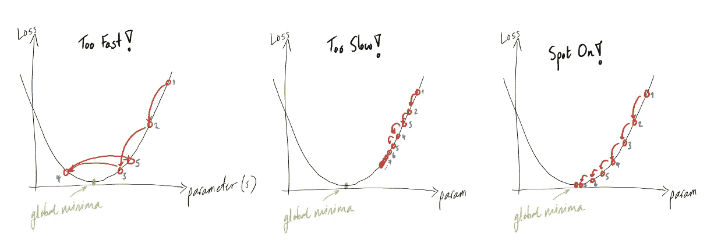
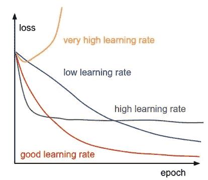
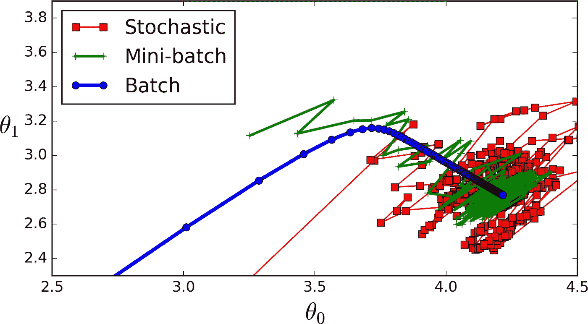
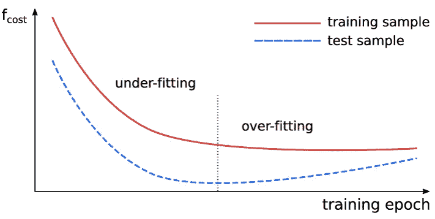

# 深度学习—超参数调整

> 原文：<https://medium.com/analytics-vidhya/hyperparameters-f7f112d93941?source=collection_archive---------13----------------------->


**超参数**是一个*静态*参数或变量，需要在对数据应用算法之前赋值。例如，像**学习率、时期等参数**。是在训练模型之前设置的。

**优化超参数:**这些参数与优化过程相关，如梯度下降(学习率)、训练过程、小批量等。

**模型超参数:**这些参数与模型有关，如隐含层数或每层神经元数等。

# 学习率

它是所有超参数中最重要的。即使我们使用预先训练的模型，我们也应该尝试学习率的多个值。最常用的**学习率有 0.1，0.01，0.001，0.0001，0.00001 等。**



[学习率](https://datascience.stackexchange.com/questions/50948/gradient-descent)

学习率的**大值**倾向于**超过梯度值，使得难以将权重收敛到全局最小值。**

学习率的**小值**使得向**全局最小值的进展非常缓慢，从验证和训练损失中可以认识到**。

学习率的一个**最优值**会导致全局最小，这可以通过**不断减少损失来看。**

**学习率衰减:**有时仅保持一个学习率可能无法帮助我们达到全局最小值，因此在一定数量的历元之后改变学习率的值，使得如果梯度停留在局部最小值时发生收敛。



[学习率衰减](https://cs231n.github.io/neural-networks-3/)

**自适应学习率:**有时理解问题并相应地改变学习率是至关重要的，比如增加或减少学习率。像 Adam Optimizer 和 Adagrad Optimizer 这样的算法。

**指数衰减:**[https://www . tensor flow . org/API _ docs/python/TF/train/指数衰减](https://www.tensorflow.org/api_docs/python/tf/train/exponential_decay)

**Adam 优化器:**[https://www . tensor flow . org/API _ docs/python/TF/train/AdamOptimizer](https://www.tensorflow.org/api_docs/python/tf/train/AdamOptimizer)

**Adagrad Optimizer:**[https://www . tensor flow . org/API _ docs/python/TF/train/Adagrad Optimizer](https://www.tensorflow.org/api_docs/python/tf/train/AdagradOptimizer)

# 迷你批次大小:

它是深度学习中最常调整的参数之一。如果我们有 1000 个记录用于训练模型，那么我们可以有三组不同的小批量大小。

**第一个**:如果我们保持 ***Minibatch size = 1*** ，那么反向传播后每条记录的权重都会更新。称之为 ***随机分批梯度下降。***



[批量大小](https://stats.stackexchange.com/questions/153531/what-is-batch-size-in-neural-network)

**第二个**:如果我们保持***mini batch Size =***数据集中的记录数，那么在所有记录通过正向传播后，权重被更新。称之为 ***批量梯度下降。***

**第三个**:如果我们保持 ***Minibatch Size =值在 1 到记录总数*** 之间，那么在所有设定的记录数通过正向传播后，权重被更新。称之为 ***小批量梯度下降。***

最常用的 ***迷你批次尺寸值*** 为 **32、64、128、256。**大于 256 的值需要更多的内存和计算效率。

【https://arxiv.org/abs/1606.02228】批量大小如何影响模型性能:

**stack exchange**:[https://stats . stack exchange . com/questions/49528/batch-gradient-descent-vs-random-gradient-descent](https://stats.stackexchange.com/questions/49528/batch-gradient-descent-versus-stochastic-gradient-descent)

**BGD vs SGD**:[https://towards data science . com/difference-between-batch-gradient-descent-and-random-gradient-descent-1187 f 1291 aa 1](https://towardsdatascience.com/difference-between-batch-gradient-descent-and-stochastic-gradient-descent-1187f1291aa1)

# 迭代次数

迭代或历元的数量可以基于验证误差来决定，只要验证误差保持减小，我们就可以假设我们的模型正在积极地学习和更新权重。有一种技术叫做**提前停止**，这有助于确定迭代次数。



提前停止

**验证监视器**:[https://www . tensor flow . org/get _ started/monitors # early _ stopping _ with _ Validation Monitor](https://www.tensorflow.org/get_started/monitors#early_stopping_with_validationmonitor)

```
validation_monitor = tf.contrib.learn.monitors.ValidationMonitor(
      test_set.data,
      test_set.target,
      every_n_steps=50,
      metrics=validation_metrics,
      early_stopping_metric="loss",
      early_stopping_metric_minimize=True,
      early_stopping_rounds=200)
```

最后一个参数指示 ValidationMonitor，如果在 200 步(轮)的训练中损失没有减少，它应该停止训练过程。

会话运行钩子:它是 tf.train 的一个不断发展的部分，向前看似乎是实现早期停止的合适地方。

```
[https://www.tensorflow.org/api_docs/python/tf/train/SessionRunHook](https://www.tensorflow.org/api_docs/python/tf/train/SessionRunHook)
```

**StopAtStepHook** :在一定步数后请求停止训练的监视器。

```
[https://www.tensorflow.org/api_docs/python/tf/train/StopAtStepHook](https://www.tensorflow.org/api_docs/python/tf/train/StopAtStepHook)
```

**NanTensorHook** :监控丢失的监视器，如果遇到 NaN 丢失，则停止训练。

```
[https://www.tensorflow.org/api_docs/python/tf/train/NanTensorHook](https://www.tensorflow.org/api_docs/python/tf/train/NanTensorHook)
```

# 隐藏单元/层的数量

高度神秘的参数决定了隐藏单元和层的数量。我们试图在深度学习中实现的是在特征和目标之间建立一个复杂的映射函数。**开发复杂的函数，其复杂度与隐藏单元的数量成正比，隐藏单元越大意味着函数的复杂度越大。**需要注意的一点是，如果我们创建的模型过于复杂，那么它会过度拟合训练数据，这可以从训练时的验证错误中看出，在这种情况下，我们应该减少隐藏单元。

**总之，在增加隐藏单元数量的同时，跟踪验证错误。**

正如 Andrej Karpathy 所说，3 层网络比 2 层网络性能更好，但超出这个范围对网络没有什么帮助。而在 CNN 中，层数越多，网络的性能越好。

安德烈·卡帕西:[https://cs231n.github.io/neural-networks-1/](https://cs231n.github.io/neural-networks-1/)

**深度学习书籍【http://www.deeplearningbook.org/contents/ml.html】:**

# RNN 的超参数

对于单词嵌入，嵌入大小是要设置的关键参数。尺寸越大，性能越好。常用的嵌入大小是 200。

与更传统的循环单元相比，使用门控单元具有明显的优势。收敛往往更快，最终解往往更好。然而，在比较 LSTM 和 GRU 时，结果并不是决定性的，这表明门控循环单位类型的选择可能严重依赖于数据集和相应的任务。除了语言建模之外，GRU 在所有任务上都超过了 LSTM。

我们一致的发现是，至少两个深度是有益的。然而，在两到三层之间，我们的结果是混合的。此外，LSTM 和 GRU 之间的结果参差不齐，但都明显优于 RNN。

在[神经机器翻译]实验中，LSTM 细胞始终胜过 GRU 细胞。由于我们架构中的计算瓶颈是 softmax 运算，因此我们没有观察到 LSTM 单元和 GRU 单元之间的训练速度有很大差异。令人有点惊讶的是，我们发现普通解码器的学习能力不如门控解码器。

**网络可视化**:[http://jalammar . github . io](http://jalammar.github.io/)

**深度架构基于梯度训练实用推荐**:[https://arxiv.org/abs/1206.5533](https://arxiv.org/abs/1206.5533)

**深度学习书作者伊恩·古德菲勒**:[http://www.deeplearningbook.org/contents/guidelines.html](http://www.deeplearningbook.org/contents/guidelines.html)，[http://neuralnetworksanddeeplearning . com/chap 3 . html # how _ to _ choose _ a _ neural _ network ' s _ hyper-parameters](http://neuralnetworksanddeeplearning.com/chap3.html#how_to_choose_a_neural_network's_hyper-parameters)

**扬·勒村**:[http://yann.lecun.com/exdb/publis/pdf/lecun-98b.pdf](http://yann.lecun.com/exdb/publis/pdf/lecun-98b.pdf)

**生成好字嵌入**:[https://arxiv.org/abs/1507.05523](https://arxiv.org/abs/1507.05523)

如果你学到了什么，别忘了鼓掌！