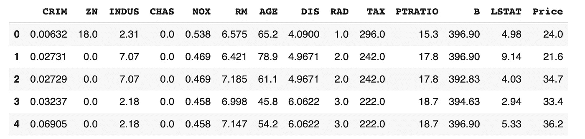
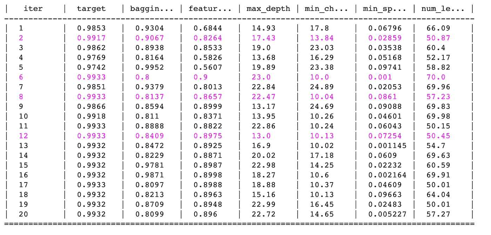
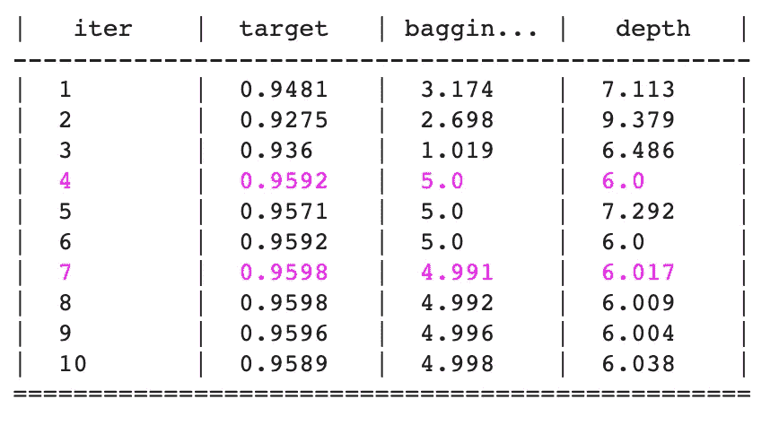
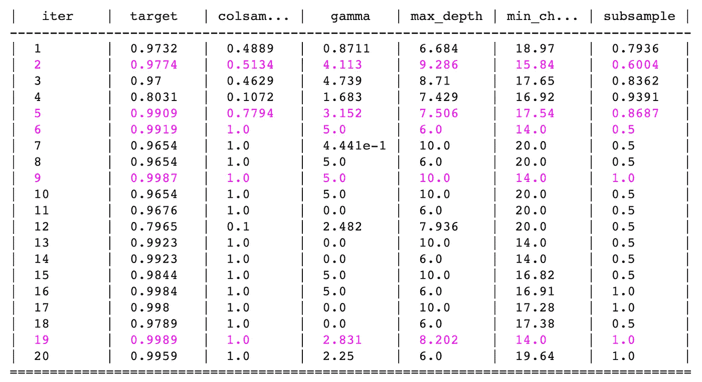

# 使用贝叶斯优化对 LightGBM、CatBoost 和 XGBoost 回归器进行超参数优化。

> 原文：<https://medium.com/analytics-vidhya/hyperparameters-optimization-for-lightgbm-catboost-and-xgboost-regressors-using-bayesian-6e7c495947a9?source=collection_archive---------0----------------------->

**日本东京一条繁忙的街道。在这里找到说英语的人，就像找到助推算法的最佳超参数一样困难。**😉

## 如何用贝叶斯优化来优化 boosting 机器学习算法的超参数？

B oosting 机器学习算法被高度使用，因为它们比简单的算法提供了更好的准确性。这些算法的性能取决于超参数。一组最佳的参数有助于获得更高的精度。手动寻找超参数是乏味且计算昂贵的。因此，超参数调整的自动化非常重要。RandomSearch、GridSearchCV 和贝叶斯优化通常用于优化超参数。[贝叶斯优化](http://papers.nips.cc/paper/4522-practical-bayesian-optimization-of-machine-learning-algorithms.pdf)与其他方法相比，能给出更好更快的结果。

**贝叶斯优化是如何工作的？**

1.  建立目标函数的代理概率模型
2.  找到在代理上表现最好的超参数
3.  将这些超参数应用于真正的目标函数
4.  更新包含新结果的代理模型
5.  重复步骤 2-4，直到达到最大迭代次数或时间

贝叶斯优化器建立给定目标函数的概率模型，并使用它来选择最有希望的超参数，以在真实目标函数中进行评估。如果你想深入研究，那么就在这里阅读**和 [**这里阅读**](https://towardsdatascience.com/a-conceptual-explanation-of-bayesian-model-based-hyperparameter-optimization-for-machine-learning-b8172278050f) 。**

****如何用贝叶斯优化优化超参数？****

**我将使用[贝叶斯优化](https://github.com/fmfn/BayesianOptimization) python 包来演示基于贝叶斯模型的优化的应用。通过 pip 安装贝叶斯优化 python 包。**

**`pip install bayesian-optimization`**

**超参数优化过程可以分为三个部分。**

****第 1 部分—定义目标函数****

**定义一个目标函数，将超参数作为输入，给出一个最大化或最小化的分数作为输出。**

****第 2 部分—定义超参数的搜索空间****

**定义要优化的超参数范围。保持较窄的参数范围以获得更好的结果。**

****第 3 部分——定义目标函数的代理模型并调用它。****

**做一个贝叶斯优化函数，调用它使目标产出最大化。贝叶斯优化函数有三个输入:`Objective Function`、`Search Space`和`random_state`。**

**让我们实现贝叶斯优化，以提高机器学习算法的回归目的。**

****导入库并加载数据。****

**我将在本教程中使用[波士顿住房](https://www.kaggle.com/c/boston-housing/data)数据。**

****

**波士顿住房数据的前 5 行。**

**我们的数据有 13 个预测变量(自变量)，价格作为准则变量(因变量)。**

## ****1。LightGBM 回归器****

****a .目标函数****

**目标函数将返回负的`l1`(绝对损失，别名= `mean_absolute_error`，`mae`)。目标是优化目标函数的输出。也可以用`l2`、`l2_root`、`poisson` 代替`l1`。**

****注:****

> **LightGBM 和 XGBoost 没有 R 平方度量。如果你想用 R2 指标代替其他评估指标，那么就写你自己的 R2 指标。**

****参见 R2 指标的目标函数示例。****

****b .搜索空间****

**定义目标函数输入参数的范围。您可以根据想要优化的超参数的数量来定义输入参数的数量。这个例子有 6 个超参数。**

****c .代理模型和优化****

**定义一个贝叶斯优化函数，最大化目标函数的输出。`init_points`和`n_iter`之和等于优化轮次总数。**

*****把所有的放在一个函数里。*****

**上述代码的输出将是表，该表将目标函数的输出作为目标，并将输入参数的值作为目标函数。使用`obtimizer.max['params']`获得最佳参数。**

****

**LightGBM 回归器的超参数优化结果表**

## ****2。Catboost 回归器****

****a .目标函数****

**目标函数有两个输入:`depth`和`bagging_temperature`。目标函数将返回测试的最大平均 R 平方值。**

****b .搜索空间****

**目标函数只有两个输入参数，因此搜索空间也只有两个参数。**

****c .**代理模型与优化**

**贝叶斯优化器将优化`depth`和`bagging_temperature`，以优化`R2`值。**

****

**CatBoost 回归器的超参数优化结果表**

## ****3。XGBoost 回归器****

****a .目标函数****

**目标函数给出输入参数`r2`的最大值。**

****注:****

1.  **如果`eval_metric`包含在参数中，则使用`early_stopping_rounds`较小的数字(10 或更小)。为什么？因为如果给定的早期停止轮次的评估指标值没有提高，那么训练将会停止。**
2.  **如果参数中没有定义`eval_metric`，则使用比`num_boost_rounds`大的数字`early_stopping_rounds`。为什么？因为训练将在给定的提前停止回合停止。**

****b .搜索空间****

****c .代理模型和优化****

****

**XGBoost 回归器的超参数优化结果表**

**我希望，你已经学习了贝叶斯优化的超参数优化的整体概念。超参数调整现在看起来很容易。对吗？**

## ****结论****

**使用`Bayesian Optimization`很容易优化超参数。LightGBM 和 XGBoost 没有`r2`度量，因此我们应该定义自己的`r2 metric`。**light GBM 和 XGBoost 的** `**r2**` **度量差别不大。LightGBM R2 度量应该返回 3 个输出，而 XGBoost R2 度量应该返回 2 个输出。****

**我们可以根据模型需求使用不同的评估标准。保持搜索空间参数范围较窄，以获得更好的结果。`bayesian-optimization`最大化目标函数的输出，因此`l1` & `l2`输出必须为负，`r2`输出必须为正。**

**在 Github 或 [**Colab 笔记本**](https://colab.research.google.com/drive/1gWwUa3ASZLJTijy3JoJl_nEqHlwHVIeB) 上查看 [**笔记本，查看用例。如有任何疑问，请通过**](https://github.com/dc-aichara/DS-ML-Public/blob/master/Medium_Files/hyp_tune.ipynb) **[**LinkedIn**](https://www.linkedin.com/in/dcaichara/) 联系我。参数调的开心！感谢您的阅读..！☺️****

## ****参考文献:****

1.  **[https://towards data science . com/a-基于贝叶斯模型的概念解释-机器学习的超参数优化-b8172278050f](https://towardsdatascience.com/a-conceptual-explanation-of-bayesian-model-based-hyperparameter-optimization-for-machine-learning-b8172278050f)**
2.  **[https://towards data science . com/an-introductive-example-of-Bayesian-optimization-in-python-with-hyperpt-aae 40 fff 4 ff](https://towardsdatascience.com/an-introductory-example-of-bayesian-optimization-in-python-with-hyperopt-aae40fff4ff0)o**
3.  **[https://medium . com/spike lab/hyperparameter-optimization-using-Bayesian-optimization-f1 f 393 CD 36d](/spikelab/hyperparameter-optimization-using-bayesian-optimization-f1f393dcd36d)**
4.  **[https://www.kaggle.com/omarito/xgboost-bayesianoptimization](https://www.kaggle.com/omarito/xgboost-bayesianoptimization)**
5.  **[https://github.com/fmfn/BayesianOptimization](https://github.com/fmfn/BayesianOptimization)**