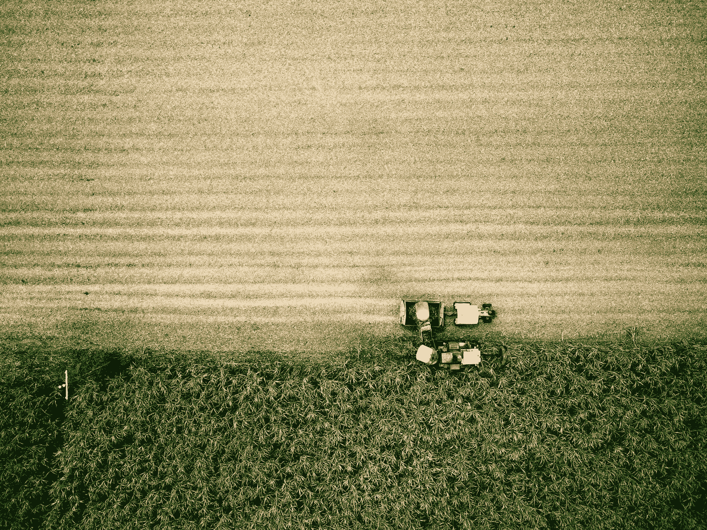
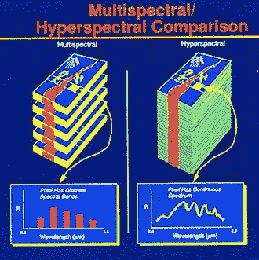
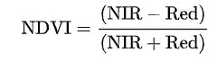
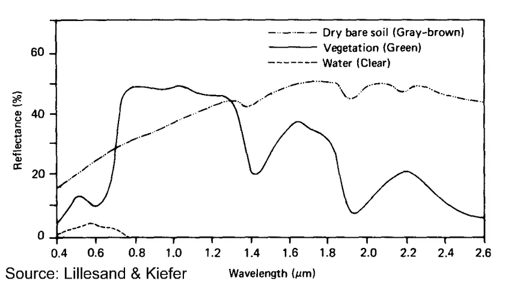
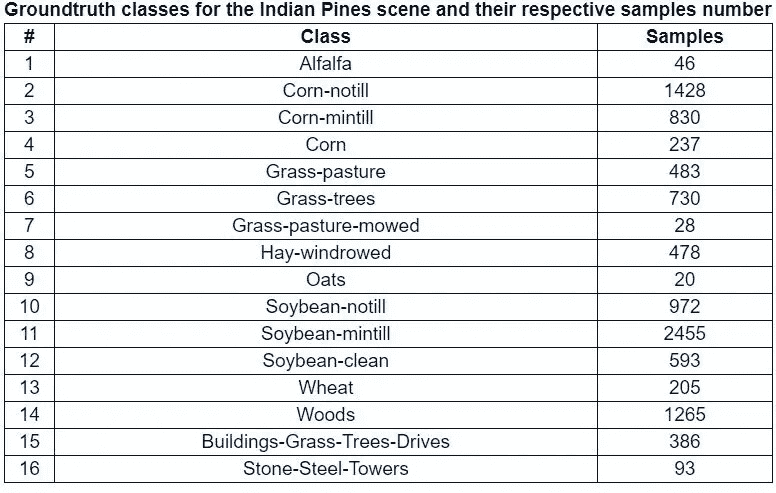
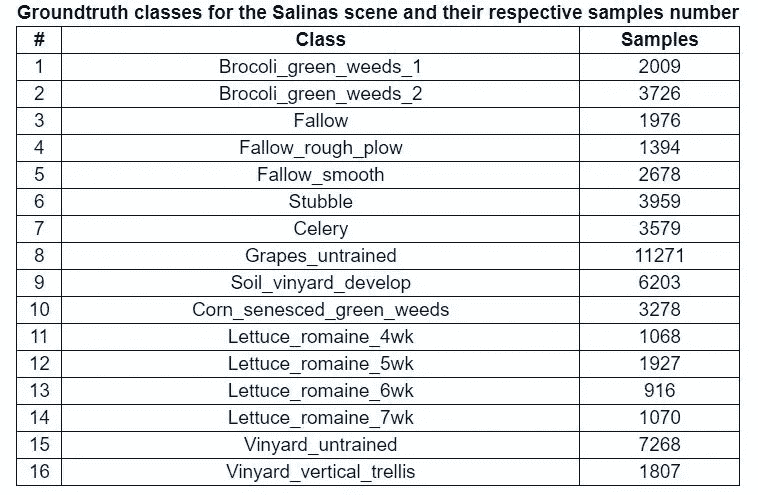

# 农业高光谱图像分类

> 原文：<https://medium.com/analytics-vidhya/hyperspectral-image-classification-in-agriculture-72e4d588c8dc?source=collection_archive---------16----------------------->

乔希·威瑟斯在 [Unsplash](https://unsplash.com?utm_source=medium&utm_medium=referral) 上的照片

> 光谱图像往往在通道数量上不同于普通图像，即当你看普通图像时，它有三个通道，即 RGB(红、绿、蓝)，并且是可见的。而高光谱图像包含多个波段(或者通道可以互换使用)。我们将研究互联网上的一些数据集，并尝试将这些图像可视化。除此之外，我们将研究机器学习和深度学习算法，这些算法可以应用于 Indian Pines 数据集。这些图像大多是使用 AVIRIS(机载可见光/红外成像光谱仪)传感器采集的。

## 让我们看看高光谱图像中经常使用的一些术语

1.  波段:之前我提到过 AVIRIS 传感器，它有 224 个波段，这意味着图像的深度为 224。除此之外，这些波段包括可见光、近红外、紫外、短红外波(SWIR)，
2.  多光谱图像和超光谱图像之间的区别:首先，在这两种图像中都涉及多个波段，但是主要区别在于波段窄，在多光谱图像的情况下，与超光谱图像相比，波段稀疏，在超光谱图像中，图像非常接近，在某些情况下甚至重叠。谈论数字有* * * *而且正如维基百科 perfects 所描述的“ ***”多光谱成像处理离散且有些窄的波段上的几幅图像*** *”。*

该图显示了离散波段和连续波段的堆叠。

3.我遇到的另一个术语是归一化植被指数(NDVI)，它用于识别特定图像是否包含绿色植被。植被和非植被的区别，也就是说建筑物或道路可以用。植物通常吸收红色，这就是为什么它们是绿色的。因此，在植被的情况下，红色波段的反射率值通常很低。而近红外(NIR)波段被植物显著反射，因此在反射率对波长的曲线图中存在尖峰，其可用于识别植物。使用一个简单的公式计算 NDVI 值:

该图显示了反射率的峰值

显示反射率与波长关系的图像

# 印度松树数据集

我们将用于分类目的的数据集是从 AVIRIS 传感器获取的印度松树。图片尺寸为 145*145*220。基于 imageNet 训练的移动网络用于图像分类。共有 16 类，包括小麦、大豆、玉米和建筑物。

印度松树数据集的类别

**萨利纳数据集**

萨利纳图像是在加利福尼亚上空拍摄的。包括葡萄园在内，共有 16 个等级。

盐藻纲

这是安明传感器在意大利北部帕维亚上空拍摄的两个场景。帕维亚中心和帕维亚大学的超世群体数量分别为 102 个和 103 个。帕维亚中心是一张 1096*1096 像素的图片，而帕维亚大学是 610*610 像素，但这两张图片中的部分示例不包含数据，必须在调查前处理掉。几何目标是 1.3 米。两张图片地面真相各差 9 级。在图中可以很清楚地看出，处理过的试验是国外的暗条纹。

我们现在将在下一篇博客中研究编码部分。