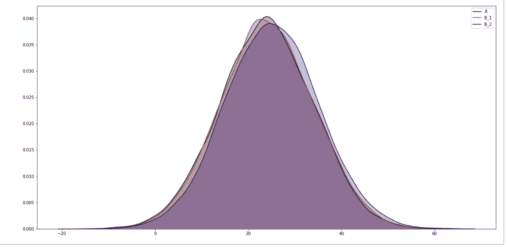
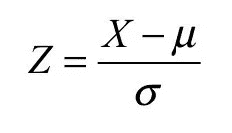
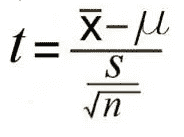
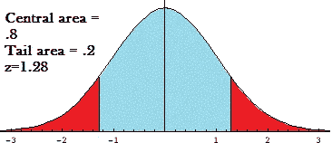
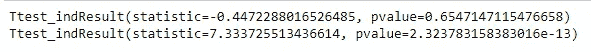

# Python 中的假设检验

> 原文：<https://medium.com/analytics-vidhya/hypothesis-test-in-python-13ea116bae29?source=collection_archive---------6----------------------->


# 数据驱动的时代

我们生活在一个数据驱动决策的时代。这意味着你在工作或个人生活中的每一次讨论都需要信息来支持你的论点。

从工作的角度来看，这意味着你将成为一个过程的一部分，这个过程包括数据提取、分析、见解发展，以及最终根据你所学的内容制定战略。

有时候，仅仅是信息是不够的。你会遇到某些情况，你会认为某个观察到的差异很重要，而你的同事却不这么认为。这篇文章旨在帮助你了解:假设检验——简单的理论和应用；如何使用 python 进行测试并最终得出结论。

# 假设检验

这种技术可以让你识别出微小的群体差异。在本文中，我们将只探讨二项式检验，或者换句话说，两个总体之间的差异。

当我们处理 A 和 b 两种人群时，使用这种技术是很常见的。想象一下，你在一家营销公司工作，他们决定在他们的应用程序中加入一个新功能。目标是增加应用访问。为了评估结果，您将客户数据库分成两个平衡的样本。A 组将不能访问新功能，而 B 组可以。发布该功能后，您提取每个组和客户的应用程序访问次数，并评估各组之间是否存在显著差异。

现在，让我们来看看这个理论。通常，我们没有信息参数，所以我们需要估计平均值。为此，我们将使用最大似然估计。因此，给定一个观察向量 **X，**，我们可以构建我们的测试结构:

```
H0: Xa = Xb — which is called the Null Hypothesis
H1: Xa != Xb — which is called the Alternative Hypothesis
```

从理论上讲，零假设必须相等。原因是我们假设人口 A 和 B 具有相同的分布，我们需要满足统计特性。第一个假设是零假设是真的，如果结果显示不是，你可以得出结论，你拒绝了零假设，或者换句话说，替代假设是真的。特别是，我更喜欢使用替代假设作为平均值之间的差异，一旦你将获得信息，如果它更大或更小。

对于我们的示例，我们将模拟两个具有不同平均值和相同大小的随机样本。值得一提的是，在现实世界中，你需要确认你有足够的样本来进行测试，否则你会得到假的结果。

```
import pandas as pd
import numpy as np
import matplotlib.pyplot as plt
import seaborn as sns
import ossample_a = np.random.normal(24, 10, 10000)
sample_b_1 = np.random.normal(24, 10, 10000)
sample_b_2 = np.random.normal(25, 10, 10000)plt.figure(figsize=(20, 10))
sns.kdeplot(sample_a, label="A", shade = True, color = '#000000')
sns.kdeplot(sample_b_1, label="B_1", shade = True, color = '#B22222')
sns.kdeplot(sample_b_2, label="B_2", shade = True, color = '#00008B')
plt.legend();
```



按组划分的应用程序访问分布

# 假设检验——检验的类型

好的。我们有分布，但我们需要使用什么测试。三种最常见的检验是 Z 检验、T 检验和卡方检验。

## **Z 测试**

这个测试是基于这样一个事实:我们的总体是正态分布的，我们知道方差，样本量大于 30。
因为[中心极限理论](http://sphweb.bumc.bu.edu/otlt/MPH-Modules/BS/BS704_Probability/BS704_Probability12.html)，平均值有一个正态分布，所以我们不需要担心这个。Z 统计(或 Z 得分)的计算方法如下:



其中 X 是观察值，μ是平均值，σ是标准偏差

## t 检验

为了应用 T 检验，我们的总体必须是正态分布的，我们不需要知道均值和方差。因此，与 z 相比，这是一个更强的测试。一般来说，当我们需要比较两个样本之间的差异时，我们使用这个测试。t 分数的计算方法是



其中 X 是估计的平均值，μ是总体平均值，S 是估计的标准偏差，n 是样本量

## 其他人

您可能需要使用其他测试(方差分析、f 检验、卡方检验等),但我们不会将重点放在它上面，以免过多地扩展主题。

# 假设检验—临界值

> [给定假设检验的**显著性水平**是一个**值**，小于或等于该值的 P- **值**被认为在统计上**显著**。](http://www.stat.yale.edu/Courses/1997-98/101/sigtest.htm)

T 临界值是 [t 分布](https://www.statisticshowto.datasciencecentral.com/probability-and-statistics/t-distribution/)上的“截止点”。几乎等于正态分布。区别在于每个分布的形状。



双边测试临界区(红色)

一般来说，我们定义临界值为 **α = 0.05。**如果我们的 p 值低于 **α** ，我们拒绝 H0。否则，我们保持我们的零假设。

# 应用测试

既然我们已经知道了这个理论，那么是时候进行测试了！

```
import statsmodels.api as sm
import scipy.stats as stats## H0: A = B
## H1: A != B
test_1 = stats.ttest_ind(sample_b_1,sample_a, equal_var = True)
test_2 = stats.ttest_ind(sample_b_2,sample_a, equal_var = True)print(test_1)
print(test_2)
```



t 检验输出

正如我们所看到的，第一个样本并没有表现出明显的差异。另一方面，第二个样本，即使有很小的差异，我们认为这种差异是显著的。这使我们能够得出结论，在有疑问的情况下，我们应该应用统计技术来支持我们的结果。

值得一提的是，在某些领域(主要是生物统计学)，临界值需要非常非常小。原因是因为我们需要提供尽可能高的重要性。

本文到此为止。希望你们喜欢:)