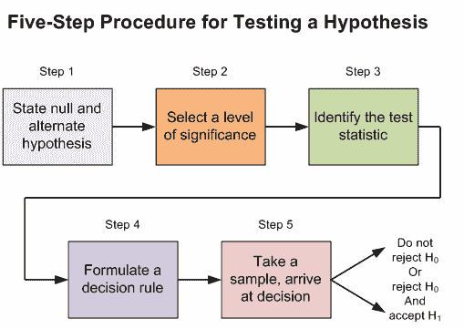
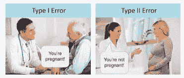
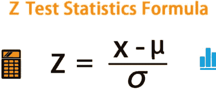
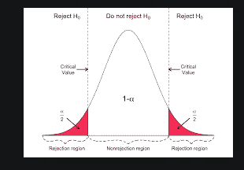
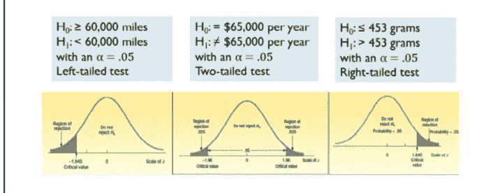
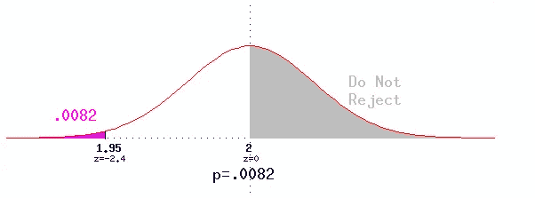
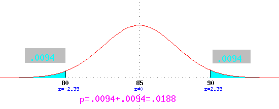
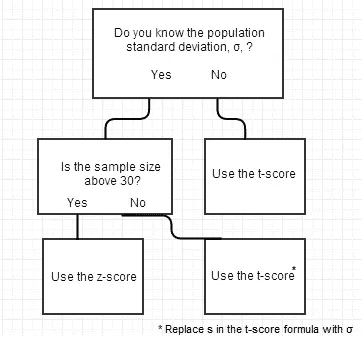

# 假设检验

> 原文：<https://medium.com/analytics-vidhya/hypothesis-testing-6669e846f04d?source=collection_archive---------11----------------------->

术语“假设”是指我们对总体参数所做的假设。这里有一个假设陈述的例子->一辆家庭中型车的平均成本是 22，000 美元。假设检验是指检验关于总体参数的假设陈述的有效性。下图显示了在我们解释测试结果之前测试假设的步骤。

[来源](https://www.thewastewaterblog.com/hypothesis-testing)

**第一步——陈述无效假设和替代假设:**无效假设是一种陈述，即除非有证据证明，否则群体特征之间没有差异。如果数据证明一个总体的特征之间存在差异，那么零假设被拒绝。

[来源](https://www.pinterest.com/pin/70016969186403511/)

**步骤 2—选择显著性水平:**显著性水平是拒绝零假设的概率的截止水平。这个级别是根据需要解决的问题而设计的。例如，显著性水平(p 值)为 0.05 表示当没有实际差异时，得出存在差异的结论的风险为 5%。较低的显著性水平表明您需要更强有力的证据才能拒绝零假设([来源](https://statisticsbyjim.com/glossary/significance-level/))。较低的 p 值(如 0.001)将在临床问题中定义，而 p 值 0.05 通常将在商业问题中定义。

注意:因为决策者不能研究群体中的每一个候选人，这种假设检验容易出错。有两种类型的错误:a)类型 1 错误(α)-当零假设为真时拒绝它。b)类型 2 错误(β)-当零假设为假时不拒绝它。

[来源](https://www.statisticssolutions.com/to-err-is-human-what-are-type-i-and-ii-errors/)

**第 3 步——确定检验统计量**:这是一个随机变量，从样本数据中计算出来，帮助我们决定是否需要接受或拒绝假设。它可能是样本均值或样本标准差或类似的东西，如下图所示。z 检验统计量计算值 x 和样本平均值除以样本标准差之间的差值。

[来源](https://www.wallstreetmojo.com/hypothesis-testing/)

**步骤 4-制定决策规则**:决策规则是一个陈述，它规定了接受或拒绝零假设的条件。例如，这里的钟形曲线解释了决策规则。临界值的计算将在正文的后半部分介绍。

[来源](https://www.geo.fu-berlin.de/en/v/soga/Basics-of-statistics/Hypothesis-Tests/Introduction-to-Hypothesis-Testing/Critical-Value-and-the-p-Value-Approach/index.html)

**步骤 5-做出决定**:为了做出决定，需要以下步骤:a)选择一个样本统计量。b)将统计值与临界值进行比较。c)决定我们是否需要接受或拒绝零假设。

**步骤 6 —推断结果**:如果我们没有拒绝零假设，那么这意味着检验统计量和总体参数之间没有太大的差异，例如，样本均值和假设总体均值。如果我们拒绝零假设，那么由于随机抽样，类型 1 错误(α)的概率似乎很小，当它为真时拒绝。

**单尾和双尾检验**:判断假设检验是单向还是双向的最好方法是看交替假设的符号(H1)。如果交替假设有小于或大于符号，那么它分别是左尾或右尾检验。如果假设检验说不等于，那么它就是一个双尾检验并且 alpha 或 type 1 误差在尾部两边都分为 0.05/2 =0.025。

资料来源:Mc Graw Hill

**单尾检验的例子** ( [来源](http://www.cs.uni.edu/~campbell/stat/inf4.html)):如果基于 144 盒葡萄干麸皮的平均值是 1.95 勺葡萄干，并且你知道葡萄干勺数的标准差是 0.25，你是否拒绝凯洛格的葡萄干麸皮中有两勺葡萄干？z =(1.95–2)/(. 25/12)=-2.4。与 z 值-2.4 相关的区域是. 0082(根据 [z 表](http://www.z-table.com/))。由于 1.95 < 2，你可能拒绝零假设；由于是单尾检验，p=.0082。因此，您在 1%的显著性水平上拒绝了零假设，但在 0.005 的显著性水平上未能拒绝它。

[来源](http://www.cs.uni.edu/~campbell/stat/inf4.html)

**双尾检验的例子** ( [来源](http://www.cs.uni.edu/~campbell/stat/inf3.html)):如果你被告知三年级学生的平均体重是 85 磅，标准差是 20 磅，你发现一组 22 名学生的平均体重是 95 磅，你会怀疑那组学生是一组三年级学生吗？z 值为((x-bar)-)/(*sigma*/(n^.5))；分子是观察到的和假设的平均值之间的差异，分母将测量单位重新调整为标准偏差单位。(95–85)/(20/(22^.5))= 2.3452。z 得分 2.35 对应于概率 0.9906，这使得 0.0094 在尾部超出。由于一个可能远低于 85，如此大或更大的 z 值的概率是. 0188。这是 p 值。请注意，对于这些双尾测试，我们使用 z 得分的绝对值。

因为. 0188 < .05, we reject the null hypothesis at the 5% significance level; if the null hypothesis were true, we would get such a large z-score less than 5% of the time. Because .0188 > .01，我们未能在 1%的水平上拒绝零假设；如果零假设为真，我们将在超过 1%的时间内获得如此大的 z 值。如果 z 值很大，我们拒绝零假设，这意味着 p 值很小。如果我们在 5%的显著性水平上拒绝一个假设，p < .05, hence we will reject that hypothesis at the 10% significance level.

Note: Z test and t-tests can be used in hypothesis testing. However, t-tests are used when population parameters are not known.

[来源](https://www.statisticshowto.com/probability-and-statistics/hypothesis-testing/t-score-vs-z-score/)