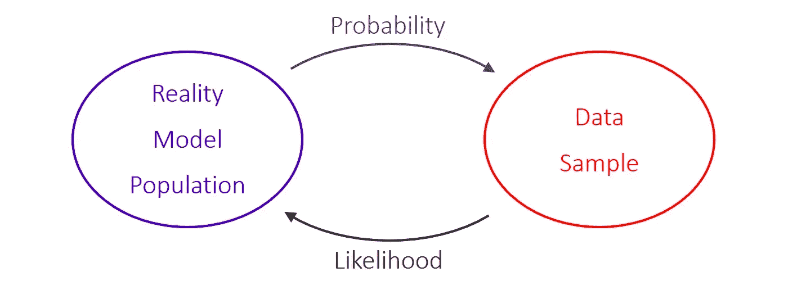
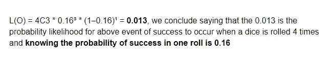
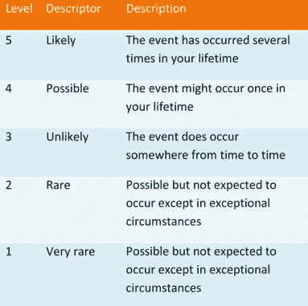
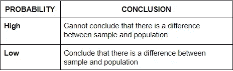
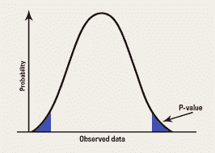
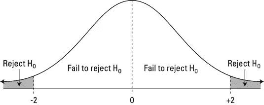
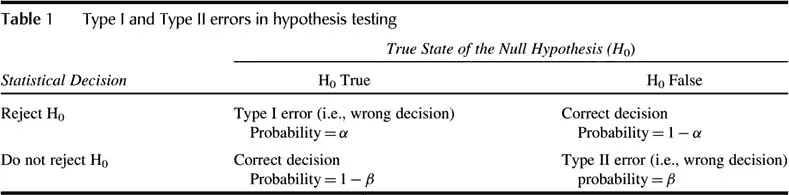
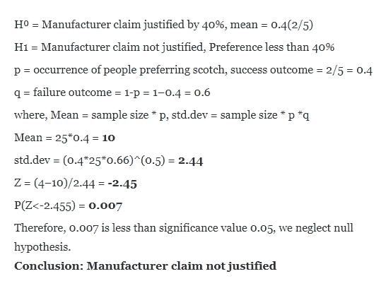
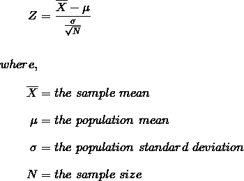
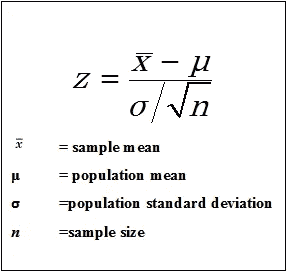

# 假设检验

> 原文：<https://medium.com/analytics-vidhya/hypothesis-testing-8d1c9aad5314?source=collection_archive---------26----------------------->

我的同胞们，你们好。每一次开始都是向前迈出的一大步。因此，让我们来了解一下数据科学家爱好者在数据科学领域前进所需的一些初始假设。

**假设:**它是一种方法论，确切地说是一种统计方法，用于确定数据的性质，并根据业务需求从这些填充的数据中做出假设，其中假设是使用概率因子做出的。

我们将从可能性开始:

**似然:**它表示，通过已知一个事件(一组成功)发生的概率，从观测值或概率中给定一组参数值，某件事情发生的可能性。**更像是概率的同义词**

**公式:L(o) = NCn * p^n * (1-p)^f**

其中 O =可能性，p =成功概率，n =事件总数，N =事件总数中的成功结果数，f =事件总数中的失败结果数。

**举例:**掷骰子，成功得到 3 的概率是 1/6 (0.16)。现在，掷骰子 4 次，我们观察到 3 次掷骰子得到 3 次(成功结果)和 1 次失败结果。可能性是。

## 确定可能性:

**高度可能性:**意味着**很有可能**样本均值更接近于基础总体均值，这仅仅是因为随机机会。

**低可能性:**意味着**一个样本均值仅仅因为随机机会而更接近基础总体均值的**是不太可能的。

# **假设要求框架:**

假设检验通过使用样本数据来评估假设的合理性。

1.  **零假设(H⁰) :** 表示由于随机机会，样本和总体数据之间不存在某些特征的差异。假设研究员的预测是真的。
2.  **交替假设(H1):零假设的交替，**它表示由于随机机会，样本和总体数据之间存在某些特征的差异。假设研究员的预测不正确。

**P 值:**是假设零假设为真，结果比观察结果更极端的概率。这里极端意味着**显著性水平。**

**显著性水平:**用于拒绝零假设的标准。通常α被设定为 **5%或 1%，**即概率因子为 0.05 或 0.01。重要性水平因业务问题陈述而异。

**置信度:**1-显著性水平，用来表示你对自己的结论有多自信。

1.  **p 值<显著性值，我们拒绝零假设**
2.  **p 值>显著性值，我们未能拒绝零假设**

# 假设中的第一类和第二类错误:

1.  **第一类错误(用α表示):**也称为“**假阳性**”，即当一个零假设实际上为真时拒绝该假设的错误。

**例如:**得出两组(群体和样本)之间有差异的结论，而实际上没有差异。**无效假设被错误拒绝**

2.**第二类错误(用β表示):**也称为“**假阴性**”，当备选假设实际为真时，不拒绝零假设的错误。

**例如:**得出两组(群体和样本)之间没有差异的结论，但实际上存在差异。当事实为假时，零假设不被拒绝。

## **例如:**

一家制造商声称五分之二的人喜欢意大利威士忌而不是杜松子酒。随机抽样 25 人，结果有 4 人更喜欢意大利苏格兰威士忌，制造商的说法合理吗？，以 95%的置信度进行测试。

这里，

# **Z 值和 Z 测试:**

**Z-Score:**A**Z**-**Score**是在**统计**中使用的数值测量值，表示一个值与一组**值**的平均值(平均值)的关系，根据平均值的标准偏差进行测量。如果 a **Z** - **得分**为 0，则表明该数据点的**得分**与平均值**得分相同。**

Z 检验:I 是假设具有正态分布的检验统计量。为了进行准确的 z 检验，应该知道标准偏差。**样本量大于 30 时使用。**

# **结论:**

还有更多类型的假设检验，如方向性检验、双尾检验和多样本检验，这些将在未来的学习中涉及。

在这里，我们概述了探索任何填充数据的假设所需的初始知识。感谢并祝福阅读这篇文章的人们。感激不尽！