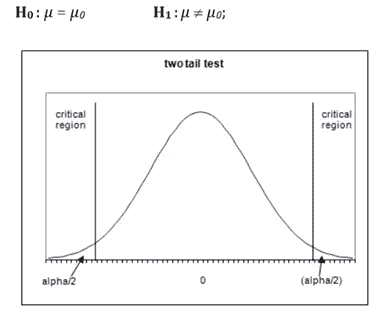
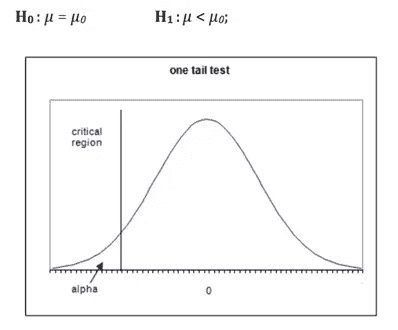
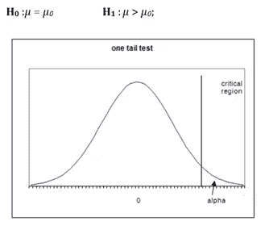
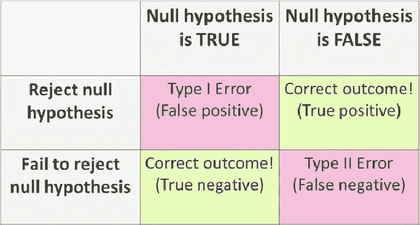

# 假设检验:一种使用 p 值接受或拒绝假设的方法

> 原文：<https://medium.com/analytics-vidhya/hypothesis-testing-a-way-to-accept-or-reject-your-hypothesis-using-p-value-d550b127fd1e?source=collection_archive---------9----------------------->

统计学中最基本的概念之一是假设检验。不只是在数据科学中，假设检验在每个领域都很重要。想知道怎么做吗？？？让我们举一个例子。你一定听说过救生圈吧？？假设救生圈声称，它杀死 99.9%的细菌。他们怎么能这么说呢？必须有一种测试技术来证明这种说法是对的？？假设检验用来证明一个主张或任何假设。

# 内容列表

1.假设检验的定义。

2.无效和替代假设检验。

3.简单和复合假设检验。

4.单尾和双尾测试。

5.关键区域。

6.第一类和第二类错误。

7.具有统计学意义。

8.自信程度。

9.显著性水平。

10.p 值。

这个博客将这些概念分成小块，这样你就可以理解它们的动机和用途。当你写完这篇博客的时候，假设检验的基础知识将会被清楚地解释。！！

# 假设检验的定义

> ***假设是关于参数值(均值、方差、中值等)的陈述、假设或主张。).***

假设是对你周围世界的有根据的猜测。它应该是可测试的，无论是通过实验还是观察。

比如，如果我们声明“多尼是有史以来最好的印度船长”这是我们根据他担任队长期间球队的平均输赢做出的假设。我们可以基于所有的匹配数据来检验这种说法。

# 零假设和替代假设检验

**零假设**是在假设其为真的情况下，对可能被拒绝的假设进行测试。无效的概念类似于无罪直到被证明有罪我们假定无罪直到我们有足够的证据证明嫌疑犯有罪。

用简单的语言，我们可以把零假设理解为已经被接受的陈述，例如，天空是蓝色的。我们已经接受这一说法。

> 它由 H0 命名。

**替代假设**补充了原假设。与零假设相反，交替假设和零假设一起覆盖了总体参数的所有可能值。

> *它由 H1 表示。*

让我们用一个例子来理解这一点:

一家肥皂公司声称其产品平均能杀死 99%的细菌。为了检验这家公司的说法，我们将提出无效假设和替代假设。

零假设(H0):平均值=99%

替代假设(H1):平均值不等于 99%。

注意:当我们检验一个假设时，我们假设原假设为真，直到样本中有足够的证据证明它为假。既然如此，我们 ***拒绝无效的*** ***假设*** 而支持备用假设。如果样本提供了足够的证据让我们 ***拒绝原假设*** ，我们不能说原假设是真的，因为它仅仅是基于样本数据。要说零假设是真的，我们必须研究全部人口数据。

# 简单和复合假设检验

当一个假设指定一个参数的精确值时，它是一个简单的假设，如果它指定一个值的范围，那么它被称为复合假设。

例如摩托车公司声称某款车型每升平均行驶里程为 100Km，这是一个**简单假设**的案例。

一个班学生的平均年龄大于 20 岁。这个说法是一个**复合假设**。

# 单尾和双尾假设检验

如果备择假设在两个方向(小于和大于)给出了在零假设中指定的参数值的备择，它被称为**双尾检验**。

如果备择假设仅在零假设中指定的参数值的一个方向(小于或大于)给出备择，则称之为**单尾检验**。

例如，如果 H0:平均值= 100，H1:平均值不等于 100

根据 H1 的说法，平均值可以大于或小于 100。这是一个双尾检验的例子

同样，如果 H0:均值> =100，那么 H1:均值< 100

Here, the mean is less than 100\. It is called a One-tailed test.

# Critical Region

The critical region is that region in the sample space in which if the calculated value lies then we reject the null hypothesis.

**让我们用一个例子来理解这个:**

假设你想租一套公寓。你从不同的房地产网站上列出了所有可租的公寓。你的预算是卢比。15000/月。你不能花更多的钱。你做的公寓清单，价格从 7000/月到 3 万/月不等。

你从列表中随机选择一个公寓，并做如下假设:

H0:你会租这个公寓。

H1:你不会把公寓租出去的。

现在，由于你的预算是 15000，你必须拒绝所有高于这个价格的公寓。

这里所有高于 15000 的价格都成为你的临界区域。如果随机公寓的价格位于这个区域，你必须拒绝你的零假设，如果随机公寓的价格不在这个区域，你不拒绝你的零假设。

根据替代假设，临界区域位于概率分布曲线的一个尾部或两个尾部。临界区域是对应于概率分布曲线中的截止值的预定区域。用 **α表示。**

**临界值**是分离支持或拒绝零假设的值的值，并在α的基础上计算。

我们以后会看到更多的例子，我们如何选择 **α会很清楚。**

**基于替代假设，出现了三种临界区域:**

这是一个双尾测试。

**案例 2)** 这个场景也称为左尾测试。

**案例 3)** 这种情况也称为右尾测试。

# 第一类和第二类错误

所以第一类和第二类错误是假设检验的最重要的课题之一。让我们通过将这个主题分解成更小的部分来简化它。

**假阳性(I 型错误)** —当你拒绝一个真零假设时。

**假阴性(II 型错误)** —当你接受一个假的零假设时。

犯 I 型错误(假阳性)的概率等于临界区α的显著性水平或大小。

α= P[当 H0 为真时拒绝 H0]

犯 II 型错误(假阴性)的概率等于β。这就是所谓的“测试的力量”。

β= P[h1 为真时不拒绝 H0]

**示例:**

这个人因被指控犯有盗窃罪而被捕。陪审团必须决定有罪或无罪。

**H0:** 人是无辜的

H1:人是有罪的

第一类错误是，如果陪审团判定这个人有罪(拒绝 H0)，尽管这个人是无辜的(H0 是正确的)。

第二类错误是陪审团释放了这个人[不要拒绝 H0]，尽管这个人是有罪的[H1 是真的]。

# 统计上显著的

为了理解这个话题，让我们考虑一个例子:假设有一个糖果厂，每天生产 500 克糖果。工厂维修后的一天，一名工人声称他们不再生产 500 克糖果，可能会更少或更多。那么这位工人声称这个错误的依据是什么呢？？？那么，我们在哪里画一条线来决定糖果重量的变化呢？这个决定/边界在统计上是显著的。

# 信心程度

顾名思义，自信的程度:我们在做出决定时有多自信。LOC(置信度)应大于 95%。低于 95%的置信度不会被接受。

# 显著性水平(α)

用最简单的术语来说，显著性水平是当零假设事实上为真时，错误拒绝零假设的阈值概率。这也被称为第一类错误率。

这是类型 1 错误的概率。它也是临界区域的大小。

一般来说，需要对α进行强有力的控制，在测试中，它会以非常低的水平作为前缀，如 0.05(5%)或 01(1%)。

如果 H0 没有在 5%的显著性水平被拒绝，那么可以说我们的零假设是正确的，有 95%的把握。

# p 值

让我们假设我们正在进行 1%显著性水平的假设检验。

其中， **H0:均值< X** (我们只是假设一个 1 尾检验的场景。)

我们获得临界值(基于我们使用的测试类型),并发现我们的测试统计量大于临界值。因此，我们必须拒绝零假设，因为它位于拒绝区域。如果零假设在 1%被拒绝，那么它肯定会在更高的显著性水平被拒绝，比如 5%或 10%。

如果我们的显著性水平低于 1%,我们会拒绝我们的假设吗？

是的，上面的场景有可能发生，这里就出现了“p 值”。

**p 值是可以拒绝零假设的最小显著性水平。**

这就是为什么现在许多测试给出 p 值，并且它更受欢迎，因为它给出了比临界值更多的信息。

**对于右尾检验:**

P 值= P[测试统计> =测试统计的观察值]

**对于左尾测试:**

P 值= P[双尾检验的检验统计数据<= observed value of the test statistic]

**:**

P 值= 2 * P[检验统计量> = |检验统计量的观察值|]

**使用 p 值进行决策**

我们将 p 值与显著性水平(α)进行比较，以对零假设做出决定。

如果 p 值大于α，我们不拒绝零假设。

如果 p 值比α值小，我们就拒绝零假设。

我希望你清楚假设检验中使用的一些基本术语。但这并不是结束。我将很快提出假设检验技术。非常感谢你研究这个博客。:)