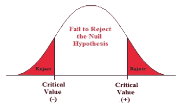
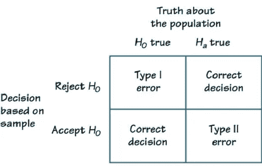
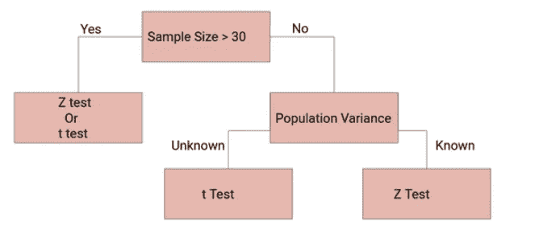
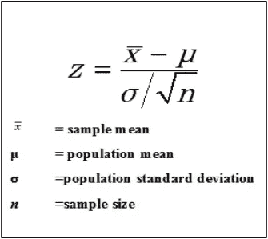
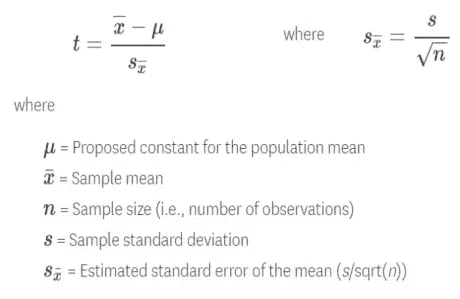
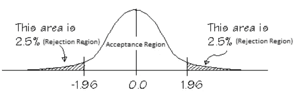

# 假设检验

> 原文：<https://medium.com/analytics-vidhya/hypothesis-testing-a3250cf55585?source=collection_archive---------29----------------------->

> ***每个问题都有答案！***
> 
> ***——未知***

**假设**

在任何商业场景中，任何问题通常都有两个答案。每当我们面临一些问题时，我们必须做出选择，为了做出这些选择，我们使用了被称为假设检验的测试，这有助于我们满怀信心地做出决定。

例如，在线课程用户的趋势是什么？

如果我们看到更大的画面，它可以增加或减少。

假设是关于总体参数的声明(断言):

**人口平均数:**

例如:在一个特定的城市，平均每月的手机账单是 42 美元

**人口比例:**

例:本市成年人拥有手机的比例为π = 0.88 即 88%，

这样，我们可以创建一个不同的假设。有两种假设。

**1。零假设 H0** —它陈述了要检验的主张或断言。它总是关于总体参数，而不是样本统计。它代表*现状*。

示例:制造的螺栓的平均直径为 30 毫米。

**2。替代假设 H1**——这正好与零假设相反。这是研究人员试图证明的假设。它挑战*现状*。

在上面的例子中，另一个假设是制造的螺栓的平均直径不是 30 毫米。

**假设检验:**

假设检验是一种从总体中选择样本，并使用样本统计数据对总体做出判断，并决定假设是否正确的方法，在此基础上，我们拒绝或不拒绝零假设。

让我们借助一个例子来理解假设检验。假设，我们从 300 人的总体中选择 30 个样本。人口的平均年龄是 45 岁。这里，无效假设是

H0: μ = 45

我们将尝试计算样本的平均值或样本中人们的平均年龄，并使用它来决定是否拒绝零假设。

为了做到这一点，我们将尝试使用 t 或 z 测试来找到上限和下限。如果样本均值落在拒绝区域(如上图红色区域所示)，我们将拒绝零假设，否则，我们将得出结论，我们无法拒绝零假设，我们的人口平均年龄为 45 岁，由 H0 代表。

进行假设检验时有两种错误:

**I 型错误:**拒绝一个真零假设。第一类错误的概率为α，也称为显著性水平。

**第二类错误:**拒绝错误的零假设失败。犯第二类错误的概率由β给出。

下图显示了这两个错误。变得困惑？与机器学习中的 ***混淆矩阵*** 相同。我所有的 ML 天才都会明白！

现在我们回到测试，有许多测试可以找到置信区间。应该根据总体标准差是否已知，在 z 检验和 t 检验之间进行选择。

在确定了用于测试的技术之后，我们确定了临界值。一般情况下 **α = 0.05** 临界 z 值为 **1.96** 这意味着决定拒绝或不拒绝零假设的临界值。然后计算测试统计量。

z & t 检验

一旦我们计算出测试统计量的值，我们将看到它是否位于拒绝区域。

最后，如果你的 z 值大于 **1.96** ，我们拒绝零假设。

这是对假设检验以及如何使用它的一个非常简短的解释。我相信你会对这个话题有所了解。

非常感谢你读到这里。如果您有任何反馈或建议，请随时发表评论。还有，让我知道你以后想读什么，永远记住“*永不停止学习”*。