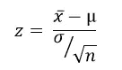
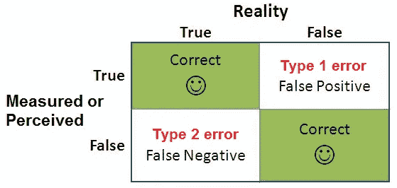

# 假设检验|初学者需要知道的一切

> 原文：<https://medium.com/analytics-vidhya/hypothesis-testing-all-a-beginner-needs-to-know-dd1bdeebdbf1?source=collection_archive---------2----------------------->

[来源](https://www.123rf.com/photo_31230071_hypothesis-concept-word-cloud-background.html)

统计学上的假设是对一个事件的假设，一种基于推理的比例。假设检验是一种利用实验数据进行决策的统计方法。基本上，我们使用问题陈述的一些参数来假设结果。

没明白吗？好吧…

假设你经营一家制药公司，你推出了一种已经在市场上销售了很长时间的药物。现在你想知道有多少百分比的印度人在患有相关疾病时使用这种药物，以预测该药物的未来产量。你首先会想到的是调查印度的全部人口，并从他们那里获得详细信息。

*这是一件相当不切实际的事情。这项工作将是乏味而困难的。那怎么办呢？*

现在，考虑到许多因素，你开始在整个印度进行小规模的人口调查。这些小群人被称为样本。根据现有的数据和销售情况，您有一个假设，即 20%的印度人口正在使用该药物，现在您需要使用那些样本来证明该假设(一般由总人口的 10%组成，应采集 30 个以上的样本)。 ***这种基于推理的对药物的假设叫做假设，而检验这种假设的方法叫做假设检验。***

下面我画了一个流程图来演示假设检验是如何进行的？

# 假设的类型:

有各种类型的假设，如简单的，复杂的，逻辑的，统计的，等等。总的来说，有两种。

1.  ***零假设(Ho):*** *表示两个变量/样本之间没有关系或者缺乏信息来陈述一个科学假设。除非有相反的证明，否则它被认为是真实的。*
2.  **备择*假设(H1):*** *与零假设相反，备择假设表明观察结果来源于一个真实的效果。当我们得到足够的证据来否定一个无效的假设时，这是一种否定它的尝试。它也被称为研究假设。*

现在回到上面的例子。假设你推出了一种与现有药物类似的新药，根据早期的观察，你假设 20%的印度人也会使用这种药物。这意味着新老药物的销售不会有任何变化。这被称为*零假设(Ho)。*如果结果高于或低于 20%，那么*零假设*将被拒绝，一个*替代假设(H1)* 将被接受，因为它将比另一个有效或无效。这些假设被称为数学上的选择，并且每次只有一个是正确的。

但是如何确定零假设或替代假设呢？为此，我们需要进行一些假设检验或测试统计。

# 测试统计数据:

检验统计量是用于假设检验的统计量。这有助于决定支持或拒绝零假设。存在各种类型的测试统计。比如，

这里我们只讨论 z 检验和 t 检验。

# **z 检验:**

z 检验是一种推断统计，用于在已知总体方差的情况下确定总体均值和样本均值是不同还是相似。z 检验应该在，

1.  *样本量大于 30。因为根据中心极限定理，当样本数量增加时，它们的均值分布变得类似于正态分布。*
2.  *数据呈正态分布。*
3.  *数据点是相互独立的。*
4.  *样本是相互独立的。*
5.  *每个数据点被挑选到一个样本的可能性是相等的。*

> 注:如果总体方差未知，则假设样本方差等于总体方差。

要计算总体的 z 得分，我们需要样本均值( )、样本标准差(σ)、总体均值(x)和样本数(通常大于 30)，如下所示。

公式

> 注意:z 值告诉你一个数据点离一个数据集的均值或平均值有多远，以标准偏差表示。

## **z 检验的类型:**

存在两种类型的 z 测试。a) **单样本 z 检验** b) **双样本 z 检验**

a) **单样本 z 检验**——用于检验总体均值是否大于、小于或不等于特定值。例如，为了检验新药将被少于或多于 20%的印度人使用的假设，将通过一个 ***单样本 z 检验来决定。***

b) **双样本 z 检验**——用于检查两个不同样本的样本均值是相等还是不同于两个独立总体。例如，假设我们发现样本一的药物使用均值为 1，而另一个样本的药物使用均值为 2。然后我们可以制定假设，例如，

# t 检验:

与 z 检验一样，t 检验也用于确定样本和总体之间的差异，但在确定两个独立样本组之间的统计差异但方差未知时最有用。在以下情况下应使用 t 检验:

1.  *人口的方差已知。*
2.  *样本量小于 30。*
3.  样本分布的平均值遵循正态分布。
4.  *每个样本的方差齐次，或者样本的标准差近似相等。*

计算 t 值的公式为:

> 注意:当样本数小于 30 时，t 检验效果很好。

## t 检验的类型:

目前有三种类型的 z 检验。a) **单样本 t 检验** b) **配对样本 t 检验** c) **独立样本 t 检验**

*注:单样本 t 检验和配对样本 t 检验背后的直觉与 z 检验的类型相同。* ***独立样本 t 检验*** *比较两个完全不同组的均值。*

# 显著性水平(α):

我们制定了无效假设和替代假设，并使用各自的检验统计量获得了 z 得分/t 得分。但是要拒绝或接受一个假设，我们将如何确定我们的分数在统计上是显著的呢？我们需要一些证据来接受或拒绝这个假设。在这里，重要性的水平( α *)出现了。*

***显著性水平(*** α ***)是在确定具有统计显著性的结果之前，样本证据必须有多强的度量。与显著性水平相反的水平称为置信水平(C)。***

通常，显著性水平被给定为 5%(0.05)或 1%(0.01)，使得置信水平为 95%或 99%。0.05 的**显著性水平**表示当不存在实际差异时，得出存在差异的结论的风险为 **5** %。

上图清楚地表明，对于 1%的显著性水平，如果检验统计量位于 99%的置信区间内，那么我们将接受零假设(Ho)，否则将选择替代假设(H1)。

让我们看看另一个例子，其中显著性水平(α)为 5%。*将接受零假设的区域称为* ***接受区域*** *。将要被拒绝的区域称为* ***临界区域/拒绝区域*** *。分隔两个区域的显著性水平的点称为* ***临界值*** *。*

注:对于正态分布的样本，显著性水平为 5%和 1%(曲线两侧分别为 2.5%和 0.5%)的临界值(z 得分/t 得分)为 1.96 和 2.58。

## 问题 1:

***随机抽样 50 个项目，给出均值()6.2 个单位，标准差(σ) 10.24 个单位。可以认为是从均值为 5.4 个单位，显著性水平(α)为 5%的正态分布总体中抽取的吗？***

*第一步:形成假设。*

第二步:选择一个合适的检验统计量并计算分数。

由于 n=50(>30)，我们将选择 z 测试来计算 z 得分。所以，

*第三步:获取临界值。*

对于 5%的显著性水平，临界值/z 值将为 1.96。

*第四步:比较数值，得出结论。*

正如我们看到的，1.77 < 1.96, which means our z-score lies within the acceptance region. This means our null hypothesis retains. ***接受何，拒绝。***

*上面，我们正在考虑两边的分配。如果我们只选择一边呢？测试的意义是什么？让我们明白...*

# **单尾检验和双尾检验:**

这是基于替代假设(H1)的两种假设检验。

## 单尾检验:

这种测试也称为方向性测试，因为我们只能测试一个方向的效果。当我们进行单尾检验时，整个显著性水平百分比位于分布的一个尾部的末端。

**大于或等于零的零假设。**

**零假设小于或等于零。**

这里，整个 5%区域要么在左侧，要么在右侧。

## 双尾检验:

这种测试也称为无方向性测试，因为我们可以在两个方向上测试效果。当我们执行双尾检验时，一半的显著性水平百分比位于分布的两侧。

**零假设等于零。**

这里 2.5%的区域在左边，2.5%的区域在右边。

# p 值:

让我们考虑这个问题。在那里，我们计算 z 分数，并将其与临界值进行比较。我们发现 z 值小于临界值，我们接受零假设。但是零假设为真的可能性有多大呢？我们需要一个概率值来量化我们的可能性，这可以通过使用 **p 值**来完成。

*p 值是概率。如果零假设为真，抽样变异将产生一个更远离假设值的估计值。*

或者…

*p 值告诉我们，如果零假设为真，得到这样一个结果的可能性有多大。*

问:但是我们如何知道一个 p 值在统计上是否显著呢？

*Ans:* 统计显著性的水平通常表示为 0 到 1 之间的 p 值。p 值越小，您应该拒绝零假设的证据就越强。小于 0.05 的 p 值(通常为< 0.05)具有统计学意义。它显示了反对零假设的有力证据，因为零假设正确的概率小于 5%。然而，这并不意味着替代假设有 95%的概率是正确的。

高于 0.05 的*p*-值(> 0.05)在统计上不显著，表明零假设的有力证据。这意味着我们保留原假设，拒绝替代假设。你应该注意，你不能接受零假设；我们只能拒绝空或不能拒绝它。

## 问题 2:

***假设一家制药公司生产一种抗过敏抗生素。他们需要进行一些质量保证，以确保他们有正确的剂量，应该是 500 毫克。在 125 种抗生素的随机样本中，平均剂量为 499.3 毫克，标准偏差为 6 毫克。抗生素含有 500 毫克剂量的可能性有多大？***

回答:从上面的问题，我们可以说这是一个双尾试验，因为小于 500 毫克的剂量影响较小，而大于 500 毫克的剂量可能会产生副作用。所以需要确保剂量等于 500 毫克。

何:= 500 毫克，H1:≠500 毫克。样本数量很大。因此选择 z 检验来确定检验统计量。

由于这是一个双尾测试，我们两边的 z = 1.304。使用 z 表，我们可以确定相应 z 值的概率值(p 值)，即 0.0968=9.68%。如果两边都算，那么总 p 值就是 0.1936 或 19.36%。

0.1936 的 p 值非常高，我们可以得出零假设为真的结论，我们对此非常有信心。

# 错误类型:

统计假设检验意味着没有任何检验是 100%确定的:这是因为我们依赖概率来进行实验。因为观察值是随机选择的，所以在决定接受或拒绝零假设(Ho)时，我们有可能犯错误。尽管假设检验应该是可靠的，但还是会出现两种类型的错误。

*这些错误被称为第一类和第二类错误。*

[来源](https://www.abtasty.com/blog/type-1-and-type-2-errors/)

## **第一类错误:**

**第一类错误**发生在原假设为真但被拒绝的时候。这也被称为**假阳性**。我们偶然高估了效果就发生了。这是运气不好。他的错误类型并不表明研究人员做错了什么。实验设计、数据收集、数据有效性和统计分析都可能是正确的，但这种错误仍然会发生。

尽管我们不知道哪些研究有假阳性结果，但我们知道它们的发生率。**I 类错误的发生率**等于假设检验的显著性水平，也称为 **alpha (α)** 。这意味着 95%的置信水平测试意味着有 5%的机会出现第一类错误。

## 第二类错误:

第二类错误发生在零假设为假，并且你随后接受它的时候。当您执行假设检验，并且您的 p 值大于您的显著性水平时，您的结果不具有统计显著性。这令人失望，因为你的样本没有提供足够的证据来证明你所研究的效应存在于人群中。

然而，即使测试结果不支持，这种效应也有可能存在于人群中。如果是这种情况，您刚刚经历了第二类错误。犯第二类错误的概率称为β。

[来源](https://stats.stackexchange.com/questions/307568/type-i-error-in-research-what-is-the-alpha-of-a-study-especially-when-there-are?rq=1)

测试中错误的优先级完全取决于我们正在解决的问题。假设一个水池被氯高度污染，人们正在抱怨他们灼伤的皮肤和眼睛。现在，您关闭了游泳池，并做了一些重新测试，以消除氯的影响。之后，你取了水样，做了一个检测，检查氯含量，是否适合人喝。现在出现了四种情况。游泳池仍然被污染，你仍然关闭游泳池，或者游泳池现在可以供公众使用，你打开了它。测试仍有出错的可能。假设您的污染测试呈阴性(条件 1)，但它仍然存在。根据测试，你打开了泳池。类似地，污染测试为阳性(条件 2)，但影响不再存在。根据测试，你的游泳池仍然关闭。

我们的无效假设是没有污染。这意味着条件 1 是 I 类错误，条件 2 是 II 类错误。在这种情况下，优先处理第二类错误不会造成任何伤害，但是第一类错误会导致严重的后果。

就这些了，伙计们。请访问我的其他博客。我写过很多关于机器学习中统计分析的博客。

## 参考资料:

 [## 什么是 1 型和 2 型错误？

### 统计假设检验意味着没有任何检验是 100%确定的:那是因为我们依赖概率来…

www.abtasty.com。](https://www.abtasty.com/blog/type-1-and-type-2-errors/)  [## 假设检验中的错误类型

### 假设检验使用样本数据来推断总体的性质。你获得巨大的利益…

statisticsbyjim.com。](https://statisticsbyjim.com/hypothesis-testing/types-errors-hypothesis-testing/)  [## 单尾和双尾假设检验解释-统计由吉姆

### 选择是执行单尾假设检验还是双尾假设检验是您可能…

statisticsbyjim.com。](https://statisticsbyjim.com/hypothesis-testing/one-tailed-two-tailed-hypothesis-tests/)