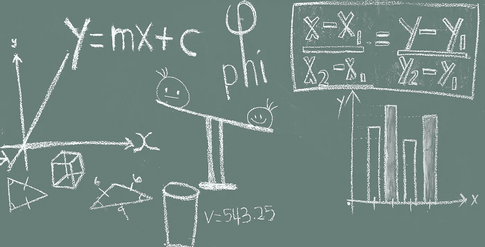

# 假设检验与第一类和第二类误差

> 原文：<https://medium.com/analytics-vidhya/hypothesis-testing-and-type-i-type-ii-error-114090b47da2?source=collection_archive---------24----------------------->

统计学是数学的一个分支，处理数据的收集、分析、解释、表达和组织。统计是关于数据的，为了从这些数据中获得有用的信息，应用不同的技术来解释数据之间存在的关系是很重要的。

统计数据主要分为两个子分支:

1.  **描述性统计:**这些用于汇总数据，如连续数据类型的平均值、标准偏差，而频率和百分比对分类数据很有用。
2.  **推断统计:**有时数据可能非常大，因此并不总是能够获取整个数据来评估数据之间的关系并解释数据之间的结论，因此收集数据的子集，也称为样本，并得出关于整个人群的结论，这就是所谓的推断统计。使用 ***假设检验、*** 数字特征的估计、数据内关系的相关性等等得出推论。

# 什么是假设检验？

假设检验是通过进行一些统计检验(T 检验、卡方检验、方差分析检验等)对总体进行推断或解释的过程。).另一个与假设检验相关的术语是 **p 值。**

> 在统计假设检验中，p 值或概率值是在假设零假设正确的情况下，获得至少与实际观察到的结果一样极端的检验结果的概率。

**假设检验的步骤如下:**

(一)。做一个初始假设—零假设(零假设总是试图假设没有异常模式，并且总是同质的，等等)。

㈡。收集数据样本或证据。

㈢。通过使用来自样本数据的各种统计测试来理解和分析数据，以验证假设是否具有统计显著性。

㈣。根据检验统计量决定是接受还是拒绝零假设。

还有一个假设叫做**替代假设**。**备选假设**是在假设检验中使用的与零假设相反的假设。

# 第一类和第二类错误:

当样本量的增加导致第一类和第二类错误最小化时，从样本中对总体进行推断有其自身的成本，例如拒绝好的结果或接受错误的结果，这一点没有单独提及:

**第一类错误:**当无效假设为真时拒绝该假设。

**第二类错误:**当假设为假时接受零假设。

让我们考虑一个小例子:

假设我们的**零假设(h0)** 是:股市会崩盘，我们的**替代假设(h1)** 是:股市不会崩盘。

在分析数据后，我们得出结论，由于缺乏支持零假设的证据，替代假设是正确的，但零假设可能是我们的真实陈述，但替代假设成为真实，我们拒绝零假设。这导致了第一类错误。现在，这可能导致巨大的损失。因此，第一类和第二类错误起着重要作用，在假设检验和解决任何机器学习用例时，请确保查看第一类和第二类错误。这取决于您正在解决的用例，是类型 I 错误更有害，还是类型 II 错误更有害。