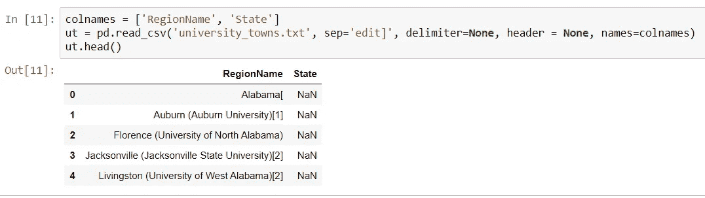
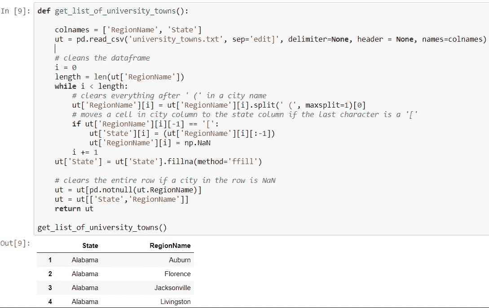
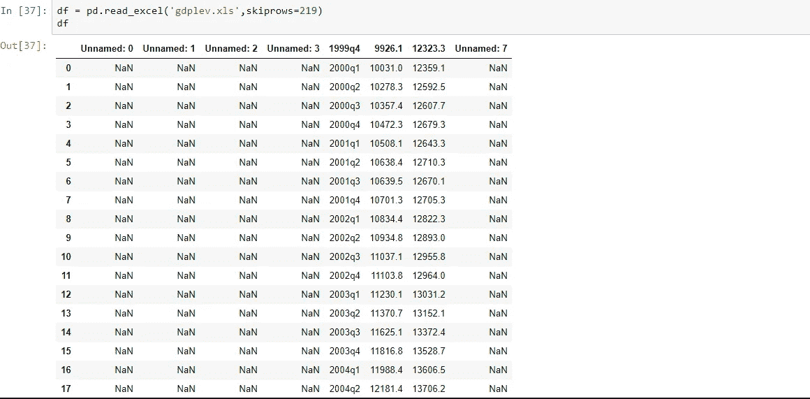
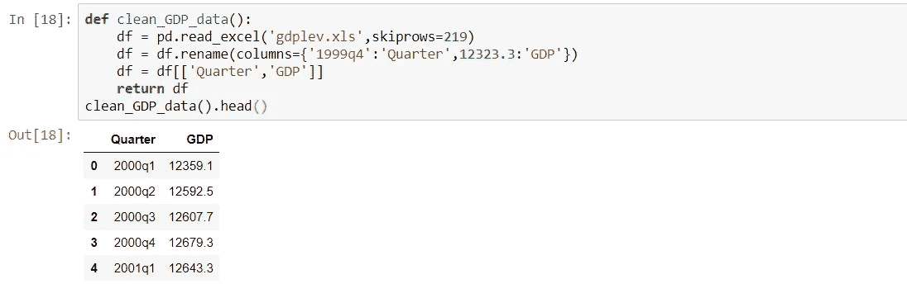
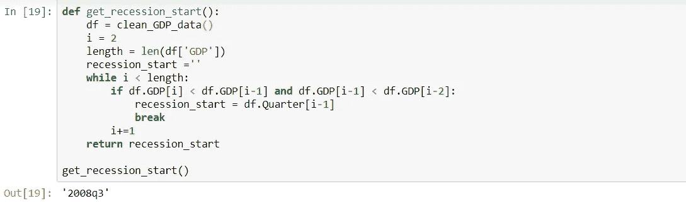
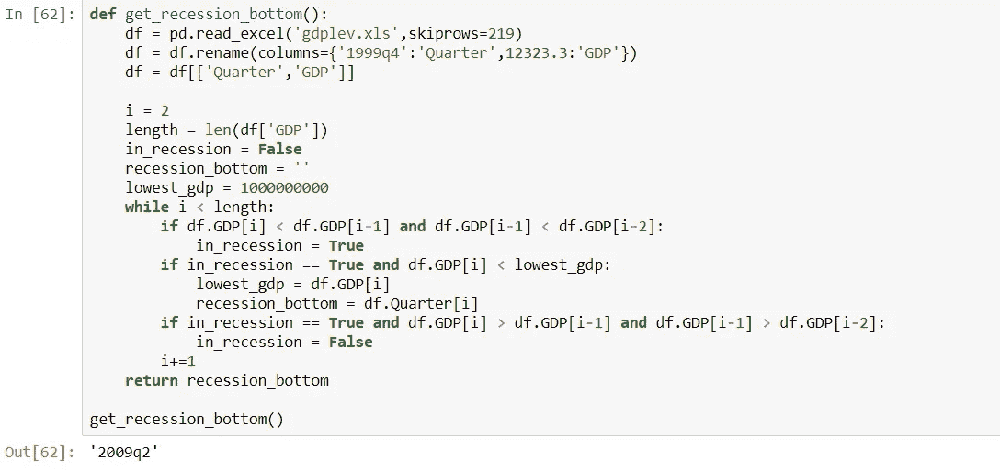
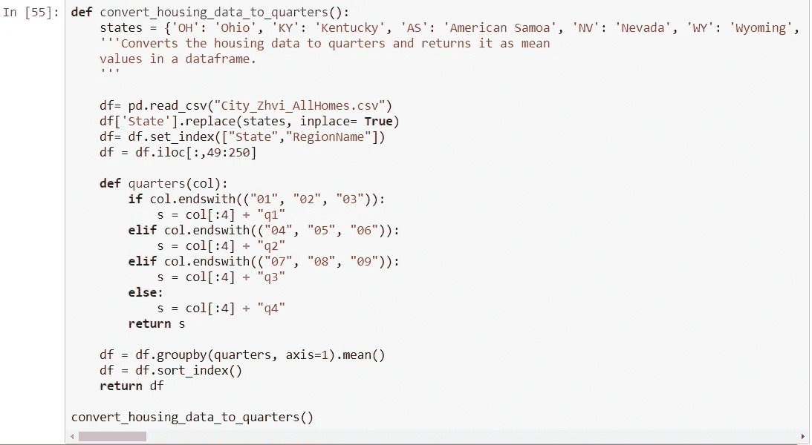
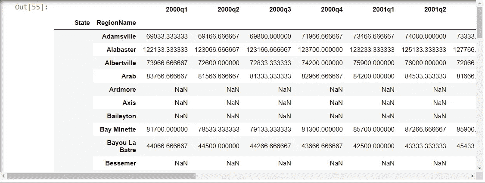
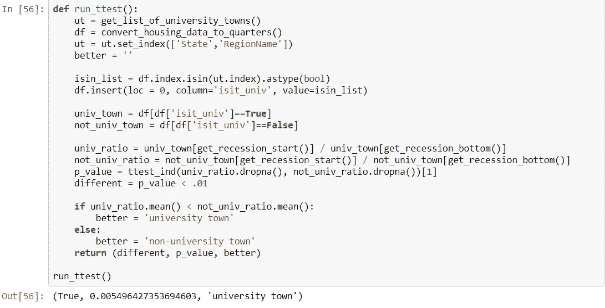

# 假设检验:大学城比非大学城更能抵御衰退吗？

> 原文：<https://medium.com/analytics-vidhya/hypothesis-testing-are-university-towns-more-resilient-than-non-university-towns-to-recession-662286a914ed?source=collection_archive---------13----------------------->

在一个早期项目中，我试图用 Python 来检验大学城是否比非大学城更能抵御经济衰退。更具体地说，我问*大学城的房价受经济衰退的影响小吗？*

首先，*大学城*是一个大学生占城市总人口比例很高的城市。

假设是，我们可以预计这些城市的房价受经济衰退的影响较小，主要是因为我们应该预计，不管经济前景如何，住在这些城镇的学生、教职员工和其他与大学生活相关的工作者的人数将会差不多。

为了获得大学城的列表，我简单地使用了[维基百科](https://en.wikipedia.org/wiki/List_of_college_towns#College_towns_in_the_United_States)，它维护着美国大学城的列表。对于美国各地房价的电子表格，我使用了 [Zillow](https://www.zillow.com/research/data/) ，其中包括 [City_Zhvi_AllHomes.csv](http://files.zillowstatic.com/research/public/City/City_Zhvi_AllHomes.csv) 中 1996 年至 2020 年的数据。最后，我利用美国商务部经济分析局(BEA)计算出 2007-2009 年“大衰退”的确切开始时间以及衰退触底时间，即衰退中 GDP 最低的季度。这是必要的，因为我试图比较衰退开始时的房价和底部的房价。

为了匹配 Wikipedia 上的大学城列表和 Zillow 上的所有城市列表的格式，我需要稍微清理一下来自 Wikipedia 的文本文件。

这不是最优雅的解决方案，但至少是可行的..

接下来，为了得到衰退的开始，让我们从 BEA 加载数据，找到衰退的开始。衰退的定义是从连续两个季度的 GDP 下降开始，到连续两个季度的 GDP 增长结束。

如你所见，我们需要清理一下这个数据帧..

现在，让我们将住房数据从 Zillow 转换为 quarters。

接下来，我们将创建新的数据，显示衰退开始和衰退底部之间房价的下降或增长。

最后，我们将运行一个 [t-test](https://en.wikipedia.org/wiki/Student%27s_t-test) 来比较大学城值和非大学城值，返回替代假设(两组是相同的)是否正确，以及我们的置信度的 [p 值](https://en.wikipedia.org/wiki/P-value)。

该函数将返回元组(different，p，better)，其中，如果 t 检验在 p<0.01 处为真(我们拒绝零假设)，则 different=True，否则，different=False(我们不能拒绝零假设)。变量 p 应该等于从 scipy.stats.ttest_ind()返回的确切 p 值。更好的价值应该是“大学城”或“非大学城”,这取决于哪一个具有较低的平均价格比率(相当于减少的市场损失)

我们可以看到，大学城和非大学城的平均房价是有差别的。由于 p 值小于 0.01，我们可以拒绝零假设(大学城和非大学城之间没有显著差异)。换句话说，我们可以看到大学城和非大学城是有区别的，而且大学城确实较少受到经济衰退的影响。