# 假设检验解释

> 原文：<https://medium.com/analytics-vidhya/hypothesis-testing-explained-2cff0e974ac9?source=collection_archive---------16----------------------->

来源:- [潜力](https://www.google.com/search?q=sea+people+thibnking+pictures&sxsrf=ALeKk01xi-OR-I_2xTaS5UBYNxqk_ySmfA:1602075001832&source=lnms&tbm=isch&sa=X&ved=2ahUKEwjXyIy7wqLsAhW0heYKHcEzBscQ_AUoAXoECAwQAw&biw=1366&bih=625#imgrc=WH9wG1HgwFq43M)

> **什么是假设检验？**

数据一点都不有趣，当我们进行解释并从中找出一些意义时，它就变得有趣了。假设是让数据变得有趣的方法。它为答案提供了信心和喜爱。

> **假设检验的参数？**

H(0)—->零假设和 H(1)—->备择假设在假设检验中起主要作用。

**H(0)** :-表示默认假设或在问题中已经提出的假设。

**H(1)**:-当默认假设被拒绝时，备选假设出现。

> **临界区域，一尾测试&两尾测试？**

在深入假设检验之前，我们需要了解在决定假设是无效还是替代时起主要作用的参数。

## **i. >临界区:-零假设的拒绝边界。**

假设你是一名员工，你的上班时间是上午 10 点，如果你在上午 10 点后到达，你将被视为迟到，这里上午 10 点是关键区域。

## **二。一个尾部测试:它只有一个关键区域。**

假设你想租一套房子，你已经估算了 12000 英镑，如果房产经纪人给你看一套租金为 15000 英镑的公寓，你将会放弃在这里租房的计划 12000 英镑，卢比就像一个临界区，超过这个价格，你不会租任何房子，但是你可以租一套租金低于 12000 英镑的房子。

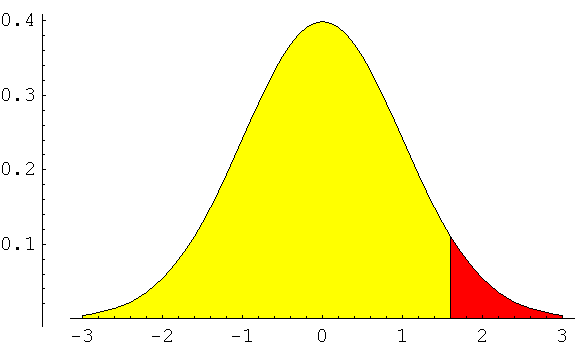

来源:[uh.edu](https://www.google.com/search?q=one+tailed+test+graph&sa=X&sxsrf=ALeKk00RJXwMaOWjt3HskWpmgBHsYXQCag:1602078100120&tbm=isch&source=iu&ictx=1&fir=Pd6H4bZ6eEZ1AM%252CKsIVlgGXZK1bbM%252C_&vet=1&usg=AI4_-kRv1wTtZiSEIfweHiDOloVW4K6PWg&ved=2ahUKEwi1hr2AzqLsAhUx4nMBHbWODikQ9QF6BAgJEEg&biw=1366&bih=625#imgrc=Pd6H4bZ6eEZ1AM)

**三。>双尾检验:-它有两个临界区。**

假设你是板球队的队长，如果你想打成平局，那么你必须和你的对手得分相等。如果你的得分多于或少于你对手的得分，你就不能赢得这场比赛。这属于双尾检验。

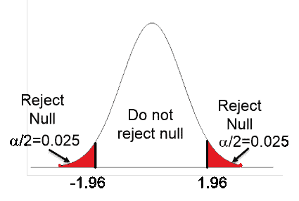

来源:- [波士顿大学](https://www.google.com/search?q=two+tail+test+image&sxsrf=ALeKk037PAIsXQgbm4xnSQwjgOa7qdeP0w:1602078169530&tbm=isch&source=iu&ictx=1&fir=h8L9onoyFq0X_M%252CPnX5iQHYEovVrM%252C_&vet=1&usg=AI4_-kRWYtIfPOIBn177npj47vrK0wuxgQ&sa=X&ved=2ahUKEwijycmhzqLsAhXH4XMBHTNbDrQQ9QF6BAgOED4#imgrc=h8L9onoyFq0X_M)

> **I 型和 II 型错误？**

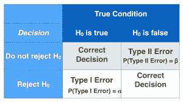

来源: [-预科生](https://www.google.com/search?q=type+i+and+type+2+error&sxsrf=ALeKk023u1jquPCoggQQiD-a2hQWFo_5Yw:1602095597981&source=lnms&tbm=isch&sa=X&ved=2ahUKEwi60o2Yj6PsAhUk_XMBHdWcDHcQ_AUoAXoECB0QAw&biw=1366&bih=625)

**I 型错误或假阳性**当零假设正确时，拒绝零假设。**II 型错误或假阴性**当零假设不正确时接受零假设**。**

**现实生活中对第一类和第二类错误的理解** :-假设你所在的区域发生了犯罪。该案件已移交法院，法庭的决定就像犯了罪的罪犯被释放(第一类错误)，而什么也没做的人被判犯了罪(第二类错误)。

来源:-[earth.com](https://www.google.com/search?q=court+criminal&sxsrf=ALeKk02l-sj8OETEmDeY2Tf1cOwOLD22Ig:1602222245382&source=lnms&tbm=isch&sa=X&ved=2ahUKEwif1aX-5qbsAhXBfn0KHT-6DYgQ_AUoAXoECBYQAw&biw=1366&bih=625#imgrc=z4hq6wrEgoosLM)

**α=p(当 Ho 为真时拒绝 H0)= 1-显著性水平**

**β=p(当 Ho 为假时 H0 的接受度)**

**β、α分别为ⅱ型误差和ⅰ型误差。**

> 假设检验的类型

假设检验大致分为以下类型:

**一、> Z 统计**

**二。> t 统计**

**三。>卡方检验**

**四。>方差分析测试**

**五、> A/B 测试**

让我们详细讨论每一个话题

> z 统计

Z-stats 是一种做假设的统计方法，它可以在两种情况下使用。

**i. >当我们知道给定总体的方差**

**二。>未给出方差，但样本量≥30。**

此外，z 检验分为两种类型:- **单样本 z 检验**和**双样本 z 检验。**

> **一个样本 Z 测试**

当我们比较一个样本平均值和一个总体平均值时，我们使用一个样本 z 检验。

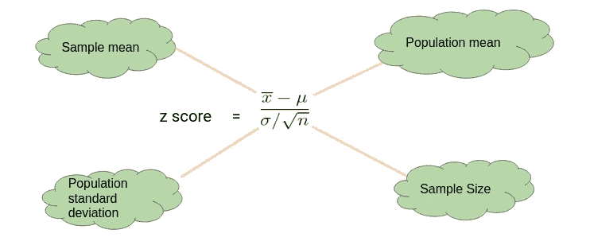

通过[分析 Vidhya](https://www.analyticsvidhya.com/blog/2020/06/statistics-analytics-hypothesis-testing-z-test-t-test/)

让我们通过一个简单的例子来理解上面的概念。

> 大学书店告诉未来的学生，其教科书的平均成本是卢比。52，标准偏差为 Rs。4.50.一群聪明的统计学学生认为平均成本更高。为了测试书店对他们的选择的声明，学生们将随机选择一个大小为 100 的样本。假设随机样本的平均值为 Rs。52.80.在 5%的显著性水平上进行假设检验，并陈述你的决定。

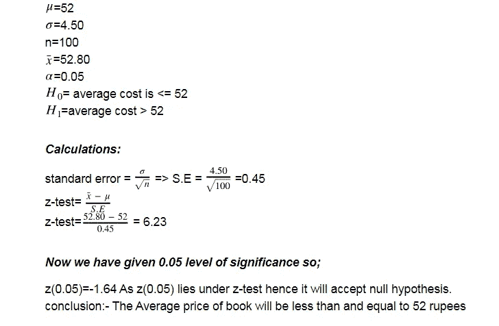

> **双样本 Z 检验**

当我们比较两个样本的总体均值时称为**双样本 z 检验**。如果平均差为零，则认为是零假设，否则是替代假设。

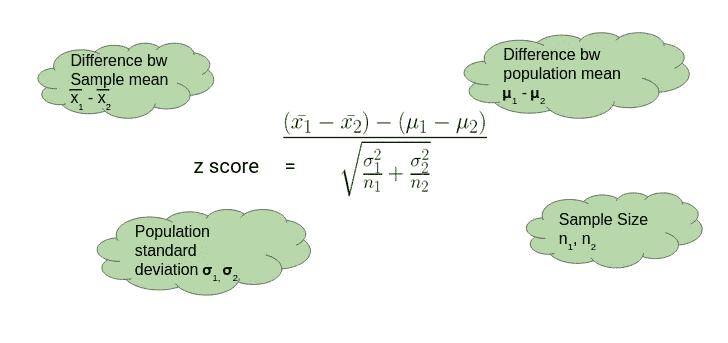

来源:- [分析 Vidhya](https://www.analyticsvidhya.com/blog/2020/06/statistics-analytics-hypothesis-testing-z-test-t-test/)

通过一个例子来理解任何公式都是有益的。

> 两个人口之间差异的双尾检验意味着有证据表明一周内从班加罗尔到 Chennai 的旅行人数不同于从班加罗尔到 Hosur 的旅行人数，假设:人口 1:班加罗尔到 Chennai n1 = 1200，x1 = 452，s1 = 212 &人口 2:班加罗尔到 Hosur n2 =800，x2 = 523，s2 = 185。

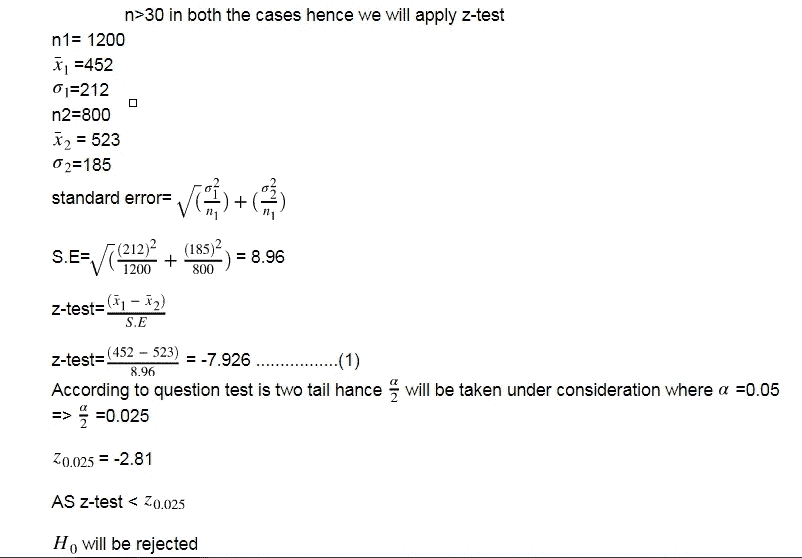

> **T 统计**

它的计算行为几乎类似于 Z-test，就像它确实由**一个样本**和**两个样本 t-test 组成。**我们可以通过考虑以下几点来区分 t 检验和 z 检验。

一. >当**样本量< 30**

二。>我们将采用**样本标准差**而非总体方差。

来源:[-成为极简主义者](https://www.google.com/search?q=happy&sxsrf=ALeKk0085z3FGXpXA4a_vAeOiAsKd1R0iQ:1602224510272&source=lnms&tbm=isch&sa=X&ved=2ahUKEwjRz6O276bsAhU873MBHYNuBkMQ_AUoAXoECCAQAw&biw=1366&bih=657#imgrc=qRx0YKmcONRNNM)

> **一个样本的 t 检验**

在一个样本 t 检验中，我们将比较样本均值和总体均值。

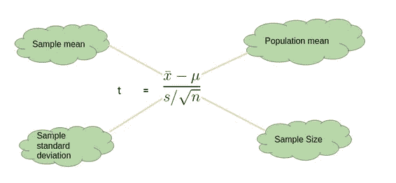

来源:- [分析 Vidhya](https://www.analyticsvidhya.com/blog/2020/06/statistics-analytics-hypothesis-testing-z-test-t-test/)

> **双样本 t 检验**

在双尾检验中，我们要比较给定总体中两个样本的平均值。

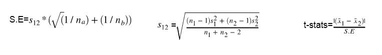

我们用一个例子来理解这个概念；

> 总体方差的混合估计数据是否提供了足够的证据来得出结论:当糖以两种不同的价格出售时，其价格的平均百分比增长是不同的？人口 1:糖的价格=卢比。27.50 n1 = 14，x1 = 0.317%，s1 = 0.12%，群体 2:糖价= Rs。20.00 n2 = 9，x2 = 0.21%，s2 = 0.11%？

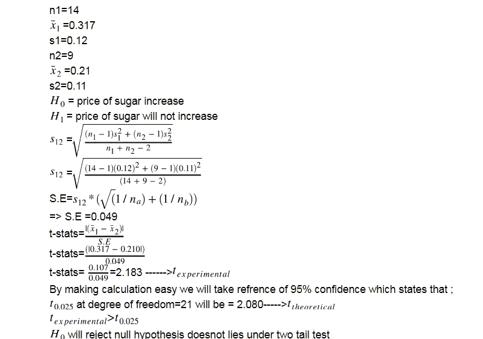

> **卡方检验**

这是假设检验最重要的方法之一。在 z 检验和 t 检验中，我们主要关注均值和方差，但在这种情况下，我们将更多地关注方差。它也被称为 X。它被公式化为:[ **X =(n-1)S /σ ]**

卡方检验主要分为两个部分；**一、>拟合优度检验:-** 为单变量卡方检验。**二。>独立性检验:-** 它用于两个变量的卡方检验。这两个公式在假设检验操作中起着关键作用。

## 配方:-

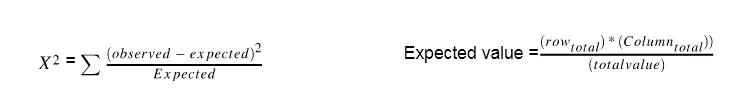

观察值将在问题中给出，我们将使用上述公式找到期望值。

我们借助一个例子来理解一下；

> 三岁的儿童被要求表明他们对三张成人照片的偏好。数据是否表明年龄和照片偏好之间有显著的关系？这项研究有什么问题？[卡方= 29.6，具有 4 个 df: 𝑝 < 0.05] ?

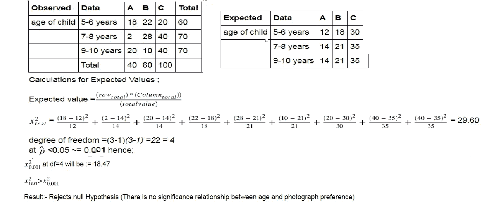

> **ANOVA 检验**

这就是所谓的方差分析测试。它用于样品内和样品间的分析。如果我们将有两个以上的样本，那么我们将使用方差分析测试。在进行方差分析测试之前，我们需要有一些相同的假设。

**i. >数据集和样本之间不应有任何依赖关系。二。>数据集应呈正态分布。**

方差分析检验中 H0 和 H1 的判定：

H0 =当，**观察到=预期&H1 =当**观察到！=预期值****

**配方:-**

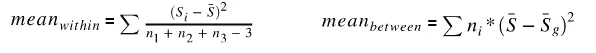

在计算出中间平均值和内部平均值后，我们将进行 f 检验，以决定是否接受 nul 假设。

> **F 检验=平均值之间/平均值之内**

> 使用以下数据，使用α= 0.05 进行单向方差分析。用 APA 格式写下结果。[第一组:51，45，33，45，67][第二组:23，43，23，43，45][第三组:56，76，74，87，56]。

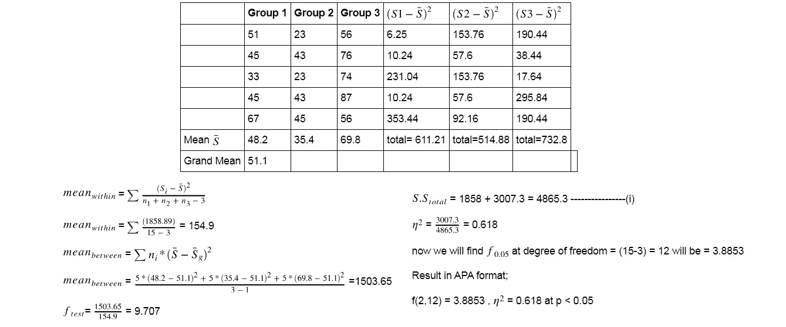

> **A/B 测试**

来源:- [优化](https://www.google.com/search?q=a/b+testing&sxsrf=ALeKk00PJ37StNbTfxMImstxpC3kuAP9hA:1602232378917&tbm=isch&source=iu&ictx=1&fir=7GffDDx1guqM9M%252Cr8SDjfhFeBWtGM%252C_&vet=1&usg=AI4_-kSucYywQyTVbrUXHOZTxMXPvCpP1g&sa=X&ved=2ahUKEwj1x6vejKfsAhXF73MBHdgdDH4Q_h16BAgMEAc#imgrc=pS55DNACi3SGVM)

假设你拥有一家移动公司，你希望接触到大量的人，为此你在 market place (facebook，instagram 等)开发了几个页面，以吸引用户从这几个页面查看你的产品。人们参与度最高的页面将被考虑在内，并将用于进一步的广告，其余的页面将被淘汰。所有这些都是使用 A/b 测试进行的。

**结论:-**

这都是我这边的。如果你对这篇文章的改进有任何建议，你可以帮忙。