# 现实生活中的假设检验:兄弟姐妹竞争和魔方的故事

> 原文：<https://medium.com/analytics-vidhya/hypothesis-testing-in-real-life-a-tale-of-sibling-rivalry-and-a-rubiks-cube-54cb1ee544c7?source=collection_archive---------15----------------------->

用数学解决实际问题总是很有趣。

## ***简介***

我和弟弟都喜欢拼图，而魔方恰好是我们的最爱之一。今年早些时候，他声称，“我可以在平均一分钟内从任意组合开始解出一个立方体”。我认为这是一个大胆的声明，我决定测试他的说法。我送给他一个全新的速度魔方，并让他记录下接下来 50 次尝试解决它的时间。三天之内，他给我发来了一张 excel 表格，上面记录了 50 次解魔方所花的时间。根据这个数据记录，我想验证他的说法是否属实。我们如何做到这一点？我们使用假设检验。我们先来了解一下假设检验背后的理论。

我哥哥记录数据的真实镜头

## **T5 什么是假设检验？**

假设检验是一种基于样本数据记录来验证总体假设的技术。它属于推断统计学的范畴。简而言之，它是一种通过尝试从样本数据中提取/推断真相来验证某个主张的技术。

像任何概率方法一样，假设检验也不是没有错误的。每个数据记录都有其固有的随机性。它可能来自测量噪声、不可测量的干扰或我们无法控制的因素。在立方体数据的情况下，随机性可能来自错误的数据输入(不太可能)、房间的湿度/温度、解立方体时的身体姿势或立方体的初始组合。

## 假设检验需要什么？

***1。一个公设或一个主张(假设):***

*   零假设(H₀):零假设是指如果采样数据不能提供足够的证据，则假设为真的现状或默认主张。
*   另一种假设(Hₐ):)如果提供了足够的证据来否定 H₀，就必须用另一种假设来支持它(Hₐ).)尽管 Hₐ的确切形式取决于手头的问题，但它通常被认为是 H₀.的补充

在立方体的例子中，H₀将是——“解决立方体的平均时间是 60 秒”。另一个假设取决于我想验证什么。在这个问题中，我特别感兴趣的是检查他是否平均花费超过 60 秒。因此，Hₐ可能是——“解出这个立方体的平均时间超过 60 秒。”

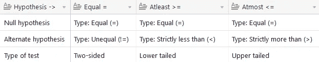

表 1:无效假设和替代假设:样本指南

表 1 显示了如何制定 H₀和 Hₐ.的样本指南应该注意的是，零假设总是等式型的。稍后我会提供更多细节。

**②*。我们愿意容忍的错误:***

如前所述，没有假设检验是没有错误的。通常，有两种类型的错误与假设检验相关联— (i)第一类错误和(ii)第二类错误。第一类错误是拒绝 H₀的概率，当它实际上是真的，而第二类错误是拒绝 H₀失败的概率，当 Hₐ是真的。

假设检验经常被比作法庭。“在被证明有罪之前是无辜的”这句话翻译过来就是“零假设是真的，除非提供足够的证据来否定它”。第一类错误类似于“一个人是无辜的，但被判有罪”，第二类错误类似于“一个人有罪，但被判无罪”。

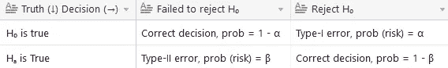

表 2:第一类和第二类误差

第一类错误的概率(α)称为显著性水平。法官不想给无辜的人定罪。同样，我们不想拒绝 H₀，当它实际上是真实的。因此，我们根据显著性水平α提供了我们在假设检验中愿意容忍的误差。显著性水平被定义为当 H₀为真时拒绝它的概率，通常使用 0.05 的值。换句话说，如果你重复进行假设检验(理想情况下是无限次)，当 H₀的假设实际上为真时，你最终会拒绝它，大约有百分之五的几率。

同样，如果一个司法系统能够将罪犯定罪，那么它就是有效的。同样，假设检验的功效取决于当假设不成立时拒绝零假设的概率，由表 2 中的 1-β给出。

我们可以将α设置为零，并声称我们的测试是无误差的。可惜，事情没这么简单。事实证明，α和β成反比。如果你试图减少α，β就会增加。随着β的增加，假设检验的功效降低。它们之间的数学关系并不简单。读者可以参考奥贡奈克的精彩著作《随机现象》了解更多细节。

## 如何进行假设检验？

任何假设检验都包括六个步骤。

1.  确定感兴趣的参数(θ)
2.  陈述无效假设和替代假设(H₀和 Hₐ)
3.  选择检验统计量(Qₜ)
4.  获得检验统计量的抽样分布
5.  设置拒绝标准
6.  计算测试统计量，并应用拒绝标准做出决定

***1。确定感兴趣的参数(θ):***

感兴趣的参数取决于陈述或假设。这些参数的常见例子包括均值、方差、比例、均值差、方差比。

**2*。陈述无效和交替假设(H₀和 Hₐ):* 、T7)**

如前所述，零假设总是等式型的，零假设可以根据手头的问题来制定。这是因为我们根据被测试的索赔的极限情况来计算所谓的临界区域。因此，我们从不使用“接受 H₀".”这个短语从统计假设检验中，我们可以得出(1)拒绝 H₀或者(2)不拒绝 H₀.的结论当我们未能拒绝 H₀时，现状依然存在。

a) *一个感兴趣的参数是* ***等于*** *一个固定值* (θ = θ₀) *—* 在这种情况下，我们将零假设表述为 **H₀: θ = θ₀** ，替代假设为**hₐ:θ≦****θ₀**。

b) *一个感兴趣的参数是* ***大于一个固定值*【θ>θ₀——在这种情况下，我们将零假设表述为 **H₀: θ = θ₀** ，替代假设为 **Hₐ: θ > θ₀** 。**

c) *一个感兴趣的参数是***小于一个固定值*(θ<θ₀)——在这种情况下，我们将零假设表述为 **H₀: θ = θ₀** ，替代假设为 **Hₐ: θ < θ₀** 。*

*通过以这种方式公式化假设检验，当我们决定拒绝零假设时，我们可以拒绝它以支持与手头问题相关的东西。*

***3、*4。选择检验统计量(Qₜ)并获得其抽样分布:****

*这是假设检验中最关键的步骤之一。选择一个合适的检验统计量包括选择一个合适的参数估计值。为了选择一个估计值，它必须满足以下标准— (i)估计值必须是无偏的(无限多次重复试验的期望值将导致真实值),以及(ii)估计值必须是一致的(估计值的方差应尽可能低)。如果你不理解前面两句话，没关系。幸运的是，我们知道自高中以来一直使用的流行估计(样本均值和样本方差，分别是真实均值和真实方差的估计)。这里的 n 代表样本大小或数据记录的数量。*

*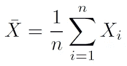*

*均值估计:样本均值*

*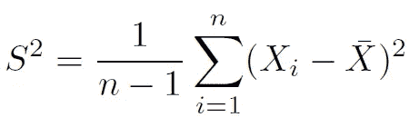*

*方差估计:样本方差*

*应该注意的是，根据定义，任何统计都不应该依赖于未知参数。换句话说，我们应该能够为一个统计量计算出一个固定的数字。我已经提供了一个在假设检验中使用的常用统计数据的综合列表，以及在哪些假设下可以使用它:*

***一、一个样本的 Z 检验:***

*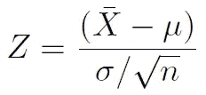*

*z 统计量的定义是用样本均值(x̅)减去其真实均值(μ)，然后用标准误差(σ/√n)对其进行缩放。为了使这成为一个统计数据，我们必须知道右边的所有参数。μ从零假设中已知，我们假设真实方差已知。*

****假设:*** (i)大样本量(ii)已知方差*

*如果这些假设成立，则 z 统计量遵循标准正态分布。*

*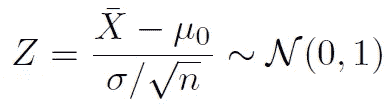*

*单样本 Z 统计量*

*如果方差未知，Z 不再是一个统计量，因为我们不能确定右侧。*

****假设:*** (一)大样本量(二)未知方差*

*因此，我们用上式中未知σ的估计值 S 来代替它。如果样本量很大，由于中心极限定理(C.L.T ),我们仍然可以使用 z 检验。*

***二。一个样本 t 检验:***

*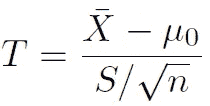*

*t 统计量的定义是用样本均值(x̅)减去其真实均值(μ),然后用标准误差的估计值(S/√n)对其进行缩放。*

****假设:*** (一)小样本量(二)未知方差(三)X 源于正态分布*

*如果这些假设成立，则 t 统计量遵循具有 n-1 个自由度的学生 t 分布。*

**

*单样本 t 统计量*

*对于小样本情况，如果 X 不遵循正态分布，我们必须依靠蒙特卡罗模拟或自举方法。*

***三。双样本 Z 检验:***

*该测试用于验证与两个随机变量的差异相关的声明。在这里，δ₀被定义为真正意义上的差异(μ₁——μ₂).*

****假设:*** (i)两个随机变量都具有正态分布(ii)方差已知(iii)相互独立的总体*

*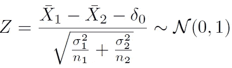*

*双样本 Z 统计量*

***四。两样本 t 检验:***

*对于小样本情况，我们可以使用双样本 t 检验。*

****假设:*** (i)两个随机变量都具有正态分布(ii)小样本量(iii)未知方差(但相等)(iv)相互独立的总体*

*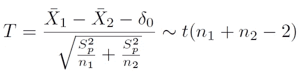*

*双样本 t 统计量*

*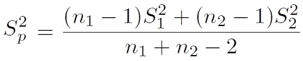*

*混合方差 Sp*

****假设:*** (i)两个随机变量都具有正态分布(ii)小样本量(iii)未知方差(且不等)(iv)相互独立的总体。这被称为韦尔奇 t 检验或不等方差 t 检验。*

*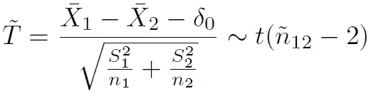*

*双样本 T 统计量*

*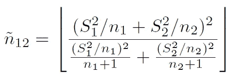*

*双样本 T-统计量的自由度*

***五、一个样本χ检验:***

****假设:*** (i)随机变量具有正态分布*

*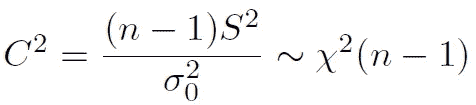*

*单样本χ统计量*

***六。两个样本的 f 检验:***

****假设:*** (i)两个随机变量都具有正态分布(ii)相互独立的总体*

*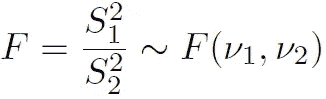*

*双样本 F 统计量*

*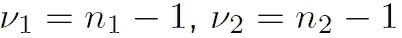*

*F-统计量的自由度*

****5、6。设置拒绝标准并做出决定:****

*这就是重要性水平发挥作用的地方。基于α的值，我们设置了拒绝标准。一旦我们选择了一个检验统计量，基于α的值和检验统计量的概率分布，我们就创建了称为临界值的界限。这些界限之外的区域称为临界区域。如果计算的检验统计量在临界区，我们拒绝零假设。*

*下图说明了如何将拒绝标准应用于单样本 z 检验，以及三种不同的备选假设。红色区域对应于关键区域。*

*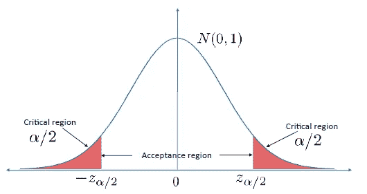*

*Hₐ一个样本均值的双边检验:μ ≠ μ₀*

*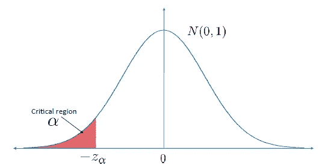*

*Hₐ一个样本均值的下尾检验:μ < μ₀*

**

*Upper tailed test for one sample mean for Hₐ : μ > μ₀*

*总而言之，如果观察到的检验统计量发生的概率非常低，我们拒绝零假设。什么叫很低？这由我们提供的显著性水平(α)决定。*

***p 值:***

*p 值被定义为获得比计算的检验统计值更极端的值的概率。换句话说，在给定样本数据的情况下，导致拒绝 H₀的最小α值。p 值也称为观察显著性水平。它是在假设零假设为真的情况下计算的。任何统计软件都会返回一个 p 值，该值可用于针对不同的显著性水平(α)进行若干假设检验，而无需重复整个过程。*

*如果 p 值>α，获得比计算的检验统计值更极端的值的概率很高(高于公差)。也就是说，如果零假设是真的，我们获得的实现具有在真理的可容忍范围内的检验统计量，并且我们获得的任何偏差都纯粹来自随机可变性。因此，我们不能拒绝零假设。*

*反之，如果 p 值< α there is a very low probability of obtaining a value more extreme than the computed test statistic. That is, if the null hypothesis is true, the realization we obtained has a very low probability (lower than the tolerance) of occurrence. The deviations observed is not due to random variability and our assumption of H₀ to be true is false. Therefore, we reject H₀.*

## ***魔方举例:***

*回到魔方的案例，现在终于是时候看看他是否能在一分钟内真正解决它，或者这只是另一种说法。*

*让我们看看给我的数据记录的分布情况。下图显示了数据记录的直方图。右边的 Q-Q 图证实了正态假设大致正确(谢天谢地！).*

*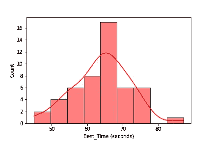**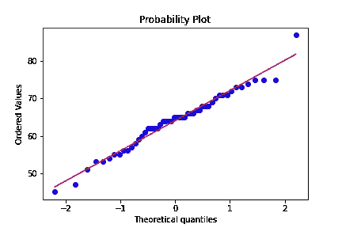*

*以下假设适用于我们的数据— (i)数据呈正态分布(ii)小样本量(iii)未知方差。因此，我们进行了单样本 t 检验。*

***一个样本 t 检验:***

*   *零假设 H₀ : **μ = μ₀** ，其中μ₀ = 60*
*   *替代假设 Hₐ : **μ > μ₀***
*   *显著性水平 **α = 0.05***
*   *均值估计(样本均值) **x̅ = 64.08***
*   *方差估计(样本方差) **S = 7.968***
*   *检验统计= **3.6203***
*   *p 值= **0.000348***

*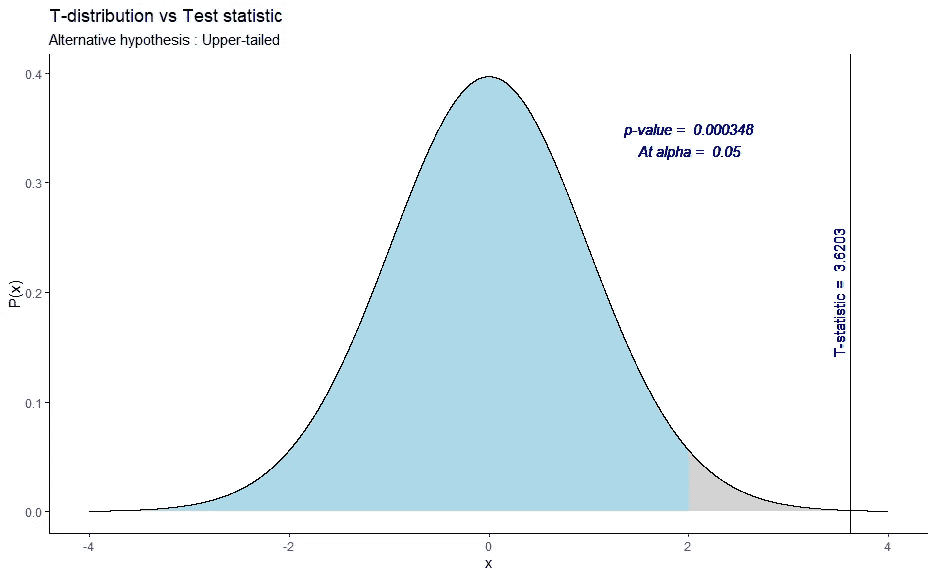*

*样本均值的单样本 T 检验*

*在上图中，灰色阴影区域代表关键区域。根据 p 值和/或观察到的 T 统计量，我们可以拒绝零假设，而支持在α = 0.05 时μ > 60 秒。我们永远找不到均值的真值(除非他无限次解立方体)，但基于构造置信区间，我们可以 95%的把握说，真正的均值在区间[62.19∞]。因此，我们断定他的说法是错误的。*

*我的兄弟，对结果不太满意，继续挑战我，"我可能在我的平均解决时间上是错误的，但是我可以向你保证，平均来说我能比你更快地解决一个立方体"。接受挑战！*

*我决定自己解立方体，记录五十个数据点。下图显示了我的数据记录的直方图以及 Q-Q 图。再次，数据似乎大致遵循正态分布，这使得生活更简单。*

*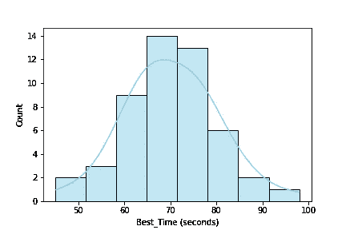**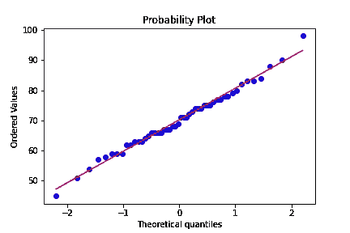*

*如下图所示，将两个直方图放在一起，我们可以看到我弟弟的平均时间比我的稍快。让我们用假设检验来验证这是否是真的。*

*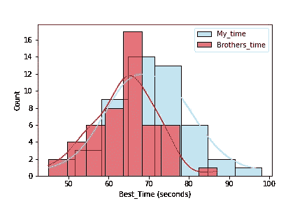*

*以下假设适用于我们的数据— (i)两个随机变量都具有正态分布;( ii)小样本量;( iii)未知方差(且不相等);( iv)相互独立的总体。因此，我们进行了方差未知的双样本 t 检验，即韦尔奇 t 检验。*

***韦尔奇 t 检验:***

*μₙ表示我兄弟所用的平均时间，而μₚ表示我的平均时间。我们想验证他的说法，因此另一个假设是μₙ < μₚ.*

*   *Null hypothesis H₀ : **μₙ = μₚ***
*   *备选假设 Hₐ : **μₙ < μₚ***
*   *显著性水平 **α = 0.05***
*   *均值估计(样本均值)**x̅ₙ= 64.08；x̅ₚ = 70.24***
*   *方差估计(样本方差)**sₙ= 7.968；Sₚ = 10.221***
*   *检验统计= **-3.3608***
*   *p 值= **0.000558***

*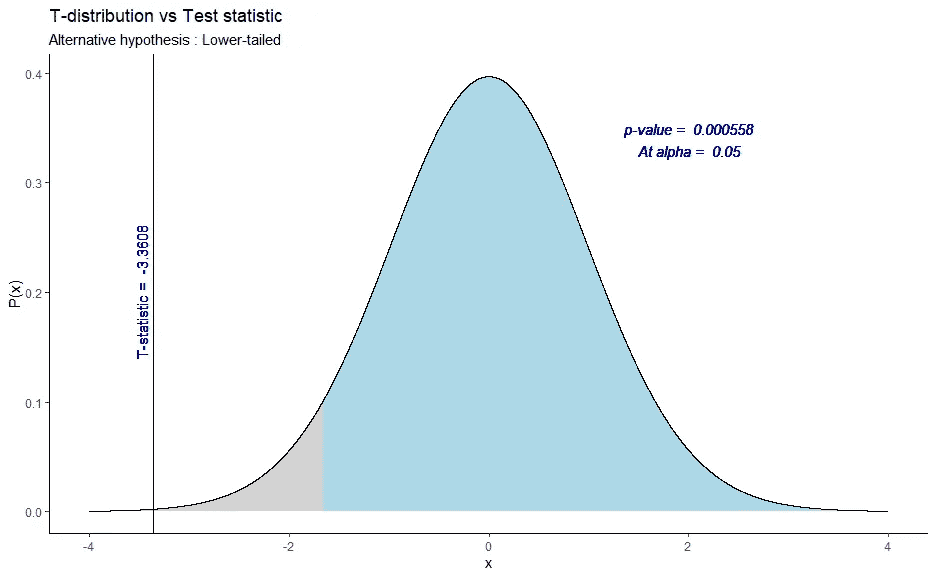*

*两个样本均值差异的 T 检验*

*从上图中，基于 p 值和/或基于观察到的 t 统计，我们可以拒绝零假设，支持μₙ < μₚ at α = 0.05\. Therefore, based on the obtained data records, we have enough evidence to prove that he can (on average) solve the cube faster than me. To summarize, my brother was right about his second claim (how sad!) and I have to work harder to defeat him.*

*This was a fun exercise and hope you guys learned how to conduct a hypothesis test for your own problem. Please feel free to share your thoughts here or connect with me on [LinkedIn](https://www.linkedin.com/in/srpraveen97) 。*

*感谢阅读！*

***参考文献:***

1.  *随机现象([https://www . Taylor Francis . com/books/random-phenomenon-babatunde-ogunnaike/10.1201/b 17197](https://www.taylorfrancis.com/books/random-phenomena-babatunde-ogunnaike/10.1201/b17197))*
2.  *统计假设检验简介([https://nptel.ac.in/courses/103/106/103106120/](https://nptel.ac.in/courses/103/106/103106120/))*