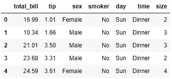

# 假设检验、P 值和一些统计检验

> 原文：<https://medium.com/analytics-vidhya/hypothesis-testing-p-value-and-some-statistical-tests-d1ce38556524?source=collection_archive---------15----------------------->

我们将详细了解假设检验和 P 值，并在 python 中进行一些测试。如果您不熟悉这些术语，请不要担心！我掩护你。


在 [Unsplash](https://unsplash.com?utm_source=medium&utm_medium=referral) 上[科学高清](https://unsplash.com/@scienceinhd?utm_source=medium&utm_medium=referral)拍摄的照片

你和你在学校所有的好朋友一起参加了一次学校旅行。猜猜在哪里？一个非常大的国家野生动物保护区。你吃过午饭，想和你最好的朋友去避难所散步。虽然没有人被允许越过危险区域，但你和你的朋友设法通过了。你正穿过丛林，唉！你好像迷路了。

作为一个勇敢的孩子，你一直走着，想找到去学校朋友和老师那里的路。但是你所有的努力都白费了。


照片由[布里吉特·托姆](https://unsplash.com/@brigittetohm?utm_source=medium&utm_medium=referral)在 [Unsplash](https://unsplash.com?utm_source=medium&utm_medium=referral) 上拍摄

你们都在一棵芒果树前停下来，然后决定休息，用那些多汁的芒果填满肚子。当你在树荫下休息时，你的朋友开始从树上摘芒果。

你的朋友摘了一些水果，你们俩开始吃。他惊叫道:“一半以上的水果都熟透了！”。

"一半以上的水果都熟透了！"是你朋友的主张。**在统计语言中，我们称之为‘假设’或‘零假设’**。“替代假设”声称与无效假设完全相反。

# 什么是假设检验？

你得知道什么是假设。当我们使用一个样本评估两个互斥(两者不能同时发生)的总体陈述时，这就是假设检验。检验一个假设有很多程序，例如:

> *一个样本比例测试*
> 
> *卡方检验*
> 
> *T 型测试*
> 
> *方差分析*
> 
> *Z 测试*

还有更多……你会惊讶地发现，假设有 100 多种测试，但没有一种能涵盖所有的测试。然而，在本文的后面，我们将讨论一些重要的过程。

## 简而言之:

在上面的例子中，你的朋友已经做了一个无效假设。但是你不会在所有情况下都得到零假设。你必须自己弥补。

因此，假设检验的第一步也是最重要的一步是识别一个无效假设和一个替代假设。

假设检验的主要目的是检验零假设是否成立。为此，我们需要数据。你必须根据你的方便来收集和整理数据。我将尝试借助上面的例子本身来解释这一点。

你想测试你朋友说法的可信度。当你独自一人在丛林中无所事事时，你在树上收集了 10 个样品中的 5 个，发现每个样品中分别有[4，6，2，3，7]个过熟的芒果。我们已经收集了 50 个芒果的数据，所以我们的人口规模是 50，我们将测试是否有超过 25 个芒果过熟。这就对了。你有你的数据。

无论如何，我们现在不打算对此进行统计测试。但是我们会试着看看那些我们需要做假设检验的东西。甚至在此之前，我们需要讨论我们在检验假设时可能犯的错误。有两种类型的错误。

# 什么是第一类错误？

当我们拒绝零假设时，它实际上是真的，这是第一类错误。这可能是由多种原因造成的，如数据不足、技术不当等。

# 什么是第二类错误？

这与第一类错误相反。当我们不能拒绝零假设时，即使它是假的，这被称为第二类错误。

# 显著性水平(alpha)是什么？

犯第一类错误的概率称为显著性水平。测试通常以 5%或 1%的 alpha 级别运行。它被称为拒绝区域，即如果 P 值低于显著性水平，我们拒绝零假设。

这完全取决于你想冒多大的风险。如果你希望你的结果 95%正确，那么你的阿尔法水平就是 5%。如果你希望你的结果 99%正确，那么你的阿尔法水平应该是 1%。恐怕你的测试不会在任何给定的时间点给出 100%准确的结果，除了一些不常见的情况。

> 这里出现了一个超级有趣的问题。为什么我会选择 95%的准确率，而实际上我可以选择 99%的准确率？有些事我们需要明白。

# 为什么显著性水平通常选择 5%？

我将为你重复重要性水平的定义。“犯第一类错误的概率称为显著性水平”。我们也讨论了第一类错误。如果我们拒绝了为真的零假设，这被称为第一类错误。

所以，当我们降低显著性水平的值时，我们降低了犯第一类错误的概率，这没问题。但同时，我们增加了犯第二类错误的可能性。因此，最好是评估这种情况下的风险，并设定你的阿尔法值。

现在我们要讨论单尾和双尾检验。

# 什么是单尾检验？

让我们再次看看上面的芒果例子。你的朋友怎么说？他说:“一半以上的水果都熟透了！”这就是我们的无效假设。那么另一个假设是什么呢？

就是“没有超过一半的水果是熟透的”。我们需要测试过熟芒果的数量是否大于水果总量的 50%。

这种检验就是单尾检验。让我给你讲讲双尾检验，这样你就可以详细了解这两个检验了。

# 什么是双尾检验？

一名政府官员声称当地学校的辍学率为 25%。去年，603 名学生中有 190 人辍学。

明确你的无效假设。应该是，“每年正好有 25%的学生辍学”。另一个假设是，“辍学学生的比例不完全是 25%”。这将是一个双尾检验，因为如果百分比明显小于或大于 25%，我们将拒绝零假设。

但是在芒果的例子中，只有当过熟的芒果明显少于总数的 50%时，我们才拒绝零假设。

还有一点需要注意。在双尾检验中，显著性水平分为两部分，也就是说，如果你选择 5%的 alpha 水平，那么两个尾部的显著性水平都是 2.5%。


孙富在 [Unsplash](https://unsplash.com?utm_source=medium&utm_medium=referral) 上的照片

# 什么是 P 值？

假设你掷两次不带偏见的硬币。你能告诉我两个头出现的概率有多大吗？所有可能的结果是[HH，HT，TH，TT]。因为概率是有利结果的数量除以结果的总数，所以概率是 1/4 或 0.25。

现在，两个人的 P 值是多少？ ***通常，在给定的条件下，如双尾检验、自由度等*** ，每个检验的 P 值都在表格中给出。但是今天，让我们来学习这些 P 值是如何计算和使用的。

## p 值是三部分之和。

> *事件发生的概率。*
> 
> 同样罕见的事件发生的概率。
> 
> *比较罕见的事件发生的概率。*

# P 值怎么算？

考虑上面的例子。让我们试着计算两次抛硬币时出现的两个头的 P 值。

第一部分是我们已经计算过的事件概率，即 0.25。现在到了第二部分。同样罕见的事件的概率，即出现两个尾部的概率也是 0.25。

第三部分是更罕见事件的概率。在我们这种情况下，没有比两个头出现更罕见的事情了。所以第三部分是零。如果我们把这些都加起来，我们得到 P 值 0.5。

大多数人都把概率误认为 P 值。希望你现在明白区别了。

现在你可能会问一个问题。这是一个小实验，总共只有 4 个结果，所以我们能够很容易地计算 P 值。如果有上百个观测值呢？几千？那我们该怎么办？

我们用一种叫做密度的东西。

假设我们正在一所大学里测量女性的身高。我们已经收集了数据，并以正态分布的形式绘制出来。对于这个例子，参考[这个视频](https://www.youtube.com/watch?v=5Z9OIYA8He8)。

大部分数值都在 142 到 169 cm 之间。确切地说，95%的数值位于 142 到 169 厘米之间。这表明，每次我们测量女性身高时，有 2.5%的可能性会超过 169 厘米，有 2.5%的可能性会低于 142 厘米。

现在让我们开始计算 P 值。身高 142 cm 的人 P 值是多少？

> 第一部分(事件的概率):由于我们有数百次观察，一个人身高 142 cm 的概率可以忽略不计。
> 
> 第二部分(同样罕见事件的概率):由于第一部分趋向于零，这也趋向于零。
> 
> 第三部分(更罕见事件的概率):现在，我们必须考虑尾部的值，因为与身高 142 cm 的人相比，它们发生的概率很小。那就是 2.5%+2.5%的结果到 5%。

所以身高 142 cm 的人的 P 值是 0.05。现在让我们看一下我们通常用来检验假设的一些检验。

# t 检验

有两种类型的 T 检验——单样本 T 检验和双样本 T 检验。

它们听起来就是这样。当我们处理一个样本时，使用一个样本 T 检验；当我们想要比较两个不同的样本时，使用两个样本 T 检验。

## 一个样本 T 检验

正如我前面提到的，当同一人群中有一个(或多个)不同的样本时，就使用一个样本 T 检验。让我们在芒果的例子上做测试。

零假设:过熟果实> 25 个(果实总数的一半)替代假设:过熟果实< = 25 个。

真正过熟的水果是[4，6，2，3，7]

```
# import one sample t test 
from scipy.stats import ttest_1samp
# This function returns two values. The first one is the t statistic # and the second one is p-value
statistic,p_value = ttest_1samp([4,6,2,3,7],5)
# We considered 5 here because 50% of each sample would be 5\. As we # have 5 samples, total would turnout to be 25.
print("The P-value is:",p_value)
if p_value <= 0.05:
    print("The hypothesis is rejected")
else:
    print("Your friend's claim is true! Unable to reject null hypothesis")Output:
The P-value is: 0.5528894339334173
Your friend's claim is true! Unable to reject null hypothesis
```

## 双样本 T 检验

当我们考虑两个独立的样本，即它们属于不同的总体时，我们使用这种检验，它也被称为独立 T 检验。让我们考虑一个例子，其中有来自两个不同田地的烟草植株高度的两个样本。Field_1 高度给定为[69，56，84，63，34，45，73，65]。Field_2 高度给定为[46，34，23，56，42，54，32，49]。让我们看看两块地的产量是否有差别。

零假设:两块田的产量没有差别。

替代假设:两块田的产量有差异。

```
field_1,field_2 = [69,56,84,63,34,45,73,65],[46,34,23,56,42,54,32,49]
# import independent t test which is also called two sample t test
from scipy.stats import ttest_ind
# This function returns two values. The first one is the t statistic # and the second one is p-value
statistic,p_value = ttest_ind(field_1,field_2)
print("P-value is:",p_value)
if p_value <= 0.05:
    print("We reject the null hypothesis. There is a difference between the yield of two fields")
else:
    print("We fail to reject the null hypothesis. There is no difference between the yield of two fields")Output:
P-value is: 0.015464452955301845
We reject the null hypothesis. There is a difference between the yield of two fields
```

在上面的双尾双样本 T 检验中，我们观察到零假设被拒绝。但是我们可以看到 P 值大于 0.01，这意味着如果我们选择α为 0.01，假设就被接受了。但是这增加了第二类错误的机会，这是我们不能承受的。

# 卡方检验

当一个总体中有两个分类变量时，应用该检验。它用于确定两个变量之间是否有显著的关联。

为了执行这个测试，我们将从库 SEABORN 导入一个数据集。

```
# Importing essential libraries and loading the dataset.
import scipy.stats as stats
import seaborn as sns
import pandas as pd
import numpy as np
dataset=sns.load_dataset('tips')print("Dimensions of the dataset:",dataset.shape[0],"rows and",dataset.shape[1],"columns.")
dataset.head()Output:
Dimensions of the dataset: 244 rows and 7 columns.
```



我们数据集的前五个观察值

正如我们所看到的，数据集中有 7 列。但是我们只关心“性”和“吸烟者”两个栏目。我们要找出这两列之间是否有任何关联。

无效假设:两列之间没有关联。

另一个假设:这两列之间有关联。

```
# Making a crosstab for the two columns we want to find the association between.
sex_smoker = pd.crosstab(dataset['sex'],dataset['smoker'])val = stats.chi2_contingency(sex_smoker)
valOutput:
(0.008763290531773594, 0.925417020494423, 1, array([[59.84016393, 97.15983607],
        [33.15983607, 53.84016393]]))
```

让我们看看 chi2 _ contigency 函数返回了什么。第一个值是 chi2 检验统计量。第二个值是概率，而第三个是 P 值，最后一个是数组，是期望值。

```
degrees_of_freedom,expected_values = val[2],val[3]
print("Degrees of freedom:",degrees_of_freedom , "\nExpected values:",expected_values)
# Storing the crosstab 
observed_values = sex_smoker.valuesOutput:
Degrees of freedom: 1 
Expected values: [[59.84016393 97.15983607]
 [33.15983607 53.84016393]]
```

# 执行卡方检验

```
from scipy.stats import chi2
chi_square = sum([(o-e)**2./e for o,e in zip(observed_values,expected_values)])
chi_square_statistic = chi_square[0]+chi_square[1]
print('Chi-square test statistic is:',chi_square_statistic)Output:
Chi-square test statistic is: 0.001934818536627623
```

在上面的代码中实现了卡方检验统计公式。

如果你不懂代码，不用担心。我们将在以后从理论上详细讨论这些测试。

```
# Calculating critical value, it will always be given in your tables. But while coding, we have to calculate it.

critical_value=chi2.ppf(q=1-alpha,df=degrees_of_freedom)
print('critical_value:',critical_value)# PPF is Percent point function which is the inverse of Cumulative distribution function.Output:
critical_value: 3.841458820694124
```

为了说明这一点，让我告诉你，如果卡方统计量大于临界值，我们拒绝零假设。

```
if chi_square_statistic>=critical_value:
    print("Reject null hypothesis,There is a relationship between 2 categorical variables")
else:
    print("Retain null hypothesis,There is no relationship between 2 categorical variables")Output:
Retain null hypothesis,There is no relationship between 2 categorical variables
```

# 参考

1.  [**斯蒂芬妮格伦**](https://www.statisticshowto.com/contact/) 。来自 StatisticsHowTo.com[](https://www.statisticshowto.com/)**的“假设检验”:对我们其他人来说是基本的统计数据！[https://www . statistics show to . com/probability-and-statistics/hypothesis-testing/](https://www.statisticshowto.com/probability-and-statistics/hypothesis-testing/)**
2.  **统计学基础(上册):A. M. **Goon** ，B. **达斯古普塔**，M. K. **古普塔****