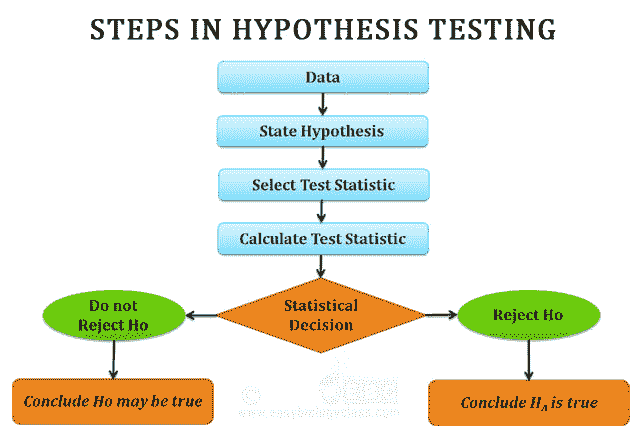
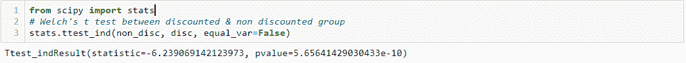
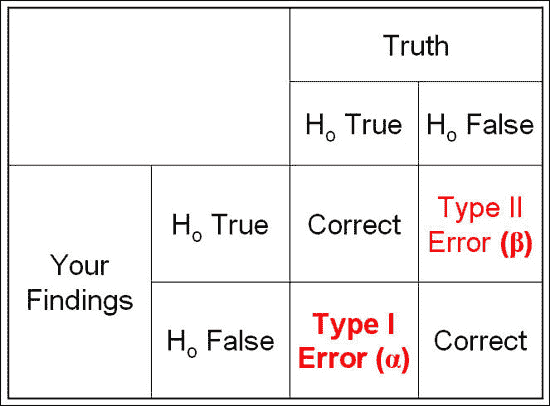

# 假设检验步骤

> 原文：<https://medium.com/analytics-vidhya/hypothesis-testing-steps-235d2670cad4?source=collection_archive---------5----------------------->

假设检验是使用统计学来确定特定假设为真的概率的过程。它评估关于总体的两个互斥的陈述，以确定哪一个陈述最受样本数据支持。假设检验的过程包括四个主要步骤:

# **步骤 1:构建一个假设**

在此阶段，我们制定了两个假设进行测试:

***零假设(Ho):*** 一种假设，即提出观察值是一个纯粹偶然的结果，两组或多组之间没有影响关系或差异。

***【Ha】***:提出样本观察值受某种非随机原因影响，两组或多组之间存在影响或差异的假设。这是你试图用实验来证明的说法。

销售折扣是通过吸引更多顾客并鼓励他们购买更多商品来增加收入的好方法。知道给予折扣的正确方法将有助于公司增加收入。我们正试图了解折扣是否对订单数量有影响，以及哪个折扣的影响最大。让我们陈述无效假设和替代假设。

***Ho*** *:有折扣和无折扣订单的平均订购数量相同。*

***哈*** *:有折扣时的平均订购量高于无折扣时的平均订购量。*

你要做的第一件事是计算打折产品和不打折产品的平均数量。问题是，我们能利用全部人口做到这一点吗？我们很少有机会处理整个数据群体，大多数时候我们必须获得一个能代表总体的样本。为了得到高质量的样本，我们必须检查这些[假设](https://www.investopedia.com/ask/answers/073115/what-assumptions-are-made-when-conducting-ttest.asp)是否满足。

# 步骤 2:设置显著性水平(α)

*显著性水平*(用希腊字母α表示)是决定何时拒绝零假设的概率阈值。通常，研究人员选择 0.01、0.05 或 0.10 的显著水平，但可以使用 0 到 1 之间的任何值。设置显著性水平α = 0.01 意味着当你的零假设实际上为真时，你有 1%的机会接受你的替代假设。

对于我们的例子，我们将设置α = 0.05 的显著水平。

# 步骤 3:计算检验统计量和 P 值

根据样本数据计算，测试可能是:

[***T 检验***](https://towardsdatascience.com/inferential-statistics-series-t-test-using-numpy-2718f8f9bf2f) :比较两个给定样本的均值。

[***ANOVA Test***](https://www.spss-tutorials.com/anova-what-is-it/):用一次测试比较三个或三个以上样本。

[***卡方***](https://www.spss-tutorials.com/chi-square-independence-test/) :比较分类变量。

[***皮尔逊相关***](https://www.spss-tutorials.com/pearson-correlation-coefficient/) :比较两个连续变量。

给定一个检验统计量，我们可以评估与该检验统计量相关的概率，称为 p 值。p 值是假设[零假设](http://mathworld.wolfram.com/NullHypothesis.html)为真，获得至少与观察到的统计一样重要的检验统计的概率。p 值越小，反对零假设的证据越强。下面是用于韦尔奇 t 测试的 python 代码。整个项目的 Github 链接可以在这里找到[。](https://github.com/omegamarkos/Northwind-hypothesis-testing-/blob/master/Northwind.ipynb)

为了在我们的例子中运行 t-test，首先，我们需要从 Scipy 导入 stats。

# 第四步:得出结论

将计算的 p 值与给定的显著性水平α进行比较。如果 p 值小于或等于α，我们拒绝零假设，如果它大于α，我们拒绝零假设失败。

在上面的例子中，由于我们的 p 值小于 0.05，我们拒绝零假设，并得出结论，给予折扣对订单数量有影响。

## 决策错误:

当我们决定拒绝或未能拒绝零假设时，可能会出现两种错误。

***一类错误:*** 一类错误发生在当一个零假设为真时，我们拒绝该假设。犯 I 类错误的概率是显著性水平α。

***II 型错误。当我们不能拒绝一个为假的零假设时，就会出现第二类错误。犯第二类错误的概率称为β，通常用β表示。*而非*犯 II 型错误的概率称为测试的功效。***

感谢阅读！

本文的所有代码都可以在[这里](https://github.com/omegamarkos/Northwind-hypothesis-testing-/blob/master/Northwind.ipynb)找到。

参考资料:

[https://www . easybiologyclass . com/hypothesis-testing-in-statistics-short-lecture-notes/](https://www.easybiologyclass.com/hypothesis-testing-in-statistics-short-lecture-notes/)

[https://www . nedarc . org/statistical help/advancedStatisticalTopics/hypothesistesting . html](https://www.nedarc.org/statisticalHelp/advancedStatisticalTopics/hypothesisTesting.html)

[https://machine learning mastery . com/statistical-hypothesis-tests/](https://machinelearningmastery.com/statistical-hypothesis-tests/)