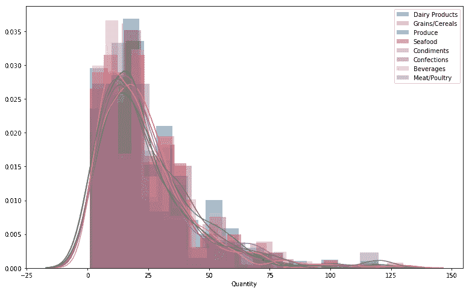

# 用微软的 Northwind 数据库进行假设检验

> 原文：<https://medium.com/analytics-vidhya/hypothesis-testing-with-microsofts-northwind-database-d1d30df8016b?source=collection_archive---------9----------------------->

当试图用数据库或数据集回答问题时，假设检验是一项非常有用的技能。在本文中，我们将使用 Northwind 数据库，看看是否可以通过假设检验来回答以下问题。：

> 按货物类别排序的数量有显著差异吗？
> 
> 单个类别对 Northwind 订购的商品数量是否会对整体数量产生重大影响？

首先，我们将设置我们的零假设如下:

**零假设**:

> *1。)H_0* :按品类分商品数量没有区别
> 
> *2。)H_0:* 某一类商品对订购数量没有重大影响。

**替代假设**:

> *1。)H_a* :订购的商品至少有一个类别数量有明显差异
> 
> 2.)H_a:至少在一个商品类别中有重大影响，且对订购数量有影响。

我们拒绝或未能拒绝一个假设的阈值是𝞪 = 0.05。

*工作流程*:

为了回答这个问题，我们需要访问和分析数据的工具、支持所需操作的平台以及分析数据的结构化方法。这个项目中使用的主要工具是 Python，Anaconda 平台有助于简化整个过程。以下是本项目中使用的工作流程的步骤:

1.  查询 SQL 数据库以获得所需的信息
2.  将数据可视化，以查看是否出现了任何模式或趋势
3.  通过使用直方图或正态性检验来检验数据是否正常。
4.  根据当时分析的数据和结果，我们将执行 bootstrap 抽样以获得均值样本，该样本将遵循正态分布
5.  使用 ANOVA & Tukey 进行测试，找出数据中不同类别之间的差异
6.  计算效果大小和/或功效，看看我们的不同比较
7.  陈述我们测试的结果。

关于本文中发现的更多信息，您可以参考 Github 站点以获得完整的项目信息和细节

# 在数据库中查询信息

为了有效地从数据库中提取所需的信息，我创建了一个简单的类来处理与数据库相关的一切。Python 的 SQLite3 包用于创建旨在访问数据库的 helper 类。回答上述问题所需的大部分信息位于数据库的`OrderDetail`表中。

*Northwind* 数据库的模式

# 形象化

为了用 Python 可视化数据，使用了 *Seaborn、Matplotlib.pyplot、*和 *Pandas* 包。用于可视化数据的主要图是*直方图*、*分布图、小提琴图、*和*箱线图*。在这 4 个图和对数据使用的测试之间，它们提供了对我们的数据的性质和我们正在比较的类别之间的差异的强烈洞察力。

*观察结果*

每个类别订购数量的平均值非常相似。从我们的箱线图来看，明显不同的那个属于*肉类/家禽。*因为他们都有非常相似的经历

按类别对数量进行描述性统计

按类别的数量分布(原始数据)

假设每个类别的位置意味着&它们的箱线图的形状非常相似，那么它们都遵循相似的分布是有道理的。

由于数据是非正态的，我们将生成一个均值样本，并对这些随机均值样本进行进一步的检验。我们将使用引导抽样来创建正态分布的数据。

# 抽样

基于*中心极限定理，*我们可以通过从现有的非正态数据中抽取 *n* 个样本来生成正态分布的数据。我们计算随机样本的平均值，并保存计算出的平均值。如果我们重复几次，随机样本的保存平均值将形成正态分布。因为我们后面的测试假设我们的数据是正态分布的，所以 *bootstrap 抽样*被用来创建均值的随机分布，我们将在后面的测试中使用。

在抽样过程中，我决定将样本数、样本大小和样本均值都设为 n=50。这样做是为了避免在采样过程中夸大结果，并防止在以后的测试中出现功率劫持。尽管通过抽样获得了正态分布，但来自原始数据或总体的样本均值并没有为所有类别生成平滑的正态分布。仍然存在某种程度的不对称。

*在*之前

按类别的数量分布(原始数据)

*在*之后

均值分布的样本，使用 bootstrap 抽样。

我们的分布不像正态分布那样具有完美平滑的钟形。我们仍然可以在下一组测试中使用我们的均值样本。数据不必完全正常，但要足够接近，以便进行比较。

# 使用 ANOVA 和 Tukey 测试寻找差异

本项目中为确定货物类型是否对订购数量有影响而执行的两个主要测试是 *ANOVA* 和 *Tukey* 。

*方差分析*

通过 ANOVA 测试，我们试图确定订购的商品类别的数量是否存在差异。根据我们的测试，在我们比较的参数中没有显著性的迹象。

我们的第一个零假设表明，按各自类别订购的商品数量之间没有显著差异。为了拒绝零假设，我们需要列 *PR( > F)* 小于我们设置的 alpha 值 0.05。由于情况并非如此，我们不能拒绝零假设。

方差分析测试的结果

> 根据我们的方差分析测试，客户订购的不同类别的商品数量之间没有**而不是**显著差异。因此，我们不能拒绝我们的第一个零假设

为了进一步验证这一点，我们还运行了事后 Tukey 测试来比较每个类别。通过这种方式，我们可以看到各组之间是否有任何差异。

*图基测试*

通过 Tukey 测试，我们试图了解不同类别的商品之间是否存在显著差异。。Tukey 测试验证了我们的 ANOVA 测试报告的内容，但也让我们更深入地了解了不同类别商品之间的关系。我们的图表显示了数据类别之间的差异，以及上限和下限，以直观显示商品类别之间的差异。

我们还运行了几次 Tukey 测试，对类别进行了 bootstrap 采样，以查看是否有突出的总体趋势。大多数生成的图形差异相对较小。它们与下面列出的非常相似。

> 除了*谷物/谷类*和可能的*饮料之外，订购的产品数量与大多数其他类别的商品数量之间存在显著差异。*

差异的 Tukey 测试可视化

根据 Tukey 测试，在*产品*和大多数其他产品之间存在显著差异。其他被认为没有显著差异的商品是*谷物/谷类*和*饮料。*尽管*饮料*被认为没有明显的不同，但它与*农产品*有很小的重叠部分，因此它可以向任何方向发展*。*

既然我们已经回答了第一个问题的第一部分，现在我们可以继续回答第二个问题:*是否有一类商品对订购的商品数量有重大影响？为了回答这个问题，我们将计算影响大小和统计功效。*

# **效果大小和统计功效**

为了回答第二个问题，必须将货物类别各自的平均抽样与总人口的平均抽样进行比较。我们正在检查一个给定数据点相对于总体人口的预测可信度。在我们使用通过 bootstrap 抽样生成的均值样本进行比较时，与总体样本相比，类别之间往往有大量重叠。这种重叠可能是相对较差的显著统计功效的指标。

*计算能力*

我们从 Python 中的`statsmodels.stats.power`包导入了`*tt_ind_solve_power*` ，以计算我们各自的样本相对于总体样本的功效。已知或可获得的值是我们的 *alpha* 阈值和*效果大小*。通过使用 Cohen's D 对总体样本均值和每一类商品的样本均值进行计算，得出影响大小。一旦计算出影响大小，我们就将这些参数传递给函数`tt_ind_solve_power` 以获得统计功效。

总体样本均值与类别样本均值的比较

*结果*

> 从对我们数据的测试来看，**我们无法拒绝我们的零假设**。**商品类别对订购商品数量没有统计影响**

总的来说，每一类计算出来的功率都很差。在多次运行我们的随机抽样后，功率范围往往在 5%和 60%之间。也有高达 90%的高功率运行。尽管这些级别的功率非常高，但是它们的关联图仍然显示了大量的重叠以及从 2 到 4 的非常高的有效大小。这些效应的大小抵消了它们各自的统计功效。根据对我们数据的检验，我们不能拒绝我们的无效假设。货物类别对订购的货物数量没有统计影响。

根据我们的统计功效计算结果，我们不能自信地说一类商品对订购商品的总量有显著影响。

# **总结**

在这个项目中，我们试图通过假设检验来回答以下问题:

> 按货物类别排序的数量有显著差异吗？
> 
> 单个类别对 Northwind 订购的商品数量是否会对整体数量产生重大影响？

通过使用助手类来查询 SQLite 数据库、数据的可视化、采样方法和一些统计测试手段，我们能够回答我们最初的问题。我们的 ANOVA 测试表明，按类别排序的商品数量没有显著差异，但我们的 Tukey 测试表明，至少有一个商品类别存在差异。除了*谷物/谷类&饮料之外，这种差异在大多数类别的产品搭配中都可以看到。*因此，我们拒绝了第一个无效假设。

我们 Tukey 测试对比的可视化

然后我们继续通过计算统计功效来回答我们的第二个问题。为了做到这一点，我们将每个类别的样本均值与总体样本均值进行了比较。我们还使用 Cohen 的 D 计算了每个效应的大小，然后将这些值传递给函数`statsmodel.stats.power`来求解我们的功效。由于我们的功率计算非常低，我们无法拒绝我们的第二个零假设。某一类商品对订购的商品数量没有重大影响。

# 结束语

这个项目非常具有挑战性，同时也很有趣。对于那些寻求提高假设检验技能的人来说， *Northwind* 数据库是一个非常有用的工具。

还有许多其他问题可以问，例如*是否有一种特定商品对收入有重大影响，*或*是否有一家特定公司的业务似乎依赖于某种产品或产品类别？这些和其他问题是练习和磨练使用假设检验和其他工具能力的好方法，例如使用 SQL 查询数据库，甚至提高您在统计学、Python 或任何其他用于分析的工具方面的技能。*

有关整个项目的更多信息，请参考下面列出的 Github 资源库。

 [## rahkeemg/DSC-用 north wind-数据库进行假设检验

### 在本课中，我们将回顾模块 3 期末项目的所有指导方针和规范。了解所有…

github.com](https://github.com/rahkeemg/dsc-Hypothesis-testing-with-Northwind-Database)