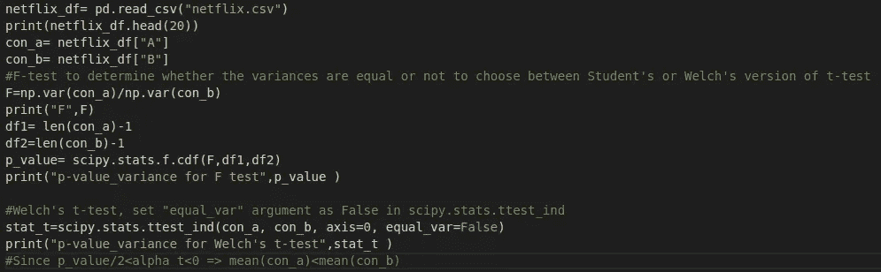

# 用 Python 进行假设检验

> 原文：<https://medium.com/analytics-vidhya/hypothesis-testing-with-python-2a76cac2dc71?source=collection_archive---------32----------------------->

我们将从这个想法的简要概述开始，然后转移到各种测试，并尝试用 Python 包含一个例子。

假设检验是一种根据从比总体规模更小的样本规模收集的数据来形成关于总体的统计结论的方法。假设是关于我们想要证明或否定的参数的陈述，因此得名:

零假设=Ho=现状[例如:让人类接受特定的日出治疗不会改变晒伤率]

替代假设= Ha =收集数据的原因[例如:用特定的防晒霜治疗人类确实会改变晒伤率]

因为我们没有提到在替代假设中使用防晒霜后晒伤的变化率是在什么方向，所以这是一个**双边测试**。

ho:θ=θo 与 Ha:θ≠θo

另一方面，一面倒的假设是，当我们具体说明防晒霜降低燃烧速度的方向时。

ho:θ≥θo 与 Ha:θ< Θo

*参考 p 值详情&1 类和 2 类误差***:**[https://www.abtasty.com/blog/type-1-and-type-2-errors/](https://www.abtasty.com/blog/type-1-and-type-2-errors/)

我们希望一个假设有小的意义和大的力量。

常见选择:α = 0.05，β = 0.2

想象一下，网飞正在测试他们 UI(用户界面)中标签的位置——“浏览 DVD”和“立即观看”。他们进行了一项实验来收集数据，以观察标签的位置对流媒体服务有正面还是负面影响。

网站界面(原谅设计技巧)

这里，

1.  *感兴趣的指标*是平均每周流媒体播放时间。
2.  *设计因素*为 UI，*等级*为{DVD 标签优先(1)，流媒体标签优先(2)}

因此，假设是:

ho:μ1≥μ2 & Ha:μ1< μ2

where μ1 =avg weekly streaming hours in DVD tab first

μ2 = avg weekly streaming hours in streaming tab first

The dataset and the code can be accessed at [https://github . com/ApurvaMisra/statistics _ experimental _ design](https://github.com/ApurvaMisra/statistics_experimental_design)，这里我只放入代码片段和结果。

Netflix.csv 包含对 1000 名用户(每种情况下 500 人)每周观看视频内容的小时数的观察。

# **在 5%的显著性水平上测试假设**

假设检验必须用 t 检验来进行。这是一种统计，检查两个平均值是否可靠地彼此不同，而不是纯粹基于偶然。但是，为了确定 Student 的(方差相等)或 Welch 的(方差不相等)t 检验是否合适，我们将对方差进行 f 检验，以比较σ1 和σ2 是否相等。

这里，假设是-

Ho: σ1 = σ2 & Ha: σ1 ≠ σ2

其中^=值是从样本中获得的。

如果 Ho 被拒绝，我们应该做韦尔奇的 t 检验，反之亦然。

假设 Ho: σ1 /σ2 =1，统计的观测值简化为:

零假设可以在阴影区域被拒绝，即

Fo> F α/2，n1–1，N2–1 或 Fo

Since, the p-value achieved through the F-test is very small< 0.05, we reject the null-hypothesis and conclude that Welch’s t-test is appropriate here.

**韦尔奇 t 检验:**

f 检验和 T 检验的代码

获得相应的 p 值

因此，我们可以得出结论，相对于“DVD 标签优先”条件，在“流媒体标签优先”条件下平均每周流媒体播放时间更长。

**免责声明**:“所有数据和场景均来自 STAT 830:滑铁卢大学的实验设计，由 Stevens 教授授课。”