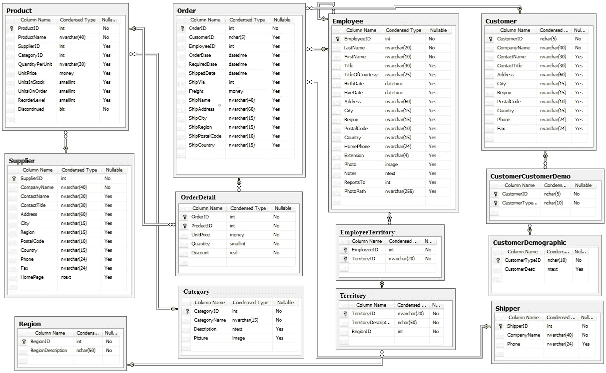
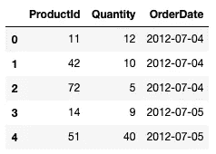
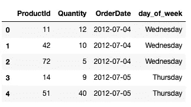
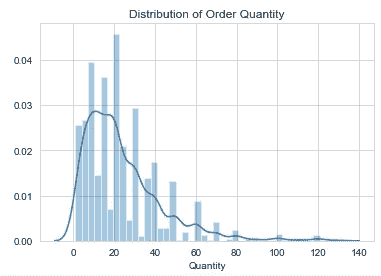
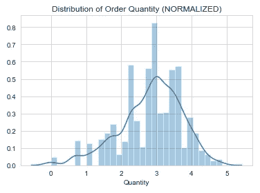
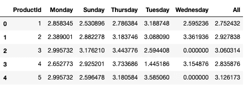
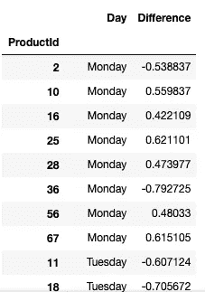

# 使用 Northwind 数据库进行假设检验

> 原文：<https://medium.com/analytics-vidhya/hypothesis-testing-with-the-northwind-database-d0382c9328bd?source=collection_archive---------9----------------------->


假设你是一名零售商，为一家虚构的国际特色食品供应商 Northwind Traders 工作。你的工作是确保你有足够的库存来完成每一个订单，并且产品不会在你的货架上放太久，可能会变质或变得不新鲜。产品告罄可能会导致你的客户转向竞争对手，临近保质期的食品将会降价销售，从而降低 Northwind 的利润率。

幸运的是，您的数据库中有三年的订单历史记录，所以是时候开始工作了。

## 首先，我们必须定义我们的假设。

𝐻₀星期几对订单数量没有影响。
H₁一周中的哪一天会导致订单数量的差异。

我们将试图拒绝零假设，即每天的订货量没有不同。这是一个双尾 T 检验，将检验样本均值是显著小于还是大于总体均值。显著性水平为 0.05 时，样本均值必须在概率分布的前 2.5%或后 2.5%。

## 现在，让我们得到我们的数据。

(这里可以下载北风数据库[)](https://docs.microsoft.com/en-us/dotnet/framework/data/adonet/sql/linq/downloading-sample-databases)

我们将使用 SQLite3 来获取数据，并使用 Python 来操作数据。以下是 Northwind 数据库的 ERD:



我们最感兴趣的是查看订购的产品、订购日期和订购数量。

```
cur.execute("""Select od.ProductId, od.Quantity, o.OrderDate
               FROM OrderDetail AS od
               JOIN 'Order' as o
               ON o.Id = od.OrderID;""")
order_df = pd.DataFrame(cur.fetchall()) 
order_df.columns = [i[0] for i in cur.description]
order_df.head()
```



如您所见，OrderDate 列不包括星期几。下面的代码将列从字符串更改为日期时间格式，并添加一个包含产品订购日期的新列。

```
order_df['OrderDate'] = pd.to_datetime(order_df.OrderDate)
order_df['day_of_week'] = order_df['OrderDate'].dt.day_name()
```



维奥拉。现在我们有了一周中的每一天。但在我们超越自己之前，我们需要确保数据遵循正态分布。(提示:并没有。)以下可视化显示了使用以下代码对 Quantity 列进行对数转换之前和之后的:

```
order_df.Quantity = order_df.Quantity.apply(np.log)
```



既然我们的数据已经标准化，我们需要查看一周中每天的平均订单量。为此，我们将创建一个数据透视表，并将其展平为一个数据帧。

```
weekday_quantity_pivot = pd.pivot_table(order_df, 
                                      index="ProductId", 
                                      columns='day_of_week', 
                                      values="Quantity",
                                      fill_value=0.0, 
                                      margins=True)
weekday_quantity = pd.DataFrame(weekday_quantity_pivot.to_records())
weekday_quantity.drop(77, axis=0, inplace=True)
weekday_quantity.head()
```



“所有”列显示了所有订单的平均订单数量，无论是哪一天，幸运的是，在我们进行分析时，“所有”列最终将作为我们的总体平均值。

## 考验的时候到了！

我们将使用 stats.ttest_1samp 进行单样本 T 检验。因为这是一个双尾测试(我们想知道你在那几天应该多点还是少点)，p 值需要减半。

```
pop_means = weekday_quantity.All # Population mean
alpha = .05 # Significance levelp_vals = []
d_o_w = []
significant_or_not = []
difference = []
for day in order_days:
    day_order = order_df.loc[order_df["day_of_week"] == day] #sort by day
    for i in np.arange(1,78): # Sort by product ID
        pop_mean = pop_means[i-1] #Population mean series begins at 0
        a = day_order.loc[day_order["ProductId"]==i].Quantity
        difference.append(a.mean()-pop_mean)
        T, two_tailed_p = stats.ttest_1samp(a=a, popmean=pop_mean)
        p_vals.append(round(two_tailed_p,2))
        d_o_w.append(day)
        if **alpha/2** > two_tailed_p: 
            significant_or_not.append(True)
        else:
            significant_or_not.append(False)    

results_df = pd.DataFrame([p_vals, d_o_w, significant_or_not, difference]).transpose()
results_df.columns = ['PVal', "Day", "RejectNull", "Difference"]
```



经过一天的重新索引和排序，我们得到了结果。该数据框架仅展示了 p 值小于阈值的产品，具有统计学意义。差值列是样本平均值减去总体平均值的差值。例如，产品 2 的平均订单量大于样本量，因此作为一名库存商，您可以减少周一的库存量，以应对可能变质的产品过剩，但产品 10 的库存在周一应该会增加，因为平均订单量小于样本量。

# 所以…

有了这些信息，你将在 Northwind Traders 的历史上巩固自己的地位，成为减少浪费、改善客户关系、增加利润的股票经纪人。但是工作还没有完成。节假日前后销量增加怎么办？季节性呢？产品订购的地区呢？数据科学家的工作永远不会结束。