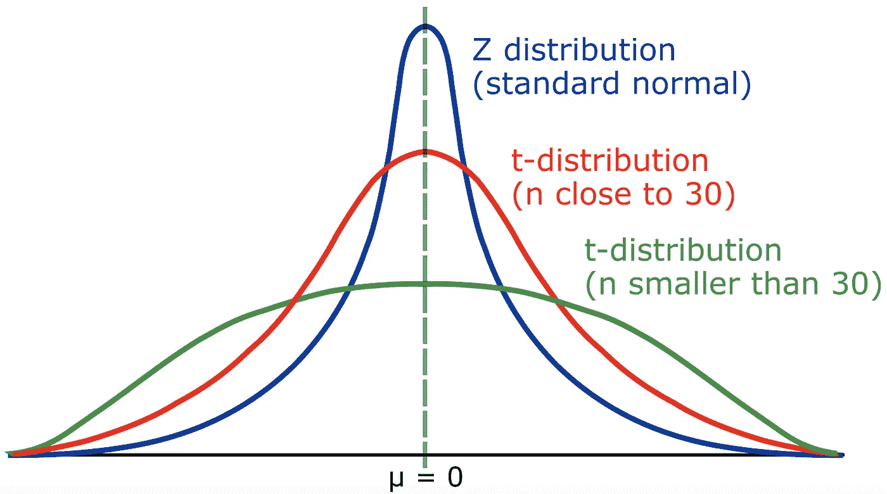
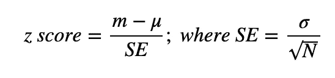
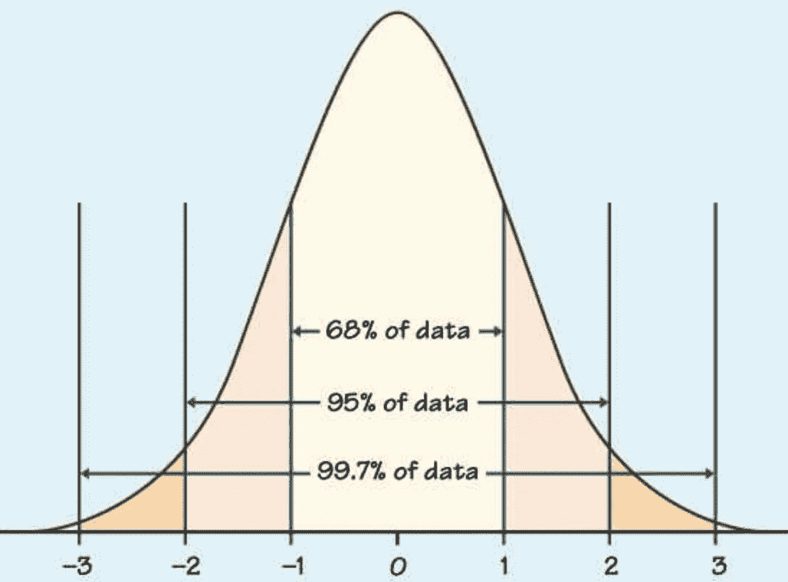
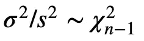
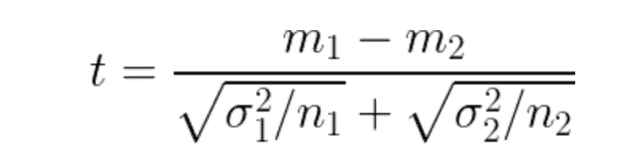
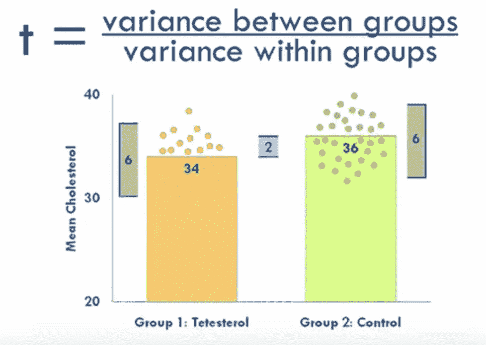
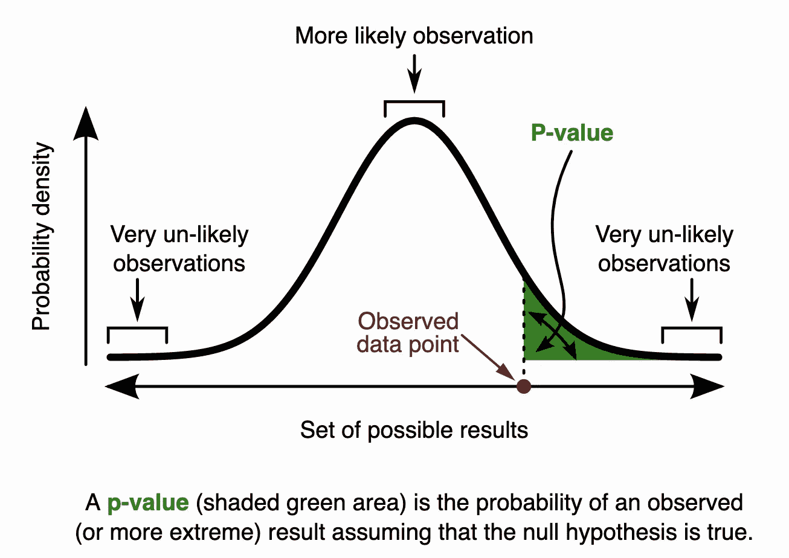

# 假设检验系列-后 1: T 检验和 P 值

> 原文：<https://medium.com/analytics-vidhya/hypothesis-tests-series-post-1-t-test-25027f5baa?source=collection_archive---------13----------------------->

统计在我们的生活中起着重要的作用。它最终成为任何数据科学家的必要基础。今天我们将通过下面的场景来回顾假设检验中的一些基本概念。

# 方案

想象一下，在一个大热天，你走在街上，然后在一家西瓜店停下来。那里的水果看起来很好，以至于你立即决定买一些，不是 2 个，也不是 3 个，而是 15 个，因为你家里有一群贪吃的人在等着你。店主断言每个成熟的西瓜大约重 1.52 公斤。作为率直的人，我们信任这个人。在家里，你的本能和好奇心会告诉你把水果放在秤上。你意识到他们大部分好像都不到 1.52 斤。这种情况下怎么用统计？

在本帖中，我们将使用一个样本 T-检验来说明这个问题。

**重述**

1.  **要解决的问题？**

我们想检查商店里西瓜的平均重量(人口平均数)是否为 1.52 公斤。

**2。怎么解决？**

一个直截了当的解决办法是测量商店里所有的西瓜。然而，这是一个牵强的想法。首先，这很费时间，其次，没有人确定你能说服店主让我们拿走他的整个水果只是为了一个微不足道的实验，至少在他看来是这样。因此，我们想出了这样一个替代方案。我们买的 15 个西瓜可以作为样品。由此，我们得到了样本的*均值*和*标准差*，它们依次用于计算 *t-stats* 和 *p 值*。

# 什么是 t 分布？

*t 分布(学生分布)与正态分布(Z 分布)相似，呈钟形，但尾部较重。当样本量很小和/或总体方差未知时，t 分布用于估计总体参数。*

如果样本量很大，t 分布接近正态分布。



正态分布和 t 分布

# 什么是 z 检验和 t 检验？

# z 测试

首先，让我们来看看它更简单的兄弟姐妹，即 z 测试:

z 测试使用 z 分数来衡量原始分数低于或高于总体平均值多少*标准差(std)* 。



*，N* 为*样本量*， *m* 为样本的均值， *μ* 和 *σ* 分别为总体的均值和标准差。

当存在正态分布(σ和μ已知)时，我们使用 z 分数，并且我们想要检查一个组的**平均值是否可靠地不同于总体**的**平均值。**

就当 z-score 是一个值点 *m* (样本均值)和一个值点 *μ* (总体均值)之间的 std 的个数*吧。注意，上式中的 *SE* 是*样本分布*的标准差，也称为*标准差*。前往[1]查看 *SE* 和*样品分配*。*

人们是如何想出这个公式的？

想法是这样的。凭直觉，我们将从总体中抽取大量样本，看看我们的样本是否可能来自总体。从浩如烟海的样本中，我们先有一个分布 X，然后，我们把*样本均值* *m* 代入 *X* ，看它符合的可能性有多大。如果 *m* 拟合得如此之好(我们可以通过计算 z 值来判断*样本均值*与*总体均值*相差多远)，我们就不能否认零假设(H0)。否则，我们拒绝 H0，因为样本不可能从总体中抽取。换句话说，在后一种情况下，我们可以拒绝 H0 接受样本可靠地不同于总体。

让我们快速看一下下面的两个例子来理解 z 测试的思想。

**Ex1** 。你的测试分数是 190 分。该测试的平均值(μ)为 150，标准差(σ)为 25。假设这是一个正态分布，你的 z 值是多少？



大多数数据位于+/- 3 标准偏差内

**Ans** :

回忆一下公式***zscore*=(*m*-*μ)*/*SE、*** *与****SE*=*σ*/sqrt(*N*)**。

插入数字:

*z 值*=(190-150)/(25/sqrt(1))= 1.6

值得注意的是，在这种情况下，样本大小为 1，因为样本中只有您的测试分数。

**Ex2** 。一般来说，女性的平均身高为 165 厘米，标准差为 5 厘米。假设身高呈正态分布，找到 50 个平均身高 170 cm 的女性随机样本的概率是多少？

**Ans** : *z 值*=(170-165)/(5/sqrt(50))= 7.07

*样本均值*比*总体均值*多 7 个*标准差*。因此，样本不太可能来自我们的人群。我们可以安全地拒绝 H0。

到目前为止，还有什么问题吗？如果没有，我有一个问题要问你。*当 N(样本量)很大(如 10000)时会发生什么？在向下滚动之前，你可以停下来思考一下。*

好吧，我们可能有你自己的答案。公式可以重新写成**(*m*—*μ)**sqrt(*N*)/*σ****。*乍一看， *N 很大，*分子也会很大，导致 *z 值很大。*由于 *z 值*较大，我们拒绝 H0。有些事情听起来不太对劲！事实上，如果样本是从总体中抽取的，那么它的均值( *m* )很有可能近似为*总体均值(μ)* 。因此，分子应该是 0(而不是一个巨大的数字)，这反过来使得*的 z 值*非常接近 0，不管分母有多大。现在有意义了吧？当样本来自完全不同的人群时，很可能你得到的样本越多(即*样本量*越大)，你就越容易区分**样本*和*人群*。*

*好的，目前为止还不错。但是等等，我们已经有了 z 测试，为什么还需要 t 测试呢？*

**因为(精确的)z 检验的局限性。**

*   **Z-tests* 只在我们知道人群的 STD(*σ*)的情况下才起作用。在现实生活中，std 是未知的，因此我们别无选择，只能通过计算*无偏样本 std* ( *s)* 来估计样本的 std *σ* 进行 t 检验。同样值得注意的是，它让我们想起了卡方分布。*

**

*卡方检验*

*   *如果数据不是正态分布，我们就不能进行 *z 检验*。*中心极限定理*可能允许我们仍然做一个 *t 检验*。*

# *t 检验*

*t 检验是由三种类型组成的参数程序[2]:*

*   ***两个样本 T-检验**(独立样本 T-检验):比较两组的平均值，看它们彼此之间是否可靠地不同。这可能是最流行的一种 t 检验。*
*   ***成对样本 T 检验**:对一组的平均值进行两次检验。例:饮酒前后测试平衡。*
*   ***一个样本的 T 检验**:将一个样本的平均值与总体平均值进行比较，以查看差异。我们要用这个来解决西瓜的问题。*

*一般来说，用 O 个*样本的 t-检验*，我们的公式与用*的 z-检验*的公式相同，只是在用*无偏* *样本 std* ( *s)* 来估计*总体的 STD*(*σ)*时稍有变化。因为要估计未知的东西，所以变得不那么自信。直观地说，当我们对总体进行估计时，标准差(即数据的扩散)必须大于从样本中计算出的原始标准差。我们用*n*1*19】来计算*无偏样本标准差* ( *s* )，而不是除以 *n* 来获得样本的“正常”标准差。然后使用*无偏样本标准差*作为总体真实标准差的近似值。从数学上讲，本测试中使用的自由度为*n*1。与正态分布相比，T-检验的钟形具有更重的尾部，因此置信度越低。随着数据越来越多(即样本量越来越大)，t 分布将变得更接近正态分布。**

*就*两样本 T 检验*而言，就有点棘手了。假设我们有 2 组，每组都有均值 *m、 *σ的*方差*、*和样本量 *n* 。t 分数的计算公式如下。**

**

**两个样本的 T 检验**

**两样本 T 检验*的思路是取*两组*之间的方差，然后除以*每组的方差。*在分母中， *n1* 和 *n2* 可以认为是归一化因子*。*在下图中，我们有两个相同大小的组，两组的平均值分别为 34、36，标准差为 6。在这种情况下，t-score ~(36–34)/6。请注意，我们刚刚忽略了*归一化因子。**

**

**两个样本 T 检验的想法。一个大的 t 分数表明组与组之间的差异很大。**

*你可能会问为什么*正态分布*遍地都是(至少在 *z-test* 和 *t-test* )。我想*中心极限定理* (CLT)在这方面有一些功劳。*正态分布*和 CLT 绝对值得自己的文章。稍后我会发一个关于这个话题的帖子。*

# *单尾还是双尾 T 检验？*

*我们只关心西瓜是否小于 1.52 kg，因此在这种情况下，一个 *1 尾 1 样本 T 检验*似乎是一个合适的选择。*

*请记住，假设检验只能帮助我们拒绝 H0，仅此而已！*

**α*(显著性水平)在这种情况下可以是 0.05。如果 *p 值*低于*α*，我们可以拒绝 H0。*

*   **H0:店里西瓜的平均重量> = 1.52(通常我们要拒收)**
*   **H1:店里西瓜的平均重量< 1.52(备选)**

*这里就不赘述计算部分的细节了。python 包应该为我们做所有的工作。*

***注**:库计算**双尾**，所以我们需要将 *p_two_tailed* (来自库的结果)除以 2，以获得**单尾**测试的 **p 值**。*

# *进行实验*

```
*### Python code*# the weights of 15 watermelons that we bought.*
weight = [1.55, 1.43, 1.48, 1.51, 1.58, 1.42, 1.52, 1.55, 1.48, 1.42, 1.48, 1.50, 1.50, 1.51, 1.46]*# the population mean that we need to check*
popmean = 1.52*# set alpha*
alpha = 0.05*# calc t-stats, and p-value of two tailed test*
t, p_two_tailed = stats.ttest_1samp(weight, popmean)*# calc p-value in 1-tailed test:*
p_value = p_two_tailed/2
print("one-tailed T-test: t = **{}**, p_value = **{}**".format(t, p_value))**if** p_value < alpha:
    print("Reject H0, the average of watermelon's weights in the shop < 1.52")
**else**:
    print("Not enough evidence, nothing the p-value can tell")*
```

# *p 值的缺陷*

## *p 值取决于样本大小，因此不一致*

*假设亚历克斯拿了 15 个西瓜做实验，而约翰拿了 30 个。p 值会有所不同。再比如，我们观察一枚硬币的公平性。如果亚历克斯扔硬币 100 次，而约翰扔 10000 次，两个结果也会不同。*

## *p 值不能提供太多信息。*

*   *我们所能得出的结论是，我们是否能拒绝 H0(存在某种 1 型错误)。没有办法知道 H0 在一定概率水平上是否是真实的。*
*   *如果 p 值很高，由于缺乏证据，我们无法判断。假设你和你的朋友打了个赌。你的朋友相信黑天鹅存在，而你不这么认为。你试图去一些野生动物园看一看成百上千的天鹅。即使你没有发现他们中的任何一个是黑人，你也不能否认你的假设，也不能接受朋友的观点。只是还没有足够的证据。*

## *适当的 p 值临界值(α)是有争议的*

*经常使用 0.05，但实际上，它应该取决于特定的实验。*

# *带回家笔记*

## *要记住的技巧*

***P 值低，空值必须进入**(如果 *p 值*低于*α值*，拒绝 H0)*

## *H0 (H 空)*

*“空”没有任何意义。无效假设倾向于说“没有影响”或者“没有什么新的，没有什么正在发生”。这就是为什么我们要拒绝 H0 去获得 H1(新知识)的原因。但事实并非总是如此。时不时地，你会意识到你需要 H0，例如，来宣称你公司中男性和女性群体的平均工资是相等的！*

## *p 值*

*   *p 值是可以选取极值的区域(概率)。当 *p 值*大于*α*时，意味着我们没有足够的证据得出任何结论。*
*   *凭借一点点微小的 p 值，我们可以理直气壮地拒绝 H0。 *p 值*是当我们拒绝 H0 时，第一类错误发生的概率*

**

*p 值的含义*

## *希腊字母的第一个字母*

*α是实验前选择的 *p 值* *截止值*。你可以认为这是我们在拒绝 H0 时允许自己犯错的概率(第一类错误——我们认为我们发现了新的东西，但事实证明不是(*假阳性-* **假**当我们认为是**阳性**))。*

*参考*

*[1]维基的样本误差和样本分布:[https://en.wikipedia.org/wiki/Standard_error](https://en.wikipedia.org/wiki/Standard_error)*

*[2]什么是 t 检验:[https://www.youtube.com/watch?v=0Pd3dc1GcHc](https://www.youtube.com/watch?v=0Pd3dc1GcHc)*

*[3]频率主义者 vs 贝叶斯统计:[https://www . analyticsvidhya . com/blog/2016/06/贝叶斯-统计-初学者-简单-英语/](https://www.analyticsvidhya.com/blog/2016/06/bayesian-statistics-beginners-simple-english/)*