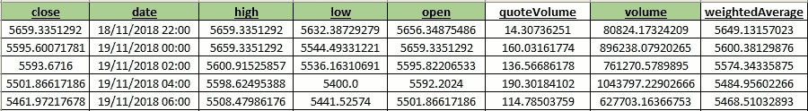
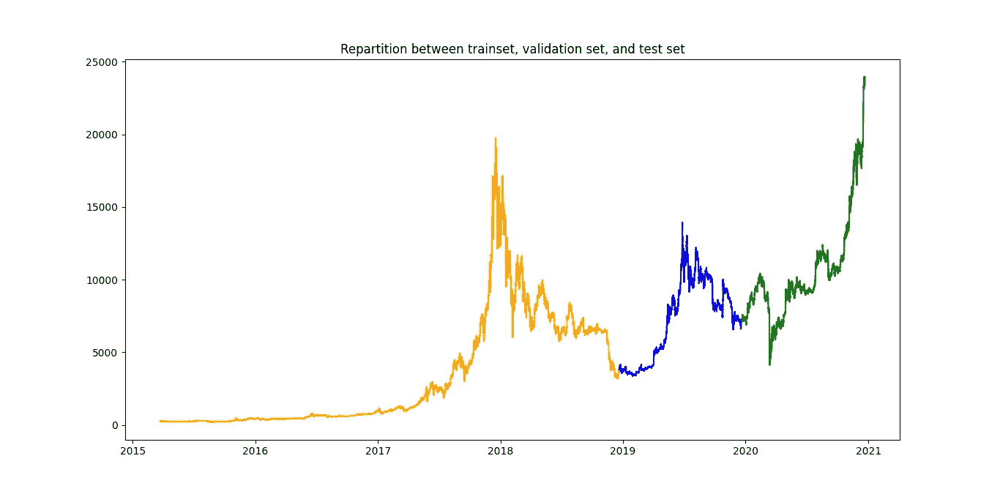
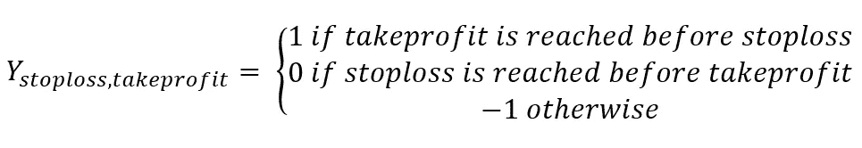
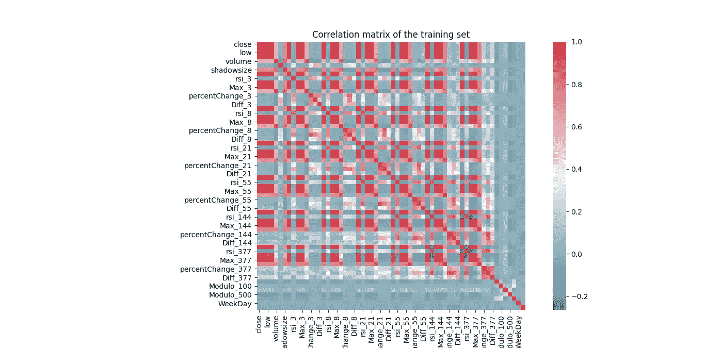
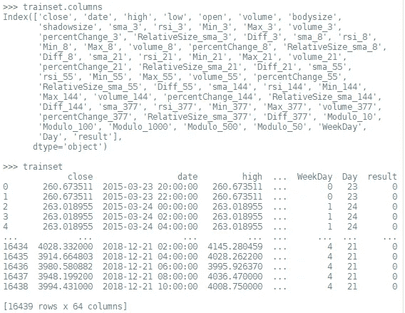
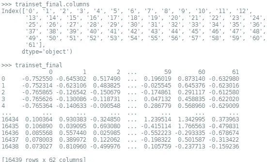

# I .用于创建股票预测数据集的交钥匙 Python 代码

> 原文：<https://medium.com/analytics-vidhya/i-a-turnkey-python-code-for-creating-a-stock-forecasting-dataset-ad25f673f3b7?source=collection_archive---------13----------------------->

> 从基本历史信息中创建一个现成的数据集。

本文是描述创建、回溯测试和部署交易机器人的分步过程的系列文章的一部分。这篇第一篇文章关注的是**计算预测变量**，而第二篇文章关注的是**构建深度学习模型**，第三篇文章关注的是**用模型识别有利可图的交易策略**，最后一篇文章关注的是程序中的实际实现(**部署**)。本文末尾给出了链接。

下面展示的管道可以应用于任何类型的金融市场(股票市场、密码、电力等)。我们构建的交易机器人只关注**看涨**走势，*即*我们只押注上涨趋势。由于交易所的多重差异，我决定不研究看跌交易。

你只需要将**输入**:

*   蜡烛线内包含以下变量的历史数据集:'*收盘*'、*日期*'、*高位*'、*低位*'、*开盘*'、*成交量【T29 ' '*
*   设置一个*止损*和一个*止盈*
*   将数据集分割成三个不同的部分:您只需要设置两个分割日期

**应用管道后您将拥有的**:

*   一组深度学习模型，以及它们在验证集上的性能
*   一个简单的交易方法:遵循最佳模型的指示
*   一种更先进的交易方法:只在最有利可图的情况下遵循最佳模式
*   一个用于 Poloniex 的操作交易机器人代码(可以适用于任何平台)

我试图让非金融读者尽可能容易理解这个系列:除了某些技术要点，文章都有很好的插图，基本概念通常很容易理解。第一篇文章有如下大纲:

**0 —导入库和常量**

**I —定义标准预测变量**

**II —构建计算所有变量的函数**

**III —计算输出**

**IV —应用 PCA 并保存结果**

**五—结论**

# **0-导入库和常量**

第一步包括初始化和输入所需的数据。导入库后，用户需要提供一个历史数据集，包含日期和每根蜡烛线内的 5 个基本信息，即**开盘**和**收盘**价格，蜡烛线内的**最小**和**最大**值，以及**交易量**。整个管道将在这些特征的基础上建造。

此外，用户只需要设置**止损**和**止盈**的值，加上我们应该将数据集分成*训练集*、*验证集*和*测试集*的日期。*训练集*用于训练深度学习模型，而*验证集*用于评估不同模型的准确性。最后，*测试集*用于检查我们的最终交易策略是否有效地处理全新的数据。

在我的例子中，我使用了从 Poloniex API 下载的加密货币数据集:它由一对 *BTC_USDT* 从 2015 年 2 月 20 日到 2020 年 12 月 21 日的 7200 秒(2 小时)蜡烛组成。我使用的数据集以及全部代码都可以在专门的 GitHub 存储库中找到[2]。

图 1:我的历史数据集的概述(绿色的相关变量)

在示例中，我确实设置了 45 个月的培训期、12 个月的验证期和 12 个月的测试期(大致为 *65%/17.5%/17.5%* )。我还决定选择*止损= 5%* 和*止盈= 10%* ，我的拆分产生以下集合:

图 2:训练集、验证集和测试集之间的划分。

初始化代码写在下面，用户应该只修改第 10 & 11 行，以便适合他自己的文件路径:

图 3:图书馆的导入和初始化

# **I —定义标准预测变量**

下一步是**定义我们要计算的变量**以预测趋势。在我的示例中，我选择只计算其中的几个变量，但是我们将会看到，这足以构建精确的模型并产生利润。在下一步中，将在不同的窗口大小上计算这些变量，以便考虑短期和长期的移动。

下面给出了计算简单移动平均线[3]和 RSI [4]的代码:

图 4 : SMA 和 RSI 的定义

# **II —构建计算所有变量的函数**

一旦我们定义了基本的预测变量，现在是时候**计算数据集**中的这些变量了。此外，我们还会计算一些常见的变量，如滚动窗口的最小值/最大值、成交量的移动平均值、 *modulos* 等。您可以选择在自己的交易机器人中添加/删除哪些变量。通常的预测变量包括指标，如布林线[5]，MACD [6]，甚至支持/阻力趋势线[7]。

下面给出了在给定数据集上计算变量的代码:

图 5:变量计算

# **III —计算输出**

现在我们已经定义了我们的预测变量 *X，*是时候**定义我们的数据集**的输出，这就是我们试图预测的结果 *Y* 。由于交易机器人以二进制方式运行——也就是说，我们要么购买/出售资产——我决定以二进制方式对我的输出进行编码。具体来说，给定我的*止损*和我的*止盈*，我定义 *Y* 如下:

图 6:计算 Y

然后删除 *Y = -1* 处的观察值(这些只是最近的时间步长)，因为我们无论如何都不能利用它们。

为此，对于每个时间步，我们从这一点开始浏览数据集，直到价格达到*止损点*或*止盈点*。由于我们只有有限的一组信息(收盘、开仓、最小、最大、成交量)，我认为在一根蜡烛线内不可能同时到达*止损点*和*止盈点*。给定蜡烛线长度的值和*止损* / *止盈*的值，这个假设是现实的，但是值得记下来。

计算输出 *Y* 的代码如下:

图 7:计算输出 Y

# **IV —应用 PCA 并保存结果**

一旦我们计算了 *X* 和 *Y* ，构建准备好的金融数据集的最后一步就是**应用主成分分析** (PCA — [8】)。这种技术对于在训练 DL 模型之前减少数据集中的方差非常有用，尤其是在预测变量高度相关的情况下。

实际上，我们计算的许多变量是高度相关的。这主要是因为它们来自同一个信号。这种相关性对于深度学习预测来说可能是一个问题，因为除了增加训练次数之外，它还增加了数据集中的方差，这通常会导致较差的预测性能。

图 8:训练集的相关矩阵(皮尔逊)

为了解决这个问题，我们应用 PCA 来创建一组新的正交分量，这些分量包含完全相同的信息。这将在训练过程中有用，因为我们将能够通过交叉验证来比较具有不同主成分集(PC)的模型，以便挑选最佳模型。

我们继续在应用 PCA 过程之前和之后缩放变量。这使得训练和预测时间都有所增加——当你需要交易机器人尽可能快地做出决定时，这很有用。

***NB :*** *我们只注意在* ***车列上安装定标器和 PCA****，否则会在接下来的部分中产生因果关系问题(也就是说，我们会在拥有未来信息的情况下预测过去的观察值)。*

在安装定标器和 PCA 之前，我们注意移除输出(*结果*)和’*日期’*变量。为了便于说明，我们可以显示应用此部分( *scaler n 1 + PCA + scaler n 2* )前后的数据集:

图 9:应用这个块之前的训练集变量的概述

图 trainset _ final 变量的概述(我们可以观察到，这些变量被很好地缩放，均值为 0，std = 1)

缩放、应用 PCA 和缩放变量的代码写在下面:

图 11:缩放，应用 PCa，然后缩放变量

**五—结论**

首先，我们可以回忆起完整的代码可以在[2]中找到。作为一个结论，我们可以满足于将我们的基本历史数据集转换成一个可以随时训练的数据集。要应用这个管道，您只需要复制/粘贴代码，并根据您的需要修改输入。

在这篇文章中，我们创造了:

*   带有 *X* 和 *Y* 的列车组、验证组、测试组
*   2 个定标器和一个 PCA 功能
*   应用定标器和 PCA 后的 3 个数据集:这些数据集是*准备训练* ( *准备预测*)数据集

下一篇文章将解释我们如何使用这些数据集来建立和训练几个深度学习模型。最终目标将是比较模型，选择最好的一个，并创造有利可图和稳健的交易策略(第三条)。我们将通过在真实环境中部署机器人来结束这个系列(第四篇)。

不要犹豫留下任何反馈/问题/ *掌声*或联系我获取更多信息。

**本系列其他文章:**

*   [二。利用 Python 中的深度学习预测加密趋势|作者 sébastien Cararo | Analytics vid hya | 2020 年 12 月| Medium](/analytics-vidhya/ii-forecasting-crypto-tendencies-with-deep-learning-in-python-5948909617db)
*   [三世。创造有利可图的交易策略|作者 sébastien Cararo | Analytics vid hya | 2020 年 12 月| Medium](/analytics-vidhya/iii-creating-profitable-trading-strategies-1858a2fc8b85)
*   [四世。部署 Poloniex 交易机器人|作者:sébastien Cararo | Analytics vid hya | 2020 年 12 月| Medium](/analytics-vidhya/iv-deploy-a-poloniex-trading-bot-c3af87eba48c)

**联系人:** sebcararo@hotmail.fr

**另一篇文章** *(用机器学习构建体育博彩算法)* [新冠肺炎如何阻止我在 2020 年成为百万富翁|作者 sébastien Cararo | Analytics vid hya | 2020 年 12 月| Medium](/analytics-vidhya/how-covid-19-prevented-me-from-being-a-millionnaire-in-2020-5b2144e8bdef)

**来源:**

[1]全文

https://seb943.github.io/Data/Paper_CreatingATradingBot.pdf

[2] GitHub 知识库

https://github.com/Seb943/TBpolo

[3]简单移动平均线

https://www.wallstreetmojo.com/moving-average-formula/

[4]相对强度指数

https://www.investopedia.com/terms/r/rsi.asp

[5]布林线

https://www.bollingerbands.com/bollinger-bands

[6] MACD(移动平均线收敛发散)

https://www.investopedia.com/terms/m/macd.asp

[7]支撑/阻力趋势线

https://trading.info/support-resistance

[8] PCA(主成分分析-特征向量分解)

https://blog . clairvoyantsoft . com/eigen-decomposition-and-PCA-c 50 F4 ca 15501

**软件:**Pyzo IDE 上的 Python 3.8.5

图 12:封面图片