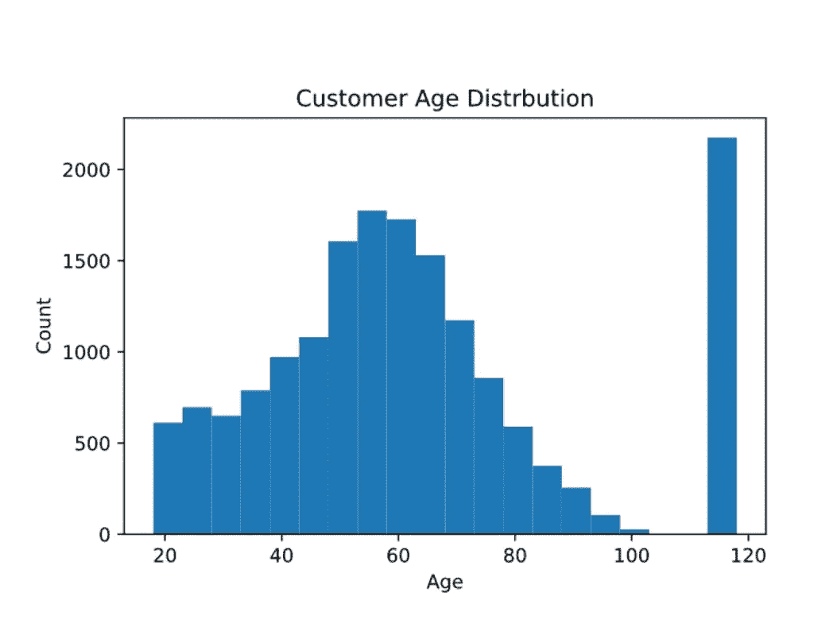
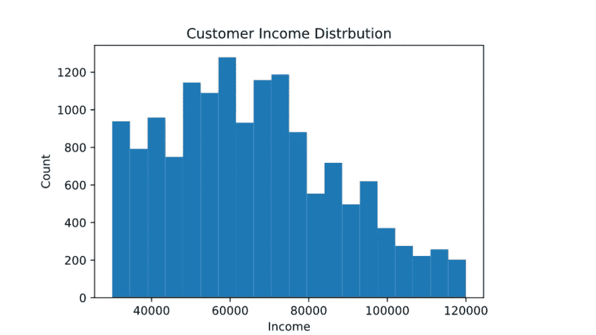
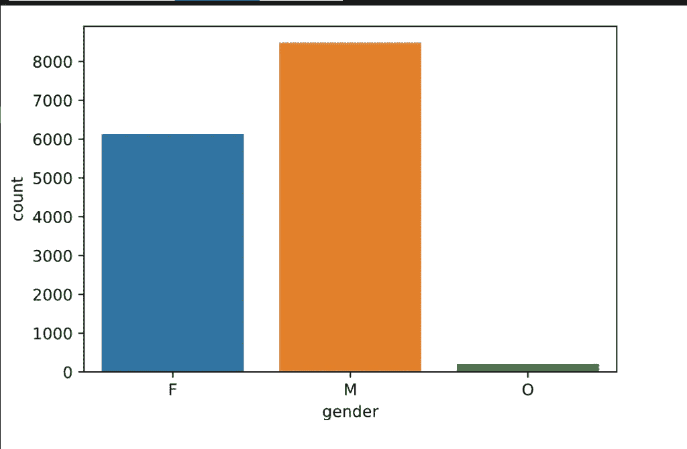
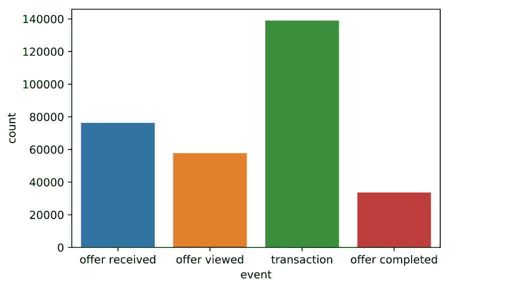
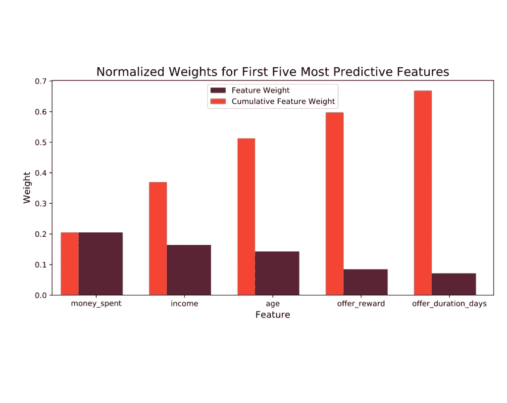
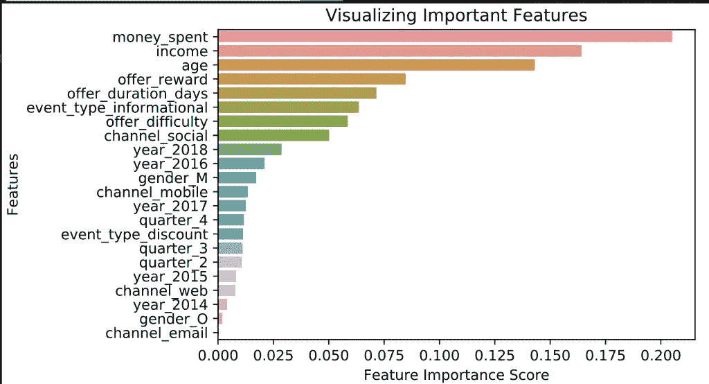

# 我分析了星巴克的数据。这是我的发现

> 原文：<https://medium.com/analytics-vidhya/i-analyzed-starbucks-data-heres-what-i-found-4f2c82fc40?source=collection_archive---------28----------------------->

汉斯·维维克在 [Unsplash](https://unsplash.com/s/photos/starbucks?utm_source=unsplash&utm_medium=referral&utm_content=creditCopyText) 上拍摄的照片

> 数据说话。它确实对星巴克有一些推荐。我只是听了听。

# 项目概述

这个项目的[数据集](https://github.com/Ezeebube5/udacity-data-scientist-project/tree/master/capstone_project/data)是真实星巴克奖励移动应用的简化版本。该项目试图使用交易、人口统计和报价数据来分析不同客户对不同报价的反应，从而建立一个模型来预测客户是否会对报价做出反应。

## 问题陈述

优惠可以是买一送一(BOGO)，折扣和信息。在 BOGO 优惠中，用户需要花费一定的金额来获得与该阈值金额相等的奖励。在折扣中，用户获得的奖励相当于消费金额的一小部分。在信息提供中，没有奖励，但也没有要求用户花费的金额。优惠可以通过多种渠道提供。

我们有兴趣回答:

1.  人口统计等不同因素如何影响对报价的反应？
2.  根据现有数据，哪些因素对要约完成影响最大？
3.  根据第二个问题的答案，我们可以采取什么措施来提高报价完成率？

## 数据集

数据包含在三个文件中:

*   portfolio.json —包含报价 id 和关于每个报价的元数据(持续时间、类型等)。)
*   profile.json —每个客户的人口统计数据
*   transcript.json 记录交易、收到的报价、查看的报价和完成的报价。

Zoe Holling 在 [Unsplash](https://unsplash.com/s/photos/strategy?utm_source=unsplash&utm_medium=referral&utm_content=creditCopyText) 上拍摄的照片

## 战略

我是这样对待这个项目的:

*   清理、处理和组合来自产品组合、客户资料和交易的数据。该组合数据集的每一行都将描述客户人口统计数据、优惠的属性以及优惠是否成功。应该考虑到有人甚至没有看就完成报价的可能性，并加以注意。只有当该人查看并完成要约时，才应考虑交易。
*   根据提供的客户人口统计数据和优惠属性，构建一个模型来预测优惠成功与否。比较逻辑回归、随机森林分类器和 KNeighbors 分类器。(具有最佳性能的模型将被进一步微调以获得最终模型)
*   获取影响产品成功的重要功能栏，并利用数据可视化来回答上述问题。

## 韵律学

项目的成功将取决于所建模型的准确性和 F1 分数。该模型应该具有 75%以上的准确性和 F1 分数，因此我们确保它在新数据集上表现良好。

卢卡斯·布拉塞克在 [Unsplash](https://unsplash.com/s/photos/data-analysis?utm_source=unsplash&utm_medium=referral&utm_content=creditCopyText) 上的照片

# 探索性数据分析

投资组合数据集相对较小，没有缺失值。

个人资料数据集在性别和收入方面有 12%的值缺失。男性约占数据的 50%。平均年龄为 62 岁。

**图 1:年龄分布**

从年龄分布来看，大多数客户年龄在 40 到 70 岁之间，有很多缺失数据，在数据集中记录为 118 岁。

**图 2:收入分配**

平均收入为 65，000 美元。2%的客户有异常收入，但约占交易的一半。

**图 3:性别分布**

分析显示，女性顾客平均年龄更大，收入更高。那些没有输入年龄的人也没有输入他们的收入，这样的行就被删除了。

抄本数据没有缺失值，有 4 种事件类型:交易、收到的报价、查看的报价和完成的报价。

图 4；事件分布

# 数据准备步骤

**投资组合数据:**

*对渠道和报价类型进行一次性编码，然后追加到数据集。
*编码后删除原始列。
*重命名列。

**配置文件数据**
*针对渠道和报价类型的一键编码。
*转换数据类型
*删除空值(118 用于表示年龄为空)
*编码后删除原始列。
*重命名列。

**抄本数据**
*不需要删除空值，因为没有空值
*事件列的一次性编码。
*对值列进行编码并将其拆分到不同的列中。
*通过将 offer id 列的值分配给 offer_id 列，合并 offer id 和 offer_id 列。
*在报价金额和奖励中为空值分配零
*将时间列从小时更改为天。
*重命名列名。
*删除档案数据集中没有的客户 id。
*删除已编码的原始列。

接下来，我创建了一个事务数据框，它在一行中包含了每个客户的报价的接收、查看和完成，因为它以前分布在不同的行中。

# 模型训练和评估

在训练模型之前，我必须删除一些列:
1。我放弃了 reward _ gained，因为它与 offer_reward
2 相同。我放弃报价 _ 完成，交易完成。
3。为了避免多重共线性，我为每组一次性编码的列删除了一列

接下来，我合并了 3 个干净的数据帧，并分成测试集和训练集。

我尝试了 3 种模型:逻辑回归、随机森林分类器和 KNeighbors 分类器。随机森林分类器产生了最好的结果，具有 79%的精确度、召回率和 F1 分数。

我对参数进行了微调，并训练了最终的模型，该模型具有 80%的精确度、召回率和 F1 值。

图 5:最具预测性的特征

# 特征重要性

从我们的分析中，我们可以看到预测报价成功的五个最重要的特征是:

1.  报价难度——客户为获得报价所花的钱。
2.  收入。
3.  顾客的年龄。
4.  提供的报酬。
5.  报价期限

图 6:重要特性

# 结论

我们超过了 75%的准确率和 F1 值的目标，达到了 80%的准确率和 F1 值。

通过分析，我们可以回答开头提出的问题:

1.  我们可以看到，收入和年龄等客户人口统计数据在预测优惠活动成功与否方面发挥着巨大作用。不过，性别并没有扮演如此重要的角色。
2.  除了收入和性别，优惠的难度，它给用户提供的回报以及持续的时间是决定优惠成功的关键因素。因此，必须注意这三个因素。奖励越高，完成率越高。此外，要约应具有更长的持续时间和更低的难度，以获得更高的完成率。
3.  从第二个图中，我们还看到社交媒体渠道比其他渠道在要约完成方面具有更大的权重和更高的影响。手机和电子邮件渠道的贡献要小得多，因为它们存在于各种促销活动中，因此不能提供额外的信息。

# 未来的改进

*   用不同的参数测试其他机器学习模型。
*   利用星巴克 web 应用程序中的模型，根据客户资料预测报价完成情况。
*   建立一个模型来测试用户会花多少钱来响应不同的优惠类型。

下一步是什么？

你可以在这里查看我的笔记本****。****

# **如果你喜欢读这篇文章，请推荐并分享它，以帮助其他人找到它！**