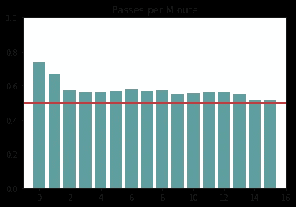
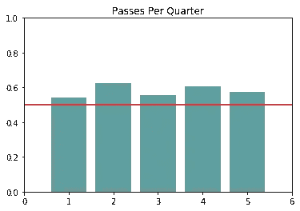
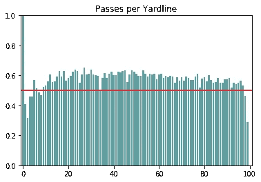
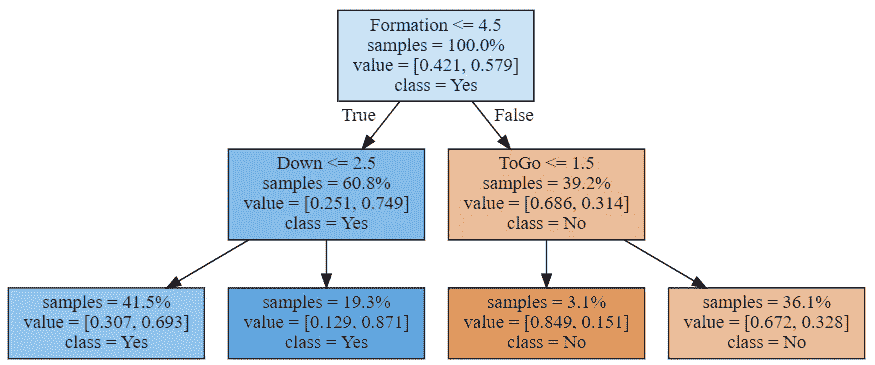
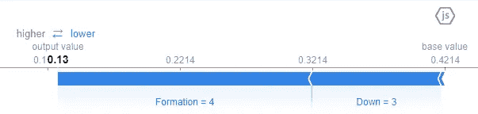
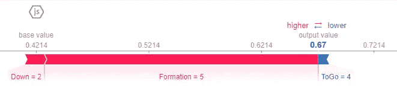
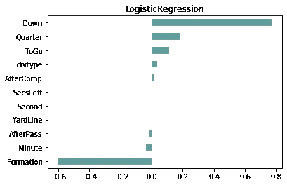
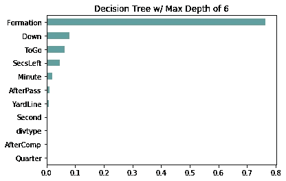
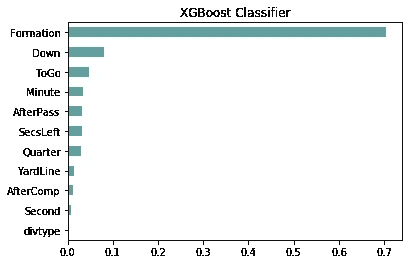

# 我现在可以(有点)预测 NFL 传球的情况了

> 原文：<https://medium.com/analytics-vidhya/i-can-sort-of-predict-an-nfl-pass-situation-now-a291eb3c1243?source=collection_archive---------7----------------------->

## 没什么大不了的。

我对足球非常着迷。起初是超级碗广告吸引了我，但在观看了商业碗之间的足球休息后，我发现每当发生战斗时，我都会被超级炒作，当重要球员受伤时，我会崩溃，并不断被观看他们球队的数百个放大镜头逗乐。这是一场睾丸激素刺激的戏剧，我当时在场。因为。它。

有时候，我们会用超级变焦镜头来展示实时发生的生存危机。

随着我的爱与日俱增，我开始注意并欣赏比赛期间播音员分享的各种统计数据。如果你看足球的时间足够长，你会开始发现统计数据和它们在正在发生的比赛或正在展开的情况中的意义之间的自然相关性。然而，将它量化成一个数据集，真的需要我将事件分解成可测量的单元，这是一个有趣而乏味的过程。我知道这听起来很无聊，但事实上，这是数据科学过程中我最喜欢的部分(除了清理数据之外，这是一种奇怪的放松)。我越了解如何将数据不足的问题分解成制造数据的方法，我就越了解不仅仅是运动和数据分析，而是自然哲学如何成为数据科学家的伟大盟友。逻辑，以及将问题分解成有形指标的能力几乎就像一个益智游戏，但充满了惊奇。我跑题了。回到格子铁足球。

**关于数据:**
**来源:**[http://www.nflsavant.com](http://www.nflsavant.com)
我用了 API 中的 3 个数据集:2017 常规赛，2018 常规赛，2019 当前常规赛。
不包括:赛季前和赛季后的比赛，以及冠军赛。

**分析笔记本链接:**[https://colab . research . Google . com/drive/1pj 5 lvidvoudqjycmhhp _ NgLujF-tNz8](https://colab.research.google.com/drive/1PJ5lWIDvoFudqjYCMHHp_NgLujF-tNz8)

虽然我有太多太多的问题想要回答，但我必须从某个地方开始，所以我选择了 NFL 中最常见的比赛之一，传球。我的假设是:仅使用前快照数据特征，算法可以预测 QB 是否会比多数基线(也就是说，数据集中传球相对于其他数据的实际百分比)更好地传球(相对于冲球)。

**多数基线:58%(传球发生率为 58%)**

## 每分钟通过次数

最初的研究表明，传球更经常发生在一个季度的开始，然后趋于平稳，然后在一个季度结束时下降。我也检查了时钟上的秒数，但这似乎并不影响播放选项。我不认为这意味着计时秒没有预测能力，我认为我遗漏了一个量化计时秒对玩家重要性的关键方法。

## 每季度通行证

四分卫肯定更喜欢在第二节和第四节扔球，这是有道理的，如果你关注比赛的话。上半场结束对球队有很大的道德影响。如果他们落后，保持比赛在可赢得的防守范围内的压力是他们的首要任务，玩电话可能会转移到更危险的立场，因为他们知道他们有休息和重组的时间，还有两个季度来弥补任何错误。

## 每码路线通行证

快攻在进攻的端区占主导地位，而当面对球门线时，他们往往更频繁地传球。我还花时间检查密度，注意到距离球门线 35 码到 50 码之间也是传球的热点。这显示了进攻方的四分卫在他自己的端区的风险与他们在防守时的风险之间的关系。队形可能对端区的成功也有很大的影响，所以我很有兴趣看看它们如何在预测模型中显示出它们的重要性。

基于我的探索，以及我在这些可视化中看到的相关性，在许多许多其他模型中，我选择关注我的第一个模型的时间和起伏。我很惊讶地发现秒钟几乎没有预测能力，但我觉得有必要在我的模型中不断检查它，以确保我没有遗漏秘密信息。我没有，但在我完成并开始汇编我的数据以供分享后，我意识到我可以通过添加某些高压场景来集中秒的力量，例如 2 分钟的警告阈值，或者游戏在积分方面有多接近。基本上，NFL 数据工程是一个门户数据项目，会把你吸进去，可能是最终的仍在进行中的投资组合，但我对此没有意见。我有一个项目可以让我在寒冷的淡季保持温暖。

# 结果

咀嚼加剧…

与其带你经历我反复遍历模型和谷歌搜索所有东西来制作一个比大多数基线表现更好的模型的严重情绪波动，我想我会抑制我的创伤，只是分享一些漂亮的视觉效果，对我的数据提供一些有趣的反馈。

是一个编队吗？如果是，检查向下。如果没有，检查码去得到第一个下降。

## 快速第一模型/浅层决策树

*   决策树:69.45%

很快，决策树模型很好地处理了这些信息，给出了令人惊讶的 69.45%的准确率，几乎比大多数基线高 12%。我听到人们一遍又一遍地说，浅层决策树是数据科学家可以要求的最佳基线分类模型，他们是对的。通过从一个最大深度为 2 的浅树开始(如上所示)，我立即有了一个超越多数基线的方法，并且有了一个简单的方法来检查我的模型的泄漏。问题是，它是如何预测特定值的？

这里有一个关于它如何判断一场传球和一场抢攻的比较，使用的是“shap . plot”(shaply？沙普利？shap-lee)。两幅图都显示了模型读取信息并做出准确预测的实例。

**为实际通过，模型正确预测为通过**。蓝色表示模型做出预测的能力降低了多少。基本上，形成是热垃圾作为一个特征。

**是一个高峰，模型正确地预测了它是一个高峰。**有趣的是，阵型实际上在指示球是否会被冲过来时非常重要。团队排队的方式似乎给了团队何时冲刺的强大预测能力，并被用于帮助模型辨别如何区分差异。

## 逻辑回归

*   *使用 ROC AUC 作为准确性指标*
*   多数基线:58.7%
*   浅层决策树:69.45%
*   测试数据:66.56%
*   验证数据:67.51%

这表明，下压、四分之一下压和多哥(进攻第一次下压所剩的码数)对我们的预测能力有最大的积极影响，然而，最初令人惊讶的是，阵型与球是被传还是被冲没什么关系。再一次，我不得不质疑我自己的量化方法来利用阵型的潜力，但是我认为这取决于量化每个阵型的位置重要性。这是我的猜测。也就是说，这出戏可以用来隐藏诡计。或者可能只是在抓拍后的最初几秒钟内决定通过。

## 决策树，最大深度 6

*   多数基线:58.7%
*   浅层决策树(深度为 2): 69.45%
*   测试数据:70.02%
*   验证数据:70.08%

很明显，逻辑回归不起作用，但是基线模型被解雇了，所以我决定调整超参数，看看我们能得到什么。我遵循的方法是推动模型，直到它开始失去预测能力，然后再缩小。在最大深度为 7 时，我得到了 69.82%的测试准确性分数，但是当我将其降低到 6 时，我的分数几乎上升到了 71%。

就像亚伦·唐纳德把一个成年人举离地面并让他在空中晃来晃去一样神奇。

## XGBoost 分类器

*   平均基线:58.7%
*   浅层决策树(深度为 2): 69.45%
*   测试准确率:70.28%
*   验证准确率:70.16%

最终，XGBoost 是我最好的模型，它的验证准确性比决策树好一点点。事实证明，梯度提升对于我的算法来说是必不可少的，以便充分利用我给它进行训练和测试的有限列。总的来说，验证数据上 70.16%的 ROC AUC 是一个惊喜，但我知道我越看这个草案，我就越觉得我可以设计出更多的功能来改进它。

# 结论:

我的假设是正确的！事实上，我可以比大多数人更准确地预测传球。托德·格利是什么？我什么？

哦，托德，你这个狡猾的女人，你在❤过得怎么样

## 接下来是什么？

我在这个模型上做得越好，*就越有可能让 Sean McVay 注意到我并雇用我作为数据科学家*。随着赛季的进行，随着 NFLSavant API 每周更新，更多的数据涌入数据集，我的下一步将是观察验证分数。我可以看到我的模型对新数据的预测有多好，所以我会一边观察一边调整特性！