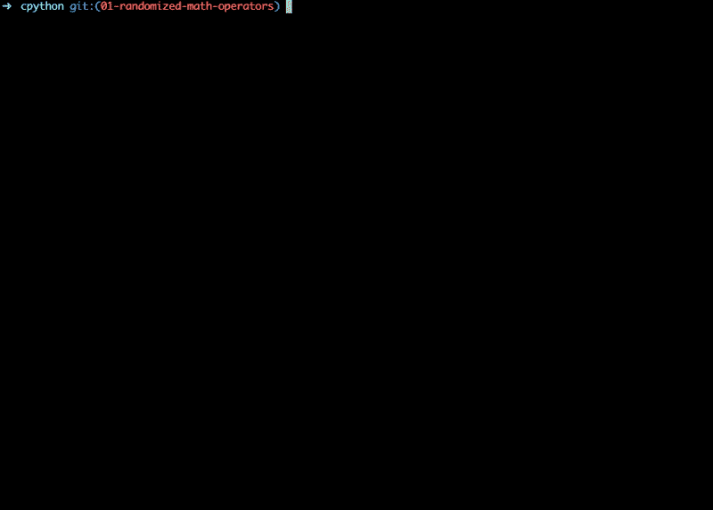

# 我改变了我的 Python，使它变得可疑

> 原文：<https://medium.com/analytics-vidhya/i-changed-my-python-and-made-it-dubious-6d5866414a73?source=collection_archive---------18----------------------->

你曾经偷看过 Python 的源代码吗？我没有，因此我决定这个星期找点乐子。在克隆了这个库之后，我意识到让 python 成为现在这个样子的代码写得有多好。在探索代码库的过程中，我想做一些改变，不是大的优化，而是一些小的调整，这将帮助我理解 python 是如何在 C 中实现的，并在课程中学习一些内部知识。为了让事情变得有趣，我想通过使加法变得不正确和不可预测来改变加法的工作方式，这意味着`a + b`将在内部随机执行以下操作之一

*   `a + b`
*   `a - b`
*   `a * b`
*   `a / b`
*   `a ** b`

在分叉和克隆了 [python](https://github.com/python/cpython) 的源代码后，我将任务分解成以下子任务

*   找到 python 的入口点(主函数)
*   找到加法发生的地方
*   了解如何在 python 对象上调用其他执行操作，如减法、乘法等。
*   写一个随机选择一个操作符的函数
*   编写一个对两个操作数应用运算符的函数

在进入我是如何做的之前，看看下面，看看它做了什么

您将看到对数字`4`和`6`执行加法是如何根据随机选取的操作计算出`0`、`10`和`24`的。

> *注意，我所做的更改只有在其中一个操作数是变量时才有效。如果整个表达式包含常数，那么它将被视为常规中缀表达式。*

# 履行

python 中的操作使用的操作码与微处理器中的操作码非常相似。根据代码被翻译成的操作码，使用操作数执行操作(如果需要)。python 的加法运算需要两个操作数，操作码名为`BINARY_ADD`，值为`23`。当执行器遇到这个操作码时，它从堆栈顶部取出两个操作数，执行加法，然后将结果推回堆栈。下面的代码片段将让您很好地了解 python 在遇到`BINARY_ADD`时会做什么。

> *这里要观察的一件事是，当两个操作数都是 unicode/string 时，它是如何连接的。*

# 检查操作数是否为数字

为了检查`BINARY_ADD`操作的两个操作数是否都是数字，我使用了名为`PyNumber_Check`的预定义函数，它检查由`PyObject`引用的对象是否是数字。

# 编写随机函数

为了生成随机整数，我使用了系统中使用`datetime.h`库的当前时间(以秒为单位),并取最大值作为模数。下面的代码片段从`[0, max)`中选取了一个随机数。

# 执行其他操作的函数

类似于添加两个 python 对象的函数`PyNumber_Add`(如果可能的话)，还有名为`PyNumber_Subtract`、`PyNumber_Multiply`、`PyNumber_FloorDivide`和`PyNumber_Power`的函数，这些函数根据它们的名字来执行操作。我编写了一个 util 函数，它接受两个操作数和一个运算符，并在执行所需的操作后返回结果 python 对象。

# 新的`BINARY_ADD`实现

现在，让我们的`BINARY_ADD`变得不可预测所需要的一切都已经准备好了，下面的代码片段非常接近它的实现方式。

# 挑战

在做了所有必要的修改后，我运行`make`来构建我的新 python 二进制文件，令我惊讶的是，代码无法构建。原因是，我进行更改的函数是在构建和初始化阶段调用的，由于在`BINARY_ADD`中引起的错误，该过程以**分段错误**结束，因为现在它有一个函数，而不是将两个数字相加，而是进行减法、乘法、除法和随机幂运算。

为了解决这个问题，我必须确保这种随机选择操作符的行为只发生在交互 shell 请求操作时，并且应该继续为其他操作正常执行。在交互式 shell 期间被调用的函数是`PyRun_InteractiveLoopFlags`，因此我开始向所有函数传递一个名为`source`的标志，直到我的踪迹到达操作码评估流。此`source`的值被设置为`1`当它被交互 shell 触发时，传递的默认值为`0`。一旦我有了这个`source`字段，并从各种初始状态传递了适当的值，一切都变得非常好。

你可以在[github.com/arpitbbhayani/cpython/pull/1/files](https://github.com/arpitbbhayani/cpython/pull/1/files)找到详细的差异。

# 结论

改变 python 的源代码很有趣，我建议你也这样做。如果您知道事物内部是如何工作的，更重要的是，了解抽象的复杂性，使应用程序开发人员的体验无缝，这总是更好的。

你可以在[arpitbhayani/cpython/tree/01-随机化数学运算符](https://github.com/arpitbbhayani/cpython/tree/01-randomized-math-operators)找到源代码。随意叉一下，自己做点改动，分享给我。我会很高兴知道你用它做了什么。

如果你想深入研究 python 的源代码，我强烈推荐你阅读 realpython.com/cpython-source-code-guide/的[。这是一本很好的指南，可以帮助你开始理解核心 python 开发人员的语言语义和编码实践。一旦你掌握了基本知识，浏览代码库就像在公园里散步一样简单。](https://realpython.com/cpython-source-code-guide/)

*这篇文章最初发表在我的* [*博客上——我改了 python，把它改成了可疑的*](https://arpitbhayani.me/blogs/i-changed-my-python) *。*

*如果你喜欢你读到的内容，订阅我的时事通讯，让邮件直接发送到你的收件箱，并对我大喊一声*[*@ arpit _ bhayani*](https://twitter.com/arpit_bhayani)*。*

