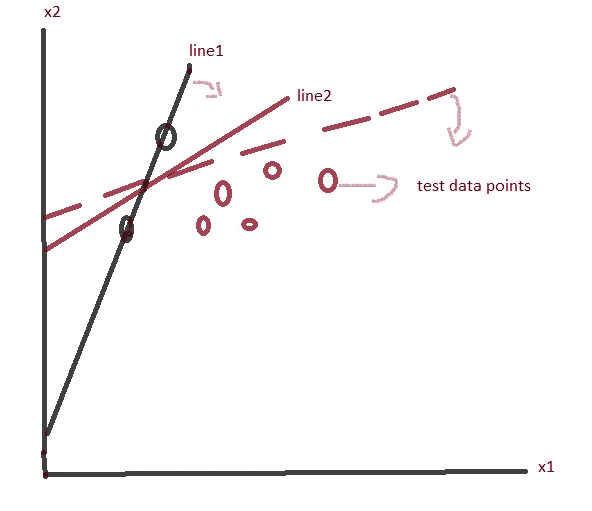
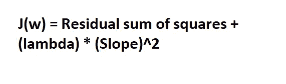
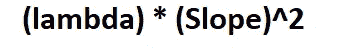
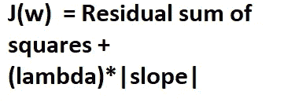
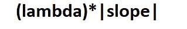

# “我确实解决过拟合问题，”拉索和岭回归说。

> 原文：<https://medium.com/analytics-vidhya/i-do-address-over-fitting-problem-says-lasso-and-ridge-regression-638e30cbce24?source=collection_archive---------20----------------------->

> 在这篇文章中，我将告诉你“为什么和什么时候我们使用套索和岭回归以及它们的主要区别。”

假设，*我们有一条最佳拟合线，对于 X 的一个单位变化，Y 产生很大的变化*(T2 陡坡的情况)。在这种情况下，模型会**过度拟合**数据。为了解决这个问题，我们有套索和岭回归。两者都是正则化技术。

## 1)- Lasso 使用 L1 正则化技术

## 2)-岭使用 L2 正则化技术

> Lasso 和岭回归的区别在于代价函数的惩罚。

如果你还记得，在线性回归中，我们试图最小化成本函数，以获得最佳拟合线。在这些正则化技术中，我们进一步在代价函数中加入了惩罚项。这些惩罚条款让一切变得不同。

> 使用这两种方法背后的关键思想是惩罚具有较高斜率的要素。

在上图中，如果我们选择线 1 作为最佳拟合线，我们将面临过拟合问题，因此为了克服这个问题，我们将选择虚线作为最佳拟合线，因为它将产生更一般化的模型(偏差更小，方差更小)。

## **岭回归成本函数**

岭回归的代价函数。

对里奇的处罚条款

> Ridge 在成本函数中增加了斜率的*“平方值”,以惩罚较陡的斜率，从而减少过度拟合问题。*

## Lasso 回归成本函数

套索回归的成本函数。

套索的处罚

Lasso 回归将“斜率的绝对值”作为惩罚项添加到成本函数中。除了解决过度拟合问题，lasso 还通过移除斜率非常小或接近零的特征(即重要性较低的特征)来帮助我们进行**特征选择。(记住斜率不会正好为零)。**

> *套索非常适用于大量特征。*

## 注意:罚项中使用的λ是一个超参数，可以通过交叉验证找到。

如果你真的觉得很有见地，别忘了鼓掌

快乐学习。