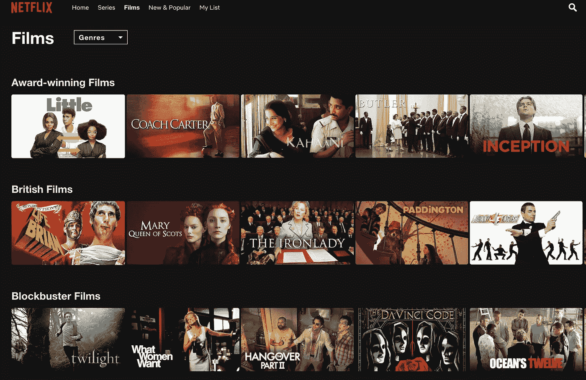

# 我已经建立了一个推荐系统——下一步是什么？

> 原文：<https://medium.com/analytics-vidhya/i-have-built-a-recommender-system-so-what-ef702c009308?source=collection_archive---------14----------------------->

图片来自 [Unsplash](https://medium.com/u/2053395ac335?source=post_page-----ef702c009308--------------------------------)

# 介绍

如今，我们在日常网络生活中每天都会遇到推荐系统。例如，亚马逊用它们来推荐产品，YouTube 推荐相关视频，Spotify 根据我们的收听历史推荐类似音乐，谷歌提供个性化广告和搜索结果。本文将讨论 KPI 和业务指标…