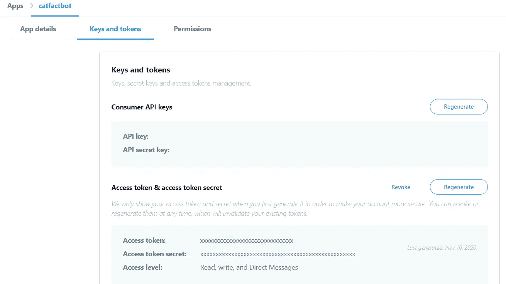
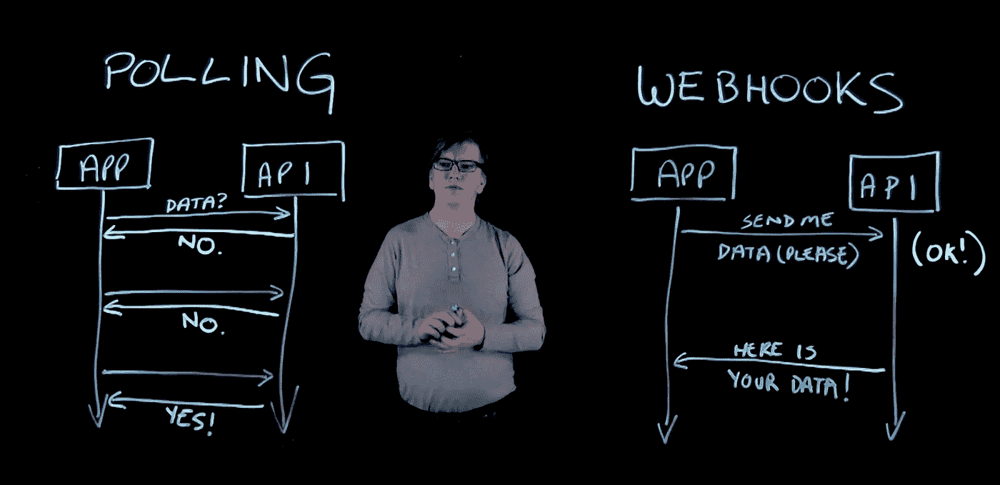
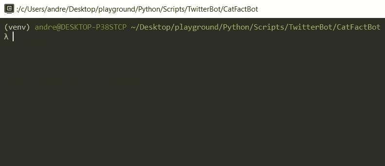
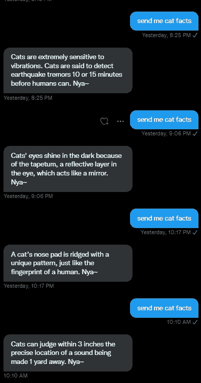

# 我用 Python 做了一个 Twitter 聊天机器人，用 Cat Facts 回复朋友的消息。

> 原文：<https://medium.com/analytics-vidhya/i-made-a-twitter-chat-bot-using-python-to-answer-my-friends-messages-with-cat-facts-61f5c842b659?source=collection_archive---------10----------------------->

为什么？因为我能，所以我为什么不能？

老实说，一旦你真正知道了正确的步骤，做起来就出奇的简单。然而，我决定写这篇文章来谈谈我是如何做到的，并展示我一路走来所犯的错误，这样任何试图做同样事情的人都不会重复它们，并且更容易复制它们。

至于我为什么要写这个应用。

我体内的孩子看到了一个以猫科仿真动物的形式回归纯喜剧潜力的 API，并且无法抑制自己对驾驭其力量的过度执着…

基本上我只是想让我的朋友们笑几分钟。这是值得的。

**我是怎么做到的？**

本指南适用于 Python 3。您可能可以让它在 2.7 中工作，但是相应地修改代码取决于您。

重要的事情先来。你需要一个 Twitter 开发者账户。如果您无法访问 Twitter API，所有这些都是毫无意义的。

你有吗？太好了！

# **第一步——注册你的应用**

使用你新获得的能力创建一个应用程序，并授予它读取、写入和发送消息的权限。



然后在“密钥和令牌”选项卡中生成您的消费者 API 密钥，并访问令牌密钥。

一定要把它们写下来。为了做到这一点，这些键至关重要，所以请再次检查您是否正确地记下了所有键**。**

**完成这些后，您需要创建一个开发环境，并在其中注册您刚刚创建的应用程序。**

****记下您放入的开发环境标签。你以后会需要它的。****

# ****错误 1——请使用账户活动 API。
(随意跳过这个。)****

**最初当我开始这个项目时，我实际上制作了一个完全可用的应用程序，它使用 Tweepy 和轮询来工作。然而，这意味着我的应用程序不能立即对直接消息做出反应。我相信你能理解，当你在做一个聊天机器人的时候，这并不好。(即使它的目的是在互联网上发送无用但有趣的关于猫的信息)**

**对此，显而易见的解决方案是使用 Webhooks！这正是帐户活动 API 所做的。**

**这样你就不用一遍又一遍地询问 Twitter 的 API 是否有新消息了。当你订阅的帐户有任何活动时，他们会向你发送帖子请求。**

****

# ****第二步——根据 Twitter 的指导方针编写一个 web hook****

**这才是真正有趣的地方。**

**为了开始从 Twitter 接收信息，这样我们就可以开始开发我们的应用程序，我们需要设置我们的 Webhook，注册它，并为它订阅一个帐户。**

**为此，首先，我建议用您的应用程序的名称创建一个新文件夹，并创建一个虚拟工作环境，方法是在项目目录下的命令行中运行:**

```
#For Windows
> **py -m venv venv**
```

**这使得事情更容易管理。另外，这样可以避免在项目文件夹之外处理文档。所以你有你自己的小推特泡泡在里面工作。**

**现在只需用命令激活您的环境**

```
#For Windows
**> venv\Scripts\activate** #OR if you're using bash **
$ source venv/Scripts/activate**
```

**您的终端应该看起来像这样:**

****

**重要的是你能看到“ **(venv)** ”部分。
如果你不能，你可能做错了。**

**从现在开始，你必须做出一个决定:**

**在本指南中，我使用 Flask 制作了应用程序，使用 Gunicorn 作为我的服务器，并将其部署到 Heroku。我还使用了几个库来简化某些工作(稍后我会解释)。所以请记住，根据您想要或计划使用的库，这可能是代码方面发生一些变化的地方。**

**如果你打算完全按照我做的去做，这里是你需要的:**

```
> **pip install flask**
> **pip install gunicorn**
> **pip install python-decouple**
> **pip install tweepy**
```

****Flask** 是我们将用来实际制作 API 的东西，该 API 将接收 twitter 发送的信息并对其做出反应。
**Gunicorn** 是在我们的本地机器(用于测试)和 Heroku 上运行服务器。
**解耦**只是简化了我们代码中环境变量的使用。稍后你们会看到这一点。
最后 **Tweepy** 是我们将用来实际发送直接消息的库。**

**现在这个问题解决了。让我们从使用 Flask 实际编写 webhook 开始。**

**Twitter 的帐户活动 API 规定，为了注册你的 webhook，它必须通过他们所谓的**“CRC _ challenge”**。 **CRC** 代表**挑战应答检查**。**

**这意味着当你注册你的 webhook 时，他们会首先发送一个 GET 请求，在 url 中有一个“ **crc_token** ”作为参数。然后，您必须使用您之前使用 **HMAC SHA256** 写下的“消费者 _ 秘密”散列这个提供的令牌，在 **base64** 中对其进行编码，最后返回生成的字符串作为响应。如果你的回答是正确的，你最终会得到一个授权的 webhook，他们会通过 POST 请求向你发送你想要的数据。**

**是啊。不要担心，你只需将下面的代码复制并粘贴到你的 app.py 中，你就可以成功了。**

**如果您希望在我们继续之前进行测试，请创建一个**。env** 文件，您在其中写下创建 twitter 应用程序时作为环境变量生成的键。像这样:**

```
consumer_key= YOUR-CONSUMER-KEYconsumer_secret=YOUR-CONSUMER-SECRETaccess_token=YOUR-ACCESS-TOKENaccess_token_secret=YOUR-ACCESS-TOKEN-SECRET
```

**之后，您可以在本地运行该应用程序，只需:**

```
> **py app.py**
```

**你应该可以用你的浏览器访问它，或者向*http://127 . 0 . 0 . 1:5000/web hook/Twitter 发出 GET 请求？使用类似于 Postman 的东西。***

**这应该会返回类似于以下内容的 JSON 响应:**

```
{
  "response_token": "sha256=x0mYd8hz2goCTfcNAaMqENy2BFgJJfJOb4PdvTffpwg="
}
```

# ****步骤 3——部署您的应用程序，并将其注册到用户活动中****

**接下来让我们继续在 Heroku 上运行我们的应用程序。**

**如果你还没有 Heroku 帐号，现在是时候创建一个了。我会等的。**

**准备好了吗？完美。**

**为了部署我们的应用程序，我们首先需要做几件事**

1.  **用你的文本编辑器创建一个名为**的文件。并写下以下内容:****

```
web: gunicorn app:app
```

**这个文件是 Heroku 在他们的服务器上实际运行你的应用程序的指南。**

**2.接下来，您需要创建一个 **requirements.txt** 文件，该文件将告诉 Heroku 您的应用程序需要运行哪些依赖项。为此，只需运行:**

```
> **pip freeze > requirements.txt**
```

**3.最后造出一个**。gitignore** 文件，这将避免你上传一些你在已部署版本中不需要的文件，一般来说，在任何地方在线都是不好的做法:**

```
venv/
.gitignore
.env
__pycache__/
```

****注意:**正常情况下 Procfile，requirements.txt 也应该在这个文件里。然而，这两个是 Heroku 正确运行的必要条件。**

**点击**新建>创建新应用**，并将其命名为您认为合适的名称。
点击**部署**选项卡。
按照 Heroku 提供的说明，启动你的应用程序。**

****写下你的应用领域。**例如“https://your-app-name . heroku app . com”**

**接下来，回到我们的终端，我们需要在 Heroku 内部声明我们的环境变量。**

**为此，只需运行以下命令:**

```
> **heroku config:set consumer_key=YOUR-GENERATED-CONSUMER-KEY** 
```

**这适用于您生成的所有信息。意为您的**消费者 _ 密钥**、**消费者 _ 秘密**、**访问 _ 令牌**、**、**和**访问 _ 令牌 _ 秘密****

**我们这样做的原因是，我们不**而**希望在我们部署的应用程序中硬编码这些信息，因为这是一个巨大的安全缺陷，有了这些密钥，任何人都可以像你一样在 Twitter 上执行操作。也就是**不好**。**

**接下来，我们需要注册您的 Webhook。**

**为了做到这一点，我们需要向 Twitter 的 API 发送一个带有授权 OAuth 1.0 会话的请求，并告诉他们记住您指定的端点。**

**我们还必须使用相同的 OAuth 1.0 会话将您帐户的活动注册到 Webhook，因为您和您的应用程序的密钥是相同的。**

**你不要烦恼。这里有一个 python 脚本可以帮你做到这一点:**

****注意:**你不必部署这个。这只是我为了让它更简单而做的一个工具。**

**但是，如果您想将其他人的活动注册到此，您需要执行一个名为“**三足认证”**的不同认证程序，您可以在此处找到:**

**[](https://developer.twitter.com/en/docs/authentication/oauth-1-0a/obtaining-user-access-tokens) [## 获取用户访问令牌(三脚 OAuth)

### 在高层次上，三足 OAuth 流程将:为消费者应用程序创建一个请求以获取请求…

developer.twitter.com](https://developer.twitter.com/en/docs/authentication/oauth-1-0a/obtaining-user-access-tokens) 

假设一切都做得正确，你现在应该是一个完全正常工作的 Webhook 的所有者，它订阅了你的个人 Twitter 帐户的活动！

现在让我们来玩玩吧。

# **错误 2——不要尝试手动发送请求。(还是那句话，你可以跳过这个。)**

这可能是让我失去最多时间的错误。

如果您对 HTTP 授权过程的所有技术内容都不熟悉，Twitter 的一些文档可能会有些混乱。因此，这促使我实际尝试手动散列生成我自己的授权密钥，以便在 CLI curl 命令中使用。

不是我最辉煌的时刻。我承认。

好的一面是，在掉进那个特殊的兔子洞时，我学到了很多关于 OAuth 1.0 和一些散列算法如何工作的知识。

# **第三步——最后，在你认为合适的时候使用 Twitter 发送给你的信息。(或参与一些高辛烷值猫恶作剧)**

从这里开始，您几乎可以自由自在了，您只需要设置一个接收 POST 请求的方法，并按照您喜欢的方式使用提供给您的信息。

在我们结束之前，如果我不告诉你最后一件事，我就不是一个值得尊敬的向导，那就是:**如何验证传入的帖子请求，以确保它们来自 Twitter，**而不是互联网上试图干扰你的应用程序的陌生人。

Twitter 实际上为我们提供了这样的工具。

在他们发送的每个 POST 请求的头中，应该有一个名为“**x-Twitter-web hooks-signature**”的项目。

您使用这个字符串将其与您的 **consumer_secret** 和 **POST** 请求的主体之间的 HMAC SHA256 散列进行比较。

还是那句话，不用担心。我掩护你:

最后，如果您还在这里，并且对“卡特彼勒事实”部分感到疑惑:

你的品味无可挑剔，不要让任何人告诉你。

你需要做的是:

在上述代码的“随心所欲”部分插入以下内容:

然后在 app.py 的顶部，在“ **app=Flask(__name__)** ”行的正上方，添加以下内容:

```
import re
import api_configimport catfactsapi=api_config.create_api()
```

最后只需将这两个文件添加到您部署的应用程序和 ***中，瞧*** :



应用程序工作的例子

这是我完成版本的 GitHub 库。如果您还有问题和/或我没有提到导致您卡住的事情:

[](https://github.com/quantumRaven23/CatFactBot) [## quantumRaven23/CatFactBot

### 每当被激活时，Twitter 聊天机器人会用一个随机的猫事实来回答。它的应用可能会有所不同(你不…

github.com](https://github.com/quantumRaven23/CatFactBot)**