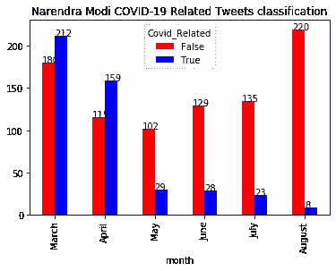
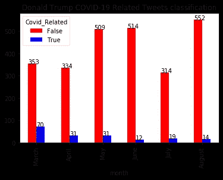
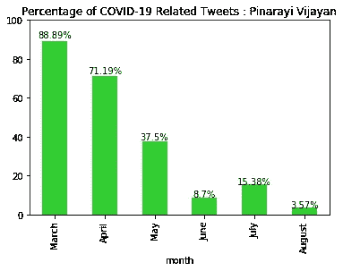
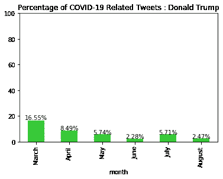

# 我浏览了当前世界领导人的推特信息，令人惊讶的是，他们正在重复我们的祖先在 100 年前疫情病毒爆发时犯的同样的错误！！！

> 原文：<https://medium.com/analytics-vidhya/i-scraped-the-twitter-feeds-of-the-current-leaders-and-they-are-repeating-the-same-mistakes-c8f611f4bc57?source=collection_archive---------15----------------------->

# 背景:

从 1918 年到 1920 年，由 [H1N1 甲型流感病毒](https://en.wikipedia.org/wiki/Influenza_A_virus_subtype_H1N1)引起的[西班牙流感](https://en.wikipedia.org/wiki/Spanish_flu)，在全球范围内感染了 5 亿人，并导致约 2000 万到 5000 万人死亡。第一次世界大战造成的极度贫困导致医疗营地和医院过度拥挤，这促进了疫情在世界范围内的发展。这场巨大灾难的另一个鲜为人知的原因是 100 年前存在的**缺乏交流**(由于技术的限制)。领导人无法充分警告他们的人民，以遏制或防止疫情疫情恶化。

100 年后，也就是 2020 年，我们正在遭受一场类似的名为新冠肺炎的疫情，它正在影响全世界的日常生活活动。我决定**检查当前的领导人是否就疫情的严重性与人民进行了足够的沟通**。我分析了著名领导人唐纳德·川普、纳伦德拉·莫迪和皮纳拉伊·维贾扬的推特，这是最常用的交流媒体之一，以检查他们的交流是否足以遏制疫情。

# 目标:

可视化 2020 年 3 月、4 月、5 月、6 月、7 月和 8 月领导人的新冠肺炎相关推文的数量和百分比。

# 可视化:

以下是我用 Python 绘制的图表。



推文分类计数(不用于比较)

**蓝色条**表示所有推文中与新冠肺炎相关的推文的数量。令人惊讶的是，尽管这几个月新冠肺炎患者人数呈大幅上升趋势，但与新冠肺炎相关的推文却呈大幅下降趋势。



新冠肺炎相关推文—每月百分比

此外，就新冠肺炎相关推文的百分比而言，有一个明显的下降趋势。

# 推论:

以下可能是这几个月来领导人推特数量下降趋势的**潜在原因**。

1.  领导人可能不喜欢谈论不好的事件，因为他们可能觉得这会损害他们的形象，减少他们在进一步选举中再次当选的机会。
2.  领导人可能认为一切都在控制之中，没有必要反复提醒人民。
3.  他们担心无力控制和遏制疫情可能会暴露他们治理的漏洞。

# 方法:

我故意把这个放在帖子的末尾。如果你对研究的技术部分不感兴趣，可以跳过这一步。

## 抓取推文:

推文的抓取由名为[**Twint**](https://github.com/twintproject/twint) 的 Twitter API 完成。安装 Twint 后，使用任何命令行界面(CLI ),我们可以提取任何用户在特定时间段内的任何格式的 tweets。我将推文提取为 *csv* 文件格式，然而，这取决于用户选择他们希望使用的任何格式。

```
$ twint -u vijayanpinarayi --since "2020-03-01" --until "2020-09-01" -o pinarayi.csv --csv
```

在这里，Pinarayi Vijayan 先生从 3 月 1 日到 8 月 31 日的推文以 *csv* 输出格式导出。请注意，“ *—直到”*参数不包括用户输入的日期。对于 Pinarayi 的推文，所有与新冠肺炎相关的推文都有#covid19 标签，因此没有必要将他的马拉雅拉姆语推文翻译成英语。

就纳伦德拉·莫迪的推文而言，并非所有推文都有标签，所以我对他的推文和标签都进行了分类处理。由于他的一些推文不是英文的，我把他所有的推文都翻译成了英文。Twint 使用谷歌翻译来翻译推文，这项工作做得很漂亮。然而，谷歌限制了每次会话的翻译数量，因此所有的推文无法通过一个命令行保存在 csv 文件中。我通过根据推文的日期将推文分成几部分，然后将它们组合成一个单独的*数据帧来解决这个问题。*

```
$ twint -u narendramodi --since "2020-03-01" --until "2020-03-16" -o modi1.csv --csv --translate --translate-dest en
```

上面的命令行代码是我创建的 csv 文件之一，它将所有的推文翻译成英语，而不管使用什么语言。

在唐纳德·特朗普的案例中，由于所有的推文都是英文的，所以所有的推文都是使用一行代码轻松抓取的。所有用于抓取 tweets 的命令行代码都在 [Github](https://github.com/FahidLatheef/COVID-Related-Tweets-Frequency-over-the-months-for-famous-politicians) 存储库中的 tweet.txt 文件中共享。

## 数据准备:

一旦收集了所有的推文，我们就可以开始分类每条推文是否与新冠肺炎相关。我用 Python 中的 *pandas* 包来做数据清理。

在喀拉拉邦首席部长 Pinarayi Vijayan 的情况下，所有与新冠肺炎相关的推文都有一个标签#COVID19 或#covid19india，所以在标签中搜索单词“covid”就足够了。

```
df_pin["Indexes"]= df_pin["hashtags"].str.find("covid")
```

上面的代码创建了一个新的列(feature)“Indexes”，如果 hashtag 不包含单词“covid”，它将给出值-1，否则给出该单词的位置索引。例如，值 2 意味着 hashtag 中的第三个字符是单词“covid ”,从开始(记住，Python 索引从 0 开始)。现在，我们可以使用下面的代码直接对 tweet 进行分类，如果“Indexes”的值为-1，则将 tweet 分类为“not Covid_Related ”,如果是任何其他值，则分类为“Covid _ Related”。

```
df_pin['Covid_Related'] = df_pin['Indexes'].apply(lambda x: 'False' if x == -1 else 'True')
```

在印度总理纳伦德拉·莫迪的例子中，他翻译的推文的所有 8 个部分被合并成一个数据帧。他的一些推文有标签，一些没有。因此，标签和他翻译的推文都被用于分类。

常见的与新冠肺炎相关的标签有' #indiafightscorona '，' #indiafightscorona '，' # jantacurfew '，' # janatacurfew '，' #stayhome '，' # rjcurfew '，常用词有' corona '，'宵禁'和' stayhome '。与前面的分类类似，创建了 3 个新的“索引”,检查这些单词在 hashtags 中的出现。

```
df_modi["Index1"]= df_modi["hashtags"].str.find("corona")
df_modi["Index2"]= df_modi["hashtags"].str.find("curfew")
df_modi["Index3"]= df_modi["hashtags"].str.find("stayhome")
```

现在，创建了一个新列“Covid_Tag ”,它检查所有这些索引是否都为-1，并将它们归类为“Covid_Tag”下的 False。如果找到任何标签关键字(“corona”、“宵禁”和“stayhome”)，则“Covid_Tag”被归类为 True。

现在，使用一个自定义功能，他所有翻译的推文都可以搜索到与新冠肺炎相关的关键词，即“janta”、“janata”、“mask”、“COVID”、“corona”、“virus”、“宵禁”、“distancing”、“chinavirus”、“lockdown”、“quarantine”、“疫情”、“kovid”、“jairbolsonaro”、“borisjohnson”、“pm-cares”和“羟氯喹”。

```
def matcher(x):
    for i in words:
        if i in x.lower():
            return True
    else:
        return Falsedf_modi['Covid_Tweet'] = df_modi['translate'].apply(matcher)
```

使用这些函数创建了一个新的二进制列“Covid_Tweet ”,如果任何单词包含在翻译的 Tweet 中，它将给出 True，如果没有，则给出 False。现在，使用列“Covid_Tweet”和“Covid_Tag”之间的 OR 函数，创建了一个新列“Covid_Related”。

```
df_modi['Covid_Related'] = df_modi['Covid_Tag'] | df_modi['Covid_Tweet']# | is the python operator OR
```

最后，对于美国总统唐纳德·川普来说，同样的“ *matcher* ”功能被用来过滤与新冠肺炎相关的推文。

```
df_trump['Covid_Related'] = df_trump['tweet'].apply(matcher)
```

## 绘图:

使用 [Pandas Dataframe Plot](https://pandas.pydata.org/pandas-docs/stable/reference/api/pandas.DataFrame.plot.html) 完成绘图，它使用 matplotlib.pyplot 作为后端绘图包。例如，使用 pandas groupby 子句，可以逐月找到与 COVID 相关和不相关的 tweets 的计数。

```
plt1 = df_pin.groupby(['month','Covid_Related'], sort = True).size().unstack()
plt1 = plt1.reindex(['March', 'April','May', 'June', 'July', 'August'])ax1 = plt1.plot(kind='bar', color = ['red', 'blue'])
ax1.set_title('Pinarayi Vijayan COVID-19 Related Tweets classification')
for p in ax1.patches:
    ax1.annotate(str(int(p.get_height())), (p.get_x(), p.get_height()))
```

这里，在汇总计数之后，Dataframe 对象使用 *reindex* 方法基于月份进行排序。然后使用*熊猫创建一个情节对象。DataFrame.plot，*其中*种类*参数用于表示绘图的类型，*颜色*用于设置条形颜色。现在， *set_title* 方法用于创建图的标题，而 *annotate* 方法用于用实际计数来注释条形高度。

```
plt4 = df_pin.groupby(['month','Covid_Related'], sort = True).size().unstack()
plt4 = plt4.reindex(['March', 'April','May', 'June', 'July', 'August'])
plt4['percentage'] = round((plt4['True']/ (plt4['True']+ plt4['False'])*100),2)
#plt4ax4 = plt4['percentage'].plot(kind='bar', color = 'limegreen')
ax4.set_title('Percentage of COVID-19 Related Tweets : Pinarayi Vijayan')
ax4.set_ylim(0,100) # Setting equal Scale from 0 to 100 for all plots# Annotation
for p in ax4.patches:
    width = p.get_width()
    height = p.get_height()
    x, y = p.get_xy() 
    ax4.annotate(f'{height}%', (x + width/2, y + height*1.02), ha='center') # formatting the annotation
```

在第二组图的情况下，使用 *set_ylim* 方法创建一个新的“百分比”列，并且所有 3 个图的 y 轴是固定的。注释与上一个图类似，除了在这个图中我们格式化了注释高度以显示%符号。

瞧吧！！！

如果有任何疑问，请在评论区提问，我会尽力澄清。Jupyter 笔记本和数据集可以在我的 [Github](https://github.com/FahidLatheef/COVID-Related-Tweets-Frequency-over-the-months-for-famous-politicians) 资源库中找到。

# 结论:

即使在这几个月新冠肺炎患者人数呈大幅上升趋势后，来自领导人的新冠肺炎相关推文仍呈大幅下降趋势。很明显，尽管被通讯的选择宠坏了，现在的领导人没有充分利用它们在像新冠肺炎这样致命的疫情期间警告他们的人民。时间会证明这些错误有多严重，让我们希望并祈祷未来几个月情况会有所好转。

# 参考资料:

来自 [u/desi_swagger](https://www.reddit.com/user/desi_swagger/) 的 [Reddit 帖子](https://www.reddit.com/r/india/comments/i72uew/number_of_times_modi_mentioned_the_words/?utm_source=share&utm_medium=web2x&context=3)

[孪生](https://github.com/twintproject/twint)