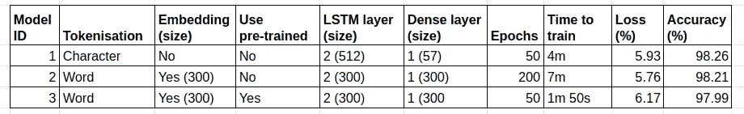
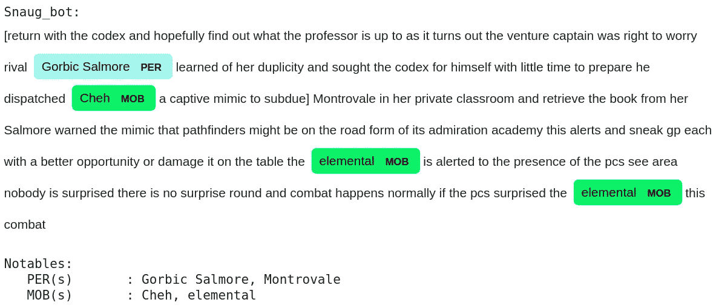

# 我，讲故事机器人

> 原文：<https://medium.com/analytics-vidhya/i-storytelling-bot-3652812f3aff?source=collection_archive---------12----------------------->

## 一个小机器人如何通过机器学习来旋转叙事


达斯汀·李在 [Unsplash](https://unsplash.com?utm_source=medium&utm_medium=referral) 上的照片

**TLDR** :我创建了一个简单的机器人，根据随机选择或输入的种子文本生成新文本。最终的预测候选是使用 Keras/Tensorflow 库的深度学习模型:使用单词标记化和预训练 Word2vec (Gensim)的 LSTM 模型。该模型在一个数据集上进行训练，该数据集由来自 [**探路者**](https://paizo.com/pathfinder) 的免费短篇故事构建而成。

完整的代码和笔记本可以在 [**这里**](https://github.com/ringoshin/snaug) 找到。

# 目录

1.  [简介](#6b49)
2.  [模型建立和选择](#d415)
    步骤 0。[项目文件夹格式化](#cfdf)
    步骤 1。[原始数据来源](#f928)
    第二步。[数据准备](#6bdf)
    第三步。[数据预处理](#65f3)步骤 4
    。[模特训练](#4d3f)
    第五步。[样本文本预测](#2d86)
    步骤 6。[型号选择](#1a18)步骤 7
    。[文本可视化](#28b0)
    第 8 步。[最终模型文本生成](#f6c7)
3.  [结论](#ad4e)

# 介绍

这是我在 [**Metis**](https://metis.kaplan.com.sg/) **数据科学训练营**的最后一个项目。我想尝试一些与我以前的作品不同的东西，我以前的作品涉及预测和图像分类。因此，在我的导师的指导下，我通过机器学习将注意力转向了创造力——文本生成机器人。

文本生成是许多 NLP(自然语言处理)应用中的一种。它既有挑战性又很有趣。我们出发了…


凯利·西克玛在 [Unsplash](https://unsplash.com?utm_source=medium&utm_medium=referral) 上的照片

[^](#bb80)

# 模型建立和选择

你会发现下面的步骤，我采取了建立最终的工作模式。为了避免重复，我有时可能只举例说明三个模型中的一个的细节。

[^](#bb80)

## 步骤 0。项目文件夹格式

我希望我的代码(和文档)尽可能地有条理，因此我利用了这里的[](https://blog.godatadriven.com/write-less-terrible-notebook-code)**和这里的[](https://docs.python-guide.org/writing/structure/)**中的一些建议。****

****我已经把常用的模块打包成库存放在 [**这里**](https://github.com/ringoshin/snaug/tree/master/lib) **:******

*   ****nlplstm _ class.py 封装 GPU 使用的类库，以及使用 Keras/Tensorflow LSTM 模型的 NLP 类库****
*   ****data-common.py —数据加载、数据保存、数据预处理和文本生成相关功能****
*   ****text _ viz _ common.py 使用空间库可视化生成文本的函数****

****没有进入太多的细节，定制的 LSTM 类让我保持理智。我可以随时在 Google Colab 或任何云平台上使用 GPU 轻松训练我的所有模型(为了速度)，同时在我的笔记本电脑上单独重新加载和预测经过训练的模型，而无需强大的 GPU(为了方便或作为一个更便宜的选择)。****

****[^](#bb80)****

## ******第一步。原始数据来源******

****过去，我和儿子一起玩过几次 [**探路者**](https://paizo.com/pathfinder) 游戏。他总是玩家之一，而我作为 DM(地下城主)运行这些游戏。一个 DM 戴着很多帽子，其中一个就是提供叙事让游戏继续下去。****

****不用说，我认为这是一个 ML 学习的机会:让我们教一个机器人如何根据它所学习的探路者故事来生成随机的、但有用的和相关的短篇故事。****

****幸运的是，我能够从 Pathfinder 网站下载免费的短篇冒险，这成为了我用来训练我的模型的数据集——全部 15000 个可用单词。****

****你可以在 这里的 [**子文件夹下找到下载的 pdf。**](https://github.com/ringoshin/snaug/tree/master/data)****

****[^](#bb80)****

## ******第二步。数据准备******

****我应用了以下小步骤(手动/脚本混合)来产生适合我们的机器学习流程的单个数据集。****

*   ****将 pdf 转换成文本文件(你可以用任何免费的在线转换器来完成)****
*   ****去掉不包含任何有价值的故事元素的文本块****
*   ****将文本文件连接成一个单一的原始文本文件 [**此处**](https://github.com/ringoshin/snaug/blob/master/data/textgen_pathfinder_raw.txt)****
*   ****使用 [**这个**](https://github.com/ringoshin/snaug/blob/master/0%20clean_raw_text_data.py) 只保留合适的句子，保存到 [**这里**](https://github.com/ringoshin/snaug/blob/master/data/textgen_pathfinder.txt) 。****

****生成的*“text gen _ path finder . txt”*将用作源文件，用于创建训练以下模型所需的数据集。****

****[^](#bb80)****

## ****第三步。数据预处理****

****经过几次初步的探索性实验，我决定尝试三种不同的 LSTM 模型，然后选择最佳方案:****

*   ****[](https://github.com/ringoshin/snaug/blob/master/1a%20snaug_train_char_token_model_save_weights.ipynb)****([参考](https://machinelearningmastery.com/text-generation-lstm-recurrent-neural-networks-python-keras/))********
*   ******[**单词分词和单词嵌入**](https://github.com/ringoshin/snaug/blob/master/1b%20snaug_train_word_token_model_save_weights.ipynb) ( [参考](https://machinelearningmastery.com/how-to-develop-a-word-level-neural-language-model-in-keras/))******
*   ****[**分词和预训练 Word2vec**](https://github.com/ringoshin/snaug/blob/master/1c%20snaug_train_pretrained_model_save_weights.ipynb) ( [参考](https://stackoverflow.com/questions/42064690/using-pre-trained-word2vec-with-lstm-for-word-generation))****

****我将仔细看看第三个模型是如何建立的，因为它采用了或多或少与前两个模型相同的技术(标记化、嵌入、LSTM/RNN、分类)。首先，我们需要导入这些库:****

```
**from keras.preprocessing.text import Tokenizer
from keras.utils import to_categoricalimport string
import textwrap
import picklefrom lib.nlplstm_class import (TFModelLSTMCharToken, TFModelLSTMWordToken, TFModelLSTMWord2vec) 
from lib.data_common import (load_doc, save_doc, clean_doc, prepare_char_tokens)
from lib.data_common import (build_token_lines, prepare_text_tokens, load_word2vec)
from lib.data_common import pathfinder_textfile, fixed_length_token_textfile**
```

****接下来，我们加载文档并用这个函数对其进行标记:****

```
**def clean_doc(doc):
 # replace '--' with a space ' '
 doc = doc.replace('--', ' ') # replace '-' with a space ' '
 doc = doc.replace('-', ' ') # split into tokens by white space
 tokens = doc.split() # remove punctuation from each token
 table = str.maketrans('', '', string.punctuation)
 tokens = [w.translate(table) for w in tokens] # remove remaining tokens that are not alphabetic
 tokens = [word for word in tokens if word.isalpha()] # make lower case
 tokens = [word.lower() for word in tokens]
 return tokens**
```

****将这些令牌组织成固定长度的令牌行并保存它:****

```
**def build_token_lines(tokens, length=50):
 length += 1
 lines = list()
 for i in range(length, len(tokens)):
  # select sequence of tokens
  seq = tokens[i-length:i]
  # convert into a line
  line = ' '.join(seq)
  # store
  lines.append(line)
 return lines**
```

****实际上，这些固定长度的线将是用于训练模型的数据集。****

****让我们使用上面的段落作为 14 个单词的玩具示例数据集，并让我们将固定长度设置为 5 个单词。然后，这个玩具示例模型将被训练，通过学习前面的 5 个单词来预测下一个单词。生成的玩具示例训练数据集如下所示:****

****因此，这也是我们实际数据集的样子。然后，我们将把固定长度的文本标记转换成适合 LSTM 训练的格式:****

```
**def prepare_text_tokens(lines):
 # integer encode sequences of words
 tokenizer = Tokenizer()
 tokenizer.fit_on_texts(lines)
 sequences = tokenizer.texts_to_sequences(lines) # vocabulary size
 vocab_size = len(tokenizer.word_index)
 #print(tokenizer.word_index) # split into X and y
 npsequences = np.array(sequences)
 X, y = npsequences[:,:-1], npsequences[:,-1]
 y = to_categorical(y, num_classes=vocab_size+1)
 seq_length = X.shape[1]

 return X, y, seq_length, vocab_size, tokenizer**
```

****第三种模式很特别，因为它使用预先训练的重量来启动训练。因此，我们需要通过使用固定长度的令牌行训练 Gensim Word2vec 模型来构建这组权重:****

```
**def load_word2vec(lines):
  # split tokens up per line for Gensim Word2vec consumption
  sentences = [line.split() for line in lines] print('\nTraining word2vec...')
  # workers=1 will ensure a fully deterministrically-reproducible run, per Gensim docs
  word_model = Word2Vec(sentences, size=300, min_count=1, window=5, iter=100, workers=1)
  pretrained_weights = word_model.wv.syn0
  vocab_size, emdedding_size = pretrained_weights.shape
  print('Result embedding shape:', pretrained_weights.shape)return vocab_size, emdedding_size, pretrained_weights**
```

****[^](#bb80)****

## ****第四步。模特培训****

****一旦我们从上一步中收集了所有必要的组件，我们就可以定义将用于第三个模型的 LSTM 模型:****

****我们添加到模型中的第一层是嵌入层。“vocab_size”是我们数据集中唯一单词的数量。一般来说，我看到的大多数文章都建议在 50-300 的范围内任意设置嵌入维数(“embedding_size”)。这也是我们将之前的“预训练权重”加载到模型中的地方。****

```
**self.model.add(Embedding(input_dim=vocab_size,
                         output_dim=embedding_size,
                         weights=[pretrained_weights]))**
```

****现在，我们添加两个 LSTM 层，并定期与辍学夫妇。****

```
**self.model.add(self.select_LSTM(embedding_size,return_sequences=True))
self.model.add(Dropout(0.2))
self.model.add(self.select_LSTM(embedding_size))
self.model.add(Dropout(0.2))**
```

****我们用两个密集层来完成模型，后者是输出层。****

```
**self.model.add(Dense(embedding_size, activation='relu'))
self.model.add(Dense((vocab_size+1), activation='softmax'))**
```

****记住这一点，让我们通过定义所需的参数来创建上述类的对象:****

```
**# create new object that is an LSTM model using word tokenization
# and pre-trained Word2vec model from Gensim to generate text
textgen_model_3 = TFModelLSTMWord2vec(use_gpu=True)textgen_model_3.define(vocab_size=vocab_size, 
                       embedding_size=emdedding_size, 
                       pretrained_weights=pretrained_weights)**
```

****从根本上说，这是一个分类练习，因此将使用“*分类交叉熵*”:****

```
**# compile model
textgen_model_3.compile(loss='categorical_crossentropy', optimizer='adam', metrics=['accuracy'])**
```

****我们现在可以训练模型并保存权重，以便我们可以从不同的云平台或本地机器重新加载这些权重:****

```
**# fit model
history = textgen_model_3.fit(X, y, batch_size=128, epochs=50)# serialize model weights to HDF5 and save model training history
textgen_model_3.save_weights_and_history(fname_prefix="./model/pathfinder_wordtoken_w2v_model_50_epoch")**
```

****这是所有 3 个模型的预处理和模型训练过程的完整脚本:****

****各型号的 Colab 笔记本也有 [**此处**](https://github.com/ringoshin/snaug) 。****

****最后但同样重要的是，我们还需要在每次成功完成训练后保存一次模型:****

****分别在 [**这里**](https://github.com/ringoshin/snaug/blob/master/2%20snaug_load_weights_save_models.ipynb) 有 Colab 笔记本。****

****[^](#bb80)****

## ****第五步。样本文本预测****

****现在，我们已经训练了模型并保存了每个模型的副本，让我们对所有三个模型运行一些示例文本预测，并看看每个模型的表现如何。****

****对于模型 1，它通过一次预测一个字母来生成文本，仅在达到所需的' *n_chars* '时返回完整的生成文本:****

****对于模型 2 和 3，它们将通过每次预测下一个单词来生成文本。当到达'*n _ words*required '时，例程将返回生成的文本:****

****这两个文本生成例程都使用了一个相当巧妙的帮助函数来为每个预测增加一定程度的随机性。这是通过添加一个称为“温度”或“多样性”的超参数来实现的。****

****低温(接近零度)将返回预期的概率。温度越高，回归概率就越随机。这可以通过在玩具概率阵列上测试辅助函数得到最好的说明:****

```
**preds=[0.05, 0.1, 0.35, 0.5]
print([preds[sample_predict(preds,0.05)] for _ in range(10)])
print([preds[sample_predict(preds,1)] for _ in range(10)])
print([preds[sample_predict(preds,5)] for _ in range(10)])**
```

****如果没有“温度”，预测将始终返回“0.5”作为最大概率。现在增加温度会引入一个你可以控制的令人兴奋的不确定性水平。****

```
**[0.5, 0.5, 0.5, 0.5, 0.5, 0.5, 0.5, 0.5, 0.5, 0.5] 
[0.5, 0.35, 0.35, 0.5, 0.5, 0.5, 0.1, 0.35, 0.5, 0.35] 
[0.05, 0.05, 0.35, 0.5, 0.05, 0.1, 0.5, 0.5, 0.35, 0.1]**
```

****对于模型 1，我是这样运行的:****

```
**temperature_table = [0, 0.7]for temperature in temperature_table:
  generated = generate_seq_of_chars(textgen_model_1,
              num_unique_char, char2indices, indices2char,
              char_seed_text, maxlen, 300, temperature) print(">> generated text (temperature: {})".format(temperature))
  print(textwrap.fill('%s' % (generated), 80))
  print()**
```

****结果如下:****

```
**>> generated text (temperature: 0)  comes a dissong creck abread to eaper the ring to hear the sandpoint in the wind a small captain now a points and styyengess-demer, and a scccentions from a for the rap, the beliening of shobthess gropp and pcs who elemental in surprised to hel make a for gite and stealsh with a worken of golds wit >> generated text (temperature: 0.7)  combat—yagg, and is she robb as magnimar’s hork samp, and as not a points and following the beat of gold, in simpating the mapical mumber she wastreaks he enter the pcs may of sandpoint’s strypeled betore and to searing the maps nom a can grack fagilies she remares staight acamem, and for sceeters**
```

****对于模型 2 和模型 3，我是这样运行的:****

```
**temperature_table = [0, 1.0]
for temperature in temperature_table:
  generated = generate_seq_of_words(textgen_model_2, tokenizer,
                       seq_length, word_seed_text, 100, temperature) print(">> generated text (temperature: {})".format(temperature))
  print(textwrap.fill('%s' % (generated), 80))
  print()**
```

****模型 2 的结果是:****

```
**>> generated text (temperature: 0)
or knowledge religion check defeating the undead is easier if the pcs extinguish the candle of the development section with the skeletons defeated the pcs can deal with the candle of night with a successful dc knowledge arcana or knowledge religion check the pcs learn this minor magic item cannot be extinguished save by snuffing the flame with live flowing blood hazelindra adds that the pcs can
keep the candle as long as they do not tell the academy of her connection to this situation the cemetery is half a mile west of the town and is accessible via a>> generated text (temperature: 1.0)
or knowledge religion check defeating the undead is easier if the pcs extinguish the candle of the development section with the skeletons defeated the pcs can deal with the candle of night with a successful dc knowledge arcana or knowledge religion check the pcs learn this minor magic item cannot be extinguished save by snuffing the flame with live flowing blood hazelindra adds that the pcs can
keep the candle as long as they do not tell that about a long plum sized ruby calling it the fire of versade savasha versade has decided to display it publicly for the**
```

****对于模型 3:****

```
**>> generated text (temperature: 0)
or knowledge religion check defeating the undead is easier if the pcs extinguish the candle of the development section with the skeletons defeated the pcs can deal with the candle of night with a successful dc knowledge arcana or knowledge religion check the pcs learn this minor magic item cannot be extinguished save by snuffing the flame with live flowing blood in order for the pcs to put out
its flame and prevent more undead from rising from graves along their path back to sandpoint they must douse the candle in blood from an open wound dealing at least points>> generated text (temperature: 1.0)
or knowledge religion check defeating the undead is easier if the pcs extinguish the candle of the development section with the skeletons defeated the pcs can deal with the candle of night with a successful dc knowledge local or knowledge religion check defeating the undead is easier if the pcs extinguish the candle of the development section with the skeletons defeated the pcs can deal with the candle of night with a successful dc knowledge arcana or knowledge religion check the pcs learn this minor magic item cannot be extinguished save by snuffing the flame with live flowing blood in**
```

****以下是为所有三种模型生成不同温度文本的完整代码:****

****此处 有 colab 版本[T5。](https://github.com/ringoshin/snaug/blob/master/3%20snaug_load_models_generate_text.ipynb)****

****[^](#bb80)****

## ****第六步。型号选择****

****当我决定最终的候选模型时，我审查了几个因素，如训练时间、模型复杂性、模型准确性、生成的文本连贯性等。****

********

****最后，我选择了模型 3，因为它比其他两个模型更快地获得了相似的精度/损失，从而使用了更少的资源。此外，当从样本文本生成进行评估时，生成的文本总体上是可以理解的。****

****[^](#bb80)****

## ****第七步。文本可视化****

****现在我们有了最终的候选模型，让我们通过使用 [**空间 NER**](https://spacy.io/usage/linguistic-features#named-entities) (命名实体识别)特性来添加可视化值。特别是，我必须生成新的命名实体来识别来自探路者幻想世界的特定域名。****

****第一步是收集新命名实体类型的列表和字典:****

```
**god_name_list = ['Erastil', 'Aroden', 'Desna', 'Sarenrae']
race_name_list = ['Azlanti', 'Varisian', 'Thassilonian', 'Korvosan', 'Magnimarian']
...
sp_name_list = ['Burning', 'Hands']entity_names = {'GOD': god_name_list, 'RACE': race_name_list, 'ORG': org_name_list, 'MOB': mob_name_list, 'PER': per_name_list, 'LOC': loc_name_list, 'SP': sp_name_list}god_labels = ['Erastil', 'Aroden', 'Desna', 'Sarenrae']
race_labels = ['Azlanti', 'Varisian', 'Thassilonian', 'Korvosan', 'Magnimarian']
...
sp_labels = ['Burning Hands']entity_labels = {'GOD': god_labels, 'RACE': race_labels, 'ORG': org_labels, 'MOB': mob_labels, 'PER': per_labels, 'LOC': loc_labels, 'SP': sp_labels}**
```

****接下来，我们在 [**短语匹配器**](https://spacy.io/usage/rule-based-matching#phrasematcher) 的帮助下，将新命名的实体更新为空间 [**匹配器**](https://spacy.io/usage/rule-based-matching) :****

```
**def get_matcher(nlp, entity_labels):
  matcher = PhraseMatcher(nlp.vocab) for entity, label_list in entity_labels.items():
    entity_patterns = [nlp(text) for text in label_list]
    matcher.add(entity, None, *entity_patterns)

  return matcher**
```

****完成后，我们现在可以使用更新的 matcher 和[**displacy . render**](https://spacy.io/api/top-level#displacy.render)来突出显示 Pathfinder 特有的重要名称。****

```
**doc = nlp(revised_text)
matches = matcher(doc)
spans = []for match_id, start, end in matches:
  # get the unicode ID, i.e. 'COLOR'
  rule_id = nlp.vocab.strings[match_id]    # get the matched slice of the doc
  span = doc[start : end]                  # print(rule_id, span.text)
  spans.append(Span(doc, start, end, label=rule_id))
  doc.ents = spansprint()
print('-'*95)options = {"ents": ['GOD','MOB','PER','LOC','RACE','ORG','SP'],
    "colors": {'GOD':'#f2865e','MOB':'#58f549','PER':'#aef5ef',
    'LOC':'pink','RACE':'#edcb45','ORG':'#d88fff', 'SP':'pink'}}print('Snaug_bot:')if using_notebook:
  displacy.render(doc, style='ent', jupyter=True, options=options)
else:
  displacy.render(doc, style='ent', options=options)**
```

****实现这些的完整功能可以在 [**这里**](https://github.com/ringoshin/snaug/blob/master/lib/text_viz_common.py) 找到。****

****[^](#bb80)****

## ****第八步。最终模型文本生成****

****万岁！我们现在已经准备好启动最终的工作模型。我添加了一个循环来检查用户输入。如果你只点击<enter>，它将从原始数据集中随机选取一个种子文本，并使用它来生成有希望的东西。要退出，只需键入“quit”并点击<enter>。</enter></enter>****

```
**text_input='random'
while True:
  text_input = input("Enter seeding text or hit <ENTER> to automate or 'quit' to exit: ")

  if text_input=='quit':
    break
  else:
    if text_input=='':
      text_input='random'
      generate_and_visualize(lines, textgen_model, tokenizer,
             seq_length, nlp, matcher, entity_names, entity_labels,
             text_input=text_input)**
```

****完整的 colab 笔记本可以在 [**这里**](https://github.com/ringoshin/snaug/blob/master/4%20snaug_final_model_generate_text_and_visualize.ipynb) 找到，这里有一个输出的例子:****

********

****[^](#bb80)****

# ****结论****

****这无疑是一个有趣的项目，因为我探索了许多不同的领域，有时甚至是不同的领域。看着这个简单的应用程序似乎完全靠自己来创造故事，真是太神奇了。我们添加的唯一成分是几个具有共同背景的短篇故事，一个用于文本生成的相当常规的 NLP LSTM 模型和一些时髦的空间功能，以使事情变得稍微明亮一些。****

****总而言之，我们肯定可以通过以下扩展目标来改进该模型:****

*   ****自动化一些手动和半自动流程****
*   ****尝试句子和文档嵌入****
*   ****研究如何用标点和其他符号生成合适的句子****
*   ****添加一个助手函数，使用户输入的文本更接近种子文本****
*   ****探索其他文本生成模型****

****我希望你喜欢阅读这篇文章，甚至可能找到对你自己的项目有用的东西！:)****