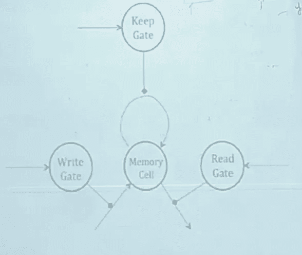

# 理解门控递归神经网络

> 原文：<https://medium.com/analytics-vidhya/i-strongly-recommend-to-first-know-how-rnn-algorithm-works-to-get-along-with-this-post-of-gated-9b4bf4f0ced2?source=collection_archive---------0----------------------->

## 门控 rnn 比 rnn 好在哪里？

## 先决条件

我强烈建议首先了解一个递归神经网络算法如何与这个门控 RNN 氏症的帖子相处。

## **门控 RNN**

在进入细节之前，让我们先讨论一下从 RNN 到类似 RNN 的东西的必要性。

在调整基本的 RNN 算法时，或多或少每个神经网络都面临一个障碍，即**消失梯度**的问题。消失梯度是多层感知器面临的一个问题，在误差率反向传播期间，当梯度本身非常小时，梯度永远不会到达初始层。

这在 MLP 中以稍微不同的方式处理，通过使用**更好的初始化技术**和**更好的激活函数**。但是，如果你观察，基本 RNN 只有一个具有多个折叠的层，因此通过时间的反向传播是通过采用**长延迟来处理这个问题的建议解决方案。**

长延迟意味着误差以两种方式传播

(1)沿着记忆状态和

(2)沿着输入路径。

然而，这里又有一个问题，当我们用长时间的延迟来解决问题时，有多少长时间的延迟必须考虑在内？没有预定义/指定的步骤来达到长延迟的最佳数量。相反，我们去尝试错误。此外，我们非常清楚，这种方式的算法可能会/可能不会给出其最佳性能。

这就是门控 RNN 消除长时间延迟问题的地方，它将一种叫做“门”的东西纳入画面。

现在我们举一个例子来了解这个算法的应用，以获得更好的画面。

考虑这两种说法—

> “天空是蓝色的”
> 
> “我在法国长大，我非常喜欢这个地方。我说法语”。

在第一种情况下，在对文本进行分类时，算法不需要长时间记住天空(主题)。然而，在第二种情况下，法国必须在存储器状态中保留一段时间，以便算法预测该人讲法语，即，可能有许多句子，直到最后一个句子说“我讲法语”，但是算法必须知道直到何时保留该信息，以便预测一些事情。这是基本 RNN 的长期延迟失败的地方，门控 RNN 提供了一个更好的优势。

在门控 RNN 中通常有三个门，即**输入/写入**门、**保持/存储**门和**输出/读取**门，因此该算法被命名为门控 RNN。这些门负责允许/禁止来自相应状态的信号流。这意味着任何给定门的值在任何给定点都是 0 或 1，这实质上意味着信号被允许或停止。

让我们以任何一个州为例来清楚地了解这一点。在输入状态的任何给定点 **t** ，输入门可以取值 0 或 1。如果输入门值为 0，则此时输入信息流被阻塞，反之亦然。(注意:其他两个门的情况相同)

有人提出了一个想法，不是完全允许/禁止信息，而是说，如果允许一些数量，而不允许一些数量，则性能会更好，这实质上意味着 gate 的值介于 0 和 1 之间，而不仅仅是 0 或 1。

说了这么多，做了这么多，还有一件事要弄清楚，是什么/谁控制着这些门？

让我们再举一个例子来了解谁控制着大门。假设我在同一段视频中给两个人分配任务，我让其中一个人计算视频中的人数，另一个人计算视频中的物品数量。这里我们可以清楚地看到，目标完全不同，这恰恰成为控制门的决定性因素，或者说输入控制门。

因此，门的输出在 0 和 1 之间，本质上是 sigmoid 函数的输出，并由输入控制，这意味着每个门是具有一个隐藏层的神经网络，其输入是 RNN 算法的输入。因此，通过门的信息流由神经网络控制，神经网络将其输入作为当前状态和给定时间 **t** 的存储状态。

通过这种方式，信息流得到控制，长时间延迟的问题在门控 RNN 中完全消除。

这就是 RNN 的基本建筑是如何建成的。基于这种架构，LSTM 和 GRU 模型得以发展，其性能远远优于基本架构。

我要写另一篇关于 LSTM 建筑的文章。

**附言**。由于这是我的第一篇文章，我愿意接受关于进一步调整这篇文章的建议。