# 我追踪了 20 个月的 Google Pay 奖励，以下是我的发现

> 原文：<https://medium.com/analytics-vidhya/i-tracked-my-google-pay-rewards-for-20-months-and-heres-what-i-found-out-ab90da686b4d?source=collection_archive---------0----------------------->

# 第一部分:钩子

如果 Google Pay 是一名员工，那么它在入职仅两年后就会拥有传奇的职业生涯。这款支付应用于 2017 年推出，名为 *Tez，*现在拥有 6500 万活跃用户，每年交易价值[1100 亿美元](https://gadgets.ndtv.com/apps/features/google-pay-ecosystem-play-india-digital-economy-ecommerce-data-2113133)。随着印度的数字支付市场预计在 2023 年翻一番达到[1350 亿美元](https://www.assocham.org/newsdetail.php?id=7138)，Google Pay 成为[第二大最常用的基于合众国际社的应用](https://www.forbes.com/sites/baxiabhishek/2019/09/25/google-pay-is-evolving-into-a-platform-to-grab-a-slice-of-indias-growing-digital-economy/#6e6e6c044868)，Google Pay 的数字及其未来看起来相当强劲。

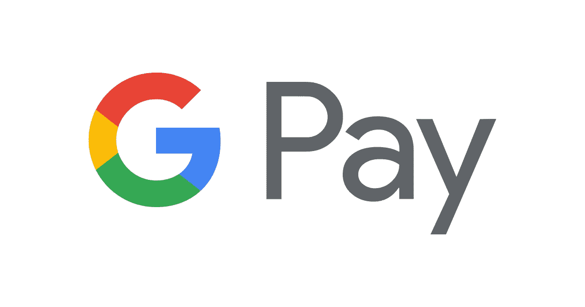

Google Pay 是另一个常见的支付应用，但在印度，它依赖于政府革命性的 UPI 系统。鸣谢:谷歌支付标志，pay.google.com。

像任何优秀的支付应用一样，Google Pay 使用久经考验的奖励系统来吸引新用户使用它。奖励系统以刮刮卡的形式出现，用户在向个人(P2P)或企业(P2B)汇款时可以解锁。)每当一张刮刮卡被解锁(更不用说被刮开)时，多巴胺就会发挥颠覆性的作用，显示用户是否得到奖励。[这是一个聪明、有效的 UX 决定](https://www.orfonline.org/expert-speak/the-weaponisation-of-cashbacks-on-upi-by-google-pay-57099/),让使用 Google Pay 变得更有趣，更容易上瘾。

我在 2018 年 1 月加入 Google Pay 派对，迟到了 3 个月，但很快就被刮卡系统吸引住了。虽然基于合众国际社的交易在各种支付应用中都能轻松实现，但我不信任 BHIM，因为它与政府有联系，我对 PayTM 和它的数字钱包系统有一种非常理性的仇恨，这个系统曾经在我支付 400 卢比的移动账单时欺骗了我。

在过去的一年半时间里，我注意到获得奖励的人数呈下降趋势。感觉就像在 2018 年，我每个月可能会得到 5-10 个奖励，而在 2019 年这一数字大幅下滑。许多工作中的朋友也有同感，他们说，自从他们在 2019 年的交易中获得现金返还以来，已经过去了*个月*。当然，在获得了将近 800 卢比的奖励后，我可能不再是一个值得奖励的顾客了。但是，在我决定抛出指控，并警告其他用户他们最终的命运之前，我需要证据。

所以我决定对我自 2018 年 1 月以来在 Google Pay 上进行的 230 笔交易做一点数据分析。

让深潜开始吧。

# 第二部分:方法论

当我开始在 Excel 上记录我的 Google Pay 数据的艰难过程时——手动！—我写下了我想从这个项目中得到的基本答案。我也承认即使我是对的。我不太可能从 Google Pay 转向另一款应用，因为:

a)相比其他应用程序，我更信任谷歌(这是你的品牌形象)

b)我非常喜欢这个用户界面。

c)我不喜欢多个应用程序做同样的工作

我使用 Google Pay 的主要原因是它的便利性和对安全设备的信任。刮刮卡是一种额外的、有效的、吸引人的奖励。

在记录数据时，我用我发现的大量信息提出了新的问题。该应用程序记录了给予用户的所有奖励、所有交易、交易对象和交易时间。通过将我的奖励日志与所有交易页面进行匹配，我能够正确地确定哪些交易获得了奖励，哪些没有。

这种交叉引用的另一个关键方面有助于减少我在同一天获得多个奖励时的错误，尽管没有交易。当刮刮卡在交易后解锁*时，用户可以选择在稍后的日子*刮刮卡*，并在初始交易*后多日*获得奖励金额。我有一个习惯，收集许多刮刮卡，然后在许多天后检查它们是否有奖励。*

奖励系统的另一个重要部分是它有一定的管理规则:

a)只有 150 卢比以上的 P2P 交易才能解锁刮刮卡

b)一旦获得一张刮刮卡，在那之后的同一天的交易将没有资格获得同类刮刮卡(用户不会解锁另一张 P2P 刮刮卡，但可以解锁一张 P2B 刮刮卡)

c)用户每周只允许使用 3 张刮刮卡。

我试图删除违反这些规则的交易——但不可否认的是，我可能没有做到最好，因为我是在 Excel 表格上直观地完成大部分工作的。

最后，为了检查我从 P2P 交易中获得奖励的频率，我添加了 *money received* 作为交易，因为这也使我有资格获得刮刮卡。不过，我确实记录了我收到了多少钱，支付了多少钱，以及它们的总额，以便提供一个完整的明细。

现在，我想知道的问题是:

a)奖励有下降的趋势吗，还是我的想象？

b)我从哪项活动中获得了最多的金钱奖励:P2P、优步账单还是沃达丰账单？(这些占了我交易的大部分)

c)什么活动给了我*最大的奖励机会*(忽略每笔交易的实际奖励金额)？

# 第三部分:调查结果

# a)奖励降低了吗？

在记录了 2018 年 1 月 24 日至 2019 年 10 月 12 日的所有 230 笔交易后，奖励是否减少的答案有点复杂。为了回答这个问题，我翻出了一些图表。快速浏览一下我是如何命名时间线的，这与分析中使用的所有其他折线图是一致的:

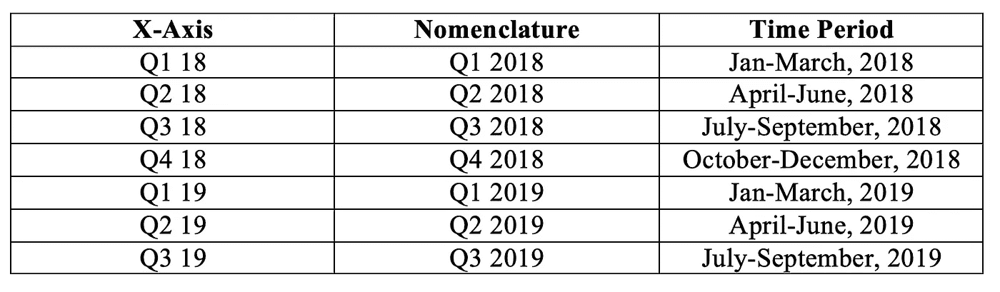

表 1:我将一个日历年中的时间段分成了几个季度(3 个月)。

现在来看图表本身—

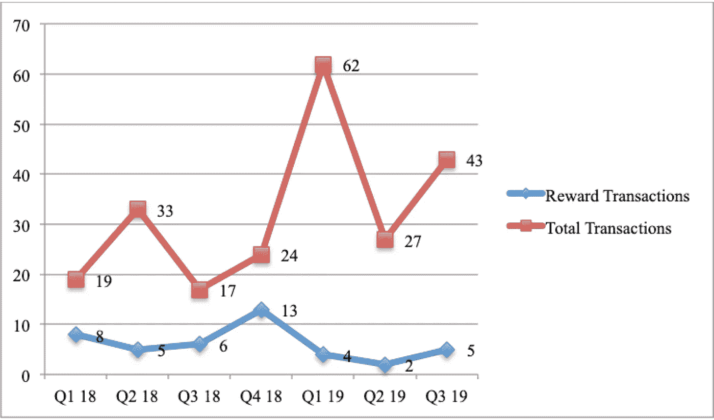

图 1:虽然奖励线显示有所下降，但似乎没有我想象的那么剧烈。

在我们理解数据之前解决一个差异:我没有将 2019 年 10 月的数据包括在这张特定的图表中，因为这将是 2019 年第四季度的唯一一个月。从我开始这个项目的那天起，**我已经做了 5 笔交易，收到了 0 笔奖励。**这些数据最终会出现在其他一些图表中，因此为了透明起见，我在开头写下这些数据是很重要的。

从图 1 的蓝线来看，很明显*的回报已经*下降，但也没有我想象的那么剧烈。出于某种原因，我坚信我每个月会获得 5-10 个奖励*，*，而实际上，我获得的最大奖励——13 个——是在 2018 年第四季度。顺便说一下，那一季度的奖励如此之高是有原因的，这是我那一季度获得的奖励的明细。

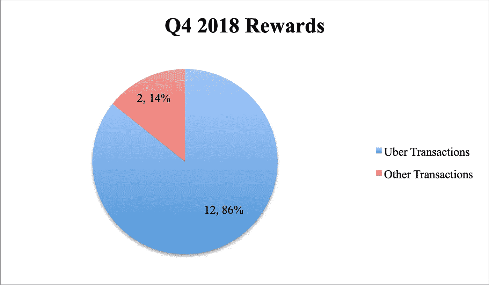

图 2:2018 年第四季度，优步交易占我报酬的 86%:这个数字高得惊人。

2018 年第四季度，我获得了 12 笔优步交易的奖励！将这与我整个分析期间优步奖励的总数相比较

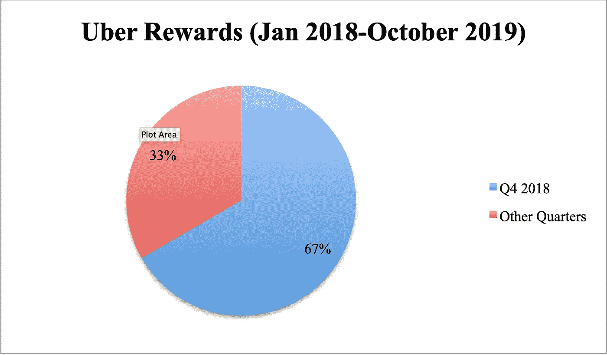

图三:2018 年第四季度优步交易的奖励占我所有优步交易奖励的 67%。

所以 Q4 2018 负责 ***一半以上*** 我的所有奖励都来自优步！2018 年第四季度发生了什么？我们将在下一部分详细回答这个问题，但现在的要点是，2018 年第四季度的 13 次奖励高峰是*而不是常态*。我们再来看看 2018 年 Q1 奥运会第二高的奖励周期(8 个)的细分情况——

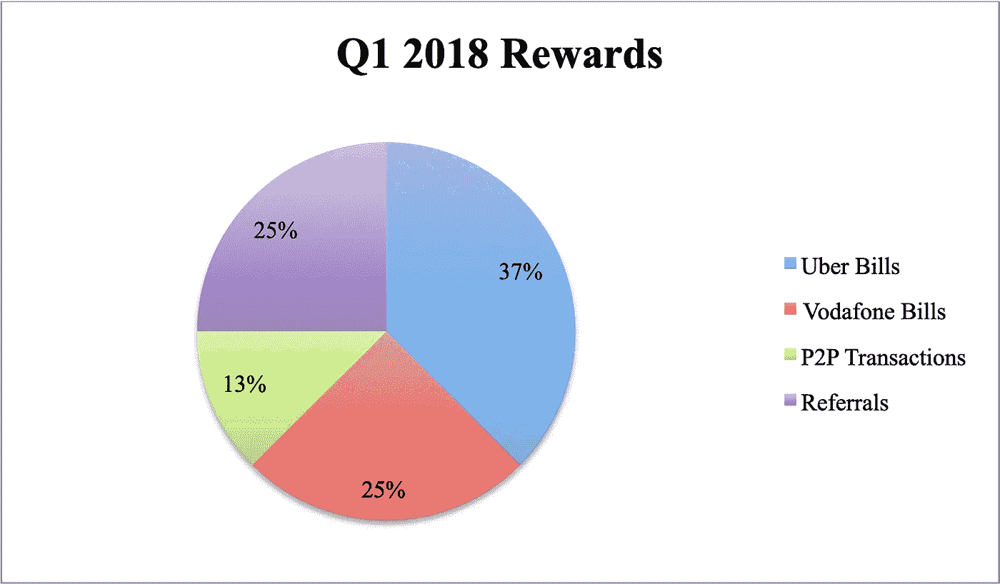

图 4:我在 Q1 2018 获得的所有奖励的分解。优步交易占这些奖励的近 40%。

除了明显的优步优势，我还想指出，我在 2018 年 Q1 奥运会上 25%的奖励来自引荐。向人们推荐 Google Pay 实际上是一种万无一失的奖励方式。与其他刮刮卡的抽奖算法不同，推荐某人(或被推荐)*肯定会给你带来回报。*我是通过推荐加入的——这给了我 51 卢比——然后又推荐了另一个人——这又给了我 51 卢比。今年晚些时候，我推荐了另一个朋友，这为我赢得了 81 卢比(谷歌提高了赌注)，总共 182 卢比的推荐奖励。

问题是，很难找到推荐这款应用的人，将它纳入我的奖励分析会影响到奖励是否真的呈下降趋势。 ***如果我移除 2018 年 Q1 奥运会的引荐*** 奖励，以及我后来从 2018 年第三季度获得的奖励，图表最终看起来像这样—

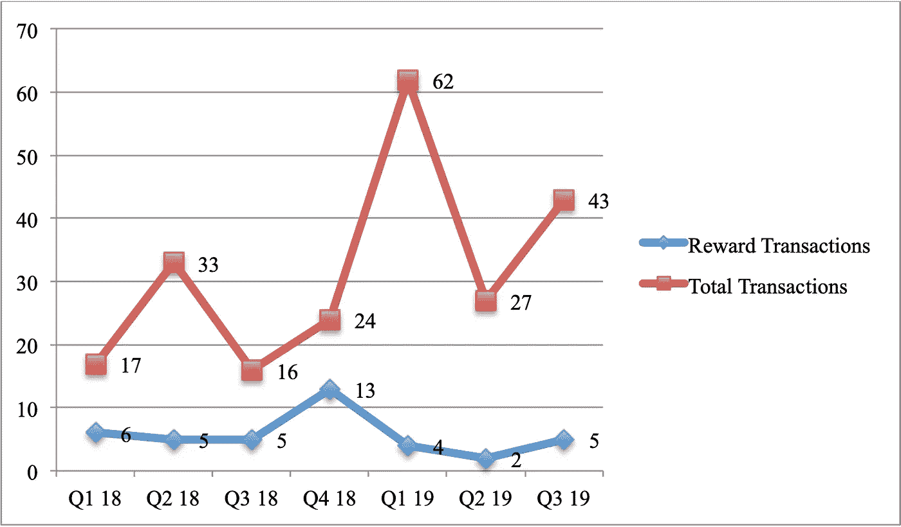

图 5:对先前的奖励和交易时间表进行了修改，但删除了推荐奖励。

现在——忽略 2018 年第四季度的大幅飙升——看起来不像是*的巨大*下降趋势，除了 Q2 2019 (2 个奖励)，这可能是我注意到并开始抱怨的三个月期间。可能是因为 2019 年第三季度我回了 5 个奖励，Google 偷听了我的抱怨。

**所以，实际上，自从我开始使用这款应用程序以来，我每个季度获得的奖励数量一直保持*相当稳定*。**

那么，为什么我觉得我的奖励开始减少了，尤其是在我进入新年的时候？

要回答这个问题，让我们看看总交易量的攀升红线。基于奖励的系统很容易让人想到:

交易越多=奖励越多。

从上面的图表来看，完全不真实。 ***Google Pay 大概对我获得的奖励数量有上限，不管我做了多少笔交易*** 。即使我的交易在后面几个季度攀升，我仍然只获得了 4-6 个奖励(还是忽略了 13 个奖励峰值。)事实上，从每笔交易的奖励百分比来看，应该是这样的:

图 6:一旦你看到我得到的奖励的百分比，下滑是相当明显的。

这告诉我们，我的奖励百分比*已经*下降了。即使不看 2018 年第四季度的*巨大的峰值，*2019 年所有三个季度的奖励百分比都低于 2018 年的可比季度，这 ***进一步让我相信我的奖励上限是每个季度 4-6 个奖励，*** 不管我最终交易了多少。

(我应该在这里指出，我已经给谷歌发了邮件，询问他们是否有官方政策来限制每个用户的奖励。他们还没有回复。)

现在来回答我的第一个问题:**我的报酬下降了吗？**

答案:**绝对而言:不尽然。用百分比来说(自从我开始使用这个应用程序以来，我的总交易量已经激增了):是的，绝对是！**

# 沃达丰-优步双头垄断

当我埋头记录数据时，两个名字——沃达丰和优步——开始跃入我的眼帘。以下是我所有奖励交易的明细:

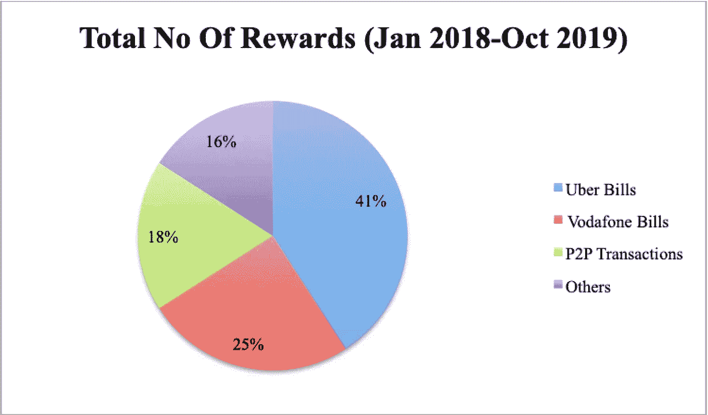

图 7:我从 2018 年 1 月到 2019 年 10 月获得的所有奖励的细分，显示了哪些交易触发了奖励。优步为 41%，沃达丰为 25%。

在我得到的 44 个奖励中，66%来自优步&沃达丰账单，18%来自 P2P 交易，16%来自“其他”交易(包括推荐，以及我交易过两次或两次以上的其他业务:Zomato、Ola、Swiggy & Amazon)

从之前的发现中，我们知道优步的数据是有偏差的:

图 3:2018 年第四季度优步交易的奖励占我所有优步交易奖励的 67%。

事实上，将我们从 Q1 2018 年奥运会的奖励细分中看到的数字相加，我们得到了一个更有趣的数字:

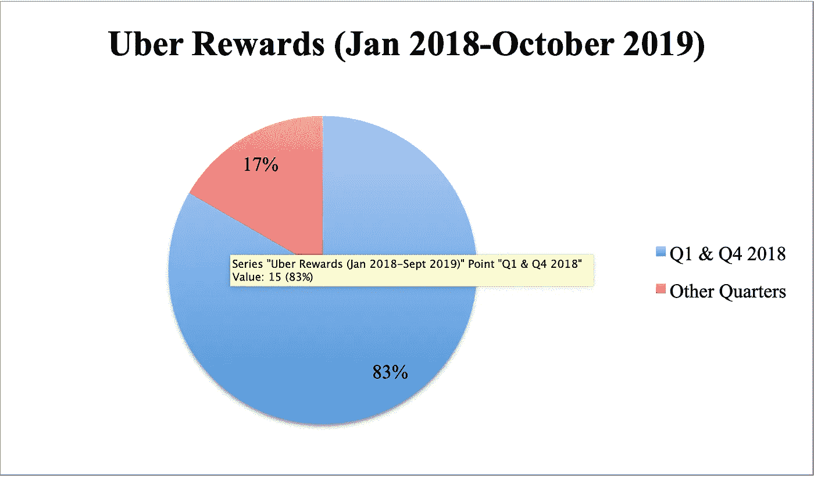

图 8: Q1 和 2018 年第四季度占我所有优步奖励的 83%。剩下的 3 项奖励将在接下来的一年半时间里发放。

两个季度(Q1 和 2018 年第四季度)占我的优步奖励的 **83%** ，一个季度(2018 年第四季度)占我的优步奖励的 **67%** 。

**那么，2018 年第四季度发生了什么？**

答案并没有那么戏剧性:从 2018 年 10 月到 12 月，优步和 Google Pay 进行了一次合作，每次用户用 Google Pay 支付一辆优步时，都会得到奖励。该优惠持续到 2018 年 12 月 31 日，或者当用户完成 10 次骑行(以先到者为准)时，每次骑行奖励 15 卢比，无论骑行实际花费多少。

(有趣的补充说明:有一次优步从我身上扣了 1 卢比——我不完全确定*为什么*因为我再也没有拿回来 Google Pay 给了我 15 卢比，给了那笔交易惊人的***15 倍回报*** 。)

让我们更深入地研究一下优步和沃达丰，并尝试回答几个问题

a)哪项交易给了我更高的回报机会？

b)两者之间，我在哪里花的钱多？

c)哪项交易给了我更多的奖金？

我们先来看看我在优步和沃达丰的交易中获得奖励的频率:

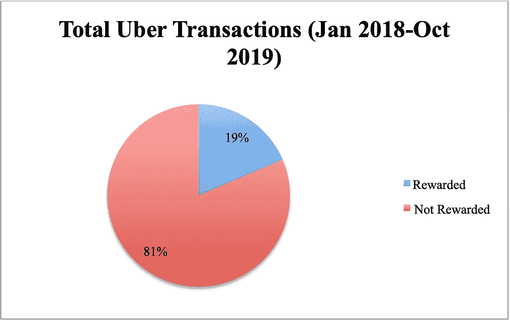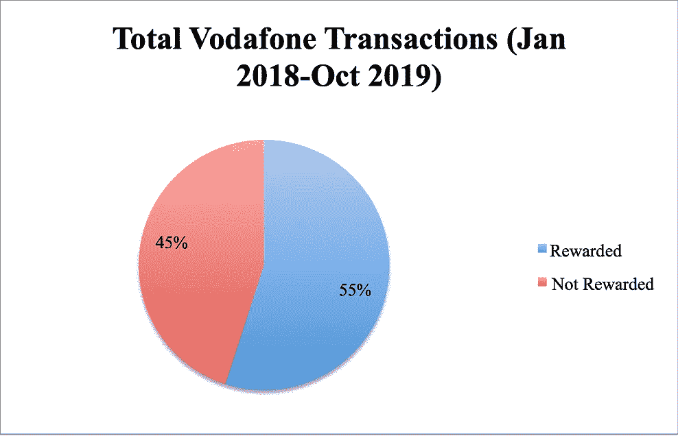

图 9 和 10:我有 19%的机会从优步交易中获利，有 55%的机会从沃达丰交易中获利。

在分析期间，我最终在优步的交易量是沃达丰交易量的 5 倍——这很容易解释，因为我每月支付电话费，但随时随地都带着优步。

然而，令人惊讶的是，我实际上因为支付了沃达丰的账单而获得了更多的奖励(55%)。我也有一种印象，我从优步获得了更多回报——可能是因为 2018 年第四季度连续 10 笔交易——但这已经被搁置了(优步获得回报的可能性为 19%，沃达丰为 55%)。)

事实上，由于结果的偏差，从优步那里获得奖励的可能性甚至比图表显示的还要低。再看一下数据:2018 年& Q4，**未**发生的三笔交易中， ***其中两笔*** 发生在 2018 年 Q2， ***其中一笔*** 发生在 2019 年 Q1。客观地说—

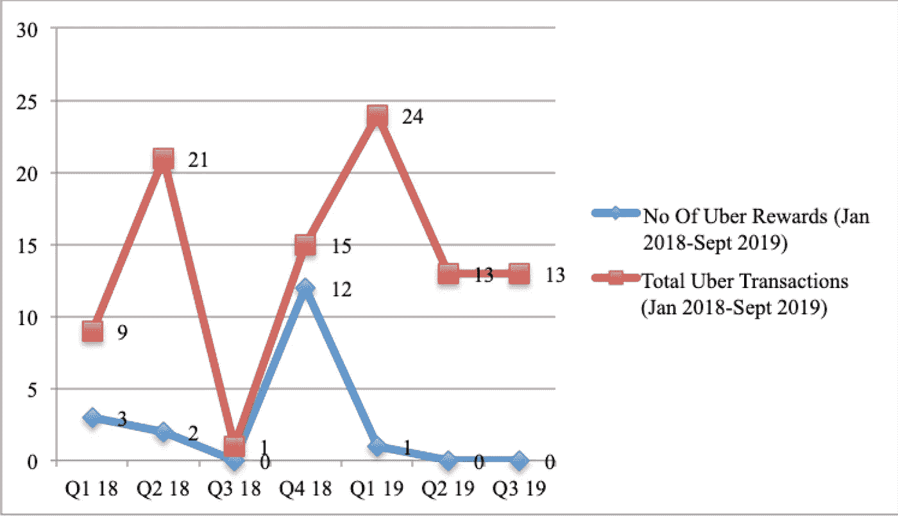

图 11:除了 2018 年第四季度的大幅飙升，优步的交易实际上给我的回报非常低。

我已经走了整整 3 个季度——9 个月！——尽管我在那段时间里骑了 27 次，却没有得到优步的奖励。与沃达丰相比—

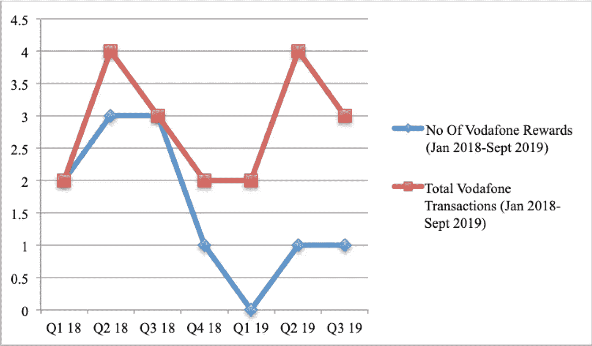

图 12:沃达丰的交易与他们的回报非常一致。

沃达丰在 2019 年 Q1 奥运会(1 月至 3 月)上根本没有奖励我，而是定期给我奖励。如果你想知道我是如何在 2018 年 Q2 和 2019 年 Q2 完成 4 笔交易的(当一个季度=三个月=三张账单时)，这是因为在 2018 年 Q2，我还为某人的预付费包支付了费用，而在 2019 年 Q2，我支付了上个月的账单，延迟了-从而将其推到了下一季度的交易列表中。

因此，尽管*在数字上，*优步给我的奖励(18)比沃达丰(11)多，但我实际上应该只希望沃达丰会给我奖励(反正有 50%的机会)，而优步不会给我太多奖励， ***除非他们再次与 Google Pay 合作。***

虽然沃达丰坚定不移地奖励我值得赞赏，但同样值得注意的是，我在 2019 年(2)的奖励低于 2018 年(9)的奖励，因此处于下降趋势，这相当令人难过。

我还想举例说明总薪酬及其实际货币价值的明细

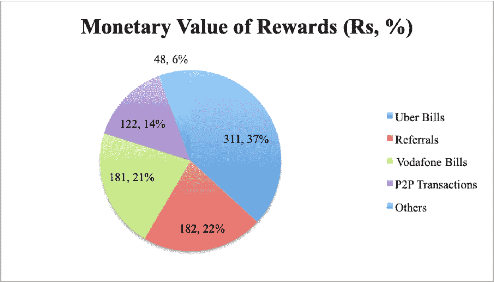

图 13:我从优步交易中赚了最多的钱(311 卢比)，其次是推荐(182 卢比)，然后是沃达丰交易(181 卢比)。)在此期间，我的总薪酬为:844 卢比。

优步账单对我的金钱回报贡献最大(311 卢比)，其次是推荐(182 卢比)和沃达丰(181 卢比)。

在交易方面，我在 2018 年 1 月至 2019 年 10 月期间在 Google Pay 上花费了 75，163 卢比，收到了 26，153 卢比，总计价值 1，01316 卢比的交易。在同一时期，我从奖励中积累了总计 844 卢比，约占我交易的 1%。下面是我在哪里做了最多的交易和(不包括 P2P)花了最多的钱。

图 14:除了 P2P 交易，我在其他所有交易上都花过钱。它们的货币价值算作直接支出。P2P 交易包括我花的钱和收到的钱，所以不算总支出。

将它们与奖励分解图放在一起，我们看到:

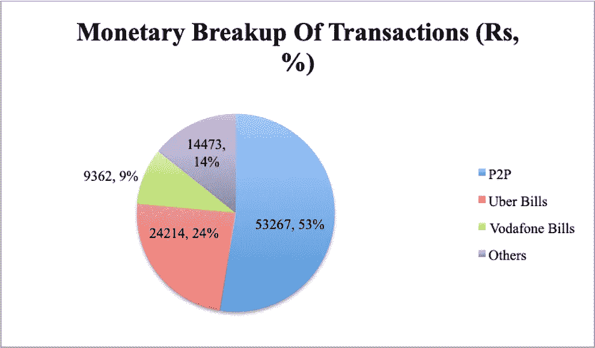

图 13 和 14:奖励和交易的货币分解的并排比较。

a)优步的支出位居第二(24%)，对奖励的贡献也最大(37%) —但大多数奖励都是在一个季度内获得的(2018 年第四季度)

b)沃达丰在我的支出中贡献最少(9%)，在奖励中贡献第三大(21%)——被推荐人超过了一个卢比。

c)我在“其他”类别的支出(14%)高于我在沃达丰的支出(9%)，但与沃达丰相比，仅占我奖励的 6%。(21%.)

P2P 交易占**我交易的一半以上** (53%)，但只占回报的 14%——第二低。

**所以回答一下我在这部分开始时提出的问题:**

a)哪项交易给了我更高的回报机会？— **沃达丰(55%)**

b)两者之间，我在哪里花的钱多？— **优步(24%对 9%)**

c)哪项交易给了我更多的奖金？— **优步(37%)**

但是让我们更深入地研究一下那些有趣的 P2P 交易吧！

# c)那些讨厌的 P2P 交易！

也许任何基于合众国际社的支付应用程序最大的优势在于，它可以在几秒钟内为你的朋友支付所有那些分摊的账单、拼车和你输掉的赌注。在我的分析中，我已经把付费和收到的交易都计入了我的 P2P 条目总数中，因为我都得到了回报。对我来说，这是 Google Pay 上第二受欢迎的交易，甚至在数字上也是如此

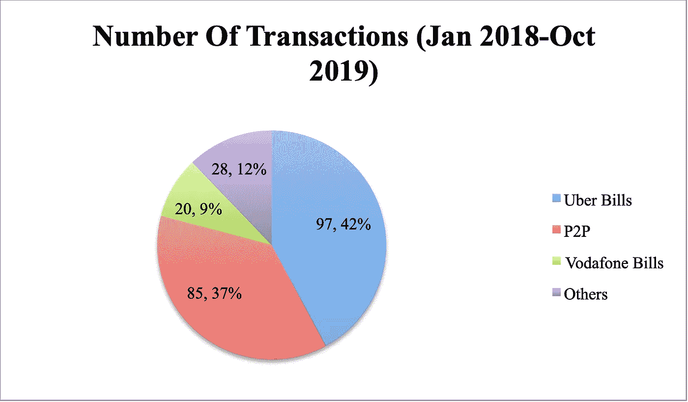

图 15: P2P 交易在我的总交易列表中排名第二，仅次于优步(42%)和 37%。

在我做的 85 笔 P2P 交易中，只有 ***8 笔获得了回报——***

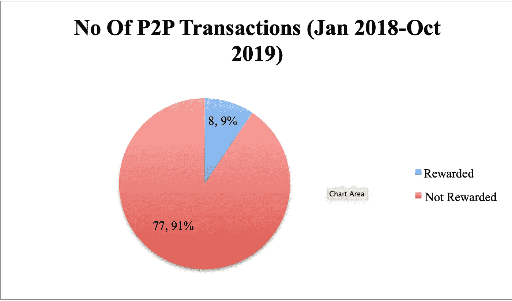

图 16:85 个 P2P 交易中有 8 个获得了奖励，这使得它成为一个非常不可靠的获得奖励的交易。

与优步(19%)和沃达丰(55%)相比，从 P2P 交易中获得回报的几率不到 10%。)考虑到 P2P 交易占我交易的 53%和我总支出的 27%，这一点也不令人高兴。让我们来看看每个季度 P2P 交易的回报趋势—

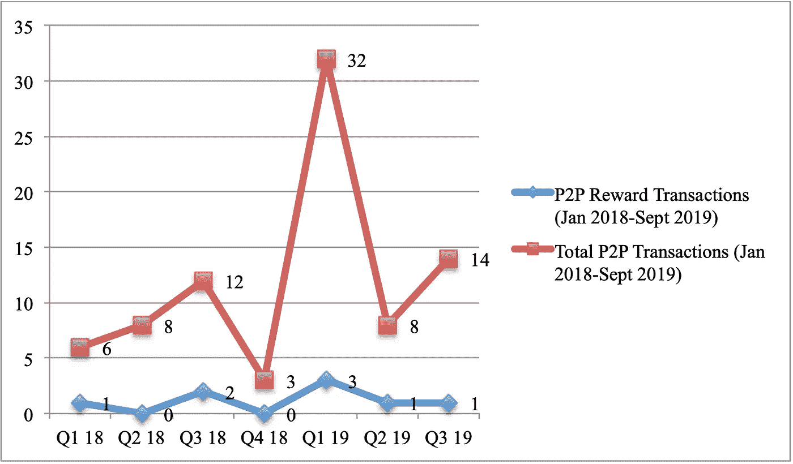

图 17:尽管我的 P2P 交易飞速增长，回报却跟不上。

从上面的图表来看，我有两个季度(6 个月)没有 P2P 交易的回报，三个季度(9 个月)各有一个回报。考虑到我进行的 P2P 交易的数量，以及我花费的 27，114 卢比和收到的 26，153 卢比，这有点令人沮丧，因为没有奖励，我不禁感到有点受骗。令人欣慰的是，回报趋势并没有呈下降趋势，但话又说回来，几乎没有任何回报表明，首先看到一个趋势并不算什么。

与我的支出和收入相比，我从 P2P 交易中赚回了大约 0.2%的回报。相比之下，我在优步的支出只收回了 1%，在沃达丰的支出只收回了 2%。不是数字，如你所见，那是可以写回家的。

# 第四部分:结论

长话短说，我的假设既对又错——这是所有分析中最好的答案，真的。奖励的机会*确实*下降了，但是绝对奖励并没有*真的*改变那么多。来刷新—

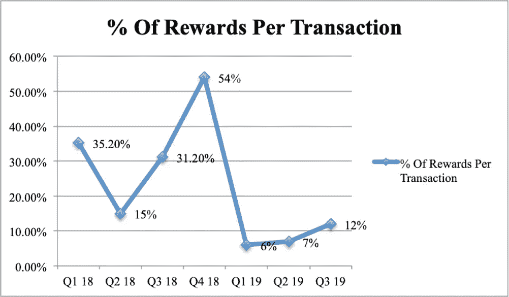

图 5 和图 6:获得的绝对奖励和获得奖励的机会的对比图。

从这两个趋势图来看，2018 年第四季度奖励的绝对闪电战，随后是 2019 年 Q1 的回归常态——然后是常态的延续——导致我觉得我的奖励在 2019 年处于下降趋势，即使我的奖励的*数量没有真正改变。我的交易指数式增长——而回报却没有平行增长——帮助巩固了这个想法。*

**我学到了什么**

为了获得最佳的交易回报比，我可能应该把我的支出限制在每季度 10-18 笔，这样我就可以回到每 3 笔交易就有回报的状态。如果 Google Pay 坚持将分子(奖励)限制在 4-6 之间，那么我也会坚持将分母(交易总额)限制在 10-18 之间，这样我就有 35%的机会获得奖励。

另一方面，虽然我不太可能大幅减少我的交易(要付的账单、要去的地方的出租车费)，但我可以*降低我的期望值，尤其是在付清优步账单或收发钱款时。即使在支付沃达丰的账单时，我也只能期望每个季度有 50%的时间*、*(这是一个跨越 3 个月的时间段)得到回报，而且这个时间段也一直处于显著的下降趋势。*

**谷歌能学到什么**

关于如何让用户参与到一个产品中，我不会给谷歌提供什么建议，但我不禁觉得，奖励用户更多的交易，而不是限制交易，会让他们参与到应用中来。我的分析告诉我，事实上应该少花些钱去 T21，因为回报跟不上交易。相反，如果我因为花更多的钱而得到奖励，并且花得更频繁，我可能会发现这种相关性，并最终增加我的使用量。

**但也……**

奖励计划*的目标是*让新用户迷上这款应用——它做到了——这款应用的易用性和功能性留住了用户——它也做到了。正如我在开始时所说，我不打算根据这些结果更换应用程序，但我也很想知道其他 Google Pay 用户以及其他平台——Pay TM——用户的奖励趋势如何。他们是否在奖励方面更加积极？他们也注重吸引新用户吗？他们也限制奖励吗？唉，我得偷个朋友的手机才能知道。