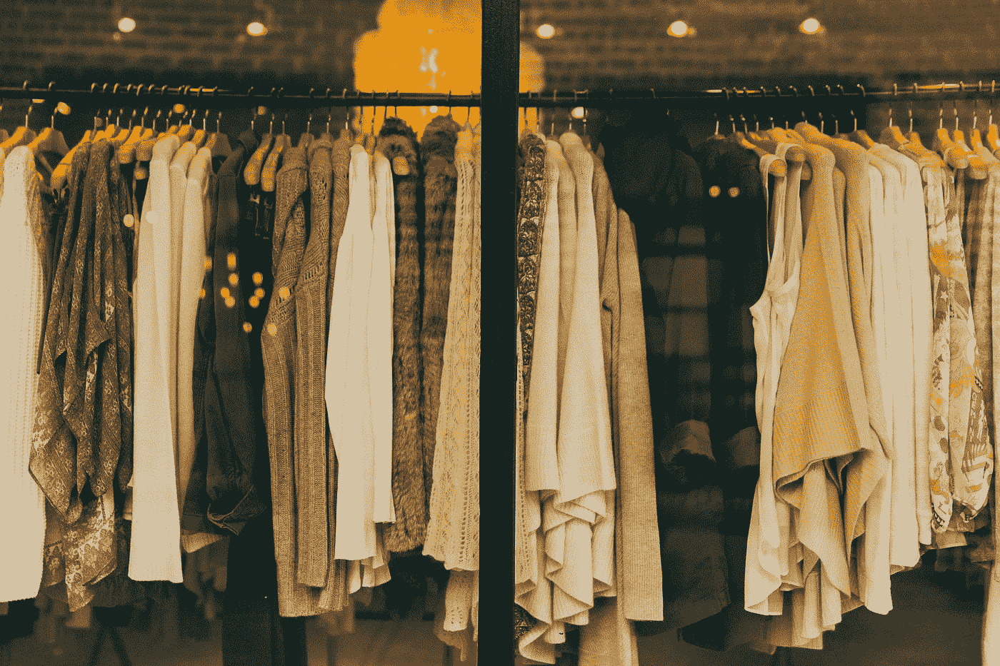
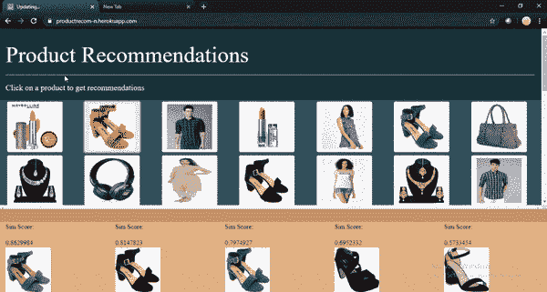

# 我试图复制电子商务平台使用的推荐引擎，下面是它是如何进行的…

> 原文：<https://medium.com/analytics-vidhya/i-tried-replicating-the-recommendation-engines-used-by-e-commerce-platforms-heres-how-it-went-a1ed3d7c82c9?source=collection_archive---------25----------------------->



购物时相似 t 恤/羊毛衫的推荐{ [Source](https://pixabay.com/photos/?utm_source=link-attribution&amp;utm_medium=referral&amp;utm_campaign=image&amp;utm_content=1031469)

作为各种电子商务网站的消费者，当平台开始推荐与以前购买相似的商品、搜索历史甚至只是看起来相似的商品时，我总是很好奇。随着隔离让我感到极度无聊，我决定进一步深入推荐引擎的世界，好家伙，我失望了。事实证明，这些算法并不难理解。因此，为了好玩，我决定创建一个推荐系统。

# **提纲**

> *数据收集*
> 
> *创建迁移学习模型并保存*
> 
> *获取推荐*
> 
> *创建用户界面并嵌入模型*
> 
> *部署*

**剧透:我确实做了一个静态的朴素模型，它适用于一些静态图像。** [**点击这里获取推荐！**](https://productrecom-n.herokuapp.com/)

很明显，现在只有大量的推荐引擎，但大多数都只迎合了数字领域的需求。电影推荐是最常用的推荐系统。因此，试图找出如何创建一个模型是一项相当艰巨的任务。最后，我决定可以使用迁移学习模型来提取特征，正如许多教程所见，只有余弦相似度可以用于获得推荐。

注意:添加了代码片段，但是对于整个源代码，[点击这里。](https://github.com/niharika412/product_recommendations)

# **数据收集**

数据收集很容易。编写一些 python 代码，您就可以准备好数据了。我决定收集自己的数据，但是任何包含产品图片的数据集都可以！Kaggle 有许多这样的数据集。

下面是一些数据抓取的代码——我首先从网站上抓取图片链接，然后下载图片。

# **迁移学习**

迁移学习就是操纵和实现一个模型，这个模型是为解决一个问题而创建的，用来解决一个不同但相关的问题。基本上就是用一个用来分类猫和狗的模型来分类汉堡和披萨。有许多型号可供选择，即。InceptionV3、VGG16、ResNet 型号和都具有相同的用途，但架构不同。我选择了 VGG16 模型进行特征提取。

特征提取是从原始变量的初始集合中评估图像并识别用于处理的可管理组的过程。

特征提取后，用余弦相似度来识别相似图像。余弦相似度使用以下公式计算。


余弦相似性

这基本上创建了一个效用矩阵，可用于进一步索引图像并获得最相似的图像！

下面是一些转移学习代码:

```
*# load the model*
vgg_model = vgg16.VGG16(weights='imagenet')

*# remove the last layers in order to get features instead of predictions*
feat_extractor = Model(inputs=vgg_model.input, outputs=vgg_model.get_layer("fc2").output)

*# print the layers of the CNN*
feat_extractor.summary()
```

点击此处查看整个笔记本！

# **获取推荐**

在特征提取之后，获得推荐是容易的。目标只是索引图像并获得相似的项目。

使用了以下函数:

```
**def** retrieve_most_similar_products(given_img):

    print("-----------------------------------------------------------------------")
    print("original product:")

    original = load_img(given_img, target_size=(imgs_model_width, imgs_model_height))
    plt.imshow(original)
    plt.show()

    print("-----------------------------------------------------------------------")
    print("most similar products:")

    closest_imgs = cos_similarities_df[given_img].sort_values(ascending=**False**)[1:nb_closest_images+1].index
    closest_imgs_scores = cos_similarities_df[given_img].sort_values(ascending=**False**)[1:nb_closest_images+1]
```

# **创建用户界面**

创建接口有很多选项，我选择 Plotly-Dash 只是因为它完全是用 Python 编写的，只带了一点 CSS(Bootstrap)。官方网站上的 dash 教程非常容易理解和实现。我想出了如何添加回调和输入、输出，于是我有了一个工作模型。作为一个几乎没有创造力的人，我花了几个小时才想出了配色方案。

这是模型的外观:



推荐

# **部署**

Dash 应用通常部署在 Heroku 上。现在，我尝试这样做，但遇到了一堆错误和警告。原来，heroku 只允许高达 500MB 的 slug 大小(原型大小),而我的模型大小大约是 528MBs。因此，整个应用程序大约有 800 兆字节。因此，我必须为界面上的所有图像生成推荐，静态地存储它们，并在用户每次请求时调用它们。这意味着该模型不能直接用于获得预测，但是至少应用程序运行得很快，并且正在工作。但是，这个模型可以直接在您的本地机器上使用(我称之为动态用户界面)。

下面是部署的模型:[产品推荐👢](https://productrecom-n.herokuapp.com/)

对于整个源代码:

 [## niharika 412/产品 _ 推荐

### 🎈基于迁移学习和余弦图像相似度的产品推荐🎀 👚 👢在线购物网站…

github.com](https://github.com/niharika412/product_recommendations) 

感谢阅读！