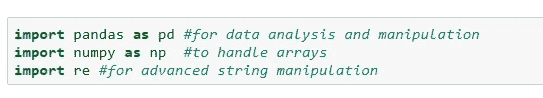
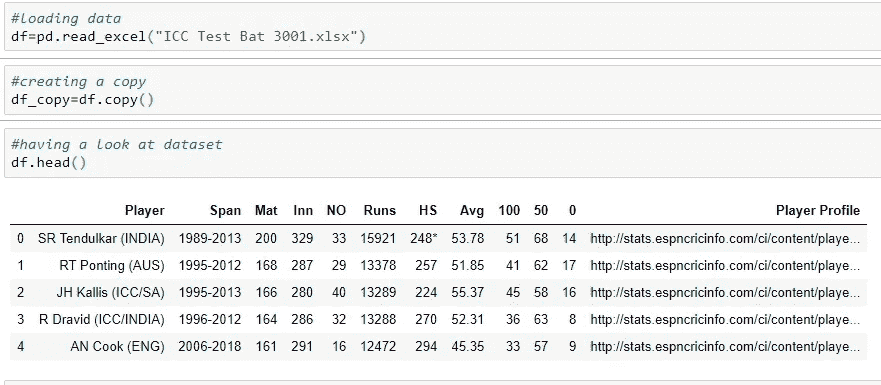
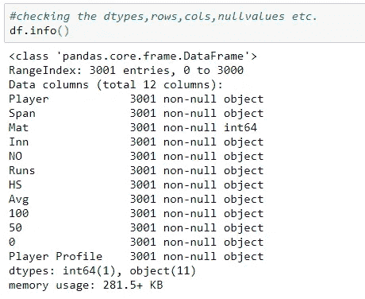
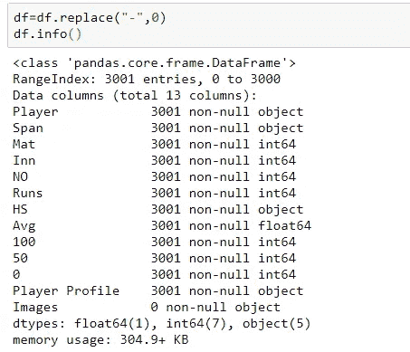
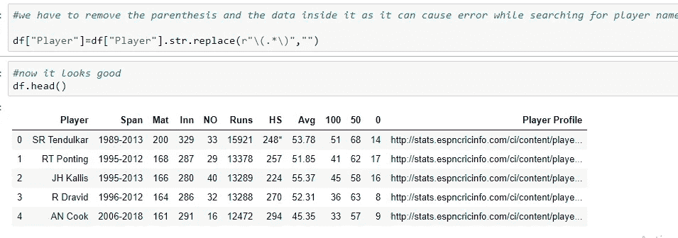
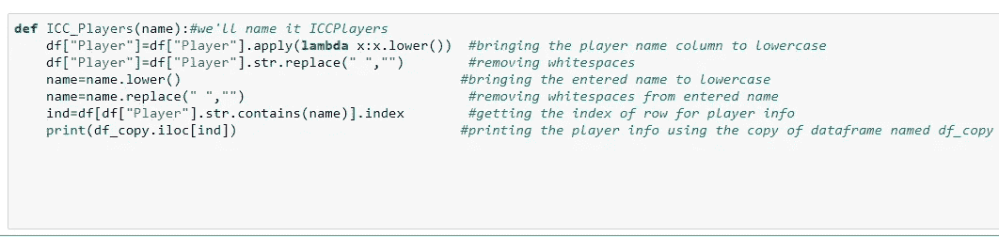
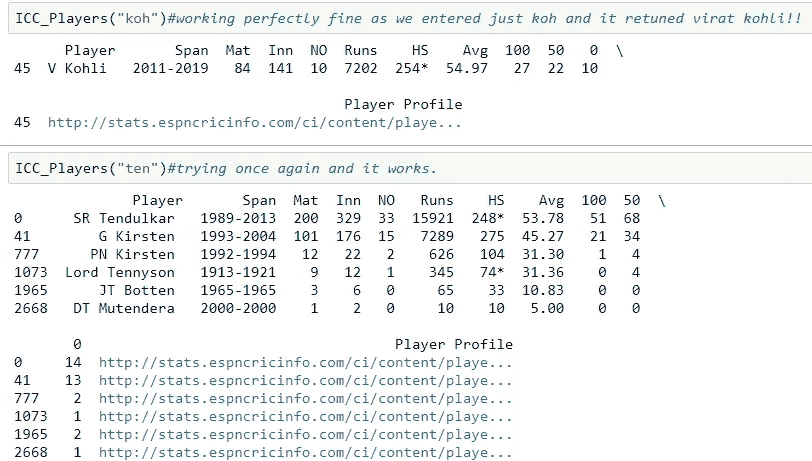
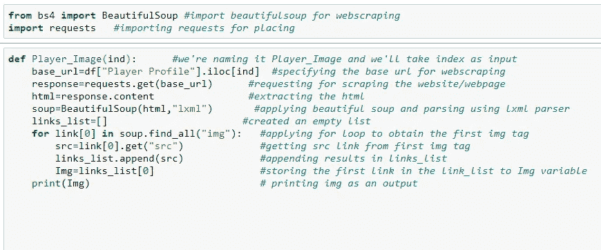
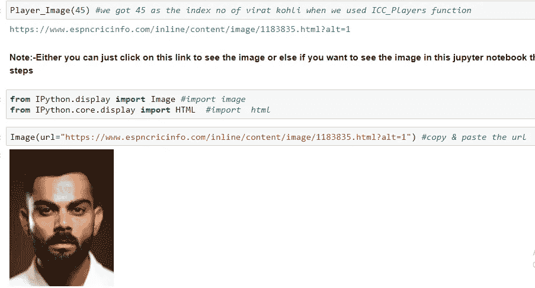

# 国际商会球员信息和刮他们的图像(ESPN 数据集)

> 原文：<https://medium.com/analytics-vidhya/icc-players-info-and-scraping-their-images-espn-data-set-bc5db6c24cf2?source=collection_archive---------39----------------------->

***大家好！！***

> **为了充分利用** [**ESPN ICC 数据集**](https://www.kaggle.com/veeralakrishna/icc-test-cricket-runs) **:** ，我们将创建两个函数

这些功能是:

1.  **ICC_Players :**

这个函数，当你输入一个不完整的名字，一个单词，甚至一个字母，就会返回这个玩家的所有信息和细节。

2.**玩家 _ 图像:**

该函数将获取 ICC_Player 函数输出的索引，并将抓取该球员的个人资料页面，并返回其 ESPN 个人资料页面上的球员图像的 url，该页面可通过单击链接或使用图像函数来查看

**注意:**您可以将这两个函数放在一起，创建一个主函数，但是为了让您更好地理解，我将它们分开创建

> 所以我们走吧，

**1。数据清理&特征工程**

导入必要的库

加载数据并查看它

现在，您可以看到数据集有 12 列，我们将在第一个函数(即 ICC_Players)中使用前 11 列，最后一列(即球员个人资料)将在第二个函数中使用，在该函数中，我们将抓取球员的个人资料页面以获取他的图像。

检查数据类型、空值等。

我们可以看到，大多数功能都有错误的数据类型，如 Inn，NO，Runs，HS，Avg，100，50 和 0 应该有 dtype int，在检查唯一值后，我得出结论，在所有列中都使用了“-”因为它们有对象 dtype，所以我用空字符串替换了它，解决了这个问题

现在，我们将进入下一个问题，即括号和其中的数据，因为它会在搜索球员姓名时产生问题，并使数据看起来有点混乱，所以为了删除它，我用空字符串替换了括号和其中的数据。

**2。创建第一个函数:ICC_Players**

首先，我将函数名定义为 ICC_Players，然后我创建了一个变量:name，它将存储在该函数中输入的内容，然后该函数将 player 列转换为小写，我使用了 lambda，然后我们将删除 player 列中的空格，然后我对包含输入的名称做了同样的两件事，以避免错误、不匹配并获得最佳结果，然后我存储了 变量 ind 中结果的索引，然后为了打印输出，我使用了数据的副本，使用了获得的索引号。

非常好用。

**3** 。**创建第二个函数:Player_Image**

现在我们将移动到下一个函数，所以最初我们将导入更多的网络抓取所需的库，即 BeautifulSoup & requests

然后我们将函数名定义为 Player_Image，并定义了一个变量:ind，它将存储输入的索引号，然后我将基本 url 指定为输入的索引号的播放器配置文件链接，然后 requests.get 将发出删除基本 url 的请求，然后我提取了整个网页的 html 并将其存储在 var:html 中，然后使用 lxml 解析器对其进行解析，然后我创建了一个名为 links_list 的空列表，它将 存储链接，然后我在 soup 变量中使用 findall for img 标记运行 for 循环，通过指定 link[0]我的意思是我想要第一个图像标记。在分析了页面的 html 之后，我知道第一个 img 标记包含球员图像，因此在这之后我提取了包含图像链接的 src，并将其存储在变量:src 中，然后我将 src 追加到空列表中，即 links_list，并将第一个链接存储到 img 变量并打印出来。

要检查它是否工作，要么你可以点击输出链接，要么你可以使用图像功能来查看 jupyter 笔记本内的图像，工作非常好。

所以我们两个的功能都非常好。

对于代码，请查看我的 [Git hub 库](https://github.com/harit198/Project-ICC-Players)

> **坚持学习！！**