# 在(人类)学习任务中使用 word2vec 的想法

> 原文：<https://medium.com/analytics-vidhya/ideas-for-using-word2vec-in-human-learning-tasks-1c5dabbeb72e?source=collection_archive---------8----------------------->

作为一名教育工作者，我梦想有一天，一个软件系统能够为我的学生生成越来越复杂的关于所教内容的问题，立即部署它们并立即标记……哦，如果这些问题也可以是独一无二的，那就太好了，谢谢。我们离给英语作文(甚至两句话的答案)打分还有很长的路要走，但是我们有必要推测一下，随着最近的进步，我们可能会取得什么样的成绩。即使这样一个令人向往的目标似乎还有很长的路要走，人类的一些学习任务类别自然地适合于一种特殊的自然语言处理(NLP)技术，称为 word2vec。

TLDR:粗略地说，word2vec 获取一个文本/文本集合(我们输入的任何内容都被称为**语料库**)中各个单词的上下文信息，并将每个单词合成为一个 n 维向量(一个向 *n* 个不同方向延伸的向量，其中 *n* 可以是任何正整数)。如果我们使用一些简单的问题模板和存储的单词组合列表，我们可以轻松地生成自动标记的问题。反正就是梦想。

我将解释 word2vec 背后的逻辑，单词向量是如何从语料库中生成的，并演示如何对这些向量进行操作(有点)类似于现实生活中实体之间的关系。为了提高效率，我将重点介绍 word2vec 的一种变体(**连续单词包**或 **CBOW** )，而不是连续跳格。之后，我会解释我的想法，一个教育工具，可以添加到任何 SaaS 学习平台。最后，我将介绍如何完善这个项目，需要什么样的语料库，以及我的想法目前有哪些限制，希望有人阅读后会进一步了解这个想法。在这篇文章中，需要注意的是，这个模型有一些限制，这些限制会在文章中出现，这篇文章主要是作为一个概念的证明。

>>>如果你已经知道了 word2vec，并且只是想看看关于教育技术应用的想法<<< >>，向下滚动到第 2 节<<<

## 1\. What is word2vec and how does it work?

In September 2013, Tomas Mikolov and his colleagues at Google Mountain View, CA released a [论文](https://arxiv.org/abs/1301.3781)关于一种进行单词预测的新方法。像以前成功的 NLP 模型一样，它利用神经网络基于上下文进行单词预测。

简而言之，它对我们想要预测的单词周围或之前的单词进行了数字表示；然后将其输入到神经网络的隐藏层，最后将信号发送到输出层，生成预测的数字表示。与任何神经网络一样，在最后计算成本函数，误差反向传播，告诉网络调整不同节点之间的权重，以便在最终层获得正确的结果。我不会深入研究神经网络本身是如何工作的，**但是**我见过的最好的解释是 3Blue1Brown 的[视频。](https://www.youtube.com/watch?v=aircAruvnKk)[电脑爱好者](https://www.youtube.com/watch?v=gQddtTdmG_8)也有我推荐的 word2vec 的视频和演示。

图 CBOW word2vec 模型架构的粗略示意图

你可能想知道一个单词的“数字表示”是什么样子。单词以“一键向量”的形式输入。一键向量是与我们的语料库的词汇长度相同的列向量:如果语料库有 10，000 个不同的单词，那么一键向量将有 10，000 个元素。对于每个单词的一键向量，将有 99'999 个零和 1 个元素设置为 *1* 。那个 *1* 表示我们的单词在语料库中的位置。

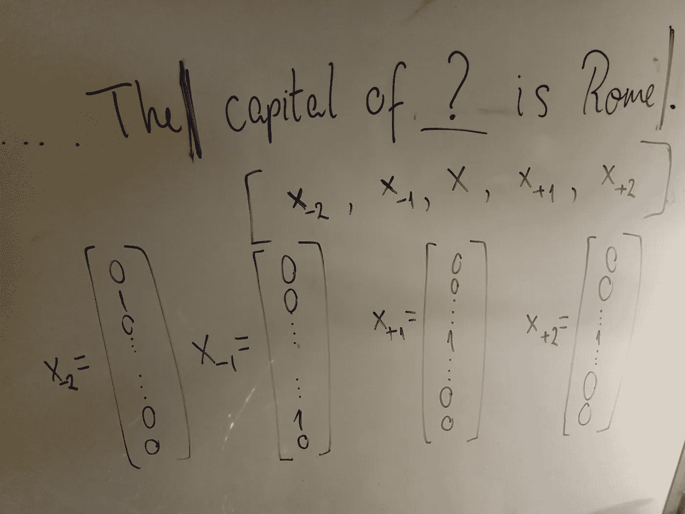

图 2:在丢失的单词周围取大小为 5 的“窗口”(前面 2 个单词，中间 1 个，后面 2 个),并将每个单词的独热向量输入到我们的神经网络中

因此，当我们将一个热点向量输入到我们的神经网络中时，如果我们有一个 5 的窗口，我们就输入 4 个一个热点向量(丢失单词两边的两个单词各一个)。请注意，这只是我们为 **CBOW** 训练网络的方式:skip-gram 做了相反的事情，它试图根据中间的一个特定单词来预测周围的单词。然而，这两个模型产生了相似的结果，尽管 CBOW 运行起来更快，而 skip-gram 在不常用的单词上表现更好。

现在，这是最有用和最有趣的部分:为了在输出层生成准确的预测，我们在神经网络中创建了一个隐藏层，它具有与每个单词相关联的唯一值。现在这个隐藏层是另一个维度矩阵 *n* x *m* 和*这个*是我们的字向量。米科洛夫的团队发现(随后的研究人员试图解释)的是，这些隐藏层向量可以作为一个单词的*含义*的数字表示…

什么…？

一个 n 维的数字向量可以代替一个单词的意思。如果你有两个语义相似的词(比如说*皇后*和*国王*)，它们会有相似的向量(至少在某些方面)。更令人惊奇的是，如果你对它们进行简单的数学运算(即加和减)，你可以得到概念上令人满意和惊人的结果。在原始论文中，它表明，如果你这样做:

向量(国王)-向量(男人)+向量(女人)= …

你得到了…

矢(*女王*)！！！

从技术上讲，概念到我们自己想法的映射并不是完美的 1 对 1，所以当你做上面的操作时，你得到了一个单词向量，最接近的单词向量是 vector(queen)。这仍然是一个令人难以置信的结果！

现在，我知道到目前为止我一直在谈论向量和*单词*向量。在学校里，向量通常显示为二维(2 个轴)或三维(我们的 3 个空间轴)。通过 word2vec 方法创建的“向量”通常具有更高的维度(在 2013 年的原始论文中，他们的词向量具有 300 个维度)。显然，这是不可能用图形表示的，所以在这篇文章中，我将把单词向量简化为 3D 向量(只是*想象*有更多的维度)。

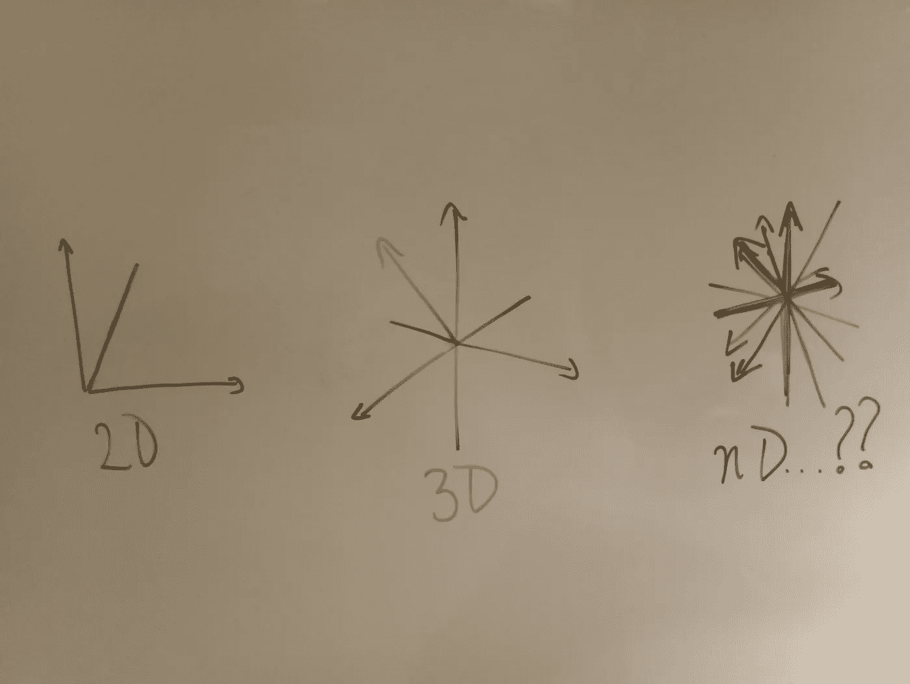

图 3:坦白地说，即使画 3D 也很难

所以，我们有了在语料库上训练过的模型。语料库可以是任何单词的集合，从餐馆菜单到整个维基百科。让我们详细说明一个例子:

假设我们有两个单词向量“柏林”和“德国”。

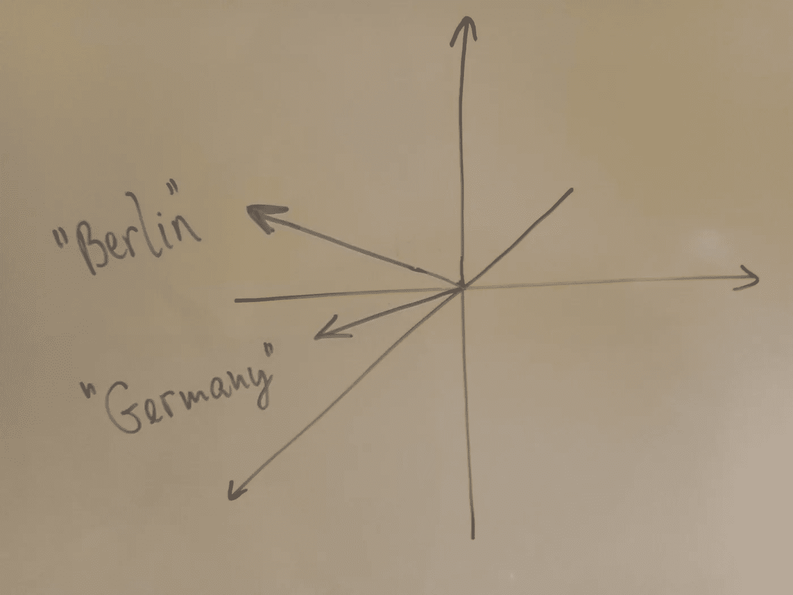

图 4:我们期望这两者之间有一些余弦相似性

现在，我们知道这两者之间存在着联系，以及某种程度上的概念相似性。测量两个向量相似性的一种方法是*余弦*相似性*相似性*。对于 2D 或 3D 向量，您可以将它描绘为向量之间的*角度*:向量之间的角度越小，该角度的余弦值越大(cos(0 度)= 1，cos(90 度)=0)。所以如果有两个向量指向非常相似的方向，你会得到非常高的余弦相似度。这可以概括为 *n-* 尺寸。

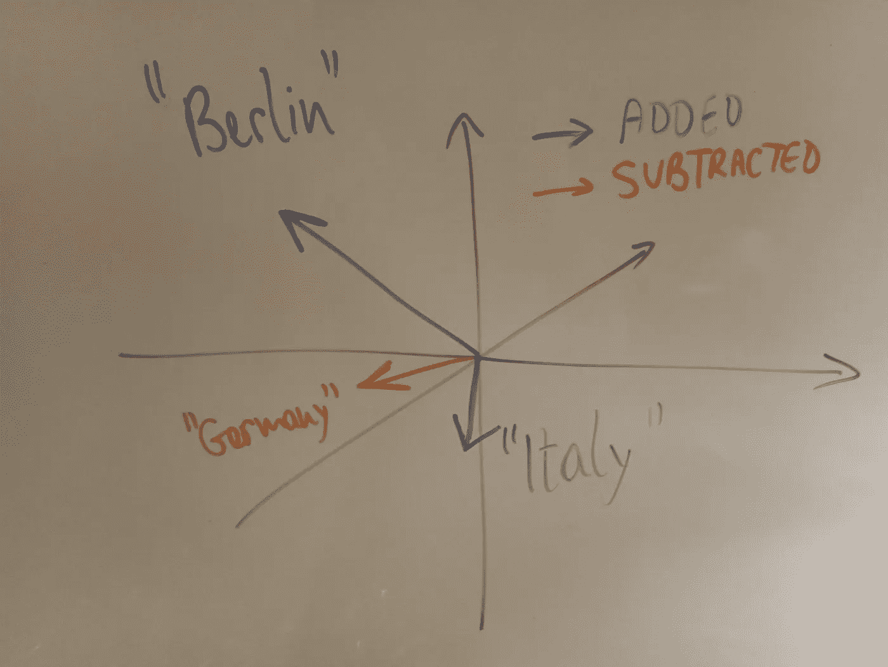

图 5:“意大利”矢量意在“突出”白板

假设我们取 vector("柏林")，减去 vector("德国")，然后*加上*vector("意大利")。如果我们思考这意味着什么，从某种意义上来说，我们是在拿一个在*的某个*维度上与代表“德国”的向量有些相似的向量(“柏林”)，并减去使这两个向量如此相似的分量。不管剩下的是什么，我们把它加到“意大利”的向量上，然后得到一个新的向量。当我们检索一个最相似向量的列表时，我们期望列表的顶部是什么？
我们期待看到“罗马”。

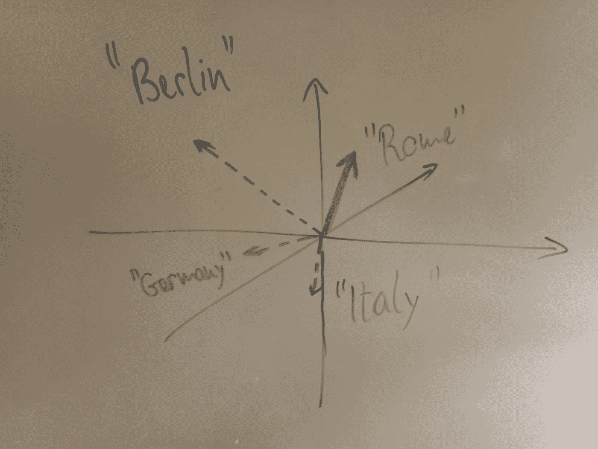

图 6:所有的矢量都指向罗马…至少在这种情况下是这样的。

使用一个流行的 word2vec 包， [gensim](https://pypi.org/project/gensim/) ，我加载了一个内置的语料库，并根据它的词汇训练了一个模型(gensim 用两行代码就简单得可笑)。存储模型(包括所有的单词向量)我已经包括了一些方法的例子和它们的输出。如果我只调用一个特定的向量:

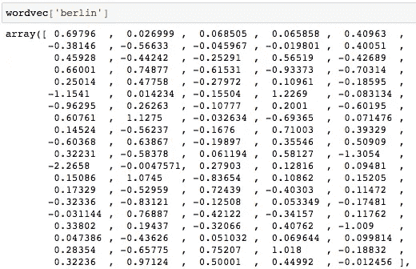

图 7

你可以看到这是一个 100 维的向量。使用 gensim 的方法，我还可以检索最相似的单词向量列表，按照余弦相似度的降序排列:

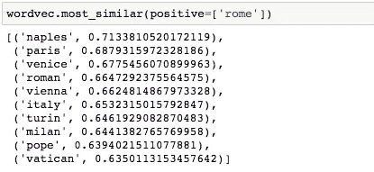

图 8

而且我们可以看到结果有直观的意义:“那不勒斯”和“威尼斯”是另外两个意大利主要城市；“巴黎”是罗马的法语对应物；“罗马”是假名，等等。所有这些词在概念上是相似的，但出于不同的原因。执行向量运算(*柏林-德国+意大利* ) 看起来会像:

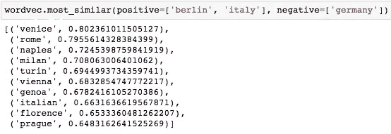

图 9

忽略我们操作的不太直观的格式，我们可以看到第一个问题是什么:我们不只是得到了“罗马”，我们得到了至少 5 个主要的意大利城市，“罗马”不是最重要的。为什么？

考虑将矢量算法重新表述如下:

“柏林之于德国，犹如…之于意大利”

(因此，制定 wordvec 操作的灵感应该来自这篇内容丰富的文章[KD nuggets](https://www.kdnuggets.com/2019/02/word-embeddings-nlp-applications.html))

你可能会认为，基于罗马和柏林都是首都，前者会非常合适，但是请记住，语言模型不知道如何反映这一点。我们的向量中可能有一个维度与典型的*资本特性*非常匹配，也许是这样，但即便如此，还有 99 个其他维度需要考虑。对一些人来说，基于文化意义和历史，当你描绘德国时，柏林是第一个想到的城市。威尼斯和意大利也是如此。此外，根据你输入的语料库(这是 Wikiwords ),该模型可能也编码了位置——威尼斯从字面上看离柏林更近。为了表明这个问题不是普遍存在的，以下是在其他首都重复的练习:

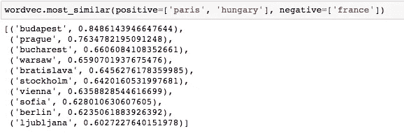

图 10:正如我们所料，巴黎——法国+匈牙利=布达佩斯

因此，我们有了第一个限制的例子:单词向量高度依赖于生成它们的语料库。但是在我们的模型中，我们可以改变语料库，我们可以改变词向量的维度(为什么在 100D 停止？)来完善我们的模型。我在原始论文中加入了一个表格，展示了使用相同的向量算术原理运行的 pairs 示例(使用 skip-gram，在 783 万个单词和 300 个向量上运行)。它没有显示 100%的准确性(第二行，例如示例 1)。

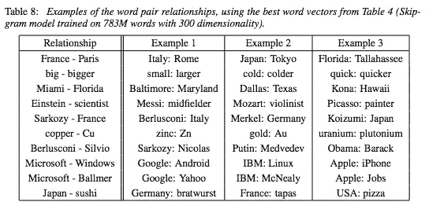

图 11:第七排很容易引发一些激烈的政治评论

## 2.word2vec 的教育技术应用思路

好了，现在我们已经学习了 word2vec，我们可以开始想象一些教育科技应用的例子了。我确信用 gensim 和语料库进行一些头脑风暴会产生一个更长的列表。按主题分类:

1.  英语—查找同义词:

假设我们有一个 KS2 班级的学生，他们打算增加词汇量。我们输入的语料库是我们能找到的所有 KS2 英语书(我们知道词汇和语言是干净的，适合年龄和能力)。我们的应用程序有一个关键字列表(由于其他 NLP 技术，可以通过形态学进行过滤，例如，如果我们愿意，我们可以将形容词传递到应用程序中)。应用程序会询问:

给出“可怕”一词的同义词。

现在这个模型已经完成了计算:它得到了所有接近“糟糕”的单词向量，并将它们存储在一个列表中。当孩子输入一个单词时，它会检查这个单词是否在列表中。这里有一个来自[维基百科](https://nlp.stanford.edu/projects/glove/)语料库的列表:

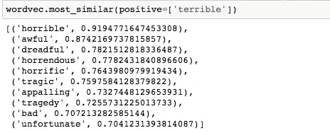

图 12

如果学生输入这些单词中的任何一个，他们就会得到一个分数。没有理由不构建应用程序，让它输出单词列表的其余部分，以便学生获得反馈。在我们有一个按形态排序的输入单词列表的情况下，我们可以让应用程序比较 grammar _ type(input _ word)和 grammar _ type(question _ word)。因为可怕是一个形容词，所以“悲剧”将被踢出这个列表。此外，我们可以调整要包含的单词向量的数量，因此我们可以只在五个单词或二十个单词后删除列表。

2.学习语言

大多数学校科目的标准练习是填空题/完形填空题，就像我们之前看到的罗马/意大利的例子。

对于这种任务，我们可以很快地提出问题。一旦我们训练了我们的网络并从语言教科书的语料库中创建了单词向量空间，我们就可以:

1.  从同一种语言的不同语料库中抽取不同的句子。
2.  从句子中随机去掉一个单词(现在我们假设它不是像“但是”、“and”、“where”等这样的停用词)。
3.  向人类学习者展示句子，并要求他们输入一个单词。
4.  检查他们输入的单词的 a .向量余弦相似度和 b .遗漏单词的语法类型。如果两者都在要求的参数范围内，它们就成功了！

显然，这听起来有点不先进，因为语言学习应用程序已经执行单词丢弃和完形填空任务。这种情况下的区别在于，你可以通过单词*表示*来扩大有效答案的范围。通常完形填空题可能只允许输入一个单词，例如“jacket”，可能是拼写错误。有了 word2vec 余弦相似性的实现，对于你输入的任何单词，你都可以允许某人输入一个同义词或与原来被删除的单词相近的匹配。

3.科学:匹配关系

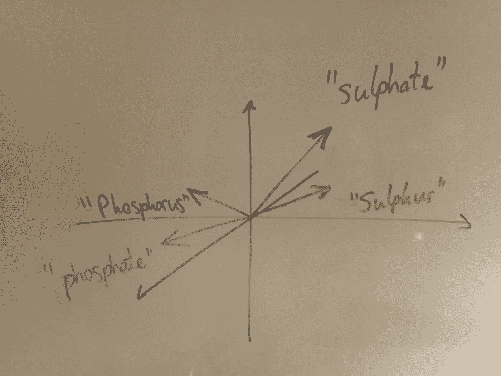

图 13

假设我们正在评估学生对化学的理解。如果我们有单词对列表，其中的单词在现实世界中与我们有某种重要的关系(如图 11 中的第一列)。如果我们从另一个(它们的向量)中减去一个，然后加上第三个，我们最终会得到这对中缺少的单词。在图 13 所示的例子中，我们有效表述的问题是:

*“硫酸盐”与“硫”的关系就像……与“磷”的关系一样。*

学生再次输入 X，程序会检查它是否在我们的目标词(“磷酸盐”)附近的单词列表中。

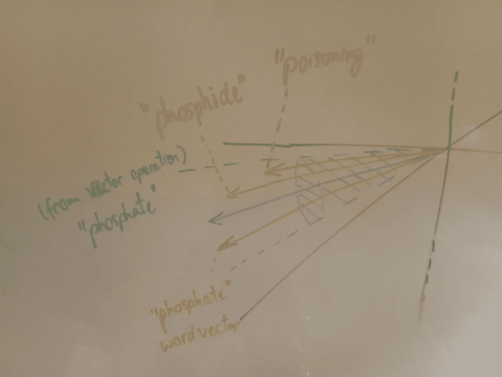

图 14

向量的局部区域可以想象为图 14，其中绿色向量是向量运算的数学结果，绿色圆锥是我们的答案词向量的可接受误差范围，橙色向量是出现的一些词。在这里，我们可以看到一些问题，因为“磷酸盐”伴随着“磷化物”(我们可以很容易地看出为什么会出现这种情况，尽管这应该是一个错误的答案)和“中毒”——因为“磷化物中毒”在我们的语料库中被提及。同样，这是一个问题，我们可以通过引入一个不同的语料库(一本化学教科书)来解决，这个语料库比维基百科更符合我们的学习目标。

在图 15 中，我再次重复了这种锻炼，但是这次是阳离子和阴离子，它们是带负电和正电的离子。电荷的类型(+/-)是阳离子和阴离子的*性质*。如果我取一个阳离子，在概念上用负电荷代替它的正电荷，根据定义，我会得到一个阴离子。

下面，我做了 vector(阳离子)— vector(正)+ vector(负)，我得到了 vector(阴离子)作为这个操作结果的邻居中最近的向量！同样令人惊奇的是，有了足够的计算和正确的语料库，现实世界中存在的*事物*的属性之间的关系可以用这种方式来表示。

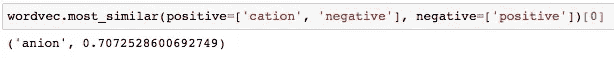

图 15

## 3.局限性/下一步

正如我提到的，这只是一个概念证明，我只是在玩这些想法。但是从原理上来看，我认为这是足够的理由来尝试实现一个完整的项目。

1.  语料库:对于任何教育背景，这将是一个包含被评估/教授内容的理想语料库。如果标准教科书有 pdf 或其他流行的机器可读格式，我会很高兴用它们来训练一个模型。
2.  语法:对于上面提到的所有问题类型，我们可以内置检查语法类型(名词、形容词、动词等)的功能，并使用它来过滤掉 word2vec 可能额外带来的许多无意义的答案。然而，这受到我们使用的任何代码的容量的限制(python 的 NLTK 可以通过词性标注来实现这一点，但不是 100%准确)。
3.  最大的限制:余弦相似性在我们的模型中最终是基于共现的。因此，它无法区分这样的句子

“女人吃西红柿。”从

“番茄吃女人。”以至

“西红柿是女人吃的”。

很难想象什么样的额外功能会产生对文本中因果因素的基本理解(词性标注和语法*可能是一个开始)，所以我们基本上被限制在余弦相似性上。然而，对于像我这样的 NLP 爱好者来说，这是一个激动人心的时刻，尤其是当工具如此容易获得的时候。*

参考书目:

1.  “向量空间中单词表示的有效估计”；[arXiv:1301.3781](https://arxiv.org/abs/1301.3781)；【https://arxiv.org/pdf/1301.3781.pdf 
2.  杰弗里·潘宁顿、理查德·索切尔和克里斯托弗·d·曼宁。2014.[手套:单词表示的全局向量](https://nlp.stanford.edu/pubs/glove.pdf)