# 基于 TenforFlow 2.0 和 Keras 的印度舞蹈形态识别

> 原文：<https://medium.com/analytics-vidhya/identification-of-indian-dance-form-using-tenforflow2-0-and-keras-4341b4c69526?source=collection_archive---------6----------------------->

## 图像分类，TensorFlow，OpenCV，Keras，印度舞蹈

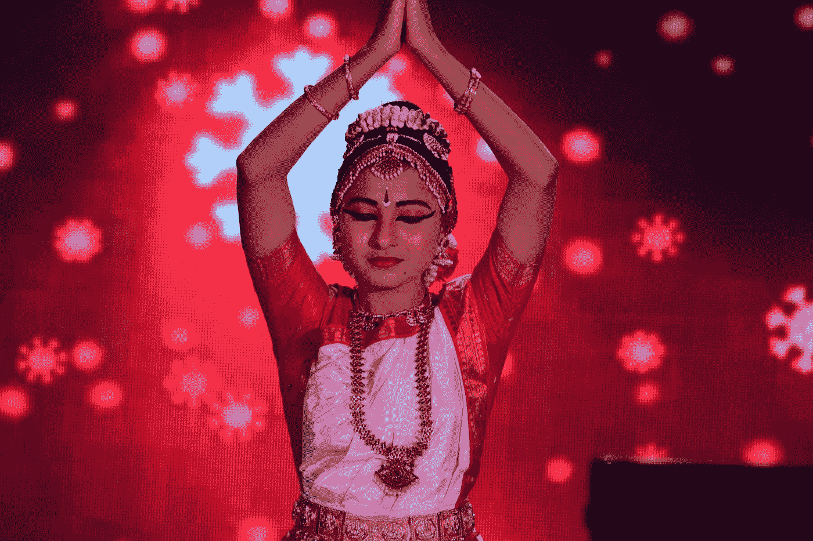

拉杰什·拉杰普特在 [Unsplash](https://unsplash.com/s/photos/indian-dance?utm_source=unsplash&utm_medium=referral&utm_content=creditCopyText) 上的照片

在这篇文章中，我将带你通过使用印度舞蹈形式数据的基本图像分类问题。我准备用 **CNN** (卷积神经网络)在***tensor flow 2.0****和 ***Keras*** 配合 ***转移学习*** 将图像分类成多类。在这篇文章中，我用迁移学习的概念对印度舞蹈形式进行分类。图像分类需要大量的训练数据来训练一个模型并取得好的结果。在我们的例子中，我们的训练数据量非常少，所以我们使用***tensor flow vgg 16***预训练 ***迁移学习*** 模型来获取其权重。本文的目的是给出如何使用迁移学习进行图像分类的基本思想。你可以从[这里](https://github.com/ubsingh9/Identify-the-dance-form)下载数据和完整代码。*

*数据集由 364 幅图像组成，分属 8 个类别，即*曼尼普尔、bharatanatyam、odissi、kathakali、kathak、sattriya、kuchipudi 和 mohiniyatam*。我们的任务是建立一个分类模型，自动标记图像并将它们分类到印度古典舞形式的不同类别中。*

*数据文件夹由两个文件夹和两个。csv 文件。这里我们的重点是训练数据并验证它们的结果。*

*具体如下:train:包含 8 个类的 364 个图像*

*   *曼尼普尔，*
*   *婆罗多舞*
*   *奥迪西*
*   *卡塔尔卡里*
*   *北印度舞*
*   *萨特里亚*
*   *库奇普迪*
*   *莫希尼亚塔姆*

*首先，在继续下一步之前，我们需要加载所有的库*

*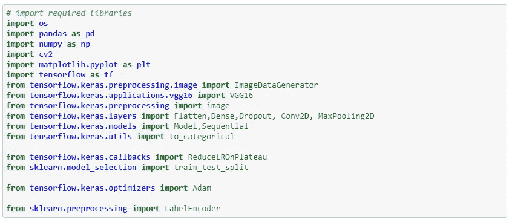*

*现在，我们加载数据集，该数据集包含训练数据集的图像名称和标签以及测试数据集的图像名称。我正在使用 *kaggle* 平台来执行我的代码，你可以使用你自己的位置。*

*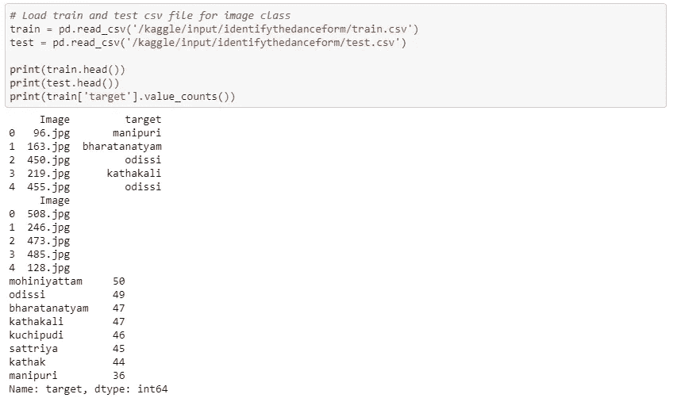*

*让我们使用直方图来绘制舞蹈形式，以检查图像分布*

*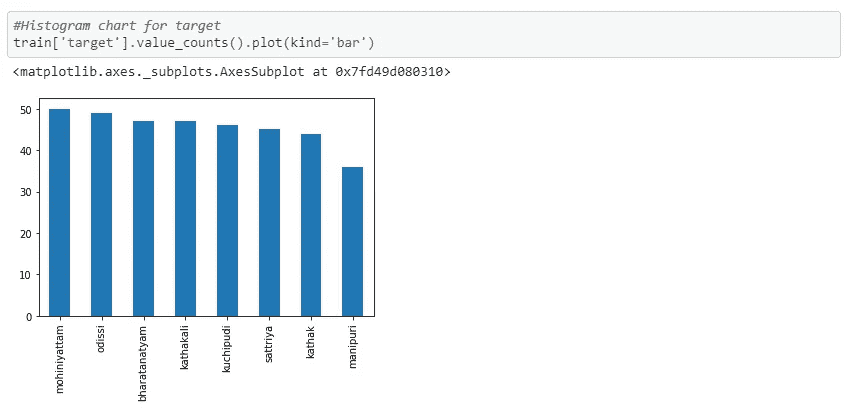*

*舞蹈类型的直方图*

*我们可以看到图像类别几乎是平均分布的，曼尼普尔*的最小图像是 36，*的最大图像是 50***

*是时候创建一个*工作目录*来将实际的图像从磁盘加载到内存中了。*

*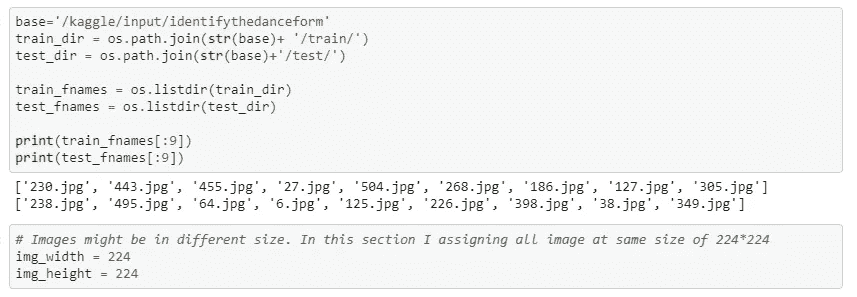*

*在指定了实际数据所在的路径后，我们需要两个辅助函数来读取图像数据并转换成数字格式。这里我使用 ***OpenCV*** 读取图像并转换成数字格式。我正在将所有图像加载到 224*224 像素。好的做法是将所有的图像加载到相同的大小。*

*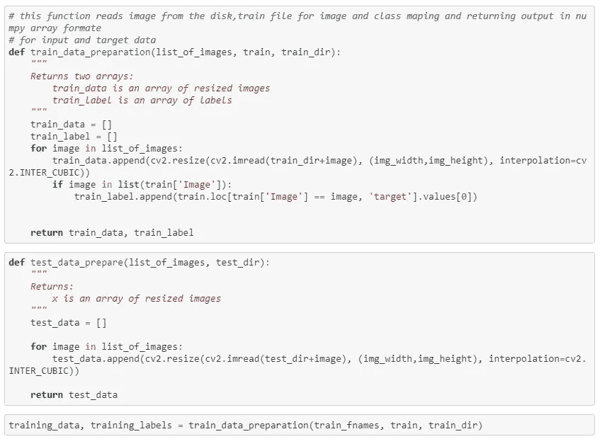**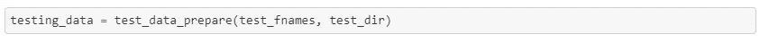*

*现在我们已经将图像加载到内存中，并转换成数字格式，让我们来看前 25 张图像。*

*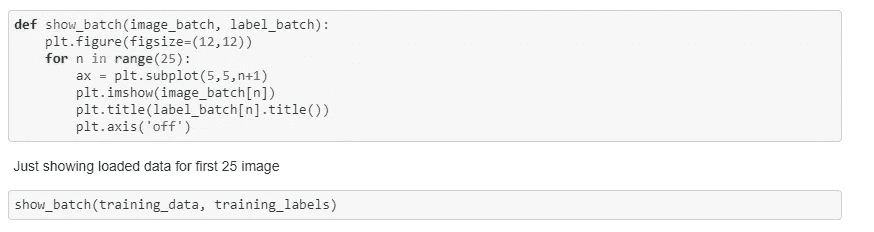**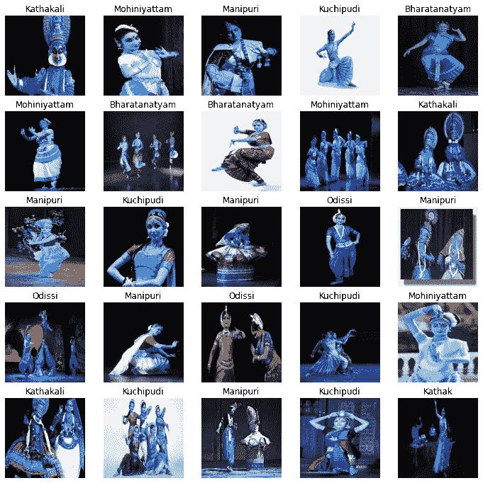*

*前 25 幅训练图像*

*从上面的图片中我们可以看到我们的目标变量是字符串格式的，为了建立模型，我们需要将字符串转换成对象变量。我们使用 *sklearn LebelEncode* r 将字符串转换成对象格式*

*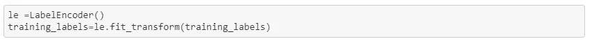*

*在建立深度学习模型之前，我们需要将数据分为训练集和验证集，以验证我们的模型性能。*

*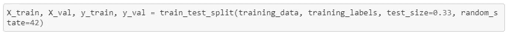*

*在模型建立之前的最后一步是应用"*图像* *增强"*来生成多个特征并避免模型的过度拟合。我们通过将所有值除以 255 来应用数值数据的重新缩放，以使所有值都在 0 到 1 之间。对于验证和测试数据集，我们仅使用重新缩放来防止我们的模型在看不见的数据上表现过度。*

*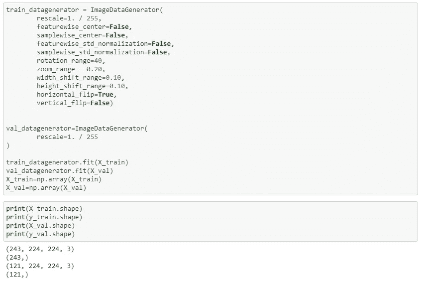*

*现在我们的数据已经可以进行训练了。是时候将预先训练好的迁移学习模型 ***VGG16*** 的权重使用到我们要求的格式中，并检查模型的摘要。*

*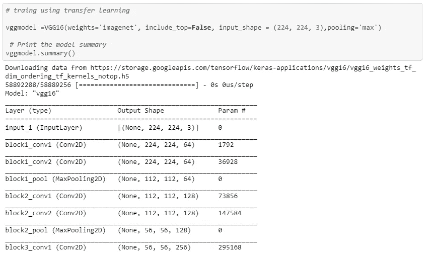**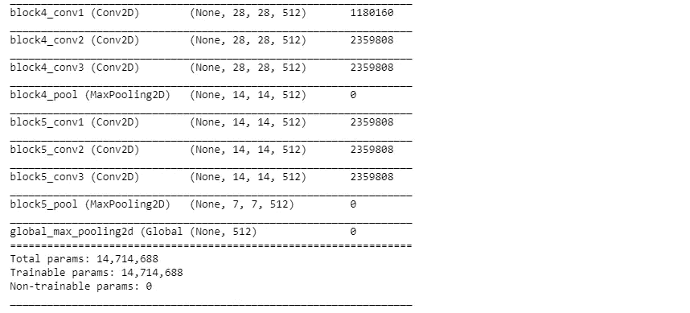*

*我们使用已经训练好的模型输出，构建两个连续的密集层，其中 *dropout =0.15* 以防止过度拟合。让我们编译模型并运行 30 个时期。*

*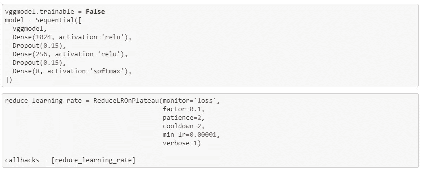**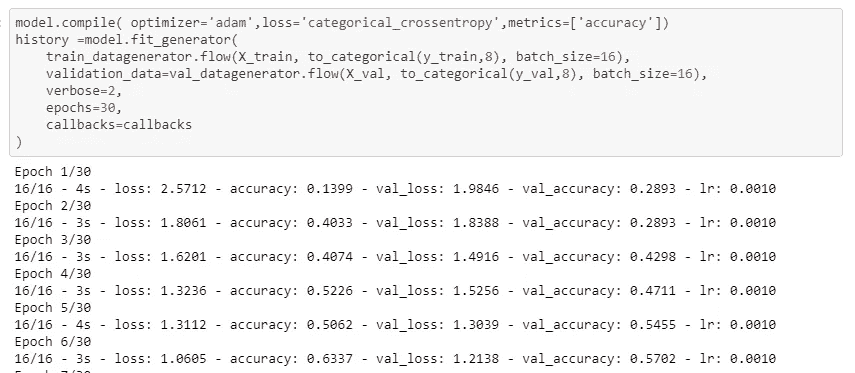**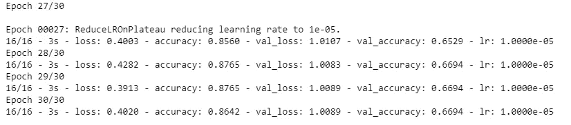*

*在 30 个历元之后，我们达到了 0.8642 的训练精度和 0.6694 的验证精度。让我们为每个时期的训练和验证数据集绘制准确性和损失图。*

*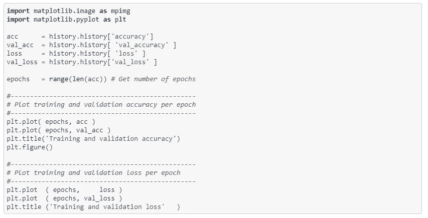**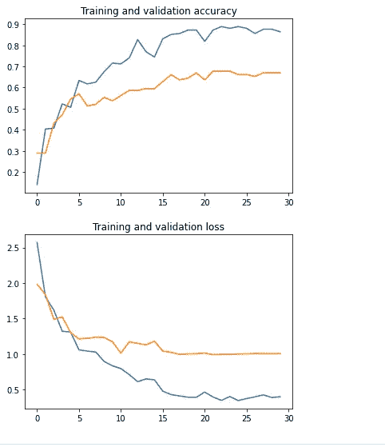*

*训练和验证集的准确度和损失图*

*从上图我们可以看到，前几个时期的训练和验证精度有所提高，但之后并没有太大的改善。*

## *结论*

*在这篇文章中，我们得到了如何使用 *openCV* 读取图像文件并应用迁移学习来训练图像数据的基本想法。*

*我希望这篇文章能让你在迁移学习的帮助下，用*和 ***keras*** 对印度舞蹈形式进行分类。**

****注:**本文使用的数据集取自此处的[和](https://www.hackerearth.com/challenges/competitive/hackerearth-deep-learning-challenge-identify-dance-form/)，用于学习目的。**

**谢谢**