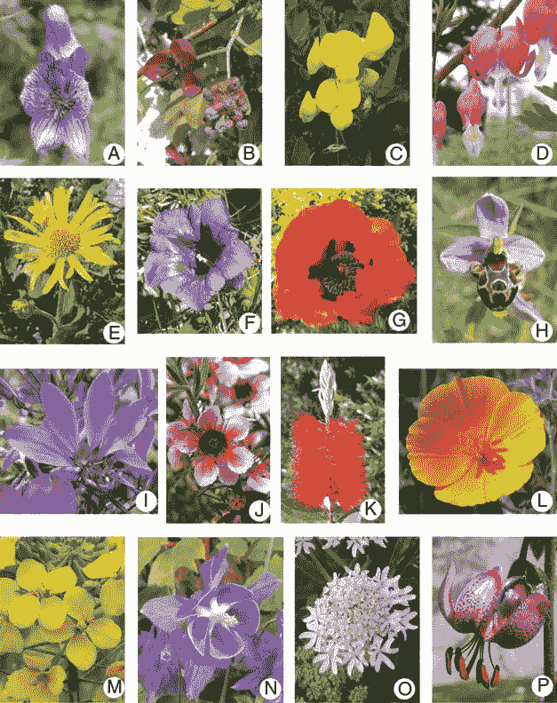

# 使用迁移学习识别花

> 原文：<https://medium.com/analytics-vidhya/identify-flowers-using-transfer-learning-b1cdf4e7c137?source=collection_archive---------16----------------------->

**什么是迁移学习？**

迁移学习是一种技术，它通过获取已经在相关任务中训练过的模型的一部分，并在新模型中重用它，来简化这一过程。

这里我用的是 google colab，它在浏览器中集成了 ram 和 GPU:)

**第一步:安装**