# 用 FastAI 从 MRI 图像中识别脑肿瘤和用 Neptune AI 进行度量跟踪

> 原文：<https://medium.com/analytics-vidhya/identifying-brain-tumor-from-mri-images-using-fastai-and-metrics-tracking-using-neptune-ai-71fbc56febba?source=collection_archive---------12----------------------->

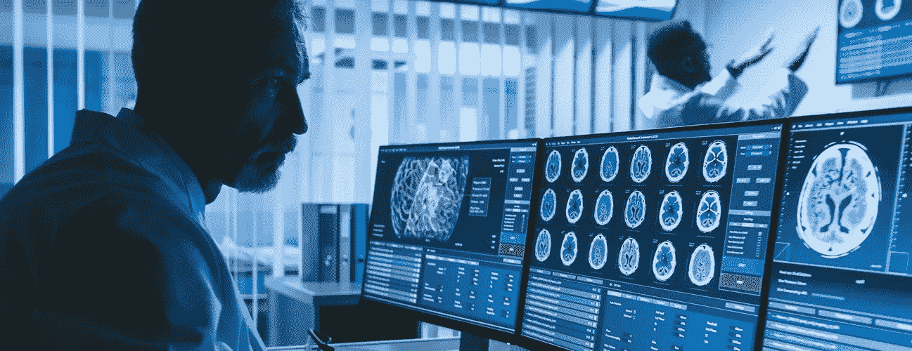

# 目标

本文的目的是探索使用 FastAI 的动态 UNet 架构从 MRI 图像中识别脑肿瘤，并在 Neptune AI logger 中记录各种损失参数，以对模型基超参数调整之间的性能进行比较分析。本文将详细探讨所使用的动态 UNet 架构和经典 UNet 架构的架构，还将探讨如何使用 Neptune AI 轻松、有序地跟踪各种损失矩阵，并在超参数调整后轻松比较各种模型性能。

# 模型描述

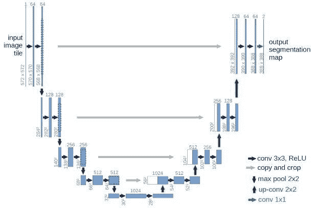

*UNet:解释经典模型架构*

U-Net 由 Olaf Ronneberger、Philipp Fischer、Thomas Brox 于 2015 年在论文《U-Net:生物医学图像分割的卷积网络》中创建。它是 FCN 的改进和发展:埃文·谢尔哈默，乔纳森·朗，特雷弗·达雷尔(2014)。“语义分割的全卷积网络”。

在生物医学图像任务中，不仅需要识别具有特定疾病的图像，还需要识别疑似疾病的区域。经典卷积神经网络将其任务集中在图像分类上，其中输入是图像，输出是一个标签，但是 UNet 能够识别可能患病的区域，它能够通过对每个像素进行分类来定位和区分边界，因此输入和输出共享相同的大小。

模型的名字来自于它的“U”形结构。左边部分称为收缩路径，由一般卷积过程构成；右边部分是扩展路径，它由转置的 2d 卷积层构成，基本上用作上采样过程。

*收缩路径*:遵循以下流程

卷积 _ 第 1 层->卷积 _ 第 2 层->最大池->丢弃(可选)

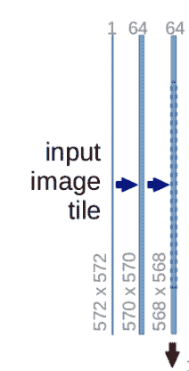

每个过程构成两个卷积层，通道数从 1 → 64 变化，因为卷积过程会增加图像的深度。向下的红色箭头是最大池化过程，它将图像大小减半。

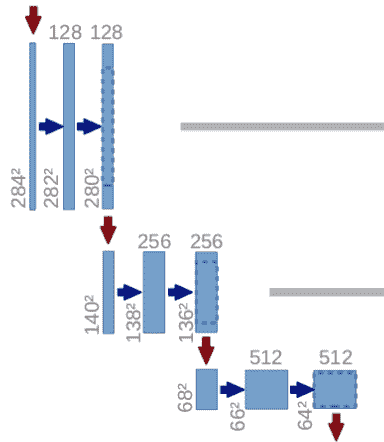

上述过程重复 3 次。

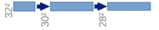

最后，在最底层构建第 2 层卷积层，但没有最大池。这时的图像已经调整到 28x28x1024。

*广阔的道路:*

在此过程中，图像将被放大到其原始大小。它遵循以下过程:

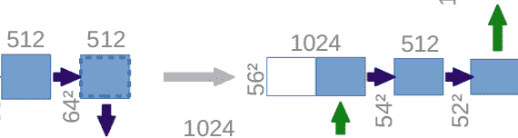

卷积 _ 2d _ 转置->连接->卷积 _ 层 1 ->卷积 _ 层 2

转置卷积是一种上采样技术，它通过填充原始图像，然后进行卷积运算来扩展图像的大小。在转置卷积之后，图像从 28×28×1024→56×56×512 被放大，然后，该图像与来自收缩路径的相应图像连接在一起，并且一起形成大小为 56×56×1024 的图像。这样做是为了组合来自先前层的信息，以便获得更精确的预测。

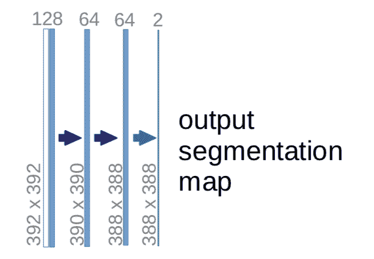

最后一步是对图像进行整形，以满足预测要求，因此最后一层卷积层具有 1 个大小为 1×1 的滤波器。

** *要详细了解转置卷积请查看这篇令人惊叹的文章:*[https://medium . com/activating-robotic-minds/up-sampling-with-Transposed-convolution-9 AE 4 F2 df 52d 0](/activating-robotic-minds/up-sampling-with-transposed-convolution-9ae4f2df52d0)

*动态 UNet 架构*

与经典 UNet 架构相比，动态 UNet 架构依赖于编码器-解码器结构。在我们的实现中，U-Net 将位于编码器(可以是预训练的模型)之上，最终输出为 n_classes。在初始化期间，它通过在模型中传递一个虚拟输入，使用钩子来确定中间特征尺寸，并自动创建向上的路径。因此，解码器部分(扩展路径)是基于编码器架构自动创建的。

*动态 UNet 实现*

1.模型实例化:在我们的实现中，编码器基本上是一个预训练的 ResNet34 模型:

```
learn = unet_learner(data, models.resnet34, metrics=dice, wd=1e-1, path='/kaggle/working')
```

上面的代码创建了一个 DynamicUNet 类的“learn”对象，编码器是一个预训练的 resnet34 模型。此外，对于评估度量，我们使用 DICE (Dice 系数是 2 *重叠面积除以两幅图像中的像素总数)。“wd”基本上是一个重量衰减参数，或者更普遍地称为 L2 正则化。这是减少过拟合的经典方法，包括将模型所有权重的平方和加到损失函数中。

2.找到最佳学习率:为了找到最佳学习率，我们从学习率范围测试开始。我们将使用 FastAI 的内置方法 lr_find()。

```
learn.lr_find()
```

这是受论文“超级收敛:使用大学习率快速训练神经网络”的启发链接:[https://arxiv.org/pdf/1708.07120.pdf](https://arxiv.org/pdf/1708.07120.pdf)

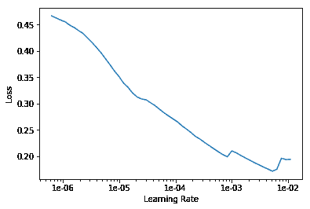

学习率(LR)范围测试的输出可以如下所示。观想给了我们损失和学习速度的概念。

3.训练模型:我们将使用 Leslie Smith 的 1cycle policy 训练网络(链接到论文:[https://arxiv.org/pdf/1803.09820.pdf](https://arxiv.org/pdf/1803.09820.pdf))。

为了使用这种方法，我们需要从上述方法中找到最佳学习率。在这种情况下，2e-03 到 8e-03 范围内的东西可以作为好的价值。因此，运行 5 个时期的 fit_cycle，并且学习速率(lr) = 5e-03，我们得到以下结果:

```
learn.fit_one_cycle(5, 5e-3)
learn.recorder.plot()
```

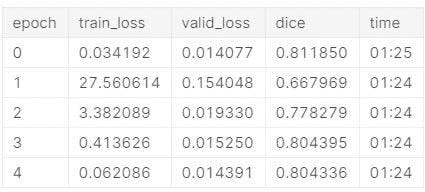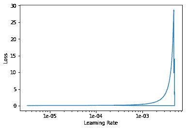

# 使用海王星人工智能记录器运行实验和度量跟踪

Neptune 是一个实验跟踪中心，为数据科学项目带来组织和协作。基本上它记录了整个实验过程。这非常有帮助，因为它有助于运行几个具有不同参数调整的实验，并比较模型的性能。

让我们看看如何为下面的项目设置一个 Neptune 监视器

1.安装所需的包:Neptune 工具需要以下包

```
!pip install neptune-contrib
!pip install neptune-contrib[monitoring]
```

2.设置 Neptune 监视器并创建一个实验:下面的代码创建了一个 Neptune 实验，它可以在模型训练期间记录各种度量

```
import neptune
from neptunecontrib.monitoring.fastai import NeptuneMonitorneptune.init('aninda/sandbox',
             api_token=secret_value_0)with neptune.create_experiment(name='FastAI_MRI_segmentation',params={'lr': 1e-2}):
    neptune.append_tag('First_logger')
    learn.callbacks.append(NeptuneMonitor())

    learn.fit_one_cycle(20, slice(2e-3))
```

由于这段代码是用 Kaggle 编写的，因此也分享了一种创建 API 令牌来保持 API 密钥秘密的方法:

```
from kaggle_secrets import UserSecretsClient
user_secrets = UserSecretsClient()
secret_value_0 = user_secrets.get_secret("api_token_neptune")
```

3.在海王星人工智能中可视化记录的实验

Neptune AI 提供了一个强大的 UI 来可视化所有的实验，并带有交互式图表来比较这些实验。

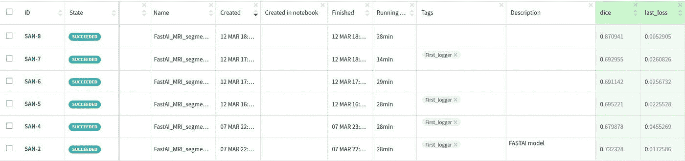

比较不同实验中各种损失指标的结果:

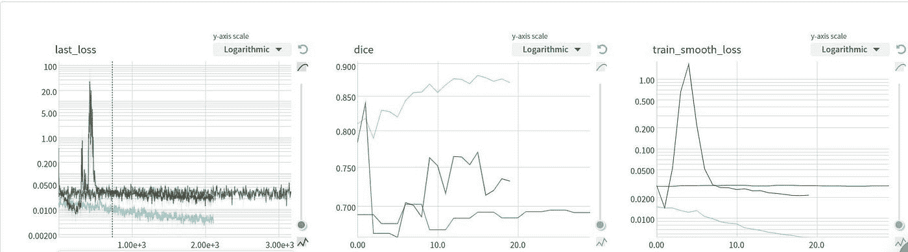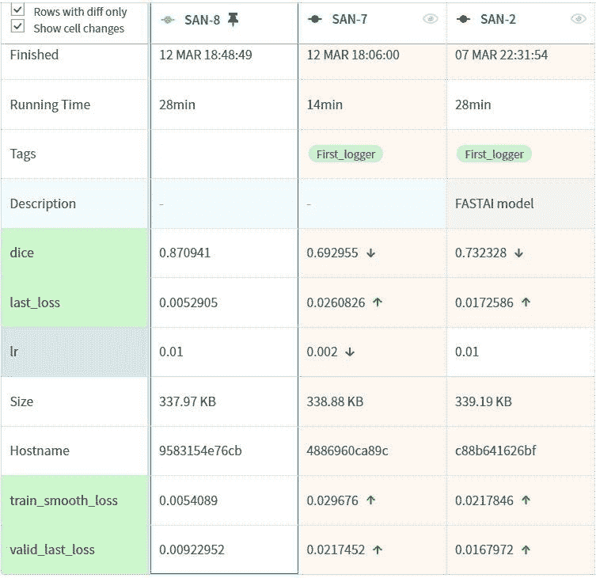

这些强大的工具有助于确定模型的正确参数，并加快数据科学项目的实验阶段。

# 保存模型并可视化预测结果

使用以下代码保存训练好的模型:

```
def save_and_show(name):
    saved_to = learn.save(name, return_path=True)
    print('Saved to', saved_to, 'Note: this will be lost unless we commit the kernel')
    learn.load(name) # free memory etc

    learn.show_results(rows=8, figsize=(32, 32))
```

调用方法

```
save_and_show('stage-1')
```

结果(实际情况与预测情况):

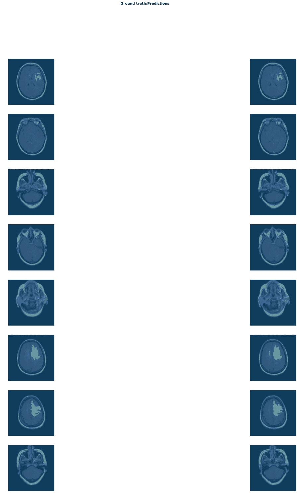

由此可见，该模型在识别肿瘤感染区域方面表现得相当好。

# 链接到代码库

*Github:*T4【https://Github . com/conformist 101/brain MRI _ Scan _ FastAI _ segmentation

Kaggle 内核:[https://www . ka ggle . com/anindabhattacharjee/fastai-MRI-segmentation-with-Neptune ai-logging](https://www.kaggle.com/anindabhattacharjee/fastai-mri-segmentation-with-neptuneai-logging)

数据集:[https://www.kaggle.com/mateuszbuda/lgg-mri-segmentation](https://www.kaggle.com/mateuszbuda/lgg-mri-segmentation)(作者:[马特乌斯·布达](https://www.kaggle.com/mateuszbuda))