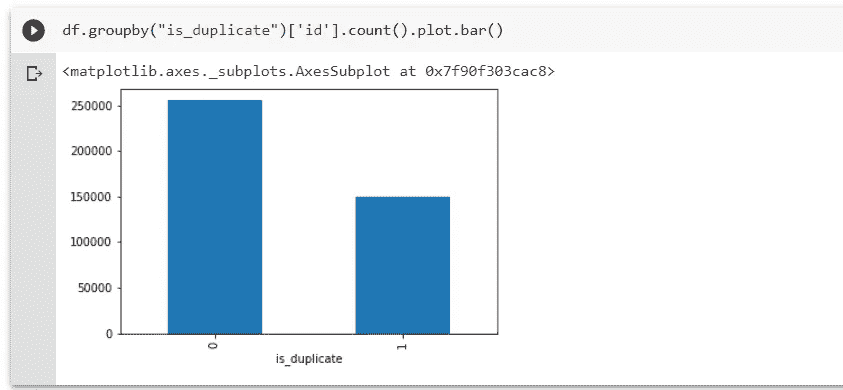
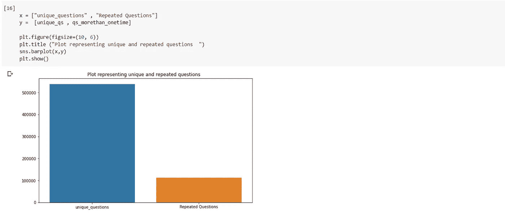
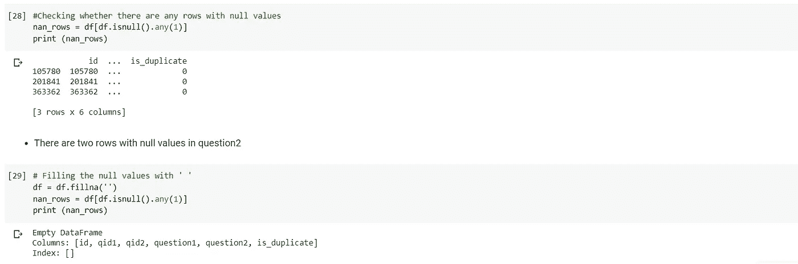

# 用源代码识别 Quora 上的重复问题

> 原文：<https://medium.com/analytics-vidhya/identifying-duplicate-questions-on-quora-with-source-code-50ee0e2c915c?source=collection_archive---------16----------------------->

介绍

我们都知道，quora 是 Quora 上最大的问答平台之一，每天都有数百万人在问问题，这是一个提问和联系提供独特见解和高质量答案的人的平台。这使人们能够相互学习，更好地了解世界。本案例研究摘自 Kaggle 竞赛

***问题陈述:***

问题陈述是为了确定 quora 上问的哪个问题是已经问过的问题的重复。这对于立即提供已经回答的问题的答案可能很有用。本案例研究的主要目的是预测一对问题是否重复。使用不同的机器学习技术

***数据集概述:***

数据集以 CSV 文件序列的形式给出。csv 文件包含 5 列:qid1、qid2、question1、question2、is_duplicate 或 not，数据集总大小为 60MB，train.csv 是数据集的 404290、[链接](https://www.kaggle.com/c/quora-question-pairs/data)

样本数据集

步骤 1:探索性数据分析

在理解了问题陈述和数据集之后，让我们开始对数据集进行一些基本的分析。数据集分析的第一步是了解数据的样子和数据集的分布，并找出缺失的值(如果存在的话)。我们将使用不同的库，如 numpy pandas 等。探索和理解数据集

库和模块

第一步是使用 pandas 读取数据集，以读取 CSV 文件

读取数据集后，数据点的数量为 404290，之后使用函数 ***df.info()*** 查找关于数据集的信息，在给定的数据集中，问题 2 部分有一个缺失值

这里我们给出了最少数量的数据字段，包括:

*   id:看起来像一个简单的 rowID
*   qid{1，2}:问题对中每个问题的唯一 id
*   问题{1，2}:问题的实际文本内容。
*   is_duplicate:我们试图预测的标签—这两个问题是否彼此重复。

让我们找出数据点在输出类中的分布

有两类 0 级和 1 级，0 级多于 1 级分布

要使用此代码找到数据集的确切比率

所以有 63.08%的问题是属于 is_duplicate = 0，而 36.92%的问题属于 is_duplicate =1

找到这个之后，下一步是找到唯一问题的数量以及重复出现的唯一问题的数量以及单个问题重复出现的最大次数，代码如下

唯一问题总数为:537933 出现一次以上的唯一问题数为:111780 (20.77953945937505%)单个问题的最大重复次数为:157 次

让我们把它画出来，看看分布

在图表中，你可以看到独特的问题比重复的问题更多。

接下来是检查任何一对重复的问题

数据集中没有重复值

检查空值并用适当的值填充它用空格填充空值，因为问题 2 中只有两个空值

填充完成后，nan 值允许执行总和特征提取，并在数据集中创建一些附加特征，以确定它们在绘图中的重要性

现在，让我们构建一些功能，如:

*   **freq _ qid1**= qid 1 的频率(qid 1 中问题的数量)
*   **freq _ qid2**= qid 2 的频率(qid 2 中问题的数量)
*   **Q1 len**= Q1 的长度。(问题 1 的长度)
*   **q2len**= Q2 的长度。(问题 2 的长度)
*   **q1_n_words** =问题 1 的字数
*   **q2_n_words** =问题 2 的字数
*   **word_Common** =(问题 1 和问题 2 中常见的唯一单词数)
*   **word_Total** =(问题 1 总字数+问题 2 总字数)
*   **word _ share**=(word _ common)/(word _ Total)
*   **freq _ Q1+freq _ Q2**= qid 1 和 qid2 的频率总和
*   **freq _ Q1-freq _ Q2**= qid 1 和 qid2 的绝对频率差

要创建这些功能，需要一个代码

在创建这些特征之后，当我们分析这些特征时，分析一些提取的特征，当我们看到图形表示时，我们能够发现 word_share 特征非常重要

之后，我们将执行文本特征的高级预处理，这在我们正在执行的第二本 ipython 笔记本中给出

预处理:

*   删除 HTML 标签
*   删除标点符号
*   执行词干分析
*   删除停用词
*   扩张收缩等。

我们还执行一些高级特征提取(自然语言处理和模糊特征)

[关于模糊特征的更多信息](https://github.com/seatgeek/fuzzywuzzy#usage)

我们正在创建一些功能，如:

*   **令牌**:分割句子空间得到一个令牌
*   **停止字**:根据 NLTK 的停止字。
*   **字**:不是停止字的记号

特点:

*   **CWC _ min**:Q1 和 Q2 常用字数与最小字数之比
    cwc_min =常用字数/ (min(len(q1_words)，len(q2_words))
*   **CWC _ max**:Q1 和 Q2 常用字数与最大字数长度之比
    cwc_max =常用字数/ (max(len(q1_words)，len(q2_words))
*   **CSC _ min**:common _ stop _ count 与 Q1 和 Q2 停车计数的最小长度之比
    CSC _ min = common _ stop _ count/(min(len(Q1 _ stops)，len(q2_stops))
*   **CSC _ max**:common _ stop _ count 与 Q1 和 Q2 停车次数最大长度的比值
    CSC _ max = common _ stop _ count/(max(len(Q1 _ stops)，len(q2_stops))
*   **CTC _ min**:common _ token _ count 与 Q1 和 Q2 令牌计数的最小长度之比
    CTC _ min = common _ token _ count/(min(len(Q1 _ tokens)，len(q2_tokens))
*   **CTC _ max**:common _ token _ count 与 Q1 和 Q2 令牌计数最大长度之比
    CTC _ max = common _ token _ count/(max(len(Q1 _ tokens)，len(q2_tokens))
*   **last_word_eq** :检查两个问题的首字是否相等
    last _ word _ eq = int(Q1 _ tokens[-1]= = Q2 _ tokens[-1])
*   **first_word_eq** :检查两个问题的首字是否相等
    First _ word _ eq = int(Q1 _ tokens[0]= = Q2 _ tokens[0])
*   **abs_len_diff** : Abs。长度差
    ABS _ len _ diff = ABS(len(Q1 _ tokens)—len(Q2 _ tokens))
*   **mean_len** :两个问题的平均令牌长度
    mean _ len =(len(Q1 _ tokens)+len(Q2 _ tokens))/2

我们还创建了一些基于特征文本数据的 TF-IDF 加权词向量

*   找到 TF-IDF 分数后，我们通过这些分数将每个问题转换为 word2vec 向量的加权平均值。
*   在这里，我们使用一个预先训练好的手套模型，它是免费的。[https://spacy.io/usage/vectors-similarity](https://spacy.io/usage/vectors-similarity)
*   它是在维基百科上训练的，因此，它在单词语义方面更强。

最后，我们将最终特征数据集保存在 finalfeatures.csv 文件中，在此基础上，我们将应用机器学习算法。最终数据集包含 5 行和 794 列。之后，我们在 SQL 数据库中读取该数据，并在应用任何模型之前将所有特征转换为数字

数据集将执行随机列车测试分割(70:30)

在这种情况下，我们应用了不同的 ML 技术来检查模型的准确性。首先，我们使用超参数调整执行了逻辑回归，然后使用超参数调整执行了线性 SVM，还使用逻辑回归检查了超参数调整

在使用 L2 正则化的逻辑回归中，我们获得了 0.52 的对数损失，在线性 SVM 中，我们获得了 0.489 的对数损失输出，这优于逻辑回归，最后，我们尝试了没有超参数调整的 GBTD，在对数损失方面，我们获得了 0.357 的输出，这优于前两种算法

记录这一切的笔记本给了

1.  [IPYTHON 笔记本 1 点击此处](https://github.com/khanakbar145/Qura-Project-/blob/master/1_Quora_Notebook1.ipynb)
2.  [IPYTHON 笔记本 2 点击这里](https://github.com/khanakbar145/Qura-Project-/blob/master/2_QuoraNotebook2.ipynb)
3.  [IPYTHON 笔记本 3 点击这里](https://github.com/khanakbar145/Qura-Project-/blob/master/3_Qura_Notebook3ipynb.ipynb)
4.  [IPYTHON 笔记本 4 点击这里](https://github.com/khanakbar145/Qura-Project-/blob/master/4_Qura_Notebook4.ipynb)

有用的链接

1.  [源代码](https://www.kaggle.com/c/quora-question-pairs)
2.  [与深度学习匹配的语义问题](https://engineering.quora.com/Semantic-Question-Matching-with-Deep-Learning)
3.  [识别 Quora 上的重复问题| ka ggle 上的前 12%！](https://towardsdatascience.com/identifying-duplicate-questions-on-quora-top-12-on-kaggle-4c1cf93f1c30)

***我希望你喜欢这篇文章，如果你喜欢，请鼓掌，我希望这对你有帮助***

你可以在上关注我

领英:[https://www.linkedin.com/in/khan-akbar-b07b7218b/](https://www.linkedin.com/in/khan-akbar-b07b7218b/)

github:[https://github.com/khanakbar145](https://github.com/khanakbar145)

谢谢你的阅读！