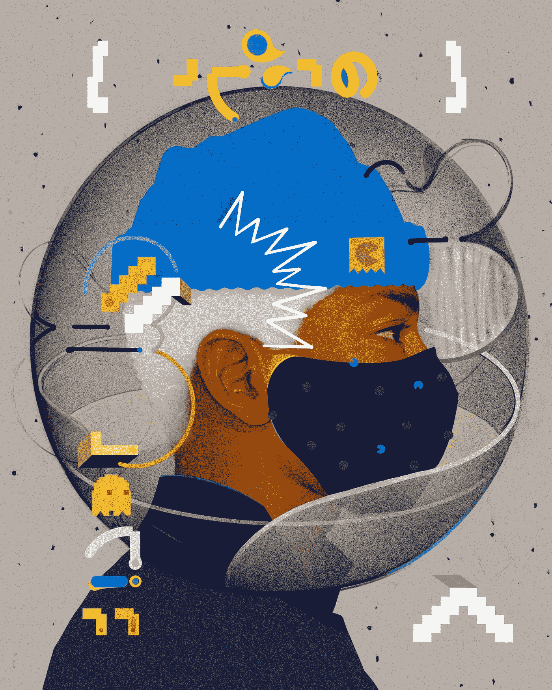
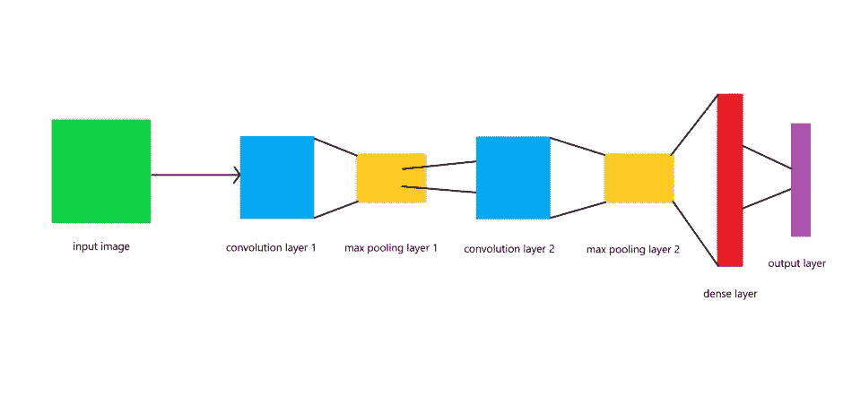
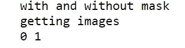
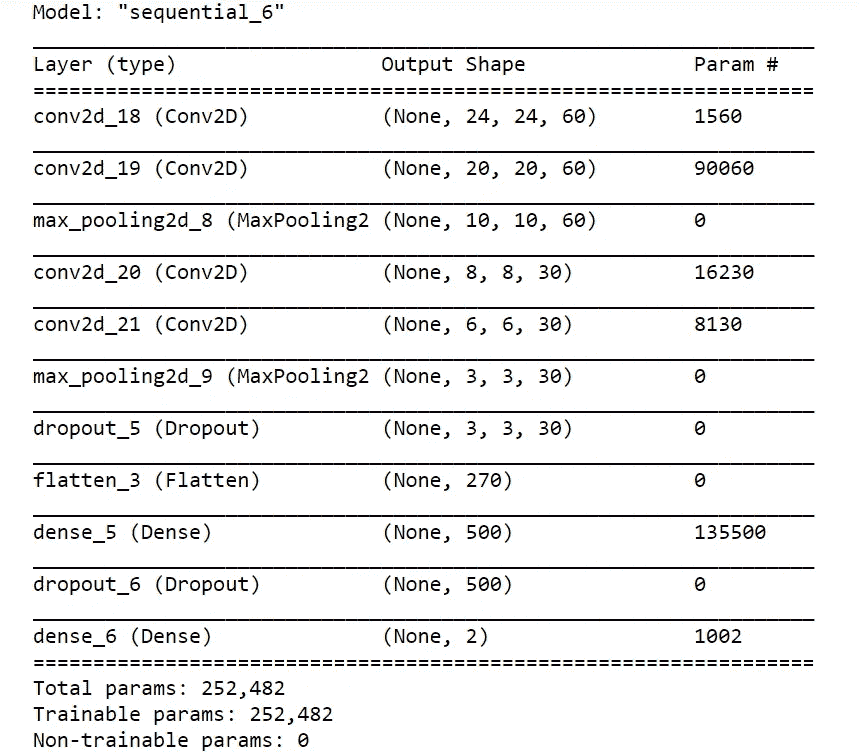
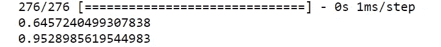
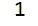

# 使用深度学习的人脸面具检测。

> 原文：<https://medium.com/analytics-vidhya/identifying-face-masks-using-cnn-b1991d74800?source=collection_archive---------13----------------------->



照片由[联合国新冠肺炎回应](https://unsplash.com/@unitednations?utm_source=medium&utm_medium=referral)在 [Unsplash](https://unsplash.com?utm_source=medium&utm_medium=referral)

看到整个世界的新冠肺炎局势，保持我们自己和我们家人的健康和安全变得非常重要，因为到今天为止还没有疫苗可用。能让我们保持一步之遥的基本装备就是使用口罩。所以我一直想为此做点什么。

所以我决定使用深度学习概念来检查一个人是否戴着面罩，或者是否使用 CNN。

**什么是 CNN？**

卷积神经网络(CNN)是一种特殊类型的神经网络，能够处理图像并基于它们的类别区分它们。它们类似于人眼感知图像的方式，并将数据传回我们的大脑，即视觉皮层。要了解更多细节，你可以在网上搜索，也可以查看这个[帖子](https://towardsdatascience.com/a-comprehensive-guide-to-convolutional-neural-networks-the-eli5-way-3bd2b1164a53#:~:text=A%20Convolutional%20Neural%20Network%20(ConvNet,differentiate%20one%20from%20the%20other.)。



CNN 的基本架构

假设你对让我们开始吧有了基本的概念！

**让我们从导入库和图像开始**。

```
import os
import cv2
import numpy as np
from sklearn.model_selection import train_test_split
from keras.models import Sequential
from keras.utils import to_categorical
from keras.layers import MaxPooling2D,Convolution2D,Dense,Dropout,Flatten,Input
import pickle
import pandas as pd
from keras.preprocessing.image import ImageDataGenerator
%matplotlib inline
import matplotlib.pyplot as plt
```

现在我们将逐个导入图像，并根据您下载数据集的位置设置路径。

```
path="dataset"
count=0
dir=os.listdir(path)
imgs=[]
count=0
classno=[]print("with and without mask")
nosf=len(dir)
print("getting images")for x in range(0,nosf):
    mypics=os.listdir(path+"/"+str(count))
    for y in mypics:
        curimg = cv2.imread(path+"/"+str(count)+"/"+y)
        imgs.append(curimg)
        classno.append(count)
    print(count,end=" ")
    count+=1
print(" ")imgnp=np.array(imgs)
clsnp=np.array(classno)
```

运行该部分后，输出如下:



现在，我们将拆分数据用于培训测试和验证。

```
x_train, x_test, y_train, y_test = train_test_split(imgnp,clsnp,test_size=0.2)
x_train, x_valid, y_train, y_valid = train_test_split(x_train,y_train,test_size=0.2)
```

分割数据后，我们将对其进行预处理，以获得正确的格式。

```
def processing(img):
    img = cv2.resize(img,(28,28))
    img = cv2.cvtColor(img,cv2.COLOR_BGR2GRAY)
    img = cv2.equalizeHist(img)
    img = img/255
    return imgx_train = np.array(list(map(processing,x_train)))
x_test = np.array(list(map(processing,x_test)))
x_valid = np.array(list(map(processing,x_valid)))
```

现在，我们将重塑图像添加深度 1。

```
x_train=x_train.reshape(880,28,28,1)
x_test=x_test.reshape(276,28,28,1)
x_valid=x_valid.reshape(220,28,28,1)
```

在此之后，我们将增加我们的数据，这将提供更好的结果。

```
datagen = ImageDataGenerator(width_shift_range=0.1,
                            height_shift_range=0.1,
                            zoom_range=0.2,
                            shear_range=0.1,
                            rotation_range=10)
datagen.fit(x_train)batch = datagen.flow(x_train,y_train,batch_size=20)
x_batch, y_batch = next(batch)
```

现在我们将标签数据转换成分类数据。

```
y_train = to_categorical(y_train)
y_test = to_categorical(y_test)
y_valid = to_categorical(y_valid)
```

接下来，让我们建立我们的模型！

```
def mymod():

    model = Sequential()

    model.add(Convolution2D(60,(5,5),activation='relu',input_shape=(28,28,1)))
    model.add(Convolution2D(60,(5,5),activation='relu'))
    model.add(MaxPooling2D(2,2))

    model.add(Convolution2D(30,(3,3),activation='relu'))
    model.add(Convolution2D(30,(3,3),activation='relu'))
    model.add(MaxPooling2D(2,2))
    model.add(Dropout(0.5))

    model.add(Flatten())
    model.add(Dense(500,activation='relu'))
    model.add(Dropout(0.5))
    model.add(Dense(2,activation='softmax'))

    model.compile(optimizer='adam',loss='categorical_crossentropy',metrics=['accuracy'])
    return model
```

请注意，这里我使用了分类损失，尽管这是一个二元分类，所以您也可以使用“二元交叉熵”。

这是我们模型的总结

```
mod = mymod()
print(mod.summary())
```



现在，我们将开始训练我们的模型。此外，如果你使用的是 GPU，那么训练时间将大大减少。

```
history = mod.fit_generator(datagen.flow(x_train,y_train,batch_size=50),
                             steps_per_epoch=880,
                             epochs=11,
                             validation_data=(x_valid,y_valid),
                             shuffle=1)
```

这将需要一些时间来训练，所以坐好，放松！

一旦训练完成，让我们检查结果。

```
score = mod.evaluate(x_test,y_test)
print(score[0])
print(score[1])
```



从结果来看，损失偏高，您可以播放和调整代码以获得更好的结果。还有一点需要注意的是，数据集中的图像非常有限，这也会影响准确性，并且模型也可能过度拟合，因此请谨慎选择参数。但它仍然有效！。

接下来，我们将保存我们的模型。

```
pik = open("ready.p","wb")
pickle.dump(mod,pik)
pik.close()
cv2.waitKey(0)
```

最后，让我们做一些预测，并交叉检查。

```
y_pred=mod.predict(x_test)
```

我们将从测试集中随机选择一个图像进行比较。

```
plt.matshow(x_test[0].reshape(28,28))
```

结果为 1，这是正确的，因为非屏蔽索引为 0，屏蔽索引为 1。



总结我们到目前为止所做的一切。

因此，我们用这种方法建立了 CNN 模型，它可以识别面具是否被戴上，同样，这个模型并不是最准确的，正如我之前所说的，因为可用的数据较少，如果你有更多的图像，那么你可以将它添加到文件夹中并再次训练，但仍然值得一试！。此外，您可以使用超参数调谐来获得更好的精度，并减少损失。我还建立了一个驱动代码，它将从网络摄像头捕捉视频，并预测面具是否存在，这是在 open-cv 的帮助下完成的。你可以从我的 [GitHub](https://github.com/patrickn699/Face-Mask-Detection.git) 获得源代码。希望这篇文章能帮助你了解 CNN 识别口罩，感谢你花时间阅读，谢谢。