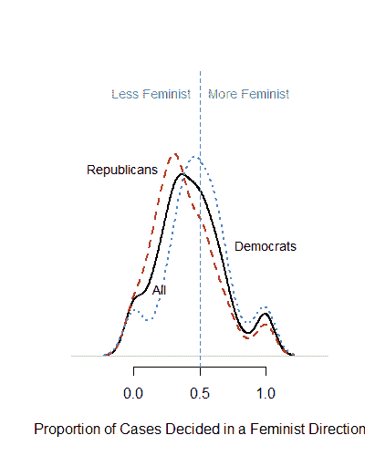

# 识别司法同理心:生女儿会导致法官裁决女性问题吗？

> 原文：<https://medium.com/analytics-vidhya/identifying-judicial-empathy-does-having-daughters-cause-judges-to-rule-for-womens-issues-6d50c3b0eed0?source=collection_archive---------1----------------------->

**备忘录**

**至:**大法官克拉伦斯·托马斯

**出自:**曼德兰科斯·西班达

**CC:** Wendy Long *(文员)*

**日期:**2018 年 4 月 19 日

**主题:**识别司法同理心:有女儿会导致法官裁决女性问题吗？

**总结**

这份备忘录是对 Glynn 和 Sen(2014 年)发表的题为*识别司法共情:有女儿会导致法官裁决妇女问题吗？*。在复制了他们的分析并运行匹配算法后，我可以坚定地证明他们研究的有效性。

**随机化**

格林和森(2014)认为，他们的数据符合自然准实验的标准，因为当一个家庭决定要一个孩子时，孩子的性别不在父母的控制范围内。这意味着他们的数据不受党派或意识形态等其他个人特征的影响(Glynn 和 Sen，2014)。正因为如此，法官和生男孩或女孩之间的关系是外生的，这也使得格林和森(2014)“量化了个人关系对决策的因果影响。”如果这些单位如他们所声称的那样被适当地随机化，我们将期望在治疗和对照组的所有观察和未观察的协变量中看到相似的分布。我们可以通过绘制对照组和治疗组的任何协变量的直方图来检查这一点。对于协变量“女孩”和“孩子”,它们对应的图表如下图 1 所示。

*图 1:治疗组和对照组的儿童和女童协变量直方图*

**使用的代码**

图 1 展示了分布的相似性，因此证明了 Glynn 和 Sen(2014 年)假设的随机性。

**方法复制和分析**

图 2 显示了 Glynn 和 Sen(2014 年)绘制的图表，该图表显示民主党法官比共和党法官以更女权主义的方式投票。

*图 2:显示以女权主义方向裁决的案件比例的图表。比较民主党和共和党法官*

我更进一步，画出了“没有女孩”的法官和“有女孩”的法官所做决定的图表图 3 显示，有女儿的法官比没有女儿的法官以更女权主义的方式投票。

*图 3:显示以女权主义方向裁决的案件比例的图表。比较有女儿和没有女儿的法官*

**使用的代码**

**治疗效果及匹配**

治疗组有一个女儿，对照组是没有女儿的法官。

我用治疗组减去对照组的平均值得到 0.4733 来计算治疗效果。这意味着，有一个女儿使法官的决定向更加女权主义的方向移动了 47.3%。然后，我使用简单的线性回归计算了这个估计值的 95%置信区间，得到 0.356；0.4576.然而，这一结果的 p 值为 0.187，因为它高于 0.05，所以在统计上不显著。

**使用的代码**

为了执行匹配，我必须将 girls 变量更改为 1 和 0 的逻辑变量，然后将其作为“girls_A”附加到主数据中。

**使用的代码**

然后，我使用倾向评分匹配产生一个 0.36 的估计治疗效果，95%的置信度在 0.34 和 0.37 之间。p 值也非常小(6.596e-12)，这使得结果具有统计学意义。我还运行了一个多变量匹配程序，给出了 0.36 的治疗效果和 0.34 的 95%置信区间；0.38.p 值也小于 0.05。然后，我通过对多变量进行基因匹配得出结论，其治疗效果为 0.36，95%置信区间为 0.34；0.38.

**使用的代码**

**结论**

通过使用不同的匹配程序计算的治疗效果都是阳性的，并且具有非常小的范围(置信区间)和小的 p 值。因此，这表明 Glynn 和 Sen(2014 年)使用的数据和运行的模型在统计上是准确的，从而使他们的结论具有重要意义。

完整代码可用 [***此处***](https://gist.github.com/MandlaSibanda196/ca6c2ddcef84e67c65d0462bd5ecb8d9) :