# 使用卷积神经网络识别淋巴结切片的组织病理学切片中的转移性肿瘤

> 原文：<https://medium.com/analytics-vidhya/identifying-metastatic-tumors-in-histopathology-slides-of-lymphatic-node-sections-using-81d8c64b12bd?source=collection_archive---------33----------------------->

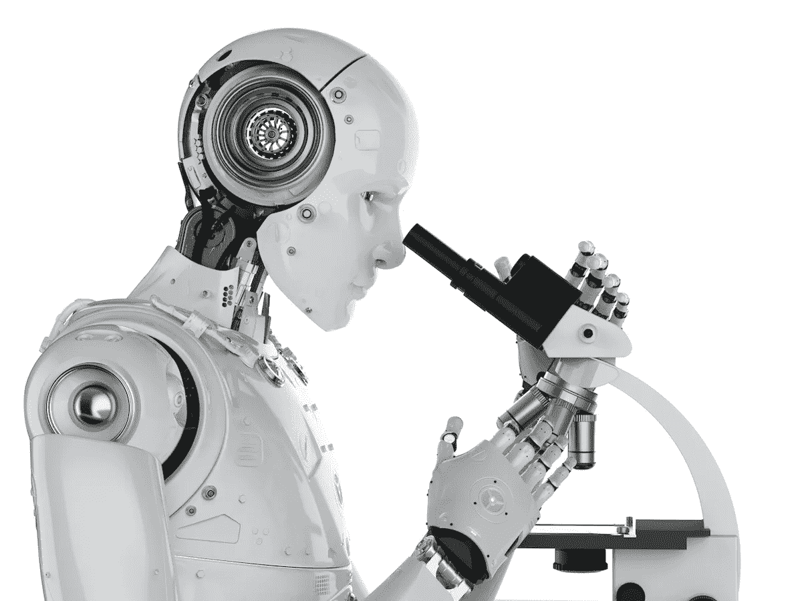

人工智能

# 介绍

转移是癌细胞扩散到身体的新区域，通常通过淋巴系统或血流。转移性癌症或转移性肿瘤是指从原发部位或其起始部位扩散到身体不同区域的癌症。

为了在组织病理学切片中识别转移性肿瘤，进行活检以从身体的受影响部位取出组织样本。然后，病理学家在显微镜下检查组织样本，并决定其中是否存在转移性肿瘤。如果存在转移性肿瘤，病理学家进行进一步的调查，以确定肿瘤的致命程度以及应将其划分为何种转移级别。这必须手动完成，并且是一个耗时的过程。此外，决定取决于病理学家的专业知识和显微镜的使用效率。

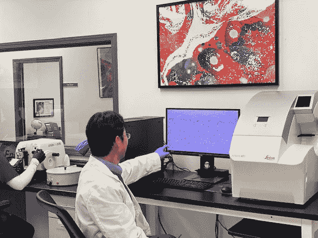

图片来源: [Enso 的发现](https://ensodiscoveries.com/2020/03/our-new-histopathology-laboratory-for-veterinary-industry-and-cros/)

因此，深度学习中的先进技术，如卷积神经网络，可以在自动检测，定位和分级身体病变组织中的肿瘤方面有很大的帮助。为了充分发挥这些技术的潜力，人们可以使用经过委员会认证的病理学家评估的大量组织病理学数据来建立管道，并在其上训练卷积神经网络的集合。

# 目标

本研究的目的是建立一个转移性肿瘤分类系统，该系统可以判断人体淋巴结切片的 96×96 像素组织病理学切片的中心 32×32 像素区域是否存在转移性肿瘤。

# 资料组

本研究中使用的训练数据集是[patchcamelion 数据集](https://arxiv.org/abs/1806.03962) [1]的子集，该数据集包含从身体淋巴结切片的组织病理学切片中提取的 220，025 幅 96×96 像素的彩色图像。每个图像被分配一个正标签或负标签。

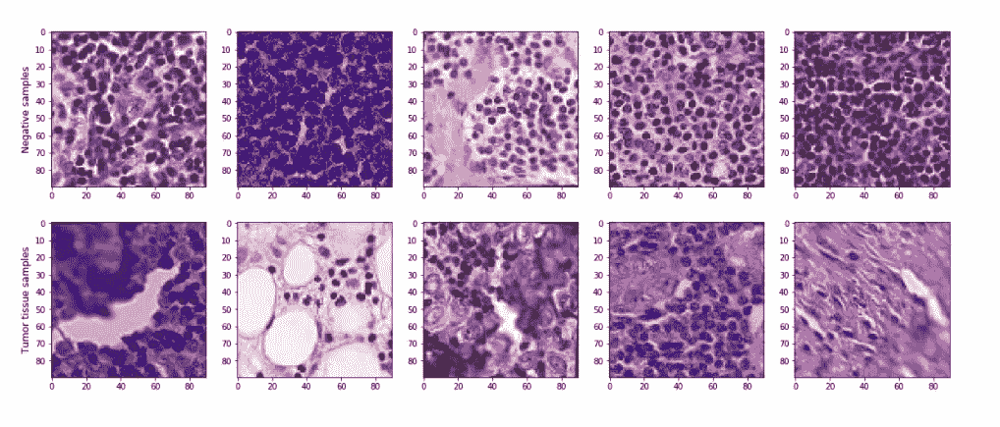

图像样本

阳性标签表示载玻片的中心 32×32 像素区域至少包含转移性肿瘤；该区域以外区域的肿瘤不影响标记。

# 方法

## A.图像预处理

作为第一步，我删除低最大像素强度(几乎全黑)和高最小像素强度(几乎全白)的图像。这是通过分别设置 10 像素和 245 像素的阈值，并将最大像素值小于 10 像素的图像分类为*几乎全黑*，将最小像素值大于 245 像素的图像分类为*几乎全白*。共有 6 幅图像属于*几乎全白*类，只有 1 幅图像属于*几乎全黑*类。

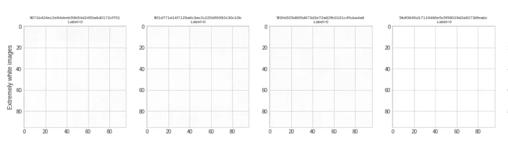

“几乎全白”图像的样本

这种预处理背后的动机是，训练数据集中的一些图像可能是从含有未染色组织甚至根本没有组织的载玻片上捕获的，并且可能在训练期间充当异常值和“坏图像”。

## B.染色正常化和增强

即使使用相同的垂死化学物质(苏木精和曙红)，组织病理学图像也有各种颜色。当使用算法处理图像时，颜色的这种可变性很容易造成很大的挑战，特别是如果使用的算法具有高模式识别能力，如深度卷积神经网络。

为了减轻这一挑战，我采用了两种方法:

1.  将图像送入训练流水线前进行归一化处理(**色斑归一化**)。
2.  通过人工增加染色可变性作为其输入(**染色增加**)使模式识别系统—卷积神经网络—更加鲁棒。

这两种方法有助于估计数字显微镜载玻片中两种标准颜色的染色强度，并对其进行修改以表示标准化染色(在归一化的情况下)或表示不同的染色(在增强的情况下)。

还有其他几种染色正常化和增强的方法。这些方法见于马森科等人在 [*中的《定量分析用组织学载玻片的归一化方法》*](https://www.researchgate.net/publication/221624097_A_Method_for_Normalizing_Histology_Slides_for_Quantitative_Analysis) [2]和袁等人在 [*中的《组织病理学乳腺癌图像中细胞核的神经染色归一化和无监督分类》*、*、* [3]。](https://arxiv.org/abs/1811.03815)

## C.拟议的分类系统

在本研究中，我提出了一个由卷积神经网络(CNNs)组成的转移性肿瘤分类系统。

## D.组件详细信息

*   **CNN 架构**:本研究中使用的 CNN 架构属于已经在 ImageNet 数据集上进行了预训练的[残差神经网络](https://arxiv.org/abs/1512.03385)【4】和[密集连接卷积网络](https://arxiv.org/abs/1608.06993)【5】家族。ResNet50、ResNet101、DenseNet169 和 DenseNet201 就是这些 CNN 架构。
*   **全连接层**:使用的全连接层包括两层，分别为 512 和 256 个神经元。每一层都包含一个整流线性单元(ReLU)激活、批量归一化和 p = 0.5 的下降。在应用了*全局最大汇集*、*全局平均汇集*和*平坦化*以及结果输出之后，完全连接的层与 CNN 的最后一个卷积层的输出相结合。
*   **损失函数**:训练神经网络的一个基本方法是通过优化其神经元的权重来改进网络，使其输出尽可能符合地面真实数据。损失函数使这成为可能。本研究中使用的损失函数是*二元交叉熵损失*。

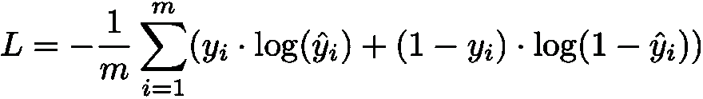

二元交叉熵损失

*   **优化器**:神经网络优化器的选择非常关键，因为它会影响优化神经元权重的过程以及整个网络的性能。本研究中使用了 Adam 优化器。关于优化器的参数初始化，我使用以下设置:lr= 0.001，beta_1=0.9，beta_2=0.999，decay=0.0，epsilon=None，amsgrad=False。

亚当更新方程式

*   **学习率**:学习率对神经网络的训练影响很大。在这项研究中使用固定的学习率 0.00007，因为它给出了良好的模型性能。

# 培养

数据集分为训练集、验证集和测试集。神经网络然后在训练集上训练 15 个时期和 32 个批量，并在验证集上验证。

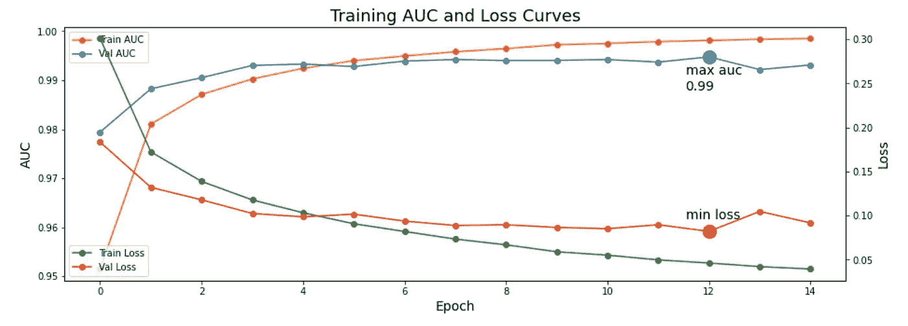

DenseNet169 的训练集和验证集的损失和 AUC 曲线

# 预言；预测；预告

在训练之后，通过使用 5 步测试时间扩充在测试集上执行预测。

# 组装

最后，创建一个大型的神经网络集合。考虑 C = {c₁，…，cₙ)配置，其中每个配置使用相同的超参数(例如测试时间增加步骤)但不同的 CNN 架构(例如 ResNet50)。每个配置 cᵢ由 m=1 个训练模型和预测组成 *y* 为每个 cᵢ.获得ᵢ执行组合，以便计算每个 cᵢ的预测的平均值 *y* ，其中 *y* = { *y* ᵢ，…， *y* ₙ}。

# 结果

为了评估转移性肿瘤分类系统的有效性，使用了 3 个经典指标:受试者工作特征曲线下面积(AUC)、敏感性和特异性。

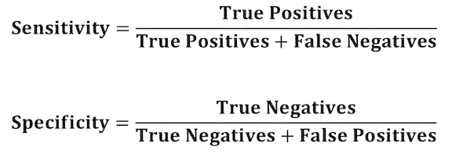

灵敏度和特异性的数学公式

*   **灵敏度**是转移性肿瘤分类系统正确识别中心 32×32 像素区域转移性肿瘤的组织病理学载玻片的能力的量度。也被称为**召回**。
*   **特异性**另一方面，是转移性肿瘤分类系统正确识别在中心 32×32 像素区域没有转移性肿瘤的组织病理学载玻片的能力的量度。
*   受试者工作特征曲线(AUC) 下的**面积等于转移性肿瘤分类系统将随机选择的阳性实例的排名高于随机选择的阴性实例的概率。最好的 AUC 分数是 **1** (或 **100%** )。**

转移性肿瘤分类系统产生的结果如下:

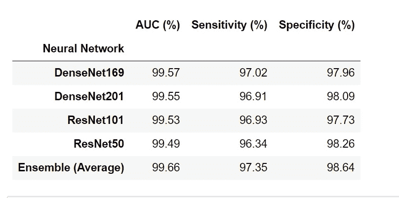

得分

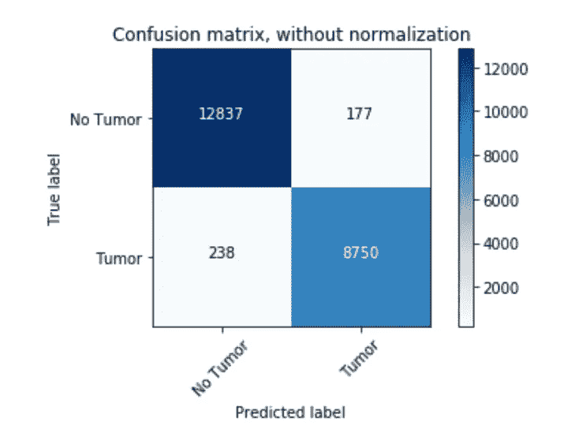

混淆矩阵

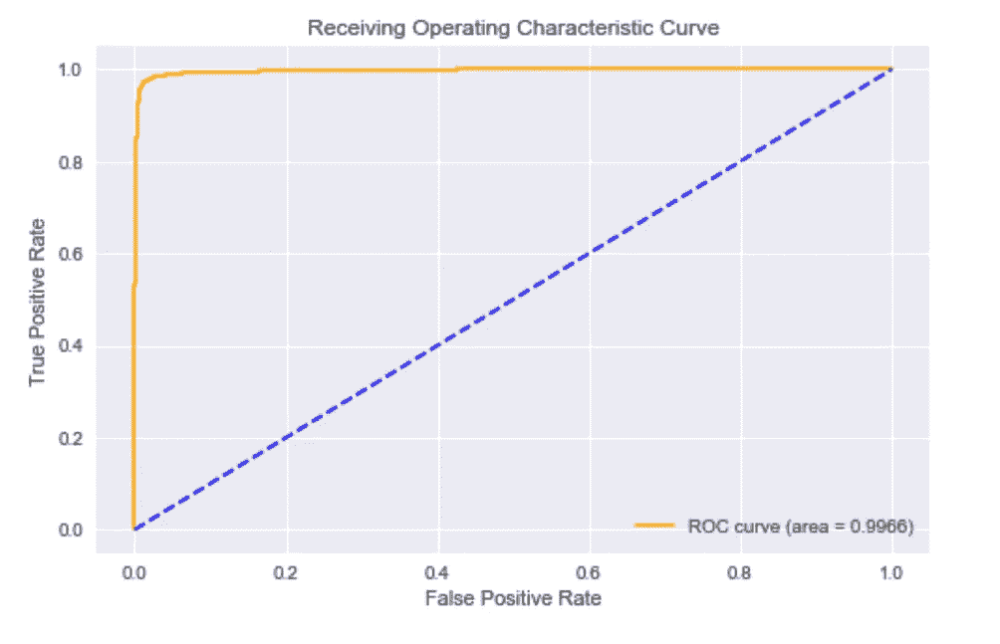

接受者操作特征曲线

# 揭开“黑匣子”的神秘面纱

在现实世界中，深度学习模型被视为“黑盒”方法，很多时候机器学习工程师必须问自己几个问题，例如:

1.  神经网络在输入图像中“看”到了哪里？
2.  在推理/预测过程中，哪一系列神经元在正向传递中被激活？
3.  网络是如何得出最终输出的？
4.  深度学习模型的决策可信吗？

为了回答这些问题，我采用了 Selvaraju 等人在 2016 年的论文 [*Grad-CAM:通过基于梯度的定位*](https://arxiv.org/abs/1610.02391)*【6】中提出的**梯度加权类别激活映射(Grad-CAM)** 。*

> *[**From arXiv**](https://arxiv.org/abs/1610.02391):*[*Grad-CAM:通过基于梯度的定位来自深度网络的视觉解释(* Selvaraju 等人，2016*)*](https://arxiv.org/abs/1610.02391)——“Grad-CAM 使用任何目标概念的梯度(比如“狗”的逻辑，甚至是标题)，流入最终的卷积层，以产生粗略的定位图，突出图像中的重要区域，用于预测概念*。”***

**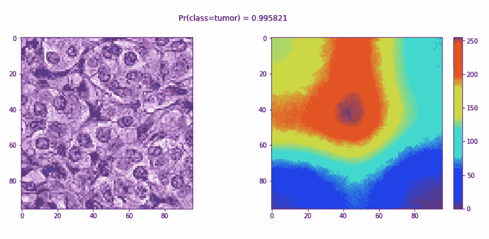**

**一张幻灯片和一张热图显示了通过基于梯度的定位从网络中得到的直观解释**

**上图右侧的热图是 Grad-CAM 应用于左侧图像的产物。由于肿瘤集中在中心 32×32 像素区域，我们看到神经网络实际上正在组织病理学图像中“观察”该区域。**

# **结论**

**虽然计算机不会很快取代病理学家，但适当设计的基于人工智能的工具在病理学实践中具有提高工作流程效率和诊断准确性的巨大潜力。最近的趋势，如数据扩充、众包以生成带注释的数据集，以及将分子和/或临床结果与人类诊断作为基础事实来源的无监督学习，正在消除病理学家在算法开发中的直接作用。**

**将基于人工智能的系统正确整合到解剖病理学实践中必然需要完全数字化的成像平台、对遗留信息技术基础设施的彻底检查、实验室/病理学家工作流程的修改、适当的报销/成本补偿模型，以及最终病理学家的积极参与，以鼓励买入和监督。**

# **关于**

**奥卢瓦费米·奥贡代尔是尼日利亚伊巴丹大学的三年级医学生。他对人工智能、基因组学和生物信息学充满热情，因为它们有可能引领人类进入精确/个性化医学时代。他利用空闲时间提高他的机器学习技能，学习基因组学和生物信息学的新概念。他从事过许多与健康相关的机器学习项目，包括大脑 3D 磁共振成像中的肿瘤分割、使用计算机视觉在胸部 x 光图像中检测肺炎，以及使用随机森林预测患者存活率。你可以发邮件到 femiogundare001@gmail.com 的**或者在 https://www.linkedin.com/in/oluwafemi-ogundare-65b6a0185/的*[LinkedIn 上联系他。](https://www.linkedin.com/in/oluwafemi-ogundare-65b6a0185/)***

***包含本研究中使用的代码的笔记本可在 [github](https://github.com/femiogundare/identifying-metastatic-tumors-in-histopathology-images-using-CNNs) 上找到。***

# ***参考***

***[1] [*威灵，B.S .，林曼斯，j .，温肯斯，j .，科恩，T. &威灵，M. (2018)。*用于数字病理学的旋转等变 CNN。](https://arxiv.org/abs/1806.03962)***

***[2] [*马森科，m .，尼特哈默，m .，马龙，J.S. &博兰，D. (2009)。一种用于定量分析的组织切片标准化方法。*](https://www.researchgate.net/publication/221624097_A_Method_for_Normalizing_Histology_Slides_for_Quantitative_Analysis)***

***[3] [*袁，E. &苏，J. (2018)。组织病理学乳腺癌图像中细胞核的神经染色归一化和无监督分类*](https://arxiv.org/abs/1811.03815) *。****

***[4] [*何，张，徐，任，S. &孙，J. (2015)。用于图像识别的深度残差学习*](https://arxiv.org/abs/1512.03385) 。***

***[5] [*黄、g、庄、l、劳伦斯·范·德·马丁&基连·q . w .(2016)。密集连接的卷积网络*](https://arxiv.org/abs/1608.06993) *。****

***[6] [*塞尔瓦拉茹，R.R .、考格斯韦尔，m .、达斯，a .、韦丹坦姆，r .、帕里克，D. &巴特拉，D. (2016)。Grad-CAM:通过基于梯度的定位*](https://arxiv.org/abs/1610.02391) *来自深度网络的视觉解释。****

***[7] [Pyimagesearch 教程:Grad-CAM——用 Keras、TensorFlow 和深度学习可视化类激活图](https://www.pyimagesearch.com/2020/03/09/grad-cam-visualize-class-activation-maps-with-keras-tensorflow-and-deep-learning/)。***

***[8] [*杰罗姆·y·程医学博士，雅各布·t·阿贝尔医学博士，尤利西斯 G.J 巴利施医学博士，大卫·s·麦克林托克医学博士&利伦·潘塔诺维茨医学博士(2020)。发展中的挑战，部署&人工智能在解剖病理学中的调节*](https://ajp.amjpathol.org/article/S0002-9440(20)30508-3/fulltext#articleInformation) *。****