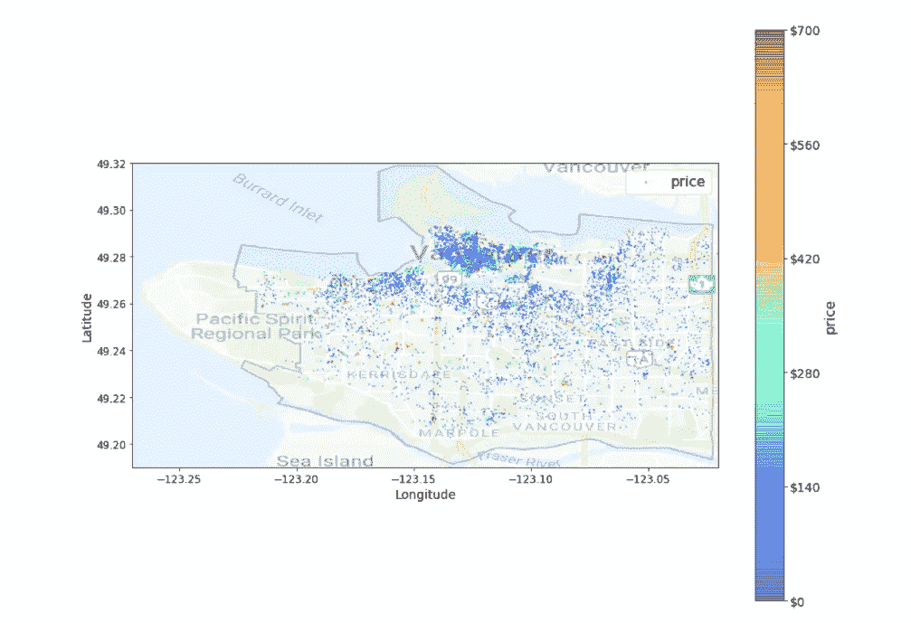
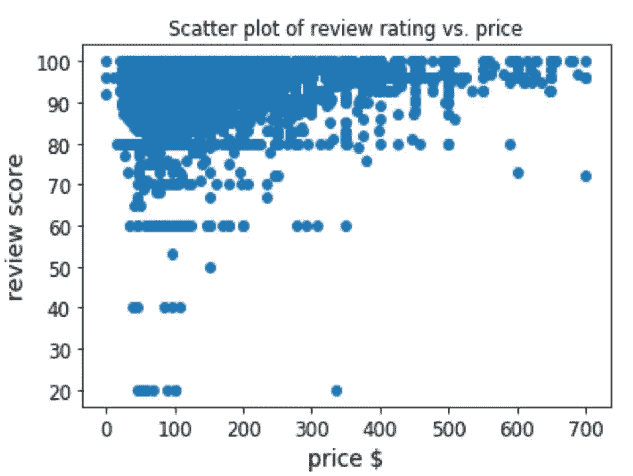
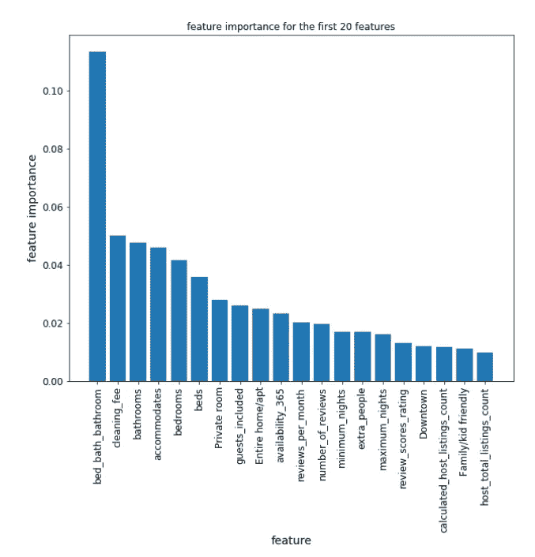
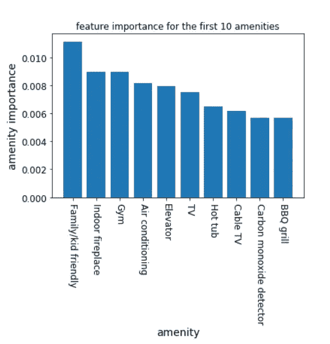

# 确定影响 Airbnb 价格的最重要的便利设施

> 原文：<https://medium.com/analytics-vidhya/identifying-most-important-amenities-affecting-the-price-of-airbnb-3a34af7e4a38?source=collection_archive---------7----------------------->

# 介绍

任何物品的价格完全由你决定。今天最常用的方法之一，是在你的地区搜索类似的，以获得市场价格的估计。虽然这种方法被证明是有效的，但我会帮你找到一个同样的逻辑方法。

影响价格的因素有:位置、床位、浴室和房间的数量、平方英尺、便利设施、主持人评价等。

**数据概述**

AirBnB 发布的数据捕捉了 2018 年的数据，它描述了温哥华民宿的上市活动。以下 Airbnb 活动被包括在温哥华数据集中:
—列表，包括列表的完整描述和平均评论分数
—评论，包括每个评论者的唯一 id 和每个列表的详细评论
—日历，包括列表 id 和当天的价格和可用性

**勘探分析区**

在分析的开始，我定义了三个业务问题来帮助我理解温哥华数据集

> *一个城市的房源分布情况如何，哪些区域有密集分布的房源？*
> 
> *确定影响特定房源价格的重要设施？*
> 
> *哪些是确定某一特定房源价格的最重要的便利因素？*

这些问题可以通过使用可视化分析数据中的模式来回答。在所有的问题中，我都创建了可视化来更好地理解这一点。

问 **问题 1:** *房源在城市中分布如何，房源分布密集在哪些区域？*

下面你可以看到城市中的列表分布。

温哥华的列表分布

此外，分析趋势，我们观察到，分布更密集的市中心，而在南温哥华最低。Kitsilano beach(市区外)的房源密度最高，其次是 East side。

大多数商品的价格都在 0.0 美元到 1000 美元之间。只有 1%的数据具有极端的价格，高于 700 美元。为了进一步分析，我们决定采用价格低于 700 美元的数据，以保持一致性。

观察评论评分与价格的散点图，似乎高价格不会导致高评论分数。有许多价格在 100 美元到 300 美元之间的列表，并且评论分数很高。也有一些价格昂贵但评论率低的列表。

问 **问题 2:** *识别影响某一特定房源价格的重要设施？*

这些数据被送入三个机器学习模型:线性模型、决策树模型和清洗后的随机森林模型。我们通过输入缺失值、解析文本特征、标准化数据，对清单数据集执行了清理过程。

计算每个模型的均方根误差(RMSE)。最初，决策树给出最低的 RMSE。然而，执行 10 重交叉验证显示随机森林生成最佳结果。对选定的模型进行微调，以获得最佳参数。

随机森林

从上图可以看出，床、浴室和卧室的数量是决定价格的最重要因素。预计 Airbnb 的价格会受到这些基本功能的显著影响。

还有其他因素对价格的影响是可以预测的，例如:住宿、私人房间、包括客人、整个家庭/公寓。令人惊讶的是，一年内的可用性和主机列表都是重要的特性。

在所有的地点中，我们只有市中心排在前 20 位，这是有道理的。通常情况下，温哥华市中心的物价较高。

问 **问题 3:** *确定某个特定房源的价格，哪些是最重要的便利条件？*

总共有 123 种便利设施，但下图显示了可能影响某个特定列表价格的前 10 种重要便利设施。

对于大多数家庭来说，租一个适合家庭/孩子的 Airbnb 是一个重要的问题。因此，此功能对列表价格的影响最大。Indore 壁炉是额外的费用，因此，拥有这一功能通常会增加价格。同样的逻辑也适用于十大重要设施中除电视之外的其他功能。

要了解有关该分析的更多信息，请查看 [Github](https://github.com/rg0408/Airbnb-Vancouver-analysis) 上 Jupyter 笔记本中捕获的详细分析