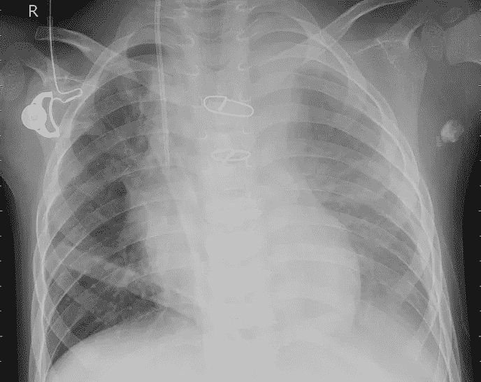
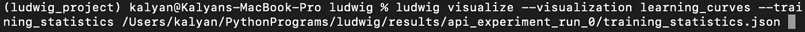

# 使用 Ludwig 深度学习和 Python 识别胸部 X 射线中的肺炎

> 原文：<https://medium.com/analytics-vidhya/identifying-pneumonia-in-chest-x-rays-using-ludwig-deep-learning-and-python-6e7de032e538?source=collection_archive---------16----------------------->

作为一名编程爱好者，我喜欢尝试各种技术，尝试各种方法。从使用 web 框架创建网站到创建 GUI，再到尝试多种 API，我喜欢将我的编程技能推向新的境界。然而，在计算机科学领域的一个领域，我已经偏离了…机器学习！由于一个简单的原因，机器学习是复杂的，我总是在某种程度上被阻止触及这个话题。它需要创造算法，理解先进的数学概念，使用某些分类，并理解该领域的方言。至少可以说，在创建、训练和预测模型的过程中，有一个很大的学习曲线。

然而，有一个答案可以弥合绝对新手和机器学习复杂性之间的差距。答案是:路德维希。

[Ludwig](https://ludwig-ai.github.io/ludwig-docs/) 是一款优步开源软件，允许用户在没有太多代码的情况下训练和测试深度学习模型，该软件建立在 TensorFlow 之上。路德维希的美妙之处在于它能够扩展自身的复杂性。对于老手来说，有数不清的参数可以被改变以创建原始的模型，而对于新手来说，有默认和围栏允许平滑、容易和快速地设置机器学习。最重要的是，由于 Ludwig 可以处理的数据类型的多样性，该软件可用于完成无限量的用例，以符合其通用性原则。

正如 Github 中所述，Ludwig 中可用的数据类型有:

*   二进制的
*   数字的
*   种类
*   设置
*   包
*   顺序
*   文本
*   时间序列
*   图像
*   声音的
*   日期
*   h3
*   矢量

您只需指定输入数据类型和输出数据类型，Ludwig 会处理剩下的工作。在我的例子中，输入是一个图像，输出是文本，这样就创建了一个图像分类器。

就如何利用它而言，该软件有两种方法，通过命令行或作为 python 中的 API。

由于我自己喜欢创建 python 脚本，我将展示 Ludwig API 以及我如何将它集成到我的代码中。在本指南结束时，您应该能够快速开始为您想到的任何用例创建模型。

## **我为什么选择我的用例？**

在我进入实际的技术过程之前，我想花点时间解释一下我的模型的决策。我创建的模型能够以大约 70%的成功率预测胸部 x 光检查是否预示着肺炎。作为一个机器学习的初学者，我想从小的项目想法开始，积累经验，但也有一些实际用途。最初情绪分析器的想法听起来很有趣，然而让计算机告诉我图像之间的差异的想法只是让我惊讶。此外，作为一个对技术革新医疗行业深信不疑的人，我将目光投向了一个与健康和医学相关的数据集。经过短暂的搜索(证明有一百万个用例)，我找到了一个肺炎胸部 x 光数据集，并开始了我的路德维希之旅。

## 安装 Ludwig

我安装 Ludwig 的方式是首先用 python 创建一个虚拟环境。简单地使用 pip install 将 Ludwig 的基本库下载到我的环境中。

然而，这仅安装了 Ludwig 所需的基本数量的库，没有数据类型指定的库，Ludwig 不能接受数据类型并创建模型。对于我的具体情况，我需要下载图像和文本库，因为它们分别是我的输入和输出类型。我还选择下载 viz 库，这样我就可以查看我的模型的训练进度的图表(这帮助我找出某些设置来调整，使我的模型更加准确)。值得注意的是 Ludwig 如何将 Matplotlib 集成到他们的软件中来创建模型。作为一个过去使用 Matplotlib 绘制股票市场趋势图的用户，我证明了这样一个事实，即这涉及到许多设置，但 Ludwig 无缝地处理了整个过程，并且具有高度的抽象性。

## 寻找数据

任何机器学习项目的第一部分都是收集数据，没有或太少都会导致模型不佳！幸运的是，当你有一个广泛的想法时，找到数据肯定不是太困难，事实上，这是一个找到数据的好地方，事实上我在 Kaggle 找到了我的胸部 x 射线数据集，这是一个允许用户发布和找到数据集的网站。

 [## 胸部 x 光图像(肺炎)

### 5，863 张图片，2 个类别

www.kaggle.com](https://www.kaggle.com/paultimothymooney/chest-xray-pneumonia) 

## **数据预处理**

下一部分包括预处理数据集，以便将信息输入到 Ludwig API 中。数据集需要从图像文件转换成 CSV(逗号分隔值)文件，以便 Ludwig 可以通读该文件。此外，数据需要分布到三个 CSV 文件中，一个用于训练:教授模型，一个用于验证:确定模型的准确性，一个用于预测:查看模型如何处理预测图像的分类。

我的训练 CSV 文件(左)，第一部分是图像路径，允许 Ludwig 识别图像文件的位置，第二部分是分类。我用来把我的文件从文件夹转换成 CSV 格式的代码。这段代码不是我自己写的，是由[吉尔伯特·坦纳](https://gilberttanner.com)写的。

模型使用的数据集中的图像。都包含肺炎

## **使用路德维希 API**

最后，现在我们已经设置了数据集，我们可以进入我最喜欢的部分，创建模型。在这里，我们将教计算机理解有肺炎和没有肺炎的胸部图像之间的差异。该项目的幸运之处在于，由于 Ludwig 的 GitHub 上提供了大量的文档，并且开始之前需要的经验相对较少，因此编码方面既不长也不困难。我将一部分一部分地分解代码。

创建脚本的第一步是加载所有的设置资源，包括导入 Ludwig 库以使用 API 和 pandas 库来处理我创建的 CSV 文件。panda 库允许我们将 CSV 存储到这三个变量中，每个变量都是创建模型的一部分。重要的一点是，如果你使用这个博客作为制作你自己的模型的指南，确保你的 CSV 文件和你的 python 脚本在同一个地方，否则你必须提供它们的文件路径。

模型定义是代码的下一部分，在这里我们通知 Ludwig 关于我们想要的模型的所有信息和域。Ludwig 使用这些信息，然后相应地构建模型。模型定义可以有许多不同类型的值和参数，但是我将解释我在模型中使用的参数(基本的)。有两种方法可以提供这些信息，正如我在这里所做的，您可以创建一个字典变量并以类似的方式构造它，或者导入一个包含所有必要信息的 yaml 文件。

输入特性包括 CSV 文件第一列的名称、数据类型、默认编码器和可选的预处理器。有许多定制这可以采用，但我的项目，我不寻求其他功能。简单地说，编码器编码我们的输入数据类型，然后解码成我们的目标输出数据类型。预处理器确保所有图像都具有相同的高度和宽度，使模型更容易比较图像。

输出特征是模型应该输出的输出名称和数据类型。

最后，训练部分将告知 Ludwig 如何训练模型。Epochs 和 Batch Size，告诉 Ludwig 运行你提供的数据集的次数。发现自己在玩 Epoch，选择停在 7 个 Epoch。时期和批量越大，模型的训练时间就越长，因此处理时间也就越长。

接下来，我们开始创建和训练我们的模型。第一行代码通过将我们的模型定义作为参数传递给 Ludwig 来为我们创建模型。之后，我们开始使用 train 函数训练模型，并传递包含 CSV 文件的验证和训练变量。这将是你的机器上运行时间最长的部分。此外，注释掉的部分详细说明了如何加载先前保存的模型，这样，当您只想进行预测时，就不会浪费时间来创建新模型。确保在 model_path 变量中指定正确的文件路径。

程序的最后一部分是我们根据测试数据集得到预测的地方。选择您自己的保存路径来访问预测的 CSV。

看看我的预测吧！

我的模型做出的预测(左)，对应的测试数据集(右)

在查看了 Ludwig 生成的统计文件后，我的预测在识别胸部 x 光片中是否有肺炎方面的准确率约为 70%。由于这是我第一次动手做机器学习项目，我的准确率有点低。使用 Ludwig 进行更好的配置，精确度肯定会提高。

好了，这是我完整的最终代码:

## **可视化模型**

该项目或任何机器学习项目的视觉和重要部分是观察机器如何学习。幸运的是，Ludwig 用一个简单的命令为我们处理了整个过程。

下面是结果图:

随着模型经历每一个时代，都显示出持续的改进！

# 结论

来自优步的 Ludwig 深度学习开源软件是将机器学习带给大量用户的强大工具。它具有极高的弹性，能够插入到任何脚本中，这对于在流水线流程中制造程序是至关重要的。由于它是开源的，它有快速增长和扩展的能力，甚至比现在更大，在未来提供更多和更好的功能。它的核心原则可扩展性、通用性和灵活性都是根深蒂固的。

由于这是我的第一个机器学习项目，将模型集成到脚本中的成功只会激励我进一步依赖这项技术来进行未来的努力，以及为 Ludwig 的开源软件做出贡献。

## 资源

路德维希·吉图布:[https://github.com/uber/ludwig](https://github.com/uber/ludwig)

感谢 Robert Walid 关于路德维希的文章: [*路德维希简介以及如何通过 Flask*](https://www.adaltas.com/en/2020/03/02/ludwig-deep-learning-flask/) 部署深度学习模型