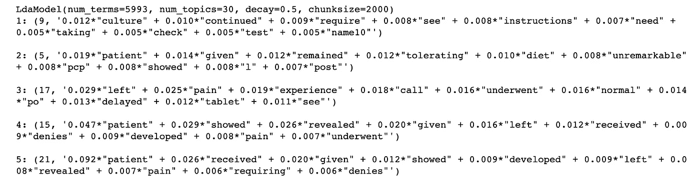
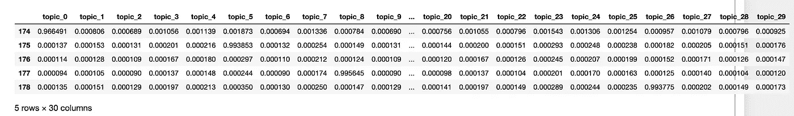
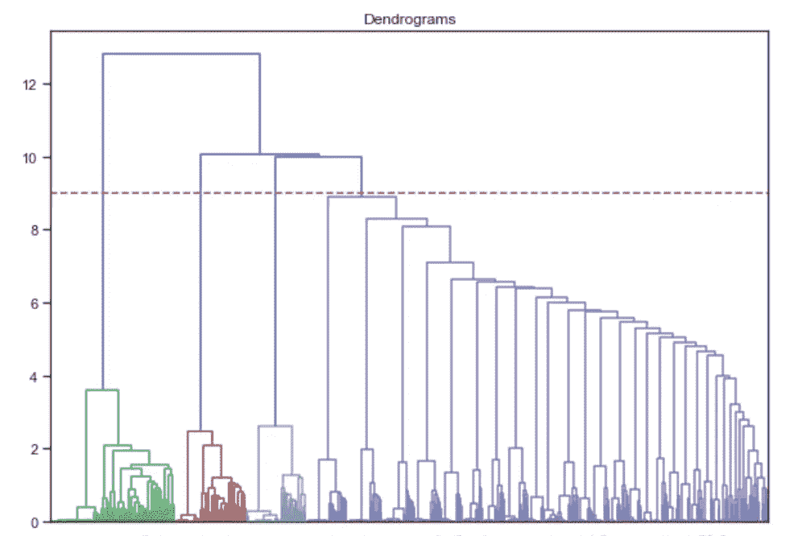
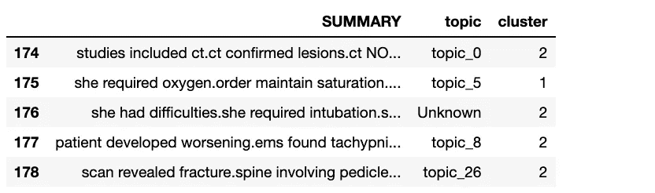
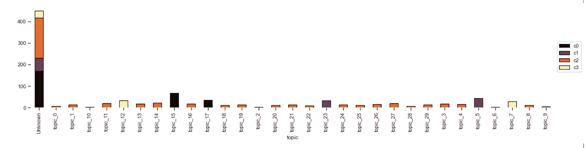

# 文本聚类-识别临床文档中的关系

> 原文：<https://medium.com/analytics-vidhya/identifying-relationships-in-clinical-text-nlp-clustering-929eb04b5942?source=collection_archive---------3----------------------->

这是 4 部分系列的最后一部分！到目前为止，我们一直在谈论:

1.  [预处理和清洗](/@tyagigaurika27/nlp-preprocessing-clinical-data-to-find-sections-461fdadbec77)
2.  [文本摘要](/@tyagigaurika27/text-summarization-for-clustering-documents-2e074da6437a)
3.  [使用潜在狄利克雷分配(LDA](/@tyagigaurika27/nlp-topic-modeling-to-identify-clusters-ca207244d04f) )的主题建模
4.  **集群——我们来了！！**

> *如果您想自己尝试整个代码或跟随，请访问我在 GitHub 上发布的 jupyter 笔记本:*[*https://GitHub . com/gaurikatyagi/Natural-Language-Processing/blob/master/introduction % 20 to % 20 NLP-Clustering % 20 text . ipynb*](https://github.com/gaurikatyagi/Natural-Language-Processing/blob/master/Introdution%20to%20NLP-Clustering%20Text.ipynb)

# 聚类的输入数据(第 3 节的概述)

使用词性标注和识别短语中单词的层次来清理和总结文本。这然后被输入到一个**潜在狄利克雷分配(LDA)** 算法中以得到主题:



LDA 输出

在本节中，我们将把上述内容转换成每个文本(输入行)的数据框架，得到每个主题(特征)的%倾向。

```
topics_all = pd.DataFrame.from_dict(document_topic, orient='index')
topic_column_names = ['topic_' + str(i) for i in range(0, 30)]
topics_all.columns = topic_column_names
display(topics_all.head())
```



聚类输入

我们现在可以在图表注释中可视化这些主题的层次结构！这将有助于确定我们需要的集群数量。

# 可视化以识别集群数量

```
from scipy.cluster import hierarchy
plt.figure(figsize=(10, 7))  
plt.title("Dendrograms")  
dend = hierarchy.dendrogram(hierarchy.linkage(topics_all, method='ward'))
plt.axhline(y=9, color='r', linestyle='--')
```



x 轴包含样本，y 轴表示这些样本之间的距离。距离最大的垂直线是蓝线，因此我们可以决定阈值为 9，并在该点切割树状图(水平虚线)。

我们有 4 个集群，因为这条线在 4 个点上切割树状图。现在让我们对这些集群应用层次聚类。

# 使聚集

在我们聚集之前。我们应该知道你在选择什么参数以及为什么:联系决定了在一组观察值之间使用哪个距离。该算法合并最小化所选标准的聚类对。

1.  **ward** 最小化被合并的聚类的方差。
2.  **平均值**使用两个集合的每次观察距离的平均值。
3.  **完全或最大关联**使用两组所有观察值之间的最大距离。
4.  **single** 使用两个集合的所有观测值之间的最小距离。

我想最小化合并后的聚类之间的差异。现在，我只能用**欧几里德距离。**

```
from sklearn.cluster import AgglomerativeClustering
cluster_model = AgglomerativeClustering(n_clusters=4, affinity='euclidean', linkage='ward')  
cluster = cluster_model.fit_predict(topics_all).tolist()
# print(type(cluster))
topics_all["cluster"] = cluster##VISUALIZZATIONdf_for_h_visual = df ## derived from topics_all to get 1 topic per text- refer to part 3 of this series.
df_for_h_visual["cluster"] = topics_all["cluster"]
df_for_h_visual.drop(['propensity'], axis = 1, inplace=True)
df_for_h_visual.topic.fillna(value="Unknown", inplace=True)
df_for_h_visual.head()
```



每个文本及其集群 1 个主题

# 可视化集群

```
df_histo = df_for_h_visual.groupby(['topic','cluster']).count().reset_index()
df_histo = df_histo.pivot(index='topic', columns='cluster', values='SUMMARY')
df_histo.columns = ["c0", "c1", "c2", "c3"]ax = df_histo.plot.bar(stacked=True,   colormap='inferno', edgecolor='black', linewidth=1)ax.legend(loc='center left', bbox_to_anchor=(1.0, .5))
ax.spines['top'].set_visible(False)
ax.spines['right'].set_visible(False)
ax.spines['bottom'].set_visible(False)
ax.spines['left'].set_visible(False)plt.show()
```



# 结论

来自建模主题的“未知”类别的大约 50 个文档实际上与主题 _23 和主题 _5(集群 1)在相同的域空间中。

在这个 4 部分的教程中，你已经看到了如何从原始文本到摘要文本。然后对主题进行建模，最后，将这些主题聚集在一起，以识别相近但不是相同主题的文本之间的关系。这也有助于确定以前未确定的临床笔记的“潜在主题”。我希望你喜欢这个！