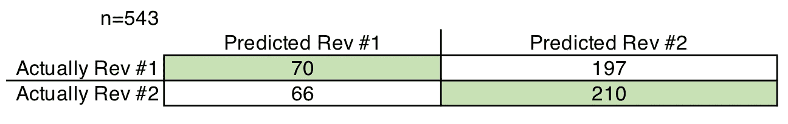

# 用文本分类识别审查者#2

> 原文：<https://medium.com/analytics-vidhya/identifying-reviewer-2-with-text-classification-6f10f04cf5a0?source=collection_archive---------7----------------------->

来自 [Pexels](https://www.pexels.com/photo/gray-magnifying-glass-and-eyeglasses-on-top-of-open-book-3109168/?utm_content=attributionCopyText&utm_medium=referral&utm_source=pexels) 的 [Wallace Chuck](https://www.pexels.com/@chuck?utm_content=attributionCopyText&utm_medium=referral&utm_source=pexels) 的照片

几乎所有的学者都和令人畏惧的第二号评审员有过争执，或者至少知道他们的存在。有无数的模因影射评论者#2 的名声是不合理的，无知的，不可能取悦的。甚至有一个推特账户专门用来发布与 2 号评审者相关的内容，@GrumpyReviewer2，无数的研究人员使用#reviewer2 标签来发泄他们与 2 号评审者的争执。

评论者#2 现象似乎是普遍接受的，但不清楚它实际上有多真实。然而，关于为什么审稿人#2 似乎总是阻止你的手稿被发表，已经提出了许多假设。有些人认为第二位评审者是后来招募的，可能不在首选评审者之列，这可能意味着第二位评审者离你的研究领域更远了。其他人提出，评审者#2 可能花了更长的时间来回应，这可能是特定个性特征的指示。还有一些人认为，审稿人是由期刊编辑操纵的，所以你首先收到的是好消息，因此不一定反映了审稿人被招募或回复评论的顺序。

有了这么多猜测，似乎是时候将数据科学应用到这个问题上了——评论者#2 真的像每个人说的那样糟糕吗？公平地说，之前已经分析过评论者的回答。 [Jonathan Weisberg](https://jonathanweisberg.org/post/Reviewer%202/) 之前测试了审稿人编号是否与审稿人是否推荐拒绝、重大修改、次要修改或接受手稿相关。韦斯伯格发现，审稿人的数量与对手稿的评判或多或少没有关联，但审稿人花在手稿上的时间长度确实与更有利的手稿推荐相关。然而，在综述文本中比在出版物推荐中有更多细微的信息，也许最重要的是，作者经常只看到综述文本而不是出版物推荐。这意味着作者对评审者#2 的看法更可能基于评审评论的内容和语气。

我决定测试评论者#2 现象是否强到足以让机器学习算法预测特定评论是来自评论者#1 还是评论者#2。为此，我下载了 2015 年至 2019 年发表在《生物地球科学》(Biogeosciences)杂志上的文章的公开手稿评论，该杂志是我研究领域的优质杂志，用于使用 Python 中的 scikit learn 进行文本分类。数据集包括来自评审者#1 的 1，376 个评审和来自评审者#2 的 1，337 个评审。我用 tika Python 库将下载的 pdf 文件转换为原始文本，然后清理文本文件，删除暴露审阅者编号的识别文本。文本被进一步去除标点，用 nltk(雪球斯特梅尔)做词干，并且英语语言停用词被移除，最终产生 58，853 个单词的语料库。审查数据分为训练集和测试集，训练:测试比例为 80:20，数据转换为“术语频率乘以逆文档频率”(tfidf)。使用支持向量机分类器，使用随机梯度下降学习，选择前 2 个百分点中的特征用于模型训练。这种文本分类流水线速度很快(训练和测试只需几秒钟)，使用 SGD 的 SVM 算法[是文本分类的最佳方法](https://scikit-learn.org/stable/tutorial/text_analytics/working_with_text_data.html)之一，通常产生与深度学习递归神经网络方法相同的精度[。](https://arxiv.org/abs/1702.05531)

那么，常见的机器学习文本分类方法可以预测一篇评论是来自评论者#1 还是#2 吗？嗯，结果不是很好。我能达到的最高精度只有 0.517，超过了 50%，但也只是勉强达到。有趣的是，混淆矩阵显示，该模型预测评审者#2 的频率高于评审者#1。

那么这意味着什么呢？1 号评审员和 2 号评审员的区别都在我们脑子里吗？我还没到那种程度。对这些结果有几点需要注意的地方:1 .这些评论只来自一个期刊，2。这些评论仅来自最终发表的文章，3。这些是公开评论，可能会束缚评论者的行为，4。这个问题可能需要更多的训练数据。更大、更多样化的数据集可以允许对评审者#1 和评审者#2 进行更好的预测。然而，至少对于在生物地理科学中发表的论文，在审稿人#1 和审稿人#2 使用的语言中似乎没有特别清晰的模式。所以暂时不要太在意评论者 2。