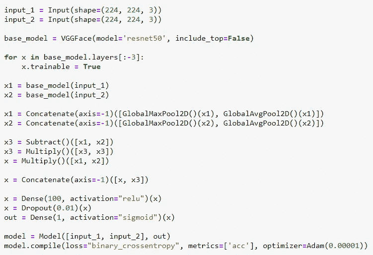

# 借助深度学习识别血亲

> 原文：<https://medium.com/analytics-vidhya/identifying-the-blood-relatives-with-the-help-of-deep-learning-e03247520954?source=collection_archive---------11----------------------->


在这里我想分享一下我是如何使用深度学习算法参加[东北微笑实验室挑战赛](https://www.kaggle.com/c/recognizing-faces-in-the-wild/overview)的。

挑战在于建立一种深度学习技术，以帮助研究人员建立一个更复杂的模型，仅根据两个人的面部图像来确定他们是否有血缘关系。因为大多数有血缘关系的人都有相同的特征，如眼睛，鼻子，面部切口，我们需要使用图像来识别。

## 本次挑战的目的:

现在，东北大学的研究人员希望改进他们的面部图像分类算法，以弥合研究与 DNA 结果等其他家族标记之间的差距。

在这场比赛中，我们建立了一个复杂的深度学习模型，这将有助于根据面部特征确定研究人员。

## 真实世界示例:


伊万卡和唐纳德·特朗普的 AUC 值

正如我们在这里看到的，AUC 表示百分比，因此我们可以得出结论，伊万卡·特朗普与唐纳德·特朗普有血缘关系，只有通过深度学习使用面部特征的图像才有 92%的可信度。

## **需要记住的事情:**

1.  可能存在我们可能忽略的家族面部关系，这可以通过深度学习来避免。
2.  记住，不是每个家庭成员都有亲属关系。例如，父母和他们的孩子是亲戚，但彼此不是。

# **数据概述:**

数据由 [Families In the Wild (FIW)](https://web.northeastern.edu/smilelab/fiw/) 提供，这是最大、最全面的自动亲属识别图像数据库。FIW 从公开的名人图片中获取数据。

在比赛中，我们提供了 4 个文件。

1.  train-faces.zip →将训练集划分为多个族，每个族以唯一的族 id (F0123)作为文件夹名称，每个族作为成员，每个成员以唯一的(MIDx)作为文件夹名称，其中包含成员面部的各个图像。
2.  train.csv →这个文件包含了亲属关系的训练标签。
3.  test-faces.zip →测试文件包含未知个人的面部图像。
4.  sample_submission.csv →正确格式的示例提交文件。列`img_pair`描述了一对图像，即`abcdef-ghijkl`表示一对图像`abcdef.jpg`和`ghijkl.jpg`。你的目标是预测`test-faces`中的每一对图像是否相关，其中 1 表示相关，0 表示不相关。

## **指标:**

在预测概率和观察目标之间的 ROC 曲线下的[区域评估提交。所以我们在 sample_submission.csv 中提交每个关系的概率。](http://en.wikipedia.org/wiki/Receiver_operating_characteristic)

# 探索性数据分析:

**a)了解家族数量:**
我们可以看到，只有 1 个家族有 41 个成员，其余家族成员少于 15 个


在家庭和每个家庭的成员数之间绘图

```
The minimum family count is : 1
The no of families with minimum family count are : 1
The maximum family count is : 41
The no of families with minimum family count are : 1
```

**b)绘制一个人的图像:**我们可以看到这些图像是不同年龄和不同位置的。


**c)绘制文件夹中图像的数量:**


**用于优化的重要东西:**

1.  此处，训练、cv 和测试分割的数据应基于家庭 id 而非关系进行，因为如果我们基于关系图像进行分割，可能会造成数据泄漏，因为在训练数据本身中可以看到家庭的一些特征。
2.  在给定的数据中，我们只获得了关系现有数据，因此我们需要创建一个没有关系的图像对列表来训练数据。这也是根据家庭 Id 进行分割的原因。我们创建一个在训练数据中没有关系的对 id，我们假设它没有关系。
3.  为了进行训练，我们使用了 fit_generator，因为图像大小为 224 X 224，将所有关系放入一个数组会消耗大量 RAM。因此，我们创建了一个生成图像对的生成器，每个时期的步数取为 200，因此每个时期生成器生成 200 对图像。

# 数据预处理:

对于训练和测试，我们已经从每个图像的 R，G，B 值中减去了所有训练图像的 R，G，B 平均值。

我在[中使用了预处理 _ 输入，这个](https://github.com/rcmalli/keras-vggface/blob/master/keras_vggface/utils.py)代码具有 R、G、B 的硬编码平均值，这些平均值是用非常大的数据计算的。

下面是图像预处理后的样子。


# **深度学习模型解决问题:**

1.  **VGG 人脸模型:**在 omkar parkhi 2015 年发表的一篇名为[深度人脸识别](http://www.robots.ox.ac.uk/~vgg/publications/2015/Parkhi15/parkhi15.pdf)的论文中有所描述。在此[站点](https://machinelearningmastery.com/how-to-perform-face-recognition-with-vggface2-convolutional-neural-network-in-keras/)中解释了 VGG 人脸的实现。

**答:变异 1:**


**b .变化 2 :**


**c)变化 3 :**



VGG 人脸是最好的模型，与其他模型相比具有更高的 auc，在本次比赛中，我们使用了多种多样的 VGG 人脸模型。

2.**基于暹罗的模型:**这是一种一次性图像识别技术。这个模型在标题为[的论文中有所描述，用于一次性图像识别的连体神经网络](https://www.cs.cmu.edu/~rsalakhu/papers/oneshot1.pdf)。这里提到的[是实现暹罗网络的](https://towardsdatascience.com/one-shot-learning-with-siamese-networks-using-keras-17f34e75bb3d)。

在这场比赛中，我们不能直接使用暹罗模型，所以模型架构是从暹罗模型的灵感。

**a)变化 1 :**


**b)变奏 2 :** 还有一个模型，我们在 fit_generator 里面把 steps_per_epoch=100 给改了。

3.**基于初始模型:**它是最好的人脸识别技术之一。这在 2014 年的一篇论文标题[中有所描述。在](https://arxiv.org/abs/1409.4842)[站点](https://www.analyticsvidhya.com/blog/2018/10/understanding-inception-network-from-scratch/)中解释了初始网络的实施。

**盗梦空间网络的目标:**

*   模型越大，越容易过度拟合。当训练数据很小时，这一点尤其明显
*   增加参数的数量意味着您需要增加现有的计算资源

我们在《盗梦空间网络》中得到了非常少的公共和私人分数，所以我们没有将《盗梦空间网络》包括在集合模型中。

# 模特评分:


# **ka ggle 提交的集合模型:**

我们不应该添加准确性或得分较低的模型。我保持了 0.81 的阈值，所以我选择了符合这个标准的模型。


前 5 个模型预测的 pdf 图

取 5 个模型的输出结果的平均值并提交，从中我们可以得到 0.911 的私人分数。


代码的完整链接可以在这里找到。

# 真实世界应用:

我举了几个真实世界的例子，并预测了这种关系的可能性。我在 flask 上创建了一个 web 应用程序，上传了图像并预测了 AUC。

使用的图像有:


组合的概率如下:


# 未来工作:

1.  我们可以添加几个不同的模型，并获取它们的集合输出，但它们应该保持标准。
2.  我们可以通过给每个模型不同的权重来集成模型。

# 来源:

1.  [https://www . ka ggle . com/c/recogniting-faces-in-the-wild/overview](https://www.kaggle.com/c/recognizing-faces-in-the-wild/overview)
2.  [https://www . analyticsvidhya . com/blog/2018/10/understanding-inception-network-从头开始/](https://www.analyticsvidhya.com/blog/2018/10/understanding-inception-network-from-scratch/)
3.  [https://machine learning mastery . com/how-to-perform-face-with-vgg face 2-convolutionary-neural-network-in-keras/](https://machinelearningmastery.com/how-to-perform-face-recognition-with-vggface2-convolutional-neural-network-in-keras/)