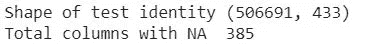

# IEEE 欺诈检测

> 原文：<https://medium.com/analytics-vidhya/ieee-fraud-detection-f69586177604?source=collection_archive---------9----------------------->

我知道你可能是生活中一些诈骗的受害者，从学校恶作剧到一些真正的金钱损失。我们不能控制人们，也不能否认轻松赚钱的想法，所以人们倾向于偷别人的东西。我们不能总是阻止人们这样做，但我们绝对可以采取一些预防措施，以避免未来的损失。

在本文中，我们将讨论一个检测在线欺诈交易的案例研究。本次比赛由 [Kaggle](https://www.kaggle.com/c/ieee-fraud-detection) 主持。所以让我们深入研究一下。


# 内容:-

> (1)-加载数据
> (2)-探索数据
> (3)-特征工程
> (4)-高级特征工程
> (5)-最后一步处理数据
> (6)-建模
> (7)-结论

# [1]加载数据

我们将首先加载提供给我们的数据。有两个表，一个在 train_identity.csv，另一个在 train_transaction.csv。


加载两个表后，我们将合并它们。详情请参阅笔记本。

# [2]探索数据

这个数据集有很多特性，很难逐一检查。已经为我们提供了一些高级功能，这些功能对于分类非常重要。我们必须预测给定的交易是否是欺诈性的，所以是的，这是一个二元分类任务。

**(1)数据的类型有哪些？**

*   **TransactionDT:** 给定参考日期时间的时间增量(不是实际时间戳)
*   **交易金额:**交易支付金额
    美元**产品代码:**产品代码，每笔交易的产品
*   **card1 — card6:** 支付卡信息，如卡种、卡类、发卡行、国家等。
*   **地址:**地址
*   **距离:**距离
*   **P_ and (R__) emaildomain:** 购买者和接收者电子邮件域
*   **C1-C14:** 计数，比如找到多少个地址与支付卡关联等。实际意义被掩盖了。
*   **D1-D15:** 时间增量，如前一次交易之间的天数等。
*   **M1-M9:** 匹配，比如名片上的名字和地址等。
*   **vxxxx:**Vesta 设计了丰富的功能，包括排名、计数和其他实体关系。
*   **分类特征:**
    product CD
    card 1—card 6
    addr 1，addr 2
    P*email domain R*email domain
    M1—M9

**(2)——数据是平衡的还是不平衡的？**


我们可以看到这是一个非常不平衡的数据集。所以我们不能用准确性作为衡量标准。我们必须使用一些其他指标，如 F1 得分、auc。在这种情况下，我们使用 AUC-ROC 评分。

**(3)缺列有多少？**



这里的数据包含大型 nan 列。这些列可能会影响我们的模型性能。因此，我们将删除缺失值超过 90%的功能。


缺失值超过 90%的特征。

**(4)欺诈交易和非欺诈交易的交易值分布是怎样的？**


从这个分布图中，我们可以观察到一些现象，例如欺诈性交易很高，而非欺诈性交易在本质上有点一致。

**(5)探索范畴特征**


从上面的条形图中，我们可以观察到一些卡特征，如卡 4 与万事达卡和维萨卡的欺诈性交易较高，卡 6 与信用卡和借记卡的欺诈性交易较高。

*   一些特征具有许多需要最小化的分类特征。例如，设备信息功能包含各种设备的名称。因此，Redmi Note 4 和 Redmi Note 5 等两款设备将被视为两个不同的类别，以避免我们将它们作为一个类别在“Redmi”下使用。
*   其中一个特性包含不同的操作系统版本，因此它们被转换成基本系统如 windows、linux、mac 等。
*   缺失的功能被转换为“缺失”值。
*   NaNs 和 inf 值由特定特征的平均值代替。
*   通过多次迭代，我发现获取整个数据集不会产生好的结果。所以我进行了降采样，只使用了 30 %的非欺诈数据。

# [3]特征工程

在进行一些特征工程之前，进行了一些预处理步骤，例如移除 NaN 和无穷大值，并且在某些情况下用平均值替换它们。

进行了以下特征工程:

```
raw_train_data['id_30'].loc[raw_train_data['id_30'].str.contains('Mac')]='mac'
raw_train_data['id_30'].loc[raw_train_data['id_30'].str.contains('iOS')]='ios'
raw_train_data['id_30'].loc[raw_train_data['id_30'].str.contains('And')]='android'
raw_train_data['id_30'].loc[raw_train_data['id_30'].str.contains('Lin')]='linux'
raw_train_data['id_30'].loc[raw_train_data['id_30'].str.contains('Win')]='windows'
np.unique(raw_train_data['id_30'])raw_train_data['device_name'] = raw_train_data['DeviceInfo'].str.split('/', expand=True)[0]raw_train_data.loc[raw_train_data['device_name'].str.contains('SM', na=False), 'device_name'] = 'Samsung'
raw_train_data.loc[raw_train_data['device_name'].str.contains('SAMSUNG', na=False), 'device_name'] = 'Samsung'
raw_train_data.loc[raw_train_data['device_name'].str.contains('GT-', na=False), 'device_name'] = 'Samsung'
raw_train_data.loc[raw_train_data['device_name'].str.contains('Moto G', na=False), 'device_name'] = 'Motorola'
raw_train_data.loc[raw_train_data['device_name'].str.contains('Moto', na=False), 'device_name'] = 'Motorola'
raw_train_data.loc[raw_train_data['device_name'].str.contains('moto', na=False), 'device_name'] = 'Motorola'
raw_train_data.loc[raw_train_data['device_name'].str.contains('LG-', na=False), 'device_name'] = 'LG'
raw_train_data.loc[raw_train_data['device_name'].str.contains('rv:', na=False), 'device_name'] = 'RV'
raw_train_data.loc[raw_train_data['device_name'].str.contains('HUAWEI', na=False), 'device_name'] = 'Huawei'
raw_train_data.loc[raw_train_data['device_name'].str.contains('ALE-', na=False), 'device_name'] = 'Huawei'
raw_train_data.loc[raw_train_data['device_name'].str.contains('-L', na=False), 'device_name'] = 'Huawei'
raw_train_data.loc[raw_train_data['device_name'].str.contains('Blade', na=False), 'device_name'] = 'ZTE'
raw_train_data.loc[raw_train_data['device_name'].str.contains('BLADE', na=False), 'device_name'] = 'ZTE'
raw_train_data.loc[raw_train_data['device_name'].str.contains('Linux', na=False), 'device_name'] = 'Linux'
raw_train_data.loc[raw_train_data['device_name'].str.contains('XT', na=False), 'device_name'] = 'Sony'
raw_train_data.loc[raw_train_data['device_name'].str.contains('HTC', na=False), 'device_name'] = 'HTC'
raw_train_data.loc[raw_train_data['device_name'].str.contains('ASUS', na=False), 'device_name'] = 'Asus'
```

一些大字符串被它们的短形式所取代。

进行上述将设备名称缩短为其基本名称的步骤的目的是最小化分类特征的总数。

# [4]高级特征工程

让我们做一些高级的特征工程。部分代码摘自本次竞赛中发布的顶级内核。

```
raw_train_data['TransactionAmt_to_mean_C1'] = raw_train_data['TransactionAmt'] / raw_train_data.groupby(['C1'])['TransactionAmt'].transform('mean')
raw_train_data['TransactionAmt_to_mean_C3'] = raw_train_data['TransactionAmt'] / raw_train_data.groupby(['C3'])['TransactionAmt'].transform('mean')
raw_train_data['TransactionAmt_to_mean_C5'] = raw_train_data['TransactionAmt'] / raw_train_data.groupby(['C5'])['TransactionAmt'].transform('mean')
raw_train_data['TransactionAmt_to_mean_C13'] = raw_train_data['TransactionAmt'] / raw_train_data.groupby(['C13'])['TransactionAmt'].transform('mean')
raw_train_data['TransactionAmt_to_mean_D15'] = raw_train_data['TransactionAmt'] / raw_train_data.groupby(['D15'])['TransactionAmt'].transform('mean')
raw_train_data['TransactionAmt_to_std_C1'] = raw_train_data['TransactionAmt'] / raw_train_data.groupby(['C1'])['TransactionAmt'].transform('std')
raw_train_data['TransactionAmt_to_std_C3'] = raw_train_data['TransactionAmt'] / raw_train_data.groupby(['C3'])['TransactionAmt'].transform('std')
raw_train_data['TransactionAmt_to_std_C5'] = raw_train_data['TransactionAmt'] / raw_train_data.groupby(['C5'])['TransactionAmt'].transform('std')
raw_train_data['TransactionAmt_to_std_D15'] = raw_train_data['TransactionAmt'] / raw_train_data.groupby(['D15'])['TransactionAmt'].transform('std')
```

还有一些更多的功能工程完成，请检查笔记本文件，以获得更多的细节。让我先解释一下我们做了什么样的特征工程

(1)- **设备信息:-** 设备名称被缩短为其品牌名称，只是为了作为分类变量。

(2)- **Id_XX:-** 它们中的一些包含操作系统的名称和其他参数，这些参数被清理和缩短以作为分类变量。

(3)- **日期和时间:-** 交易日期、时间、小时从给定的时间戳中分离出来，这被认为是一个好的特征。

(4)- **交易金额:-** 计算欺诈性和非欺诈性交易的平均值、标准偏差。

(5)- **Card-X:-** 所有卡的详细信息被组合在一起，以给出一个可以识别单个用户交易的 id

**更新:-**

为了更进一步的工程设计，我们做了以下改动:-
(a)-从论坛上，我发现日期并不是一个重要的因素，它只与用户 id 有关。
(b)-所以直接使用 userid 给了我们一个非常糟糕的结果，可能是因为新用户在测试集中，而不是在训练集中。

# [5]为最终步骤处理数据

现在让我们将分类值转换为序数值。下面的代码做到了这一点。


现在让我们删除目标列，并将其存储在不同的变量中。


现在让我们将数据分为训练集和测试集。


现在我们的数据终于可以施展魔法了。

# [6]建模

因为这是一场激烈的竞争，所以使用简单的基线模型没有帮助。

但还是让我们使用随机森林分类器来检查它是如何工作的。


随机森林分类器

所以我们得到的 auc-roc 值是 0.9441。但是请记住，这仍然是在训练集上的结果，我们还必须在最终的测试集上进行尝试。

现在让我们试试 Light GBM，它是一种高级模型，主要用于这种比赛。


轻型 GBM

所以我们取得了比上次更好的成绩。让我们最终向 kaggle 提交我们的测试数据预测。


# **【7】结论**

因此，我们的模型工作得非常好，我们可以使用更高级的特征工程和一些集合模型来进一步改进它。

> **预防胜于治疗**

这样，我们可以很容易地确定金钱的损失，并在某种程度上，我们可以提高人们的财务稳定性。