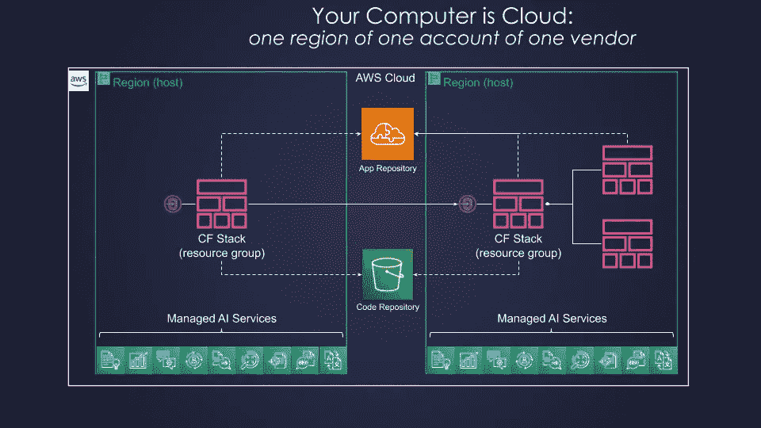
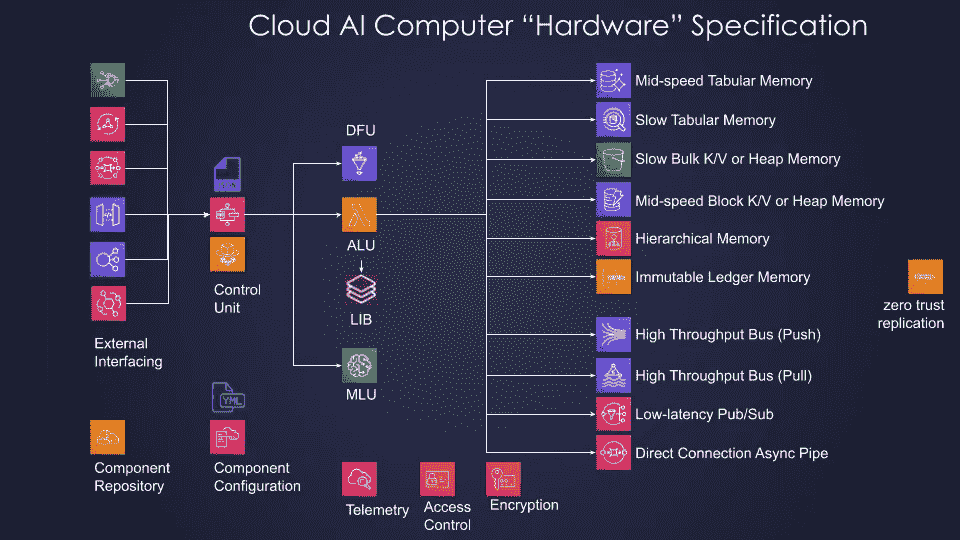
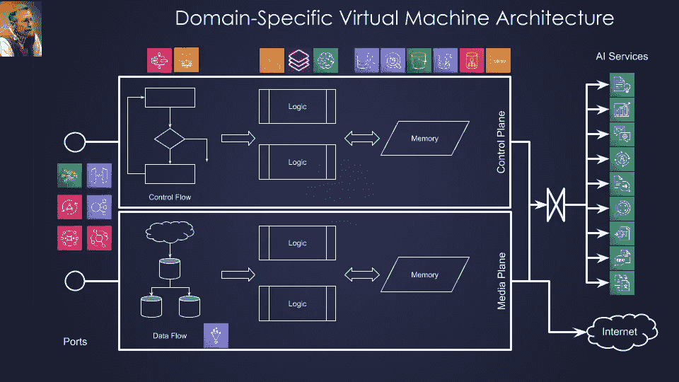
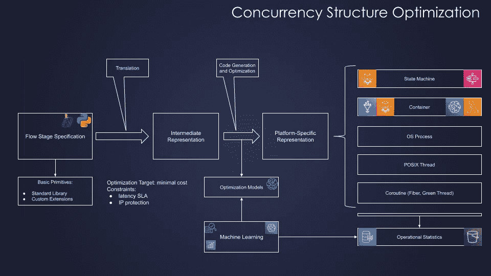
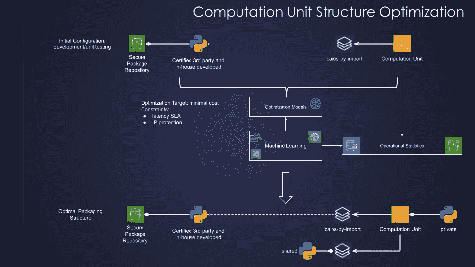
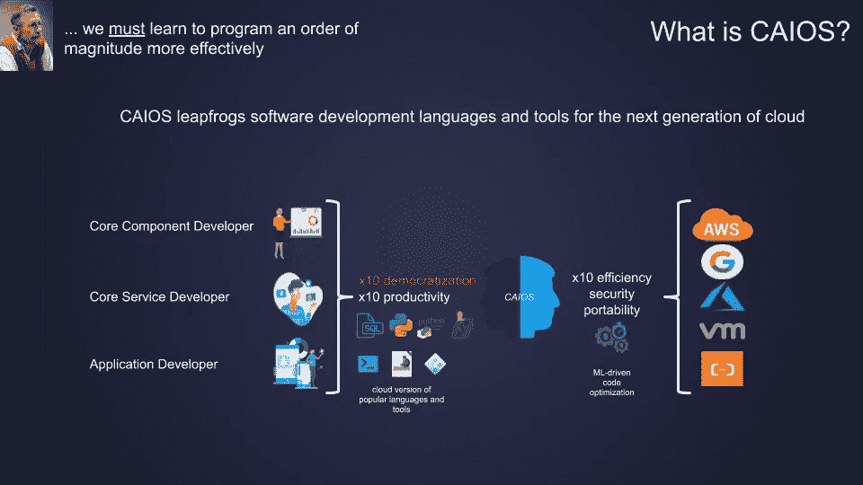

# 如果你的电脑是云，它的操作系统应该是什么样的？

> 原文：<https://medium.com/analytics-vidhya/if-your-computer-is-cloud-how-its-operating-system-should-look-like-24f62e274a95?source=collection_archive---------3----------------------->

## **响应无服务器革命**

# 介绍

与容器不同，容器是一种渐进的变化，引入了较小的虚拟机，隔离程度较低，无服务器技术产生了真正的破坏性变化，但尚未被软件行业完全吸收。我们需要停止谈论更快的马，开始谈论赛车。

虽然云功能(例如 AWS Lambda)构成了无服务器革命的重要组成部分，但它们只是一个更大难题的一部分。为了理解这种范式转变的全部含义，我们必须看看由云功能粘合在一起的无服务器存储、消息传递、API、编排、访问控制和计量服务。全部使用的累积效果要比单个部分的总和强得多。延伸我们的汽车与马匹的类比:不仅仅是发动机、底盘、轮胎、方向盘和信息娱乐单元分开，而是所有部件组装成一个连贯的单元。

颠覆性技术首先是心理上的颠覆性。为了充分利用颠覆的潜力，人们必须重新思考，重新行动。

实现这一目标的障碍始于这样一个事实，即所有现有的主流开发工具和编程语言都是在 50 年前与互联网和 UNIX 一起构想出来的，当时克服计算资源匮乏仍是主要挑战。在这个摇摇欲坠的基础上修补新的功能使它们变得更强大，但不是更强大。因此，它们都完全不适合新的无服务器云环境。要取得真正的突破，需要对许多熟悉的概念进行彻底的重新思考:

什么是计算机？

*   什么是操作系统？
*   什么是中间件？
*   什么是应用？
*   什么是编程？
*   什么是测试？
*   什么是源代码管理？
*   什么是生产力？
*   什么是质量？

在本文中，我们将逐一简要分析其中的前两个主题。

# 什么是无服务器云电脑？

传统上，“计算机”指的是单个物理设备。然而，在过去的十年中,“作为计算机的数据中心”的概念已经获得了广泛的认可。在云计算的背景下，一台“计算机”构成了一个仓库大小的建筑，里面装满了成千上万个独立的盒子，每个盒子都执行各种专门的功能，并通过一个超快速的局域网连接起来。如果我们采用通过总线连接的 CPU、ALU、RAM 和外设的传统计算机模型，我们可以说，现在专用计算机执行单个芯片的功能，超高速局域网扮演总线的角色。

然而，从无服务器计算的角度来看，这种比喻的直接应用价值有限。不仅各个数据中心不再可见，而且可用性区域的整个概念也消失了。我们可以推理的最小单位是**一个供应商**的一个客户的一个区域，如下图所示:

图 1:无服务器云计算机

这是我们可以随意使用的无服务器云计算机。它是真正的超级计算机还是仅仅是一台非常强大的计算机，有时是一个激烈辩论的话题。不管怎样，无服务器云计算机以传统成本的一小部分为我们提供了 10 年前我们甚至无法想象的容量水平。

我们是否可以或应该将芯片/外设/总线类比应用于这种无服务器云计算机，它的好处是什么？是的，我们可以，这仍然是一个有用的比喻。它特别有用，因为它将帮助我们认识到我们现在所拥有的是一种机器代码级别的编程环境。我们必须提高抽象层次，以便将其大规模投入生产使用。

## 什么是无服务器云电脑 ALU？

ALU 代表算术逻辑单元；在传统计算机中，它执行所有基本的算术和布尔逻辑计算。我们的无服务器云计算机中有类似的东西吗？从某种意义上说，我们有。与任何类比一样，知道在哪里停止是好的，但是我们可以将云函数(例如，AWS Lambda)视为一种具有某些约束的 ALU 设备。目前，爱尔兰地区的任何 AWS 无服务器云计算机都有 3000 个这样的逻辑单元，带有 3GB 本地缓存(有些人仍然称之为 RAM)，500MB 非易失性内存(也称为本地磁盘，分成两半)，15 分钟的硬上下文切换和大约 1.5 小时的热缓存寿命。这些逻辑设备运行用各种主流编程语言编写的“微代码”，如 Python、JavaScript 等。一个人是完全还是部分利用这种能力是另一个问题。无服务器云计算机的定价模式是这样的，你只需为你所使用的付费。

与传统 alu 不同，有多种方式来激活这种无服务器云逻辑设备的微代码，并控制它们是执行纯计算还是也有一些副作用。ALU 只是无服务器世界中的一个类比，但在一定范围内，它似乎是有用的。

## 什么是无服务器云电脑 CPU？

如果我们有无服务器云 alu 的 3K，我们是否也有 CPU 来控制它们，我们真的需要这样的设备吗？答案是有这样的设备，在很广泛的场景下都有用，但纯粹是可选的。云编排服务，如 AWS Step 函数，可以扮演这样的角色，内部并行流的功能类似于单个内核。AWS 爱尔兰地区的“云 CPU”最多可被占用 1 年，最多可处理 25K 个事件。我们可以拥有多少这样的无服务器云 CPU？我们可以立即获得 1300，然后每秒钟再增加 300。与云功能一样，我们将只为我们正在使用的功能付费。

## 什么是无服务器云电脑内存？

好的，我们有 alu(有一些缓存和 NVM ),我们有可选的 CPU 来协调它们。接下来，我们对 RAM 和磁盘存储有类比吗？是的，我们有，但我们可能会选择停止谈论易失性和非易失性存储器之间的人为分离。无论如何，现代 CPU 使这种分离变得毫无意义。只说记忆比较好。无服务器云计算机有不同类型的内存，每种内存都有自己的容量/延迟比率和访问模式。例如，AWS S3 提供对键/值或堆内存服务的支持，具有几乎无限的容量和相对高的延迟，而 DynamoDB 提供语义相似的键/值和堆内存服务，具有中等的容量和延迟。另一方面，AWS Athena 提供高容量、高延迟的表格(SQL)内存服务，而 AWS Serverless Aurora 提供相同的表格(SQL)内存服务，具有中等容量和延迟。

有趣的是，一些无服务器的云“内存”服务，如 DynamoDB，可以直接从 Step 函数(又名无服务器云 CPU)访问，而另一些则只能通过云函数(无服务器云 alu)访问。目前，阶跃函数的内部高速缓存内存限制为 32K，因此，它仅适用于控制流的直接编程，而不适用于大容量数据流。这样一个限制是一个阻碍还是一个实用的权衡选择是一个单独讨论的主题。

对可用服务的完整分析，包括无服务器的 Cassandra、云目录和 Timestream，超出了本备忘录的范围。

## 什么是无服务器云电脑外设？

因此，我们有了无服务器的云计算机 alu、CPU 和内存(当然，都是隐喻性的)。我们传统电脑里有没有类似外设的东西？是的，我们确实有类似端口的东西，它将我们的无服务器计算机连接到外部世界。与传统端口一样，每个端口都支持不同的协议，并且具有不同的性价比特征。例如，AWS API Gateway 支持 REST 和 WebSockets 协议，而 AWS AppSync 支持 GraphQL，AWS ALB 支持普通 HTTP(s)。

对可用服务的全面分析，包括 CloudFront CDN、物联网网关、Kinesis 和 AMQP，超出了本备忘录的范围。

## 什么是无服务器云电脑总线？

因此，我们有比喻的 alu，CPU，内存和无服务器计算机的端口。我们有类似公共汽车的东西吗？我们需要吗？答案是肯定的，我们确实有几种类型，有时是必要的。例如，AWS SQS 提供高速、中等容量的推送服务，而 AWS SNS 提供高速、中等容量的发布/订阅通知服务，而 AWS Kinesis 提供高速、高容量的推送服务。

## 无服务器云电脑还有什么？

与传统的计算机不同，它包含了更多的电池:数据流单元(又名 AWS Glue)，机器学习单元(Sage Maker endpoint)，访问控制(AWS IAM)，遥测(AWS Cloud Watch)，打包(AWS Cloud Formation)，用户管理(AWS Cognito)，加密(AWS KMS)，组件库(AWS server less Application Repository)，以及一系列完全托管的人工智能服务，如 AWS intensive，Rekognition，Textrat 等。

无服务器云计算机“硬件”的完整规格如下图所示:

图 2:无服务器云计算机“硬件”

# 无服务器云操作系统

遵循荷兰计算先驱 E.W. Dijkstra 建立的有用传统，我们将把上文概述的无服务器云计算机隐喻“硬件”规范视为“珍珠项链”的底层，即堆叠在较低级基础架构虚拟机顶部的较高级别、特定于域的*虚拟机*，如下图所示:

图 3:特定于域的虚拟机架构

问题是接下来会发生什么，我们会在这个比喻上走多远？

如上所述，这种隐喻性描述的主要目的是强调我们所掌握的驯服这种野兽的低级抽象。

遵循或多或少标准的软件系统分层模型，硬件之上的下一层通常是驱动程序层，它提供对底层设备的编程访问。在我们的案例中，我们可以将云供应商 SDK(例如 AWS boto3)视为“驱动程序”层。

关于操作系统以及更高层的责任，关于它的范围可能有许多意见，就像讨论这个主题的人数一样多。在本文中，我们将采用一种相对限制性的观点，认为操作系统负责单台计算机的最佳资源利用，在我们的例子中，这是一台无服务器云计算机。

事实上，尽管无服务器云计算机按照一般标准来看非常强大，但它们并不是无限的。虽然它们可以扩大规模，但我们总是希望用同样多的钱获得更多的价值。因此，最佳资源利用目标，即在保持在 SLA 范围内的同时最小化成本，确实适用。

优化分布式系统的资源利用和提高生产力是更高层的责任，即无服务器云中间件和无服务器云框架，这将在单独的备忘录中讨论。

这样一个无服务器的云操作系统应该负责什么样的资源优化？最终，它归结为最佳并发结构和最佳打包。不过，在我们讨论优化细节之前，我们需要简要了解一下传统的操作系统服务，即:文件系统、进程、安装包和进程间通信。

## 什么是无服务器云 OS 文件系统？

正如我们上面讨论的，文件系统的整个概念可能已经过时，对于应用程序代码开发，我们最好开始讨论传统数据结构的云版本，如列表、向量、集合、哈希表等。所有这些数据结构都可以有效地映射到上述不同的无服务器云存储服务上。

然而，除非我们要重写所有可用的软件，这是不切实际的，否则我们有时仍然需要讨论文件，例如 Python 模块、Linux 共享对象和可执行文件。使用云功能的本地磁盘存储必须作为特例处理，主要是出于冷启动优化的原因。理想的解决方案是利用用户空间中的 Linux [文件系统——FUSE](https://en.wikipedia.org/wiki/Filesystem_in_Userspace)根据性价比，直接挂载到 S3、DynamoDB、无服务器 Cassandra 甚至无服务器 Aurora。不幸的是，这在今天是不可能的，因为 FUSE mount 要求 Lambda 容器以*特权*模式运行，出于安全原因这是不允许的。另一种可能是为每个运行时环境开发一个云版本的模块导入器:Python，JavaScript，JVM。虽然这需要一些额外的工作，并且对遗留代码不太友好，但是云导入器允许一些传统的基于磁盘的导入器所不具备的优化。请看我们三部曲中的第一篇，它描述了 BlackSwan Technologies 的 [Python 云导入器](/@asher.sterkin/serverless-cloud-import-system-dc8e55bf2a96)的构建。

类似的逻辑也适用于 Linux 共享对象和可执行文件。理想情况下，ELF 文件应该直接从云内存源加载。这反过来需要修改 [dlopen](https://pubs.opengroup.org/onlinepubs/009695399/functions/dlopen.html) 函数——这在不久的将来很难实现。一个可能的解决办法是首先从云资源下载共享库和可执行文件到 **/tmp** 文件夹。这将使我们回到所有共享库(包括 Python 扩展)的 250MB 磁盘空间限制。另一种选择是模仿 RAM 磁盘，这将从更大的 3GB 预算中减去双倍的内存消耗。与 cloud importer 一样，这里也可以进行一些重要的优化来加速二进制文件的下载。

## 什么是无服务器云操作系统流程？

现在，我们进入了一个未知的领域。一个与 Linux 过程相似的清晰模型还没有被定义。运行状态机的阶跃函数(尽管我们不得不停止称它们为状态机，但它们不是状态机)是一个很好的选择，但是由一些外部事件触发的单个 Lambda 函数呢？我们应该将它们视为传统操作系统中的中断处理程序吗？这可能不是一个坏主意，但只有时间能证明一切。

## 什么是无服务器云 OS 安装包？

答案似乎很明显:它是 AWS 上的云形成堆栈或另一个云平台上的类似解决方案。在无服务器的世界中，云形成堆栈不*运行*——无服务器应用没有守护进程——除非由一些外部事件明确触发，否则没有任何东西在运行。在这个讨论中，我们排除了 Fargate 容器，这些容器*运行*。因此，启动云形成栈仅仅意味着安装一个无服务器应用的副本。虽然它会保留一些资源，但在一些真正的工作负载开始运行之前，它不会消耗这些资源。嗯，几乎…即使在被动模式下，存储容量仍然会被消耗，但这与一些应用程序占用的磁盘空间没有什么不同，即使它从未启动。

## 什么是无服务器云 OS 进程间通信？

这是另一个需要进一步阐述的模糊领域。传统的操作系统，如 Linux，有两个标准和一个半标准的进程间通信机制。共享内存和管道(命名的或短暂的)是两种标准的进程间通信机制，它们在 50 年前出现在 Unix 中。Tcp/IP 是一种半标准的 IPC，主要用于更大规模的中间件设备。

## 什么是无服务器云 OS 共享内存？

上面提到的所有无服务器云内存服务，基本都是可共享的。我们仍然需要恰当地利用它们各自可用的互斥和事务作用域机制。Clojure 持久数据结构和软件事务内存提供了一个有趣的灵感来源。

## 什么是无服务器云 OS 管道？

不幸的是，我们没有无服务器云操作系统管道。更准确地说，我们没有好的。上面列举的无服务器云总线服务做得不错，但只适用于非常有限的场景。用生物学的比喻来说，它们对中央静脉和动脉有好处，但对毛细血管没有好处。就目前而言，为每个流创建单独的 SQS 队列是不切实际的——创建时间太长，而且对于大量的流来说，它的伸缩性也不好。如果我们决定将一些处理分散到一个队列中，那么计算出属于某个特定流的所有消息何时被处理是很重要的。使用无服务器的云共享内存设施，原则上应该可以开发出好的、轻量级的、经济的管道。这是一个进一步研究的方向。

## 什么是无服务器云联网？

一些有趣的 R&D 活动目前正在这一领域进行(见参考文献)。

## 最佳并发结构

在典型的无服务器云计算机(如 AWS)中，人们可以确定以下不同级别的并发性:

1.  AWS 步进功能(云 CPU)
2.  单个 AWS 阶跃函数内的并行状态机(云核心)
3.  单个 AWS Lambda 函数实例(云 ALU，通常与上面的#2 相关，但不总是如此)
4.  单个 AWS Lambda 函数中的 Linux 进程(云 ALU 进程)
5.  单个 AWS Lambda 函数中的单个 Linux 进程内的 Posix 线程(云 ALU 线程)
6.  特定 AWS Lambda 函数的特定 Linux 进程的单个 Posix 线程中的协同例程(绿色线程)

最佳并发结构取决于几个不断变化的因素，尤其是数据量、速度和外部系统(例如 web 服务器)的限制。还有一个问题是，系统中的哪些流程需要由事件驱动，哪些流程需要由步骤函数来编排。即使有可能，手动寻找最佳结构也是一项艰巨的任务。通过应用由操作统计数据提供的适当的机器学习模型来寻找最佳结构看起来是一个更有前途的方向，如下所示:

图 4:并发结构优化

对最佳并发结构的讨论揭示了另一个重要方面:目前可用于指定 AWS 阶跃函数、Lambda 函数和云形成堆栈的工具处于令人绝望的低抽象级别——就像一种机器代码。把这些又长又丑的 JSONs 和 YAMLs 称为人类可读的会很有趣，如果它不是那么悲伤的话。没有理由不将它们的内部结构作为某种高级编译器的目标平台。这是可以做到的，也应该做到。

## 最佳包装

坚持 AWS Lambda 的 250MB 代码大小限制没有太大意义。今天，由于这种限制，许多 ML 推理过程不得不选择不太方便的容器封装，即使可用的 3GB RAM 对于执行任务来说已经足够了。举例来说，没有什么实际的理由可以解释为什么 Python 模块不能直接从 S3 引进。Python **importlib** 原则上允许这样做。同样的逻辑也适用于 Linux 共享对象。虽然一个适当的解决方案需要对 AWS 鞭炮进行深入的干预——这在未来并非遥不可及，但在短期内不太实际——但基于额外的 250 MB**/tmp**空间的接近近似值今天是可能的。

但是现在，我们面临另一个问题。比如说 Python 的云导入(同样的逻辑也适用于 JavaScript、Java 和。NET)以及 Linux 共享对象会增加所谓的**冷启动**延迟。对于许多应用程序来说，这并不构成问题，并且整体生产率的提高(假定不再需要打包 zip 文件)将很容易超过另外几秒钟的延迟(顺便说一下，是免费的)。对于其他一些应用程序，这可能是一个问题。这又给我们带来了另一个优化挑战:根据合适的 ML 模型和收集的操作统计信息，找到导入模块和共享对象的最佳组合，放入 AWS Lambda 包中(直接或通过 AWS Lambda 层)。

与最佳并发结构一样，这是高级编译器的任务。当软件工程师从事显然可以通过自动化改进的手工活动时，我们将把每一种情况都视为浪费宝贵的时间。

此外，请注意这里出现的一种模式。虽然传统操作系统和编译器提供了一些静态优化形式，但新的无服务器云世界要求优化过程是动态的、不断重复的，并且基于收集的操作统计数据，如下所示:

图 5:计算单元结构优化

## 可移植的“硬件”抽象层

正如操作系统经常发生的那样，上述两个优化问题都需要某种形式的抽象，将核心算法与每个特定云平台的技术细节隔离开来。的确，云 Python 导入系统的 90%依赖于 Python 模块系统，而不是依赖于 AWS vs GCP 的云存储如何工作。同样的逻辑也适用于 Linux 共享对象和并发结构。当然，同样的“硬件”抽象对于编写可移植的应用程序代码来说是一个有用的生产力工具，但是在到达框架层之前，我们还有一段路要走。

# 还有什么？

我们从重新考虑无服务器云计算机“硬件”模型的最基本层面开始，概述了无服务器云操作系统的主要职责。我们仍然需要讨论中间件在优化无服务器分布式系统资源利用中的作用，以及通过适当调整框架(包括整个开发工具链)来提高生产率。当然，真实的过程并不像描述的那样是线性的。为了开始初步的调查，我们需要一些最低限度的开发和测试系统。因此，实际上，开发活动是在多个层并行进行的。

# CAIOS 简介

该项目代号为 CAIOS(代表云人工智能操作系统，以强调与托管人工智能功能的深层联系)，目前由 *BST LABS* 作为母公司黑天鹅科技(BlackSwan Technologies)的内部开源项目进行。

图 CAIOS 项目

CAIOS 项目的目标是实现:

*   软件开发过程的数量级民主化——没有理由认为它会如此复杂，如此痛苦
*   生产率和质量的数量级增长——软件开发没有理由如此缓慢、如此昂贵、如此漏洞百出
*   价值速度的数量级增长—我们必须开始交付客户和市场真正需要的东西，而不是我们可以强迫他们接受的东西
*   数量级的运营成本降低—运行软件系统没有理由像今天这样昂贵
*   安全性的数量级改进—随着数字化变得无处不在，容忍安全漏洞不再是一个选项

释放并适当利用无服务器云计算的全部潜力提供了一个独特的机会，最终实现 60 年前最初设想的 [*人机共生*](https://internetat50.com/references/Licklider_Man-Computer-Symbiosis.pdf) 。

# **冠状病毒时代后手稿**

这篇论文的大部分是在最近的科罗纳疫情全球危机之前写的。当我读到史蒂夫·布兰克(Steve Blank)对全球经济(尤其是初创企业)的潜在影响的分析时，我很认真:

> 为了疫情而关闭经济从来没有发生过。
> ……
> 如果你今天的商业模式看起来和月初一样，那你就是在否认。

事实上，对于软件行业来说，派对可能已经结束了——如果不是现在，那么在可预见的将来。我们将不再能够因为开发与真实用户需求不匹配的半实现服务，然后延迟交付并超出预算而获得额外奖励。由于疫情的担忧，对自动化的需求将会上升。在短期内，对膨胀的运营和开发成本、低劣的质量和安全性以及延迟交付的容忍度将会降低，然后消失。

具有讽刺意味的是，我们大约 2020 年 3 月的商业模式可以追溯到 50 年前。在他开创性的 [ACM 图灵讲座](https://www.cs.utexas.edu/users/EWD/ewd03xx/EWD340.PDF)中，E.W. Dijkstra 做了如下评论:

> 如今，人们经常会听到这样的观点:…编程曾经是一个报酬过高的职业……也许程序员们……没有做好他们应该做的工作。社会对程序员和他们的产品越来越不满意。

那是 1972 年。

今天，我们软件开发人员的收入仍然比学校教师高一个数量级。但是，我们是在做一份更重要的工作，还是至少我们的工作做得足够好，足以养活自己？

唉，答案很可能是否定的，原因如下:软件开发行业的大多数工程师仍然忙于 Simon Wardley 所说的*牦牛毛*:将软件组件从一个地方移动到另一个地方，配置和重新配置基础设施，并在他们剩余的时间里编写代码片段，略微推动单点解决方案。

作为一个行业，作为专业人士，我们在很大程度上对将要发生的事情毫无准备:社会现在需要真正的自动化解决方案。没有人再对我们维持现状的理由感兴趣了。如果我们继续*给牦牛*剃毛，以技术限制为由，我们如何继续比许多其他专业人士挣得更多？我们是否能够以简洁且易于证明正确性的形式制定业务问题的解决方案，并将剩下的工作留给工具来自动转换成正确的 0 和 1 序列？

现在是彻底改变我们软件开发习惯的时候了。

虽然 CAIOS 项目最初是出于对如果我们开始将云视为超级计算机会发生什么的好奇，但现在它正在重新适应新的现实。它将专注于交付实际可行的解决方案，实现运营和开发成本的大幅降低以及绝对的代码安全性。这些解决方案昨天就需要，我们再也不能等到明天了。

描述可用解决方案和未来计划的更详细信息将随后发布。敬请关注。

# 参考

*   A.Sterkin，无服务器云导入系统。[第一部分:Linux FUSE 云存储挂载](/@asher.sterkin/serverless-cloud-import-system-dc8e55bf2a96)
*   A.Sterkin，无服务器云导入系统。[第二部分:Python 云导入器](/@asher.sterkin/serverless-cloud-import-system-760d3c4a60b9)
*   A.Sterkin，无服务器云导入系统。[第三部分:支持共享 EFS](/@asher.sterkin/serverless-cloud-import-system-d216b0d05c5a)
*   南沃德利，[为什么对无服务器大惊小怪](https://hackernoon.com/why-the-fuss-about-serverless-4370b1596da0)
*   南沃德利，[亚马逊正在吞噬软件(它正在吞噬世界)](/hackernoon/amazon-is-eating-the-software-which-is-eating-the-world-738888fb9e82)
*   南沃德利，[谢谢亚马逊。嘣！商业中的一切都会改变。](https://hackernoon.com/building-a-business-from-a-great-idea-some-future-monday-42ba794fdae5)
*   G.无服务器架构:游戏规则改变者还是回收时尚？
*   G.为无服务器时代设计
*   T.瓦格纳[无服务器联网](https://read.acloud.guru/https-medium-com-timawagner-serverless-networking-the-next-step-in-serverless-evolution-95bc8adaa904)
*   T.瓦格纳[无服务器超级计算机](https://read.acloud.guru/https-medium-com-timawagner-the-serverless-supercomputer-555e93bbfa08)
*   Luiz andréBarroso Jimmy clid aras Urs hlz le，[作为计算机的数据中心:仓库规模机器设计简介，第三版](https://www.morganclaypool.com/doi/abs/10.2200/S00874ED3V01Y201809CAC046)
*   关于结构化编程的注释
*   多程序设计系统的结构
*   J.C.R. Liklider，[人机共生](https://internetat50.com/references/Licklider_Man-Computer-Symbiosis.pdf)
*   D.恩格尔巴特，[增强人类智力:一个概念框架](https://internetat50.com/references/Engelbart_Augmenting-Human-Intellect.pdf)
*   李克力德，泰勒，[把计算机作为一种通讯设备](https://internetat50.com/references/Licklider\_Taylor\_The-Computer-As-A-Communications-Device.pdf)
*   史蒂夫·布兰克，[你的初创公司如何在全球疫情中生存](https://marker.medium.com/the-virus-survival-strategy-for-your-startup-a745f3555e79)
*   E.W. Dijkstra，[卑微的程序员](https://www.cs.utexas.edu/users/EWD/ewd03xx/EWD340.PDF)