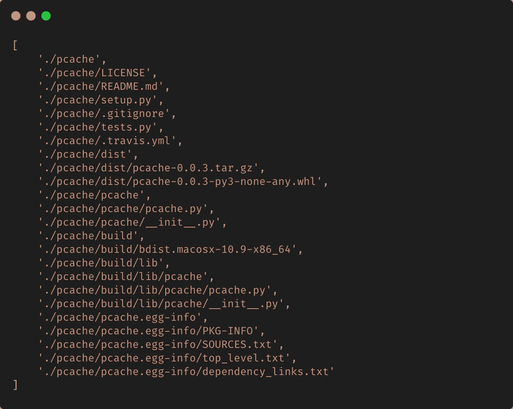

# 如何在 Python 中使用 trie 树重建目录树

> 原文：<https://medium.com/analytics-vidhya/if-youre-given-the-path-to-a-directory-you-can-easily-perform-a-walk-on-it-and-generate-the-bf321a8bdd63?source=collection_archive---------13----------------------->

来源:[https://www . raywenderlich . com/892-swift-algorithm-club-swift-trie-data-structure](https://www.raywenderlich.com/892-swift-algorithm-club-swift-trie-data-structure)

如果给定了一个目录的路径，就可以很容易地对其进行遍历，并将目录树生成为一个列表，使得树中的每个目录后面都跟着它的文件和子目录等等。让我用一个例子展示给你看。

下面是我电脑上一个名为`pcache`的目录的`tree`的输出。

让我们试着用 Python 来生成这个列表。我们将使用来自`os`标准库中的一个名为`os.walk()`的方法

当我用`./pcache`作为参数打印`generate_directory_tree`的结果时，我得到如下结果。

如果您查看结果，您会注意到在移动到同一级别的下一个目录之前，任何目录后面都跟有它的内容，就像`tree`的输出看起来一样。

现在，问题来了。情况反过来会怎样？您会得到一个随机的文件和目录路径条目列表，您必须在一个目录树型结构中对条目进行排序，其中目录后面紧跟着它的内容。考虑下面这个被打乱的列表。

## 了解如何帮助我们解决问题

> trie(也称为基数树或前缀树)是一种基于树的数据结构，用于存储字符串以便更快地检索 trie**val。每个节点存储一些字符/单词，并且沿着从根到叶的分支遍历建立整个字符串/文本。**

来源:[http://theory of programming . com/2015/01/16/trie-tree-implementation/](http://theoryofprogramming.com/2015/01/16/trie-tree-implementation/)

现在，如果我们考虑我们的路径并在`/`路径分隔符上分割它们，我们基本上拥有了可以存储在每个节点中的键。请参考下图。

现在，如果我们在这个 trie 上执行一个前序遍历，并在到达一个叶节点时打印路径，我们实际上将获得一个路径条目列表，它将被安排在一个类似目录树的结构中。让我们用一些 Python 代码来看看这一点。

PyPI 上有一个很棒的库叫做 [**pygtrie**](https://github.com/mina86/pygtrie) ，它让我们的事情变得更简单。这意味着我们不必担心重新发明轮子，从头开始编写整个 trie 实现。

因此，我们有一个路径及其类型的列表，即它是文件还是目录。我们将这个列表提供给我们的 trie，它是`pygtrie.StringTrie`的一个实例，有一个很酷的特性，它可以接受一个分隔符来标记字符串，并在 trie 节点中使用标记。路径存储为键，类型存储为值。我们将类型转换为`bool`的原因是，我们希望在遍历过程中确定我们是到达了一个叶子节点还是一个中间节点。然后，我们调用 trie 上的 traverse 方法，该方法执行前序遍历，回调帮助我们在遍历 trie 时打印路径。一旦我们运行代码，我们会得到下面的输出。

这正是我们想要的。

您可以调整实现，不仅在值中存储`bool`，还可以根据您的需求做很多事情。希望这篇文章对你有帮助。

干杯！