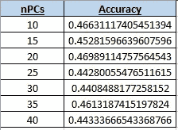

# 二。利用 Python 中的深度学习预测加密趋势

> 原文：<https://medium.com/analytics-vidhya/ii-forecasting-crypto-tendencies-with-deep-learning-in-python-5948909617db?source=collection_archive---------17----------------------->

> 不到 65 行。

本文是描述创建、回溯测试和部署交易机器人的分步过程的系列文章的一部分。第一篇文章关注的是**计算预测变量**，而第二篇文章关注的是**构建深度学习模型**，第三篇文章关注的是**用模型识别有利可图的交易策略**，最后一篇文章关注的是程序中的实际实现(**部署**)。本文末尾给出了链接。

现在我们已经创建了我们的预测变量 *X* 和我们的输出 *Y* (第一篇— [1])，是时候建立和训练几个深度学习模型来从 *X* 预测 *Y* 了。为此，我将展示如何用 Python 轻松地构建这样一个模型，训练它，并最终在一个验证集上评估它的准确性。该代码也可以很容易地适应任何其他输入格式。

本文对该过程进行了总结，以展示非常关键的信息。文章分解如下:

**0 —导入库并定义常量**

**I —训练深度神经网络**

**II —比较模型在验证集上的性能**

**三—结论**

# **0 —导入库并定义常量**

第一步是导入库，(重新)定义我们的*止损* / *止盈*，并定义我们希望模型适合的主要组件集。例如，在下面提供的代码中，我们将使用 10 到 40 台不同数量的 PC 来构建和适应深度学习模型。目标是比较它们在验证集上的准确性，并最终选出最好的一个来创建交易策略。

我们记得在前面的步骤中(文章 I [1])，我们保存了数据集，也保存了应用缩放和 PCA 后的关联数据集。这些后者被称为 *xxxx_* ***最终*** *_xxx.csv、*和**这些集合将用于预测**。

加载数据和库的代码写在下面:

图 1:加载数据和库，初始化我们的代码

# **I —训练深度神经网络**

一旦我们加载了所有的数据，下一步就是建立和训练几个深度学习模型。我决定建造 DL 模型是因为它们令人印象深刻的性能，以及用 *Keras* 建造它们相当容易的事实。

我开发的架构相当简单，由 **4 个隐藏层**组成。输入层的维度为 *nPCs* ，其中 *nPCs* 是我们用于特定回归的主成分的数量。输出层使用 **sigmoid 函数**【2】作为激活函数，使用 **Adam 优化器**【3】、**二进制交叉熵损失函数**【4】和**准确度**作为评估标准，在 *keras* 中训练模型。

我们记得，PCs 是按重要性排序的(*即*它们包含的方差)，这意味着第一个 PCs 应该是携带最相关信息的 PCs。情况并非总是如此，但通常如此。

我的模型的架构显示在下面，在这个特定的例子中有 *nPCs = 10* :

图 2:深度学习网络架构(用于说明的软件[5])

构建和训练这几个 DL 模型的代码写在那里:

图 3:构建和训练 DL 模型

# **II —比较模型在验证集上的表现**

一旦我们建立了我们的模型，现在是时候将它们与验证集进行比较了。这一步很重要，因为我们在这里对模型进行排序，这将最终决定我们将使用哪个模型进行潜在的现实交易。

为此，我们只需加载我们之前训练的每个模型，计算验证集的预测，并将所有结果存储在一个*中。csv* 文件。

***NB :*** *正如我们寻求只赌* ***看涨*** *趋势一样，我们只评估* ***看涨预测*** *(即当模型预测 1)* ***。*** *这意味着 nPCs = 10 的 46.63 %的准确率应该解释为:模型预测' 1 '的时候，46.63 %的时间发生了。*

在我们的例子中，止损= 5%,止盈= 10%,所以*先验*我们期望的精确度在 33%左右。实际上，在验证集上有以下比例的看涨结果(*结果’= 1*)，因为这一时期总体上相当看涨:

图 4:验证集平均看涨结果

获得 **46.98%则可以认为是良好的性能(见图 5)** 。但是，精确度只对模型的排序有用。此外，我们所有的模型都比验证集上的平均再分配做得好:这是一个很好的观点，我们比盲目交易做得更好。).

然后，我们可以看一看汇总表，并绘制它。我们可以观察到，使用 *nPCs = 20* 可以获得最佳性能:

图 5:验证集的精确度对比

图 6:前面表格的绘制

在*验证集*上评估模型的代码如下:

图 7:评估验证集上的模型，并将比较结果存储在一个. csv 文件中

# **三—结论**

在这一步之后，我们现在已经完成了在我们的数据集上构建、训练和评估各种深度学习模型。我们可以对我们的结果非常有信心，我们的模型的排名将允许我们在下一步中创建有利可图的战略(第三篇— *即将推出*)。

我们还可以回忆一下，完整的代码可以在[6]中找到。我写的关于建造一个高级交易机器人的论文全文见[7]。

不要犹豫，留下任何反馈/问题/ *掌声*或联系我获取更多信息。

**联系人:** sebcararo@hotmail.fr

**本系列其他文章:**

*   [I .用于创建股票预测数据集的交钥匙 Python 代码|作者 sébastien Cararo | Analytics vid hya | 2020 年 12 月| Medium](/analytics-vidhya/i-a-turnkey-python-code-for-creating-a-stock-forecasting-dataset-ad25f673f3b7)
*   [三。创造有利可图的交易策略|作者 sébastien Cararo | Analytics vid hya | 2020 年 12 月| Medium](/analytics-vidhya/iii-creating-profitable-trading-strategies-1858a2fc8b85)
*   [四。部署 Poloniex 交易机器人|作者:sébastien Cararo | Analytics vid hya | 2020 年 12 月| Medium](/analytics-vidhya/iv-deploy-a-poloniex-trading-bot-c3af87eba48c)

**另一篇文章** *(用机器学习构建体育博彩算法)* [新冠肺炎如何阻止我在 2020 年成为百万富翁|作者 sébastien Cararo | Analytics vid hya | 2020 年 12 月| Medium](/analytics-vidhya/how-covid-19-prevented-me-from-being-a-millionnaire-in-2020-5b2144e8bdef)

**来源**

[1]第一条

https://medium . com/analytics-vid hya/I-a-turn key-python-code-for-creating-a-stock-forecasting-dataset-ad25 f 673 F3 b 7

sigmoid 函数

https://www.youtube.com/watch?v=WsFasV46KgQ

Adam 优化器

https://keras.io/api/optimizers/

[4]二元交叉熵损失函数

https://gombru . github . io/2018/05/23/cross _ Entropy _ loss/#:~:text = Binary % 20 cross-Entropy % 20 loss % 20 also % 20 called % 20 sigmoid % 20 cross-Entropy % 20 loss。，组件% 20 不受% 20 其他% 20 组件% 20 值% 20 影响。

[5]用于说明的软件

 [## 神经网络 SVG

### 可供出版的神经网络架构示意图。下载 SVG

alexlenail .我](http://alexlenail.me/NN-SVG/index.html) 

[6] GitHub 知识库

https://github.com/Seb943/TBpolo

[7]全文

https://seb943.github.io/Data/Paper_CreatingATradingBot.pdf

**使用的软件:**Pyzo IDE 中的 Python 3.8.5