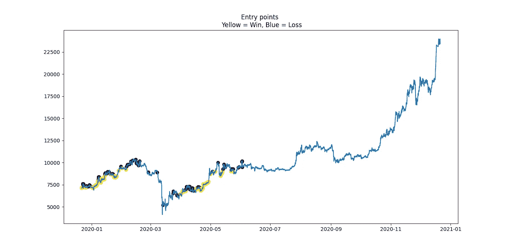

# 三。创造有利可图的交易策略

> 原文：<https://medium.com/analytics-vidhya/iii-creating-profitable-trading-strategies-1858a2fc8b85?source=collection_archive---------9----------------------->

> 得益于深度学习模型的两种盈利方式。

本文是描述创建、回溯测试和部署交易机器人的分步过程的系列文章的一部分。第一篇文章关注的是**计算预测变量**，而第二篇文章关注的是**构建深度学习模型**，第三篇文章关注的是**用模型识别有利可图的交易策略**，最后一篇文章关注的是程序中的实际实现(**部署**)。本文末尾给出了链接。

既然我们已经用训练集建立了模型，并在验证集上对它们进行了比较(文章 II — [1])，我们将在全新的数据(测试集)面前对 2 个策略进行回测。**第一种方法**是简单地从验证集中挑选出表现最好的模型，并在它预测到看涨趋势时遵循它的建议( *preds = 1* )。**第二种方法**更加进化:我们寻找阈值 *l* ，这样我们可以在选择最佳模型预测概率高于 *l 的时间步长时产生最高的 ROI，即我们寻找 *l* 的*，这样将我们的交易限制在 *proba_best_model > l* 产生最佳利润的情况下。

**0 —加载库和数据集**

**I —定义回测函数**

**II——一个简单的策略:选择我们最好的模型，在看涨时跟随它**

**III——更先进的战略**

**四—结论**

# 0-加载库和数据集

和前两篇文章一样，我们首先需要导入库、数据，并定义常数(更多细节见其他文章)。特别是我们定义了****止盈*** ，***NPC 的列表*** ，我们在构建模型的时候进行比较。为了进行回溯测试，我们还需要为每笔交易设置 ***费用*** 的值:在波洛涅克斯[2]交易所的情况下，这些费用大约是 0.125%，但是您可以根据自己的情况调整这个值。我们还定义了 ***最小交易数*** 来考虑第二种方法中的策略(50 笔交易是一个好的阈值)。初始化代码如下所示:*

*图 1:数据加载和初始化*

# *I —为回溯测试定义函数*

*一旦我们导入了数据，现在就该创建两个回溯测试函数了。第一个是计算收益和损失的函数，给定一组特定的*止损*、*止盈*和交易*费用*。这一步很重要，这样我们的回溯测试才能与现实生活中的交易条件保持一致。*

*第二个功能实际上是回溯测试功能。它将测试集作为输入，我们想要回测的模型，以及我们的常量。**然后计算测试集上的预测，并在名为*' earnings bully '***的列中计算回测收益。当我们试图构建一个*看涨*的交易机器人时，我们过滤掉*看跌*的预测( *preds = 0* )。用我们的止损和止盈设置，我们可以看看计算后这个柱的样子。我们记得'*结果*是地面真实结果，而'*预测值*是模型的预测值:*

**

*图 2:盈利看涨栏的概述*

*生成回溯测试的代码如下所示:*

*图 3:定义收入计算的函数*

# *一个简单的策略:选择我们最好的模型，在看涨时跟随它*

*一旦我们定义了回溯测试函数，我们可以试着看看第一种方法。这种方法只是简单地跟随最佳模型的看涨预测。然后我们显示*(利润和损失)概况、**进入点**，以及 ***ROI*** (投资回报)。最后，我们不妨评价一下，性能到底棒到什么程度。为了做到这一点，我们将该方法的表现与测试期间的平均回报进行比较(止损*止损*和止盈*止盈*):也就是说，如果我们总是在测试集的每个时间步押注*看涨*，我们就会看到预期回报。使用这种技术，我们可以真正评估我们的方法的性能，不受市场条件的影响。我们将获得一个名为 *avg_return_benchmark* 的指标，并将其与我们的性能进行比较。为此，我们通过*t-test*【3】与平均基准进行比较，测试我们性能的统计显著性。**

**性能优于基准测试，**当我们进行 t 检验(p 值< < 0.05)** 时，它甚至是有意义的。**

**在我们的例子中，我们得到的是这样的:**

****

**图 4:我们的最佳模型在测试集上的 PnL 演化**

****

**图 5:最佳模型的入口点**

****

**图 6:评估性能的重要性**

**我们甚至可以放大到 2020 年的前 3 个月，以更好地捕捉交易机器人的相关性。我们可以看到，交易机器人在正确的时间进行了有利可图的押注，并在市场崩溃时不再看涨。如果我们在那里使用它，它首先会让我们赢钱，其次会避免损失一些钱:**

****

**图 7:2020 年 1 月至 3 月期间放大的方法 1**

**出于信息目的，这种方法在测试集上产生了 3.3698% 的每笔交易的**投资回报率，其中 **897 笔交易**被执行，516 笔交易最终实现了止盈( **57.52%的准确率**)。****

**生成和回溯测试第一个策略的代码如下:**

**图 6:创建并评估第一种方法**

# **III——更先进的战略**

**如前所述，第二种方法的原理可以总结如下:**我们选择最佳模型，并寻找阈值 *l* ，以便将交易限制在*proba _ bully>l*产生最有利可图的策略**的情况下。为此，我们需要在***validation _ set***上评估最佳模型，否则该方法将无法推广。第一步是创建一个函数，该函数创建一个像这样的摘要表(*图 8* )，我们可以显示它以供说明(*图 9* ):**

****

**图 8:验证集上最佳模型的每个部分的概要表**

****

**图 9:引用表的绘制:当 l = 0.95 时，ROI 最大**

**一旦我们计算并保存了这个表，我们只需选择产生最佳 ROI 的阈值。在我们的示例中，我们可以看到最佳阈值是 *l =0.95* 。然后，我们可以在测试集上评估这种策略(保持预测 where*proba _ best _ model>0.95*)，以便我们可以看到这种方法如何在全新的数据上执行。我们观察到**该策略再次产生了巨大的利润，投资回报率甚至比第一种方法更高(3.41%比 2.90%)** 。所有这些观察结果都倾向于证实我们方法的稳健性和有效性。**

**另外，**性能也很有意义(p 值< < 0.05)** ，这是很棒的一点:**

****

**图 10:第二种方法在测试集上的 PnL**

****

**图 11:第二种方法的入口点**

****

**图 12:评估性能的重要性**

**在第一种方法中，我们可以在第一个月中放大以查看这种交易机器人的相关性:**

****

**图 13:2020 年 1 月至 3 月期间的方法 2 放大图**

**当我们查看这种方法的统计数据时，我们可以注意到，它比我们之前介绍的第一种方法更具选择性。在相同的测试期间，它花费了**更少的交易**，并且有了**更好的成功率**。**

**这种方法在测试集上产生了 4.1668% 的每笔交易的**投资回报率，进行了 **498 笔交易**，最终有 313 笔交易达到了止盈( **62.85%的准确率**)。****

**生成第二种方法的代码写在那里:**

**图 14:创建第二种方法**

# **四、结论**

**首先，我们可能记得完整的代码可以在资源库[4]中找到。我甚至做了一个名为***Pipeline _ I _ to _ iii . py****【5】的脚本:你只需要设置*止损*、*止盈*、*拆分日期*和*数据集位置*，管道自动完成所有步骤(变量计算、PCA、建立模型、评估、识别盈利策略)！通过使用与我在本系列文章中使用的完全相同的数据集(也可以在资源库中找到)，您最终会发现完全相同的结果。***

**在这篇文章中，我们创造了两个有利可图的交易策略。这些策略的表现优于基准指标——即*即*它们是准确的，产生了足够的利润——甚至产生了显著的结果。我们检查了这些策略在全新的数据上产生的利润，这表明它们在现实生活中的实施从长远来看也会产生利润。**

**值得注意的是，我们可以观察到该模型不再预测任何*看涨*趋势，因为 BTC 价格已经突破 15k 美元:这可能是因为我们的数据集不是*平稳的*。该模型认为，在列车运行期间，价格会降至其通常值。**我们可以避免这个问题，首先让它保持稳定，针对短期波动改变止损/止盈，或者更简单地说，增加一些标准化的控制变量，如 MACD。**然而，如果我们将管道应用于多年来一直处于有限范围内的资产，问题可能会自行解决。此外，由于交易机器人的目的是押注*短期*趋势，而不是长期投资，这不是一个大问题。我们还可以观察到，模型预测看涨趋势的最近时间是高度准确的(**高*选择性*** )。**

**现在我们已经确定并测试了我们的策略，我们可能希望在现实交易中实施它们。这正是下一篇文章(第四篇)的目的，它将揭示如何在 Python 中部署这样的交易机器人。交易机器人将使用加密货币交易平台 Poloniex API 开发。然而，该框架可以很容易地适应任何其他 API 或编码系统。**

**另外，我写的关于高级交易机器人的论文全文可以在[6]找到。不要犹豫留下任何反馈/问题/ *掌声*或联系我以获取更多信息。**

****联系人:** sebcararo@hotmail.fr**

****系列其他文章:****

*   **[I .用于创建股票预测数据集的交钥匙 Python 代码|作者 sébastien Cararo | Analytics vid hya | 2020 年 12 月| Medium](/analytics-vidhya/i-a-turnkey-python-code-for-creating-a-stock-forecasting-dataset-ad25f673f3b7)**
*   **[二。利用 Python 中的深度学习预测加密趋势|作者 sébastien Cararo | Analytics vid hya | 2020 年 12 月| Medium](/analytics-vidhya/ii-forecasting-crypto-tendencies-with-deep-learning-in-python-5948909617db)**
*   **[四。部署 Poloniex 交易机器人|作者:sébastien Cararo | Analytics vid hya | 2020 年 12 月| Medium](/analytics-vidhya/iv-deploy-a-poloniex-trading-bot-c3af87eba48c)**

****另一篇文章** *(用机器学习构建体育博彩算法)* [新冠肺炎如何阻止我在 2020 年成为百万富翁|作者 sébastien Cararo | Analytics vid hya | 2020 年 12 月| Medium](/analytics-vidhya/how-covid-19-prevented-me-from-being-a-millionnaire-in-2020-5b2144e8bdef)**

****来源:****

**[1]第二条**

**[二。利用 Python 中的深度学习预测加密趋势|作者 sébastien Cararo | Analytics vid hya | 2020 年 12 月| Medium](/analytics-vidhya/ii-forecasting-crypto-tendencies-with-deep-learning-in-python-5948909617db)**

**[2]波兰交易所**

** [## 加密资产交易所

### 购买、出售和交易比特币(BTC)、以太坊(ETH)、创(TRX)、系绳(USDT)以及市场上最好的替代币

poloniex.com](https://poloniex.com/exchange/USDT_BTC) 

[3] T 检验

 [## T 检验介绍|定义、公式和例子

### t 检验是一种统计检验，用于比较两组的平均值。它经常用于假设检验…

www.scribbr.com](https://www.scribbr.com/statistics/t-test/) 

[4]完整代码

 [## Seb943/TBpolo

### 使用 Python 和 Poloniex API 的盈利交易机器人— Seb943/TBpolo

github.com](https://github.com/Seb943/TBpolo/blob/master/Codes/III.AssessAccuracyAndBacktest.py) 

[5]*Pipeline _ I _ to _ iii . py*(仍在仓库内)

[位于主 SEB 943/TB polo(github.com)的 TB polo/Pipeline _ I _ to _ iii . py](https://github.com/Seb943/TBpolo/blob/master/Codes/Pipeline_I_to_III.py)

[6]全文

[https://seb943.github.io/Data/Paper_CreatingATradingBot.pdf](https://seb943.github.io/Data/Paper_CreatingATradingBot.pdf)

**软件:**Pyzo IDE 上的 Python 3.8.5

图 15:封面图片**